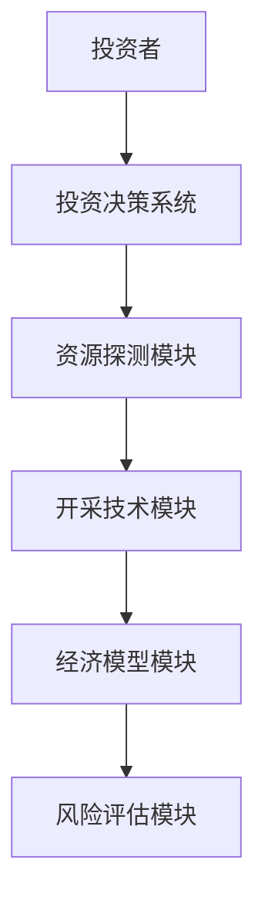
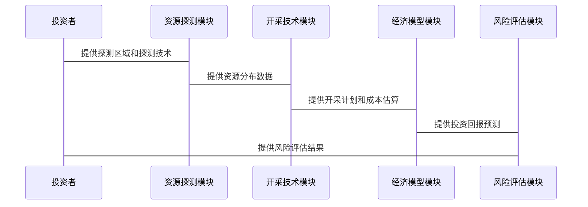

                 

# 巴菲特-芒格的太空资源开发投资：星际经济的先行者

## 关键词：太空资源开发、巴菲特、芒格、投资策略、星际经济、资源利用、技术发展

## 摘要：本文深入探讨巴菲特和芒格在太空资源开发投资中的策略和案例，分析他们在星际经济中的角色和贡献。文章从技术、经济和政策角度，详细阐述太空资源开发的潜力和挑战，并结合实际投资案例，展示巴菲特和芒格如何运用其独特的投资理念在这一新兴领域中取得成功。通过系统分析和架构设计，本文为读者提供全面的视角，理解太空资源开发投资的复杂性和未来趋势。

---

# 第1章: 太空资源开发投资的背景与现状

## 1.1 太空资源开发的背景介绍

### 1.1.1 太空资源开发的技术基础
太空资源开发依赖于多项前沿技术，包括：
- **资源探测技术**：利用遥感技术和机器人探测器识别和评估太空中的资源分布。
- **开采技术**：开发能够在极端环境下工作的采矿设备，用于提取小行星、月球和火星上的金属、稀有矿物等。
- **运输与物流技术**：研究如何高效地将太空资源运回地球或其他用途地点。
- **能源技术**：探索利用太空中的太阳能等能源支持资源开发活动。

### 1.1.2 太空资源开发的经济驱动
- **资源稀缺性**：地球上某些稀有金属和矿物在太空中的储量丰富，可以满足未来科技发展的需求。
- **成本降低**：随着技术进步，太空资源开发的成本正在逐步下降，使得商业开发成为可能。
- **市场需求**：太空资源在航天器制造、电子产品、高科技产业等领域有广泛应用前景。

### 1.1.3 太空资源开发的政策支持
- **国际合作**：多国政府和国际组织（如NASA、ESA、ISO）推动太空资源开发的国际合作。
- **法律框架**：《外空法》和《月球协定》等国际法律为太空资源开发提供了基本框架，但仍需进一步完善。

## 1.2 巴菲特与芒格的投资理念

### 1.2.1 巴菲特的价值投资理论
- **长期价值**：巴菲特注重企业长期价值，寻找具有持续盈利能力和社会价值的项目。
- **安全边际**：通过低估价格投资，确保投资的安全性和稳定性。
- **简单可预测**：选择易于理解且未来可预测的行业和企业进行投资。

### 1.2.2 芒格的多元思维模型
- **跨学科思维**：芒格强调从多个学科（如心理学、经济学、物理学）中汲取智慧，构建多元思维模型。
- **逆向思考**：通过分析问题的反面，寻找投资机会和风险。
- **避免情绪化决策**：保持理性，避免因市场波动而做出错误决策。

### 1.2.3 两人投资理念的结合
- 巴菲特和芒格的理念互补，巴菲特注重长期价值和安全边际，芒格提供跨学科的思维方式，使两人在投资决策中能够规避风险，抓住优质机会。

## 1.3 太空资源开发与投资的结合

### 1.3.1 太空资源开发的商业潜力
- **稀有资源**：小行星和月球上含有丰富的铂族金属、稀土元素等，可满足高科技产业需求。
- **能源供应**：太空中的太阳能可以用于支持深空探测任务和建立永久性太空站。
- **技术带动**：太空资源开发将推动机器人技术、人工智能和新材料的发展，带动相关产业进步。

### 1.3.2 巴菲特-芒格投资理念在太空资源开发中的应用
- **长期价值**：选择具有持续盈利能力的太空资源开发项目，如SpaceX的可重复使用火箭技术。
- **安全边际**：通过投资成熟技术和团队的项目，降低投资风险。
- **跨学科思维**：结合天文学、材料科学、经济学等多学科知识，评估项目可行性。

### 1.3.3 当前太空资源开发投资的现状与趋势
- **现状**：私人企业和政府机构正在积极推进太空资源开发，如SpaceX、Blue Origin、NASA的月球基地计划。
- **趋势**：随着技术进步和成本下降，太空资源开发将进入商业化阶段，吸引更多的投资者。

---

# 第2章: 太空资源开发的核心概念与联系

## 2.1 太空资源开发的核心概念

### 2.1.1 太空资源的定义与分类
- **定义**：太空资源指存在于地球以外天体上的有用物质，包括金属、矿物、水冰、气体等。
- **分类**：
  - **近地资源**：小行星、月球、火星等近地天体的资源。
  - **深空资源**：更遥远的行星、星系中的资源。
  - **能源资源**：太阳辐射能、氢气等可用于能源生产的资源。

### 2.1.2 太空资源开发的主要技术手段
- **资源探测**：使用轨道探测器、机器人探测器进行资源勘探。
- **开采技术**：开发适用于极端环境的采矿设备。
- **运输与物流**：研究高效运输资源的方案，如利用地球同步轨道站中转。

### 2.1.3 太空资源开发的经济模式
- **政府主导**：政府投资和补贴支持基础研究和技术开发。
- **商业驱动**：私营企业主导资源开发的商业化进程。
- **国际合作**：通过国际合作分担成本，共享技术成果。

## 2.2 太空资源开发与投资的联系

### 2.2.1 太空资源开发的商业价值
- **市场需求**：高科技产业对稀有金属的需求不断增长，太空资源开发可以提供新的资源来源。
- **技术进步**：太空资源开发推动机器人技术、人工智能的发展，带来巨大的技术溢出效应。
- **长期收益**：通过建立太空资源供应链，企业可以锁定长期稳定的资源供应，降低生产成本。

### 2.2.2 投资者在太空资源开发中的角色
- **风险承担者**：投资者提供资金支持技术开发和商业化进程。
- **资源整合者**：通过投资整合技术、人才、市场资源，推动项目进展。
- **市场推动者**：投资者的参与推动太空资源开发的商业化和规模化。

### 2.2.3 太空资源开发对全球经济的影响
- **经济增长**：太空资源开发将创造新的经济增长点，带动相关产业发展。
- **全球竞争**：各国在太空资源开发领域的竞争将加剧，推动技术进步和产业升级。
- **国际合作**：太空资源开发需要国际合作，促进全球科技合作和经济一体化。

## 2.3 系统架构与设计

### 2.3.1 太空资源开发项目的系统架构
- **资源探测系统**：负责探测和评估资源分布。
- **开采系统**：负责资源的开采和收集。
- **运输与物流系统**：负责资源的运输和存储。
- **控制系统**：整合各子系统，实现项目的整体协调。

### 2.3.2 项目管理与风险评估
- **项目管理**：采用敏捷开发模式，分阶段推进项目，确保各阶段目标的实现。
- **风险评估**：识别技术、市场、政策等风险，制定应对策略。

### 2.3.3 投资组合优化与收益预测
- **投资组合优化**：通过多元化的投资组合分散风险，提高整体收益。
- **收益预测**：基于历史数据和市场分析，预测项目的投资回报率。

---

# 第3章: 太空资源开发的算法原理与数学模型

## 3.1 太空资源开发的算法原理

### 3.1.1 资源探测与开采算法
- **资源探测算法**：利用机器学习模型分析遥感数据，识别资源分布。
- **开采路径优化算法**：通过遗传算法优化采矿设备的路径，提高开采效率。

### 3.1.2 项目可行性分析算法
- **可行性评估算法**：结合技术、经济、政策等多因素，评估项目的可行性。
- **成本效益分析算法**：计算项目的总成本和预期收益，判断项目的经济可行性。

### 3.1.3 投资回报率预测算法
- **时间序列分析算法**：利用历史数据预测未来的投资回报率。
- **风险调整收益算法**：考虑市场风险，调整预期收益。

## 3.2 数学模型与公式

### 3.2.1 资源开发成本模型
$$ C = C_{\text{开发}} + C_{\text{运输}} + C_{\text{维护}} $$

### 3.2.2 投资回报率公式
$$ ROI = \frac{\text{净收益}}{\text{投资成本}} \times 100\% $$

### 3.2.3 风险评估模型
$$ R = \sum_{i=1}^{n} (P_i \times I_i) $$

## 3.3 项目实战与案例分析

### 3.3.1 环境安装与配置
- **技术环境**：安装Python、机器学习库（如TensorFlow、Scikit-learn）。
- **数据准备**：收集太空资源探测数据、市场数据、政策信息等。

### 3.3.2 核心算法实现
- **资源探测算法实现**：使用K近邻算法（KNN）进行资源分布预测。
- **开采路径优化算法实现**：使用遗传算法优化采矿路径。

### 3.3.3 案例分析与结果解读
- **案例分析**：以SpaceX的小行星资源探测任务为例，分析算法的应用和效果。
- **结果解读**：通过算法预测资源分布，优化开采路径，降低开发成本。

---

# 第4章: 太空资源开发的系统分析与架构设计

## 4.1 问题场景介绍

### 4.1.1 太空资源开发的主要挑战
- **技术挑战**：极端环境下的设备运行和资源开采技术难度大。
- **经济挑战**：初期投资高，回报周期长，资金风险高。
- **政策挑战**：国际法律和政策尚不完善，存在不确定性。

### 4.1.2 投资者面临的决策问题
- **技术风险**：资源开发技术的不确定性和失败风险。
- **市场风险**：市场需求波动和技术替代风险。
- **政策风险**：国际政策变化对项目的影响。

### 4.1.3 系统设计的目标与范围
- **目标**：构建一个支持太空资源开发投资的决策支持系统。
- **范围**：涵盖资源探测、开采、运输、投资决策等全过程。

## 4.2 系统架构设计

### 4.2.1 系统功能模块划分
- **资源探测模块**：负责资源的探测和评估。
- **开采技术模块**：优化开采路径和设备。
- **经济模型模块**：预测投资回报和风险。
- **决策支持模块**：为投资者提供决策支持。

### 4.2.2 系统架构图（Mermaid）

### 4.2.3 系统功能模块类图（Mermaid）

## 4.3 系统接口设计

### 4.3.1 投资者接口
- **输入**：投资者的风险偏好、投资金额。
- **输出**：项目可行性报告、投资回报预测、风险评估结果。

### 4.3.2 资源探测接口
- **输入**：探测区域、探测技术。
- **输出**：资源分布图、资源储量报告。

### 4.3.3 开采技术接口
- **输入**：开采目标、设备参数。
- **输出**：开采计划、成本估算。

## 4.4 系统交互流程

### 4.4.1 项目管理流程
1. 投资者提出投资需求。
2. 资源探测模块进行资源探测。
3. 开采技术模块制定开采计划。
4. 经济模型模块评估投资回报。
5. 风险评估模块进行风险评估。
6. 投资决策系统生成决策报告。

### 4.4.2 投资决策流程
1. 投资者分析市场趋势和政策环境。
2. 评估项目的技术可行性和经济回报。
3. 结合风险评估结果，做出投资决策。

### 4.4.3 序列图（Mermaid）

---

# 小结

通过本文的系统分析，我们可以看到太空资源开发投资是一个复杂但充满潜力的领域。巴菲特和芒格的投资理念为这一领域提供了宝贵的指导，而系统化的架构设计和算法模型则为实现高效投资提供了技术支持。未来，随着技术进步和政策完善，太空资源开发投资将展现出更大的发展潜力。

---

# 作者：AI天才研究院 & 禅与计算机程序设计艺术

