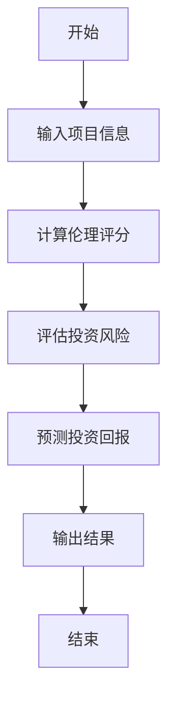

                 


# 巴菲特-芒格的太空采矿伦理投资：资源开发与环境保护的平衡

> 关键词：太空采矿、伦理投资、巴菲特、芒格、资源开发、环境保护、平衡

> 摘要：本文探讨了巴菲特和芒格的投资理念在太空采矿领域的应用，分析了资源开发与环境保护之间的平衡问题。通过伦理投资框架、算法模型和系统设计，提出了一种可持续的太空资源开发策略。

---

## 第一部分: 太空采矿与伦理投资的背景介绍

### 第1章: 太空采矿的定义与现状
#### 1.1 太空采矿的定义
- 太空采矿：从月球、小行星或其他天体中提取资源（如水、金属、稀有元素）的过程。
- 技术现状：当前主要处于概念验证阶段，部分技术已实现试验性开采。

#### 1.2 巴菲特-芒格的价值投资理念
- 长期价值投资：注重企业长期盈利能力。
- 安全边际：确保投资的安全性。
- 内在价值：企业的真实价值。

#### 1.3 伦理投资的定义
- 伦理投资：基于道德标准选择投资标的。
- 核心要素：环境、社会、治理（ESG）。

### 第2章: 太空采矿与伦理投资的联系
#### 2.1 太空采矿的伦理框架
- 环境影响：减少对地球资源依赖。
- 社会影响：太空资源开发的公平性。
- 治理问题：国际合作与资源分配。

#### 2.2 伦理投资对太空采矿的影响
- 选择符合ESG标准的项目。
- 降低投资风险。

#### 2.3 巴菲特-芒格理念与太空采矿的结合
- 长期价值：太空资源的可持续性。
- 安全边际：技术可行性与伦理合规性。

---

## 第二部分: 太空采矿与伦理投资的核心概念与联系

### 第3章: 核心概念对比分析
#### 3.1 太空采矿与传统采矿的对比
| 对比维度 | 太空采矿 | 传统采矿 |
|----------|-----------|-----------|
| 资源来源 | 天体资源 | 地球资源 |
| 环境影响 | 较低 | 较高 |
| 技术难度 | 高 | 低 |

#### 3.2 伦理投资与传统投资的对比
| 对比维度 | 伦理投资 | 传统投资 |
|----------|-----------|-----------|
| 评估标准 | ESG | 财务指标 |
| 投资目标 | 长期可持续性 | 短期收益 |

#### 3.3 巴菲特-芒格理念与太空采矿的对比
| 对比维度 | 巴菲特-芒格理念 | 太空采矿 |
|----------|----------------|-----------|
| 核心目标 | 长期价值 | 可持续资源开发 |
| 风险控制 | 安全边际 | 技术可行性 |
| 投资标准 | 内在价值 | 伦理合规性 |

### 第4章: 实体关系图
#### 4.1 太空采矿与伦理投资的ER图
```mermaid
erDiagram
    participant 投资者 {
        <属性> 投资者ID
        <属性> 投资金额
        <属性> 投资目标
    }
    participant 项目 {
        <属性> 项目ID
        <属性> 项目目标
        <属性> 项目风险
    }
    participant 伦理框架 {
        <属性> ESG评分
        <属性> 项目合规性
    }
    投资者 --> 项目 : 投资
    项目 --> 伦理框架 : 评估
```

#### 4.2 巴菲特-芒格理念与太空采矿的ER图
```mermaid
erDiagram
    participant 巴菲特理念 {
        <属性> 长期价值
        <属性> 安全边际
    }
    participant 太空采矿 {
        <属性> 资源开发
        <属性> 技术可行性
    }
    巴菲特理念 --> 太空采矿 : 应用
    太空采矿 --> 伦理框架 : 评估
```

---

## 第三部分: 太空采矿伦理投资的算法原理

### 第5章: 伦理投资评估算法
#### 5.1 伦理评分计算公式
$$ E = \sum_{i=1}^{n} w_i \cdot s_i $$
其中，$E$为伦理评分，$w_i$为权重，$s_i$为评分项。

#### 5.2 投资风险评估公式
$$ R = \sqrt{\sum_{i=1}^{m} (w_i \cdot r_i)^2} $$
其中，$R$为投资风险，$w_i$为权重，$r_i$为风险项。

#### 5.3 投资回报预测公式
$$ P = \sum_{i=1}^{k} (w_i \cdot r_i) $$
其中，$P$为投资回报，$w_i$为权重，$r_i$为回报项。

### 第6章: 算法流程图


---

## 第四部分: 太空采矿伦理投资的数学模型与公式

### 第7章: 数学模型与公式
#### 7.1 伦理评分模型
$$ E = \sum_{i=1}^{n} w_i \cdot s_i $$
其中，$w_i$为权重，$s_i$为评分项。

#### 7.2 投资风险模型
$$ R = \sqrt{\sum_{i=1}^{m} (w_i \cdot r_i)^2} $$
其中，$R$为投资风险，$w_i$为权重，$r_i$为风险项。

#### 7.3 投资回报模型
$$ P = \sum_{i=1}^{k} (w_i \cdot r_i) $$
其中，$P$为投资回报，$w_i$为权重，$r_i$为回报项。

---

## 第五部分: 系统分析与架构设计

### 第8章: 系统分析与架构设计
#### 8.1 系统功能设计
- 数据输入模块：接收项目信息。
- 数据处理模块：计算伦理评分。
- 评估模块：预测投资回报。
- 输出模块：展示结果。

#### 8.2 系统架构设计


---

## 第六部分: 项目实战

### 第9章: 项目实战
#### 9.1 环境安装
- 安装Python和相关库（如NumPy、Pandas）。
- 安装Mermaid和流程图工具。

#### 9.2 核心代码实现
```python
import numpy as np
import pandas as pd

def calculate_ethics_score(projects):
    scores = []
    for project in projects:
        # 计算伦理评分
        ethics_score = np.sum(project['weights'] * project['scores'])
        scores.append(ethics_score)
    return scores

# 示例数据
projects = [
    {
        'weights': [0.3, 0.4, 0.3],
        'scores': [0.8, 0.6, 0.7]
    },
    {
        'weights': [0.2, 0.5, 0.3],
        'scores': [0.9, 0.5, 0.6]
    }
]

# 计算伦理评分
ethics_scores = calculate_ethics_score(projects)
print("伦理评分:", ethics_scores)
```

---

## 第七部分: 小结

### 第10章: 小结
- 平衡资源开发与环境保护是太空采矿伦理投资的关键。
- 巴菲特-芒格的价值投资理念为太空采矿提供了新的视角。
- 通过伦理评分模型和算法，可以实现可持续的太空资源开发。

---

作者：AI天才研究院/AI Genius Institute & 禅与计算机程序设计艺术 /Zen And The Art of Computer Programming

