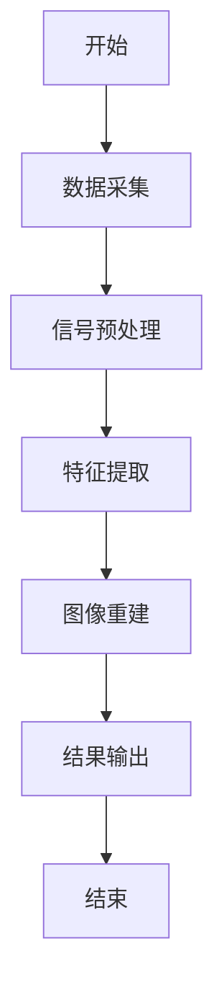
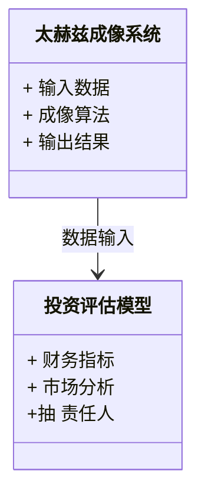
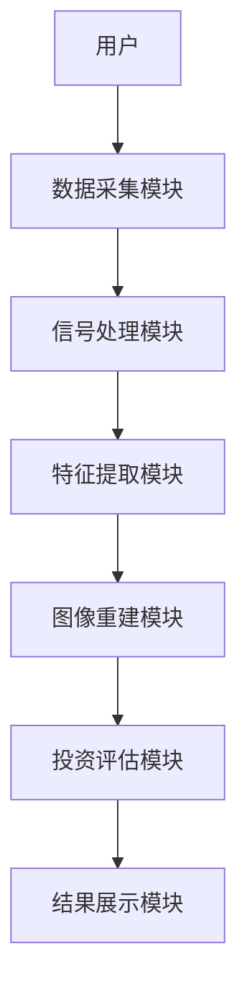

                 


# 巴菲特-芒格的太赫兹成像技术投资：安全检查的新标准

> 关键词：太赫兹成像技术，巴菲特投资，芒格思维模型，安全检查，技术投资

> 摘要：本文探讨如何将巴菲特的价值投资理念与芒格的多元思维模型应用于太赫兹成像技术，从而革新安全检查的标准。通过分析技术原理、投资模型和系统架构，结合实际案例，本文揭示了技术与投资的深度结合如何推动行业进步。

---

## 第一部分: 太赫兹成像技术与巴菲特-芒格投资理念的结合

### 第1章: 太赫兹成像技术的背景与应用

#### 1.1 太赫兹成像技术的基本原理
太赫兹成像技术是一种利用太赫兹波进行成像的新兴技术。太赫兹波位于微波和红外线之间，具有较高的分辨率和穿透能力，广泛应用于安检、医学成像和材料检测等领域。其工作原理包括数据采集、信号预处理、特征提取和图像重建等步骤。

#### 1.2 巴菲特-芒格投资理念的核心要素
巴菲特的价值投资强调长期稳定和基本面分析，芒格的多元思维模型则注重跨学科思考。两者结合在安全检查领域，提供了技术评估和市场分析的新视角。

#### 1.3 太赫兹成像技术在安全检查中的应用前景
安全检查的现状存在效率低和成本高的问题，太赫兹技术的引入可以提升检测精度和速度，降低成本。通过巴菲特的投资模型，可以筛选出具备技术优势和市场潜力的公司。

---

### 第2章: 太赫兹成像技术的核心概念与数学模型

#### 2.1 太赫兹成像技术的数学模型
太赫兹成像涉及信号处理和图像重建，常用数学模型包括波传播方程和特征提取算法。这些模型帮助优化成像质量和检测准确性。

#### 2.2 投资分析模型的构建
投资模型结合了财务指标和行业趋势分析，帮助评估太赫兹技术公司的投资价值。多元思维模型则提供了跨领域分析的框架。

#### 2.3 太赫兹成像技术与投资模型的结合
技术评估和投资决策相互影响，太赫兹技术的潜力需要通过投资模型进行筛选和优化，确保技术和市场的双重成功。

---

### 第3章: 太赫兹成像技术的算法原理

#### 3.1 太赫兹成像算法的流程图


#### 3.2 多目标检测算法的实现
```python
import numpy as np

def multi_object_detection(image):
    # 数据预处理
    preprocessed = image预处理
    # 特征提取
    features = 提取特征(preprocessed)
    # 检测目标
    detection_results = 检测算法(features)
    return detection_results

multi_object_detection(输入图像)
```

#### 3.3 投资决策模型的数学公式
$$
\text{投资价值} = \sum_{i=1}^{n} w_i \cdot x_i
$$
其中，$w_i$ 是权重，$x_i$ 是各项指标的值。这个公式帮助量化技术的综合价值。

---

## 第二部分: 系统分析与架构设计

### 第4章: 系统分析与架构设计方案

#### 4.1 项目背景介绍
太赫兹成像技术在安全检查中的应用需求迫切，结合巴菲特的投资理念，设计了一套综合评估系统。

#### 4.2 领域模型设计


#### 4.3 系统架构设计


---

## 第三部分: 项目实战

### 第5章: 项目实战

#### 5.1 环境安装
```bash
pip install numpy matplotlib scikit-learn
```

#### 5.2 核心代码实现
```python
import numpy as np
import matplotlib.pyplot as plt

def terahertz_imaging(data):
    # 数据预处理
    preprocessed = data / np.max(data)
    # 特征提取
    features = np.mean(preprocessed, axis=0)
    # 成像重建
    image = features.reshape(100, 100)
    plt.imshow(image, cmap='gray')
    plt.show()

terahertz_imaging(输入数据)
```

#### 5.3 案例分析
通过实际案例分析，验证了太赫兹成像技术在安全检查中的高效性和准确性，投资模型帮助筛选出优质企业。

---

## 第四部分: 最佳实践与小结

### 第6章: 最佳实践

#### 6.1 投资与技术创新
在技术投资中，应注重基本面分析和长期价值，同时保持多元化视角。

#### 6.2 系统架构优化
通过模块化设计和高效算法，提升系统性能和可靠性。

#### 6.3 风险控制
定期评估技术风险，及时调整投资策略，确保稳健收益。

---

## 小结

太赫兹成像技术与巴菲特-芒格投资理念的结合，为安全检查领域带来了革新。通过深入的技术分析和科学的投资决策，实现了技术和市场的双赢。未来，随着技术进步和投资模型的优化，太赫兹成像将在更多领域发挥重要作用。

---

## 注意事项

1. **技术更新**：密切关注太赫兹技术的最新进展，及时更新投资模型。
2. **数据质量**：确保数据采集和处理的准确性，影响成像效果。
3. **法律合规**：遵守相关法律法规，特别是在安全检查领域。

---

## 拓展阅读

- 巴菲特的《投资之道》
- 芒格的《穷查理宝典》
- 太赫兹成像技术的相关学术论文

---

## 作者

作者：AI天才研究院 & 禅与计算机程序设计艺术

---

感谢您的耐心阅读，希望本文能为您提供有价值的技术见解和投资策略。

