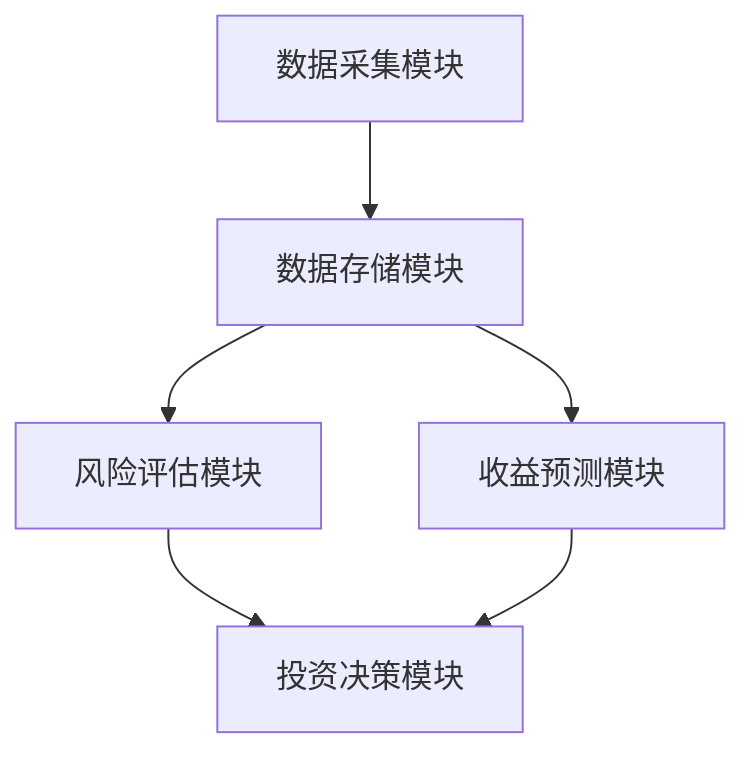

                 


# 巴菲特-芒格的太阳能技术投资：可再生能源的未来

## 关键词：巴菲特，芒格，太阳能技术，可再生能源，投资策略，净现值，内部收益率

## 摘要：本文深入分析了巴菲特和芒格在太阳能技术投资领域的策略和方法，探讨了太阳能技术的基本原理、投资评估的核心概念，以及算法原理和系统架构设计。通过实际案例分析，总结了太阳能投资的关键点和未来趋势，为投资者提供了实用的建议。

---

## 第一部分: 巴菲特-芒格的太阳能技术投资概述

### 第1章: 巴菲特与芒格的投资理念

#### 1.1 巴菲特的价值投资理论
巴菲特的价值投资理论强调长期投资、安全边际和企业基本面分析。他倾向于投资那些具有强大护城河、稳定现金流和合理估值的企业。

#### 1.2 芒格的多元思维模型
芒格的多元思维模型强调跨学科思考，将多个领域的知识结合起来，以更全面的方式理解问题。他认为投资不仅是对一家公司，更是对整个系统中各个因素的综合考量。

#### 1.3 巴菲特与芒格的合作策略
巴菲特和芒格的合作基于互补性。巴菲特擅长企业估值和投资策略，而芒格则提供多元化的思维框架，帮助识别潜在风险和机会。

---

### 第2章: 太阳能技术与可再生能源的背景

#### 2.1 太阳能技术的基本原理
太阳能是指利用太阳辐射的能量进行发电的技术。主要形式包括光伏发电（PV）和太阳热能（SHC）。光伏发电是最常见的形式，其核心是将太阳光转化为电能。

#### 2.2 可再生能源的全球发展趋势
全球能源结构正从化石能源向可再生能源转型。根据国际能源署（IEA）的数据，可再生能源在全球电力结构中的占比逐年增加，尤其是在欧洲和中国。

#### 2.3 巴菲特与芒格的太阳能投资背景
巴菲特和芒格的投资背景主要集中在传统能源和公用事业领域。近年来，他们逐渐将目光转向太阳能，因为其具有广阔的增长潜力和政策支持。

---

## 第二部分: 太阳能技术投资的核心概念与联系

### 第3章: 太阳能投资的核心概念

#### 3.1 太阳能技术的关键指标
- **转换效率**：衡量太阳辐射能转化为电能的效率，通常以百分比表示。
- **投资回收期**：项目初始投资与年净收益的比值，反映投资回报的速度。
- **系统寿命**：太阳能系统正常运行的预期年限。

#### 3.2 投资评估的关键因素
- **初始投资成本**：包括设备购买、安装和调试费用。
- **运营成本**：维护、清洁和可能的部件更换费用。
- **收益预测**：基于电价、发电量和补贴政策的收入预测。

---

### 第4章: 太阳能技术与投资的关联性分析

#### 4.1 太阳能技术对投资回报的影响
- **技术进步与成本下降**：技术进步降低了太阳能系统的成本，提高了投资回报率。
- **技术成熟度与风险**：成熟的技术降低投资风险，但技术落后可能导致收益下降。

#### 4.2 投资策略对技术发展的推动
- **资本投入与研发**：投资推动技术创新，缩短技术成熟周期。
- **市场竞争与技术升级**：投资者倾向于投资技术领先企业，推动行业整体技术水平提升。

---

## 第三部分: 太阳能技术投资的算法原理

### 第5章: 太阳能项目评估的数学模型

#### 5.1 净现值（NPV）模型
净现值（Net Present Value, NPV）是评估投资项目盈利能力的重要指标。公式如下：
$$ NPV = \sum_{t=0}^{n} \frac{CF_t}{(1 + r)^t} $$
其中，$CF_t$ 是第 $t$ 年的现金流，$r$ 是贴现率，$n$ 是项目寿命。

#### 5.2 内部收益率（IRR）模型
内部收益率（Internal Rate of Return, IRR）是使 NPV 等于零的贴现率，公式如下：
$$ NPV = \sum_{t=0}^{n} \frac{CF_t}{(1 + IRR)^t} = 0 $$

---

## 第四部分: 系统分析与架构设计

### 第6章: 太阳能投资系统的架构设计

#### 6.1 项目场景介绍
假设我们正在评估一个太阳能发电厂的投资项目，需要考虑发电量、投资成本、运营成本和补贴政策。

#### 6.2 系统功能设计
- **数据采集模块**：收集历史电价、补贴政策、天气数据等。
- **风险评估模块**：分析技术风险、市场风险和政策风险。
- **收益预测模块**：基于历史数据和模型，预测项目收益。

#### 6.3 系统架构设计
以下是系统架构的 Mermaid 图：


---

## 第五部分: 项目实战

### 第7章: 环境安装与核心代码实现

#### 7.1 环境安装
需要安装 Python、NumPy 和 Pandas 等库。

#### 7.2 核心代码实现
以下是一个简单的 NPV 计算示例：
```python
import numpy as np

def calculate_npv(cash_flows, discount_rate):
    return np.npv(discount_rate, cash_flows)

# 示例数据
cash_flows = [-1000, 500, 600, 700]
discount_rate = 0.1

npv = calculate_npv(cash_flows, discount_rate)
print(f"净现值：{npv}")
```

---

### 第8章: 案例分析与项目小结

#### 8.1 案例分析
假设一个太阳能项目初始投资为 $1000 万元，预计每年收益为 $300 万元，寿命为 5 年，贴现率为 10%。计算其 NPV：
$$ NPV = \frac{-1000}{(1.1)^0} + \frac{300}{(1.1)^1} + \frac{300}{(1.1)^2} + \frac{300}{(1.1)^3} + \frac{300}{(1.1)^4} + \frac{300}{(1.1)^5} $$
计算结果为正，表明项目具有投资价值。

#### 8.2 项目小结
通过案例分析，我们可以看出，太阳能投资的评估需要结合技术、市场和政策多方面因素，NPV 和 IRR 是常用的评估指标。

---

## 第六部分: 结论与展望

### 第9章: 结论与投资建议

#### 9.1 结论
太阳能技术投资具有广阔前景，但需要综合考虑技术、市场和政策因素。巴菲特和芒格的投资策略为投资者提供了宝贵的参考。

#### 9.2 投资建议
- **长期视角**：关注技术进步和市场扩展。
- **风险管理**：评估政策风险和市场波动。
- **技术驱动**：选择具有技术优势的企业。

---

## 作者：AI天才研究院/AI Genius Institute & 禅与计算机程序设计艺术 /Zen And The Art of Computer Programming

