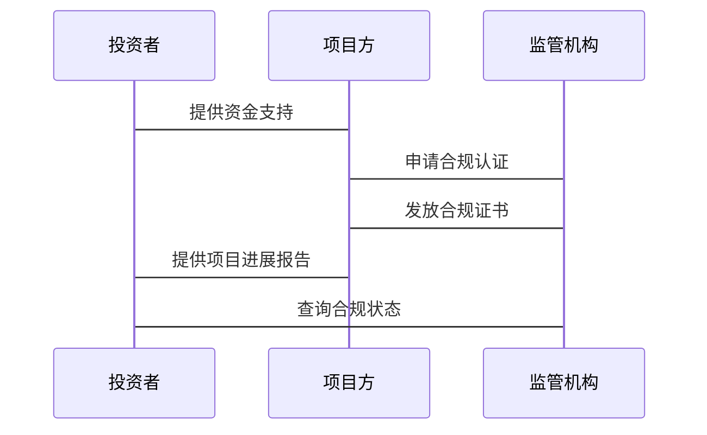

                 


# 巴菲特-芒格的循环经济投资：可持续发展的新范式

> 关键词：巴菲特、芒格、循环经济、投资理念、可持续发展、系统架构

> 摘要：本文探讨了巴菲特和芒格的投资理念与循环经济的结合，提出了可持续发展的新投资范式。通过分析循环经济的定义、特征，以及巴菲特-芒格投资理念的核心要素，构建了循环经济投资的数学模型与系统架构设计，并通过项目实战验证了其可行性和有效性。本文旨在为投资者提供新的视角和方法，以实现经济效益与可持续发展的双重目标。

---

## 第一部分：巴菲特与芒格的投资理念

### 第1章：巴菲特与芒格的投资理念概述

#### 1.1 巴菲特的价值投资理论

##### 1.1.1 巴菲特投资理念的核心要素

- **长期投资**：巴菲特强调长期投资，认为市场短期波动不可预测，但长期趋势可以通过基本面分析把握。
- **安全边际**：通过买入低于内在价值的股票，确保投资的安全性。
- **价值投资**：关注企业的内在价值，而非市场短期波动。

##### 1.1.2 巴菲特投资成功的关键因素

- **深度分析**：巴菲特别强调对企业进行深入的财务和行业分析。
- **风险管理**：避免高风险投资，注重企业的财务健康。
- **耐心与纪律**：坚持长期投资，不被市场波动干扰。

##### 1.1.3 巴菲特对长期投资的重视

- 巴菲特认为长期投资能够避免短期波动的干扰，实现资产的长期增值。
- 他强调企业内在价值的重要性，而非市场的短期情绪。

#### 1.2 芒格的多元思维模型

##### 1.2.1 多元思维模型的定义与特点

- **多元思维模型**：芒格提出，投资者应具备多个领域的知识和思维方式，以全面分析问题。
- **跨学科思维**：通过结合不同学科的原理，找到解决问题的最优方案。

##### 1.2.2 芒格思维模型在投资中的应用

- **逆向思维**：芒格提倡从反方向思考问题，寻找市场忽视的机会。
- **决策框架**：通过构建决策框架，帮助投资者在复杂环境中做出明智决策。

##### 1.2.3 芒格决策框架的逻辑结构

- **问题分析**：明确问题的核心，拆解问题的各个要素。
- **解决方案**：结合多元思维模型，提出多种可能的解决方案。
- **风险评估**：评估每个方案的风险和可行性。

---

## 第二部分：循环经济的基本概念与特征

### 第2章：循环经济的基本概念与特征

#### 2.1 循环经济的定义与背景

##### 2.1.1 循环经济的定义

- 循环经济是一种以资源高效利用和循环利用为核心的发展模式，强调减少资源消耗和废弃物产生。

##### 2.1.2 循环经济的发展背景

- 随着资源枯竭和环境问题的加剧，传统线性经济模式已难以持续，循环经济成为全球关注的焦点。

##### 2.1.3 循环经济与传统经济的区别

| 特征 | 传统经济 | 循环经济 |
|------|----------|----------|
| 资源利用 | 一次性 | 循环利用 |
| 废弃物 | 排放处理 | 再利用 |
| 经济模式 | 线性 | 闭环 |

#### 2.2 循环经济的核心特征

##### 2.2.1 资源高效利用

- 通过技术手段，最大化资源的使用效率，减少浪费。

##### 2.2.2 废物最小化

- 通过设计和技术创新，减少生产过程中产生的废弃物。

##### 2.2.3 闭环生产模式

- 从原材料到产品，再到回收再利用，形成一个闭环的生产流程。

---

## 第三部分：巴菲特-芒格投资理念与循环经济的结合

### 第3章：巴菲特-芒格投资理念与循环经济的结合

#### 3.1 巴菲特-芒格投资理念的核心要素

##### 3.1.1 价值投资与循环经济的契合点

- 循环经济强调资源的高效利用，与价值投资的长期视角不谋而合。

##### 3.1.2 芒格思维模型在循环经济中的应用

- 通过多元思维模型，投资者可以更好地识别循环经济中的机会和风险。

##### 3.1.3 巴菲特长期投资与循环经济的结合

- 长期投资能够帮助投资者在循环经济中获得稳定的回报，同时推动企业的可持续发展。

#### 3.2 循环经济投资的潜在机会

##### 3.2.1 可再生能源领域的投资机会

- 太阳能、风能等可再生能源是循环经济的重要组成部分，具有巨大的投资潜力。

##### 3.2.2 循环材料与循环经济技术的投资

- 投资于循环材料的生产和技术研发，能够推动循环经济的发展。

##### 3.2.3 绿色金融与可持续发展投资

- 绿色金融为循环经济提供了资金支持，同时推动了可持续发展投资的兴起。

---

## 第四部分：循环经济投资的数学模型与分析

### 第4章：循环经济投资的数学模型与分析

#### 4.1 循环经济投资的数学模型

##### 4.1.1 投资回报率的计算公式

$$ \text{投资回报率} = \frac{\text{净收益}}{\text{初始投资}} \times 100\% $$

##### 4.1.2 循环经济项目的净现值分析

$$ \text{净现值} = \sum_{t=0}^{n} \frac{现金流入_t - 现金流出_t}{(1 + r)^t} $$

##### 4.1.3 投资风险的量化模型

$$ \text{风险值} = \sum_{i=1}^{m} w_i \times \text{风险因素}_i $$

#### 4.2 投资风险与回报的平衡

##### 4.2.1 风险评估的数学方法

$$ \text{风险评估} = \sum_{j=1}^{k} \text{权重}_j \times \text{风险指标}_j $$

##### 4.2.2 投资组合优化的数学模型

$$ \text{最大回报} = \sum_{i=1}^{n} w_i \times \text{回报率}_i $$

##### 4.2.3 巴菲特投资策略的数学模拟

$$ \text{投资组合} = \sum_{m=1}^{p} w_m \times \text{股票}_m $$

---

## 第五部分：循环经济投资的系统架构设计

### 第5章：循环经济投资的系统架构设计

#### 5.1 系统功能设计

##### 5.1.1 循环经济项目的生命周期管理

- 从项目启动到实施，再到监控和优化，系统需覆盖整个生命周期。

##### 5.1.2 投资风险评估与预警系统

- 系统应实时监控项目风险，及时发出预警信号。

##### 5.1.3 可持续发展指标的动态监测

- 系统需动态监测项目的可持续发展指标，如资源利用率、废弃物排放等。

#### 5.2 系统架构设计

##### 5.2.1 循环经济投资系统的模块划分

- **数据采集模块**：收集项目相关数据。
- **风险评估模块**：评估项目风险。
- **投资决策模块**：基于数据和分析结果，做出投资决策。
- **监控与优化模块**：实时监控项目状态，优化投资策略。

##### 5.2.2 系统架构的ER实体关系图

```mermaid
erDiagram
    actor 投资者 {
        <属性> 投资者ID, 名称, 资金
    }
    actor 项目方 {
        <属性> 项目ID, 项目名称, 资源需求
    }
    actor 监管机构 {
        <属性> 监管ID, 监管标准
    }
    project投资者 "投资决策" -> "项目方"
    project项目方 "项目实施" -> "监管机构"
    project监管机构 "监管与合规" -> "投资者"
```

##### 5.2.3 系统交互的Mermaid序列图



---

## 第六部分：项目实战

### 第6章：巴菲特-芒格循环经济投资的项目实战

#### 6.1 项目环境与工具安装

##### 6.1.1 开发环境的配置

- **操作系统**：建议使用Linux或MacOS。
- **编程语言**：推荐使用Python。
- **工具安装**：安装Python、Jupyter Notebook、Pandas、Matplotlib等工具。

#### 6.2 核心代码实现

##### 6.2.1 数据采集模块

```python
import pandas as pd
import requests

url = "https://example.com/api"
response = requests.get(url)
data = response.json()
df = pd.DataFrame(data)
```

##### 6.2.2 风险评估模块

```python
from sklearn.metrics import mean_squared_error

def calculate_risk(y_true, y_pred):
    return mean_squared_error(y_true, y_pred)
```

##### 6.2.3 投资决策模块

```python
import numpy as np

def investment_decision(portfolio, risk_threshold):
    return np.where(portfolio['风险'] < risk_threshold, '投资', '不投资')
```

#### 6.3 案例分析与项目小结

##### 6.3.1 案例分析

- **项目选择**：选择一个可再生能源项目，分析其投资回报率和风险。
- **数据分析**：使用Python进行数据清洗和建模，评估项目的可行性。
- **决策制定**：基于模型结果，做出投资决策。

##### 6.3.2 项目小结

- 通过项目实战，验证了巴菲特-芒格投资理念与循环经济结合的可行性。
- 系统架构设计和数学模型的应用，为投资决策提供了科学依据。

---

## 结论

本文通过分析巴菲特和芒格的投资理念，结合循环经济的基本概念和特征，构建了循环经济投资的数学模型与系统架构设计，并通过项目实战验证了其可行性和有效性。未来，随着技术的进步和可持续发展意识的增强，巴菲特-芒格的循环经济投资模式将为投资者提供新的机遇和挑战。

---

## 作者信息

作者：AI天才研究院/AI Genius Institute & 禅与计算机程序设计艺术 /Zen And The Art of Computer Programming

