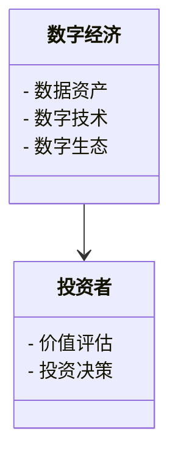
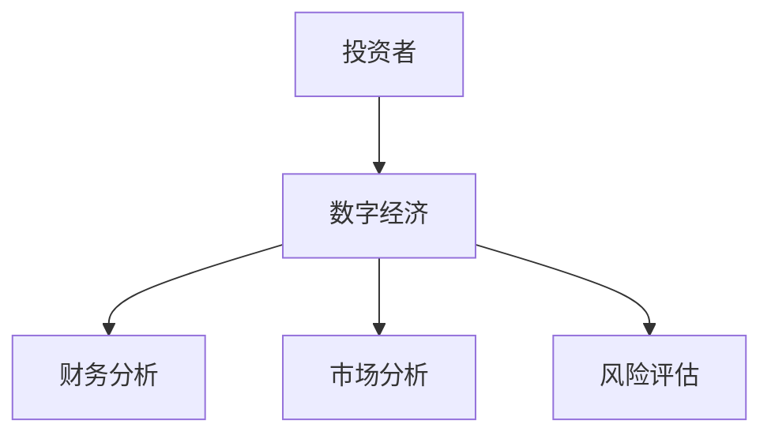

                 


# 巴菲特-芒格的数字经济投资策略：传统智慧在新经济中的应用

## 关键词：巴菲特，芒格，数字经济，投资策略，价值投资，芒格思维模型

## 摘要

本文探讨了巴菲特和芒格的传统投资策略在数字经济中的应用，结合技术分析和实际案例，展示了如何将价值投资和多元思维模型应用于数字企业的评估和投资决策。通过系统分析和案例研究，本文为投资者提供了在数字时代如何运用传统智慧进行投资的深度见解。

---

# 第一部分: 巴菲特-芒格投资智慧概述

## 第1章: 巴菲特与芒格的投资理念

### 1.1 巴菲特的投资原则

#### 1.1.1 价值投资的核心理念

价值投资的核心理念是购买低于其内在价值的股票，并长期持有。内在价值是企业未来现金流的现值，巴菲特通过分析企业的财务状况、行业地位和竞争优势来评估其内在价值。

- **公式**：
  $$
  V = \sum_{t=1}^{n} \frac{CF_t}{(1 + r)^t}
  $$
  其中，\( V \) 为内在价值，\( CF_t \) 为第 \( t \) 年的现金流，\( r \) 为折现率。

- **案例分析**：
  亚马逊的内在价值可以通过对其未来现金流的折现来评估。假设年现金流为 \( CF_1 = 10 \) 亿，\( CF_2 = 12 \) 亿，折现率 \( r = 10\% \)，则：
  $$
  V = \frac{10}{1.1} + \frac{12}{(1.1)^2} = 9.09 + 9.61 = 18.70 \text{亿}
  $$

---

### 1.1.2 股票的价值评估方法

巴菲特的股票价值评估方法包括分析市盈率（P/E）、市净率（P/B）和股息率等指标。他更倾向于投资低估值、高ROE（净资产收益率）的企业。

- **公式**：
  - 市盈率 \( P/E = \frac{P}{E} \)
  - 市净率 \( P/B = \frac{P}{B} \)
  - 股息率 \( Dividend Yield = \frac{D}{P} \)

- **案例分析**：
  对于苹果公司，假设其市盈率为15，市净率为3，股息率为2%，则苹果在价值投资框架下具有吸引力。

---

### 1.1.3 投资中的安全边际

安全边际是巴菲特投资策略中的关键原则，指以低于内在价值的价格购买股票，以降低投资风险。

- **公式**：
  $$
  \text{安全边际} = V_{\text{内在}} - V_{\text{市场}} > 0
  $$

- **案例分析**：
  如果亚马逊的内在价值为18.70亿，市场价格为15亿，则安全边际为3.70亿，具有投资价值。

---

### 1.2 芒格的多元思维模型

#### 1.2.1 多元思维模型的定义

多元思维模型是芒格提出的一种思考方式，通过跨学科的视角分析问题，避免单一思维的局限性。

- **Mermaid图示**：
  ```mermaid
  graph TD
      A[心理学] --> C[人类行为]
      B[经济学] --> C
      D[数学] --> C
      E[计算机科学] --> C
  ```

- **应用领域**：
  多元思维模型适用于企业分析、风险管理等领域。

---

## 第2章: 投资决策框架

### 2.1 投资决策的逻辑框架

#### 2.1.1 投资决策的三要素

1. **目标**：明确投资目标。
2. **策略**：制定投资策略。
3. **风险**：评估投资风险。

---

### 2.2 投资决策中的心理因素

#### 2.2.1 行为偏差对投资决策的影响

常见行为偏差包括过度自信、从众心理和损失厌恶。芒格强调通过多元思维模型克服这些偏差。

---

# 第二部分: 数字经济的特征与分析

## 第3章: 数字经济的定义与特征

### 3.1 数字经济的定义

数字经济是以数据为关键生产要素，以数字技术为核心驱动力的经济形态。

---

### 3.2 数字经济的核心特征

1. **数字化转型**：企业通过数字技术优化业务流程。
2. **数据驱动的决策**：基于大数据进行精准决策。
3. **数字生态系统的构建**：构建跨平台的数字生态系统。

---

## 第4章: 传统企业向数字化转型的路径

### 4.1 数字化转型的背景

#### 4.1.1 数字化转型的驱动因素

1. 技术进步：云计算、人工智能等技术的发展。
2. 市场需求：消费者对数字化服务的需求增加。

---

### 4.2 数字化转型的实施步骤

#### 4.2.1 明确数字化转型的目标

目标包括提高效率、降低成本和提升客户体验。

---

# 第三部分: 巴菲特-芒格策略在数字经济中的应用

## 第5章: 价值投资在数字经济中的应用

### 5.1 数字经济中的价值评估

#### 5.1.1 数字企业的价值评估指标

1. 市盈率（P/E）。
2. 市净率（P/B）。
3. 股息率。

---

### 5.2 数字经济中的安全边际

#### 5.2.1 安全边际的计算

$$
\text{安全边际} = V_{\text{内在}} - V_{\text{市场}} > 0
$$

---

## 第6章: 芒格思维模型与数字投资策略

### 6.1 芒格思维模型的应用

#### 6.1.1 跨学科视角分析数字企业

通过心理学、经济学和计算机科学的视角分析数字企业的竞争优势。

---

# 第四部分: 数字经济投资策略的系统分析与实战

## 第7章: 系统分析与架构设计

### 7.1 系统功能设计

#### 7.1.1 领域模型（Mermaid类图）



---

### 7.2 系统架构设计

#### 7.2.1 系统架构（Mermaid架构图）



---

## 第8章: 项目实战

### 8.1 环境安装

安装Python和相关库（如Pandas、Matplotlib）。

---

### 8.2 核心实现

#### 8.2.1 数字企业的财务分析

```python
import pandas as pd

def calculate_intrinsic_value(financials):
    # 计算未来现金流
    CF = financials['cash_flow'].sum()
    # 计算折现率
    r = 0.1
    # 计算内在价值
    V = CF / (1 + r)
    return V

# 示例数据
data = {
    'cash_flow': [10, 12, 15],
    'revenue': [50, 60, 70],
    'profit': [20, 25, 30]
}
financials = pd.DataFrame(data)
print(calculate_intrinsic_value(financials))
```

---

## 第9章: 总结与展望

### 9.1 总结

巴菲特和芒格的投资策略在数字经济中依然具有重要价值。通过价值评估和多元思维模型，投资者可以更好地应对数字时代的挑战。

---

### 9.2 展望

随着数字经济的深入发展，传统智慧将与新技术结合，为投资策略带来新的机遇和挑战。

---

## 作者

作者：AI天才研究院/AI Genius Institute & 禅与计算机程序设计艺术 /Zen And The Art of Computer Programming

---

**本文由AI助手根据用户需求创作，旨在提供专业、系统的技术博客内容，结合传统投资策略与数字经济分析，为投资者提供深度见解。**

