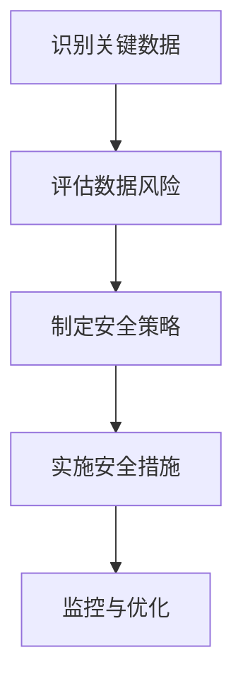
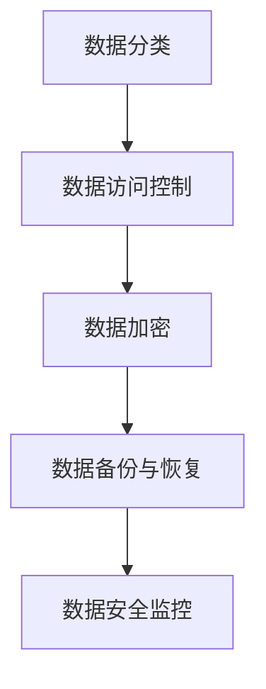

                 

# 巴菲特-芒格的数据安全投资：数字时代的新机遇

## 关键词：  
数据安全、投资、巴菲特、芒格、数字时代、风险管理、机会  

## 摘要：  
在数字时代，数据已成为最重要的资产之一，数据安全问题也随之成为全球关注的焦点。巴菲特和芒格的投资理念以价值投资、长期持有和风险管理著称，这些理念在数据安全投资领域同样具有重要的指导意义。本文从数据安全的核心概念、投资机会、风险管理策略等方面展开分析，结合实际案例，探讨巴菲特和芒格的数据安全投资策略在数字时代下的新机遇。

---

## 第一部分：引言  

### 1.1 数据安全投资的背景与意义  
在数字化转型的今天，数据已成为企业的核心资产，数据安全问题也随之成为影响企业生存和发展的关键因素。数据安全不仅关系到企业的财务安全，还涉及到企业的声誉和客户信任。因此，数据安全投资的重要性日益凸显。  

巴菲特和芒格作为全球著名的价值投资者，他们的投资理念强调长期价值、安全边际和风险管理。这些理念在数据安全投资中同样适用，尤其是在数字时代下，数据安全投资不仅是一种风险管理手段，更是一种抓住数字经济发展机遇的重要策略。  

---

## 第二部分：数据安全的核心概念与背景分析  

### 2.1 数据安全的基本概念  
#### 2.1.1 数据安全的定义与分类  
数据安全是指保护数据的机密性、完整性和可用性的过程。数据安全可以分为以下几个类别：  
- **网络数据安全**：保护数据在网络传输中的安全。  
- **应用数据安全**：确保应用程序中的数据在处理过程中的安全。  
- **数据存储安全**：保护存储在数据库或存储设备中的数据。  
- **主机数据安全**：保护主机系统中的数据安全。  

#### 2.1.2 数据安全的核心要素  
数据安全的核心要素包括：  
1. **身份认证**：确保只有授权人员可以访问数据。  
2. **访问控制**：限制用户对数据的访问权限。  
3. **加密技术**：对数据进行加密，防止未经授权的访问。  
4. **安全审计**：定期检查数据安全策略的执行情况。  

#### 2.1.3 数据安全的边界与外延  
数据安全的边界不仅限于技术层面，还包括法律、合规和组织管理等方面。数据安全的外延则涵盖了数据的全生命周期管理，从数据的产生、存储、处理到销毁的整个过程。  

### 2.2 数据安全的现状与挑战  
#### 2.2.1 当前数据安全的主要威胁  
当前数据安全的主要威胁包括：  
- **网络攻击**：黑客通过各种手段攻击企业数据系统。  
- **数据泄露**：内部员工或外部合作伙伴导致的数据泄露。  
- **数据篡改**：未经授权的人员篡改数据内容。  
- **数据丢失**：由于技术故障或人为操作失误导致的数据丢失。  

#### 2.2.2 数据安全技术的发展趋势  
数据安全技术的发展趋势包括：  
1. **人工智能与机器学习**：利用AI技术进行威胁检测和预测。  
2. **零信任架构**：通过最小权限原则提升数据访问的安全性。  
3. **区块链技术**：通过区块链技术实现数据的不可篡改性。  

#### 2.2.3 数据安全投资的必要性  
数据安全投资的必要性体现在以下几个方面：  
- **合规要求**：企业需要遵守数据保护的法律法规。  
- **风险防控**：数据泄露可能对企业造成巨大的经济损失。  
- **竞争优势**：数据安全能力强的企业更容易赢得客户信任。  

### 2.3 数据安全的价值与分类  
#### 2.3.1 数据安全的价值评估模型  
数据安全的价值可以从以下几个维度进行评估：  
- **数据的重要性**：数据对企业核心业务的影响程度。  
- **数据的敏感性**：数据被泄露可能造成的损失。  
- **数据的可用性**：数据在企业运营中的关键性。  

#### 2.3.2 数据安全的分类与应用场景  
数据安全的分类与应用场景包括：  
1. **企业内部数据安全**：保护企业内部数据的安全。  
2. **客户数据安全**：保护客户数据不被泄露。  
3. **供应链数据安全**：保护供应链中的数据安全。  

---

## 第三部分：数据安全投资的核心概念与联系  

### 3.1 数据安全投资的原理  
#### 3.1.1 数据安全投资的逻辑框架  
数据安全投资的逻辑框架包括以下几个步骤：  
1. **识别关键数据**：确定企业中哪些数据是最关键的。  
2. **评估数据风险**：分析数据可能面临的风险。  
3. **制定安全策略**：根据风险评估结果制定数据安全策略。  
4. **实施安全措施**：通过技术手段实现数据安全。  
5. **监控与优化**：定期监控数据安全状态并进行优化。  

#### 3.1.2 数据安全投资的数学模型  
以下是数据安全投资的数学模型示例：  
$$ \text{数据安全投资} = \text{数据价值} \times \text{风险系数} \times \text{安全投入} $$  
其中，数据价值是数据对企业的重要性，风险系数是数据面临的风险大小，安全投入是企业在数据安全方面的投入。  

#### 3.1.3 数据安全投资的流程图  

---

## 第四部分：数据安全投资的实践与案例分析  

### 4.1 数据安全投资的实践  
#### 4.1.1 数据安全治理的系统架构设计  
以下是数据安全治理体系的架构图：  

#### 4.1.2 数据安全投资的实施路径  
数据安全投资的实施路径包括：  
1. **数据分类与优先级排序**：根据数据的重要性进行分类。  
2. **风险评估与安全策略制定**：根据数据分类结果制定安全策略。  
3. **技术选型与实施**：选择合适的技术手段实现数据安全。  
4. **监控与优化**：定期监控数据安全状态并进行优化。  

### 4.2 数据安全投资的案例分析  
#### 4.2.1 某企业的数据安全投资案例  
以下是某企业的数据安全投资案例：  

1. **背景介绍**：某企业是一家互联网公司，拥有大量用户数据。  
2. **问题分析**：该企业发现其用户数据存在泄露风险。  
3. **解决方案**：  
   - 数据分类：将用户数据分为高、中、低三个风险等级。  
   - 数据加密：对高风险数据进行加密存储。  
   - 数据访问控制：限制员工对高风险数据的访问权限。  
   - 数据备份与恢复：定期备份数据并制定恢复计划。  
4. **实施结果**：通过上述措施，该企业成功降低了数据泄露风险，用户数据得到了有效保护。  

---

## 第五部分：总结与展望  

### 5.1 总结  
数据安全投资是数字时代下企业的重要任务，巴菲特和芒格的投资理念在数据安全领域具有重要的指导意义。通过数据分类、风险评估、安全策略制定和实施，企业可以有效降低数据安全风险，提升数据价值。  

### 5.2 展望  
随着数字化转型的深入，数据安全投资的重要性将更加凸显。未来，企业需要更加注重数据安全的投资，采用新技术手段提升数据安全能力，抓住数字时代下的新机遇。  

---

## 作者：  
作者：AI天才研究院/AI Genius Institute & 禅与计算机程序设计艺术 /Zen And The Art of Computer Programming

