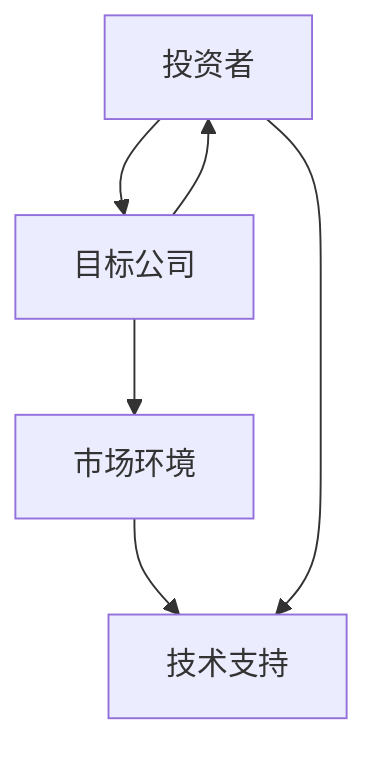
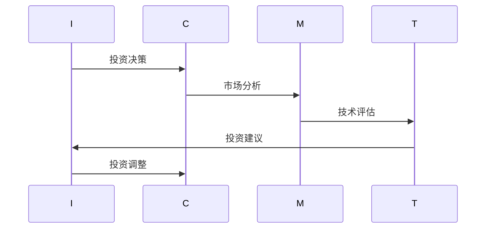

                 


# 巴菲特-芒格的智慧医疗投资：科技如何改变医疗行业

## 关键词：
巴菲特、芒格、医疗投资、科技、人工智能、大数据、医疗系统

## 摘要：
本文深入探讨了巴菲特和芒格在医疗投资领域的智慧，分析了科技如何改变医疗行业。通过详细分析医疗行业的现状、科技对医疗的深远影响以及巴菲特和芒格的投资策略，本文揭示了如何利用科技的力量在医疗投资中获得成功。文章还通过实际案例、系统架构设计和项目实战，为读者提供了全面的指导和深入的见解。

---

## 第1章: 巴菲特与芒格的投资哲学

### 1.1 巴菲特与芒格的投资理念
#### 1.1.1 巴菲特的价值投资理论
巴菲特的价值投资理论强调长期持有、寻找具有持续竞争优势的公司，并注重公司的基本面分析。他提出了“安全边际”概念，即以低于内在价值的价格买入优质资产。

#### 1.1.2 芒格的多元思维模型
芒格的多元思维模型强调跨学科思考，将多个领域的知识结合起来，以全面分析问题。他认为，投资不仅仅是金融分析，还需要对心理学、经济学、生物学等多个领域有深刻的理解。

#### 1.1.3 两人投资哲学的结合
巴菲特和芒格的投资哲学结合了长期价值投资和跨学科分析，形成了独特的医疗投资策略。他们注重公司的长期盈利能力、行业地位以及管理团队的能力。

### 1.2 医疗行业的投资价值
#### 1.2.1 医疗行业的特点与发展趋势
医疗行业具有稳定的增长性、较高的进入壁垒和较长的生命周期。随着人口老龄化和医疗技术的进步，医疗行业的需求将持续增长。

#### 1.2.2 医疗行业与经济周期的关系
医疗行业的需求相对稳定，受经济波动的影响较小。在经济衰退时，医疗行业的需求甚至可能增加，因此具有较强的防御性。

#### 1.2.3 医疗行业投资的长期性与稳定性
医疗行业的投资具有长期性和稳定性，适合长期持有的投资策略。巴菲特和芒格正是利用了这一特点，在医疗行业进行了长期投资。

### 1.3 巴菲特与芒格对医疗行业的关注
#### 1.3.1 巴菲特对医疗行业的投资案例
巴菲特投资了多家医疗公司，如制药公司和医疗设备公司。他注重公司的盈利能力和市场地位，选择具有竞争优势的企业。

#### 1.3.2 芒格对医疗行业的观点
芒格认为医疗行业具有较高的投资价值，但需要结合多元思维模型进行分析。他关注公司的管理团队、创新能力和市场前景。

#### 1.3.3 两人对医疗行业投资的共识
两人一致认为，医疗行业具有长期增长潜力，投资时需要注重公司的基本面和长期盈利能力。

---

## 第2章: 医疗行业的科技变革

### 2.1 医疗行业的现状与挑战
#### 2.1.1 传统医疗行业的痛点
传统医疗行业存在效率低下、资源浪费、信息孤岛等问题。医疗成本高企，患者体验较差。

#### 2.1.2 医疗行业的数字化转型
随着信息技术的发展，医疗行业正在向数字化转型。电子病历、远程医疗和医疗信息化成为趋势。

#### 2.1.3 医疗行业的未来趋势
未来医疗行业将更加智能化、个性化和精准化。人工智能和大数据将推动医疗行业的革命性变化。

### 2.2 科技对医疗行业的深远影响
#### 2.2.1 AI在医疗诊断中的应用
人工智能可以通过分析医学影像和病历数据，辅助医生进行诊断。AI在疾病早期 detection 和诊断准确性方面具有显著优势。

#### 2.2.2 大数据在医疗管理中的作用
大数据技术可以优化医疗资源的分配，提高医疗效率。通过分析大量数据，可以预测疾病趋势和优化治疗方案。

#### 2.2.3 医疗器械与生物科技的创新
科技的进步推动了医疗器械和生物科技的创新，如基因编辑、智能医疗设备等。这些创新将显著提高医疗效果和降低治疗成本。

### 2.3 医疗科技投资的机会与风险
#### 2.3.1 医疗科技投资的机会
随着科技的不断进步，医疗科技的投资机会将不断增加。人工智能、大数据和生物技术等领域具有较大的投资潜力。

#### 2.3.2 医疗科技投资的风险
医疗科技的投资风险包括技术风险、市场风险和政策风险。技术更新换代快，政策变化也可能影响投资回报。

#### 2.3.3 如何评估医疗科技的投资价值
评估医疗科技的投资价值需要结合技术可行性、市场前景和团队能力。投资者需要具备跨学科的知识和深入的行业理解。

---

## 第3章: 巴菲特与芒格的医疗投资策略

### 3.1 巴菲特的长期价值投资策略
#### 3.1.1 价值投资的核心要素
价值投资的核心是寻找被市场低估的优质资产。巴菲特注重公司的盈利能力、财务状况和管理团队。

#### 3.1.2 巴菲特的选股标准
巴菲特的选股标准包括低市盈率、高ROE（净资产收益率）、稳定的收益和良好的管理团队。

#### 3.1.3 长期持有与复利效应
巴菲特强调长期持有优质资产，通过复利效应实现财富增长。医疗行业的长期稳定增长符合他的投资理念。

### 3.2 芒格的多元思维模型在医疗投资中的应用
#### 3.2.1 多元思维模型的定义
多元思维模型是指通过多个学科的视角分析问题，避免单一思维的局限性。芒格认为，投资需要跨学科的知识和经验。

#### 3.2.2 医疗行业中的多元思维分析
在医疗投资中，芒格运用多元思维模型分析公司的技术、市场、管理等多个方面，寻找具有长期竞争优势的企业。

#### 3.2.3 如何用多元思维模型评估医疗投资
通过多元思维模型，投资者可以全面评估医疗公司的价值，发现潜在的风险和机会。

### 3.3 巴菲特与芒格的医疗投资案例分析
#### 3.3.1 巴菲特投资的具体案例
巴菲特投资了多家医疗公司，如制药公司和医疗设备公司。他注重公司的长期盈利能力和技术优势。

#### 3.3.2 芒格投资的具体案例
芒格投资了生物科技公司，关注公司的创新能力和市场前景。他的投资策略注重长期价值和行业趋势。

#### 3.3.3 两人投资策略的异同
巴菲特注重价值投资和长期持有，芒格注重多元思维和创新。两人的策略在医疗投资中相辅相成，形成了独特的投资风格。

---

## 第4章: 医疗科技的创新与投资机会

### 4.1 医疗科技的创新方向
#### 4.1.1 AI在医疗诊断中的应用
人工智能在医疗影像分析、疾病预测和个性化治疗方面具有广阔的应用前景。

#### 4.1.2 大数据在医疗管理中的作用
大数据技术可以优化医疗资源分配、提高医疗效率和降低医疗成本。

#### 4.1.3 医疗器械与生物科技的创新
科技的进步推动了医疗设备和生物技术的创新，如基因编辑和智能医疗设备。

### 4.2 医疗科技的投资逻辑
#### 4.2.1 投资逻辑的核心要素
投资者需要关注医疗科技的技术可行性、市场前景和团队能力。技术领先、市场需求大和管理团队优秀的公司更具投资价值。

#### 4.2.2 如何评估医疗科技公司的价值
评估医疗科技公司的价值需要结合技术、市场、财务和管理等多个因素。投资者需要具备跨学科的知识和深入的行业理解。

#### 4.2.3 医疗科技投资的风险管理
医疗科技投资的风险包括技术风险、市场风险和政策风险。投资者需要制定科学的风险管理策略，分散投资风险。

### 4.3 医疗科技的未来趋势
#### 4.3.1 数字化医疗的未来发展
数字化医疗将更加普及，电子病历、远程医疗和医疗信息化将成为主流。

#### 4.3.2 医疗数据的商业化潜力
医疗数据的商业化潜力巨大，通过大数据分析可以优化医疗资源分配和提高治疗效果。

#### 4.3.3 医疗科技与传统医疗的融合
医疗科技与传统医疗的融合将推动医疗行业的革命性变化，提高医疗效率和患者体验。

---

## 第5章: 医疗投资的系统分析与架构设计

### 5.1 医疗投资的系统分析
#### 5.1.1 投资系统的构成要素
医疗投资系统包括投资者、目标公司、市场环境、政策法规和技术支持等多个要素。

#### 5.1.2 投资系统的目标与功能
医疗投资系统的目标是实现投资收益最大化，功能包括信息收集、分析决策、风险管理和投资执行。

#### 5.1.3 系统分析的方法与工具
系统分析的方法包括SWOT分析、PEST分析和价值链分析。工具包括决策树和层次分析法。

### 5.2 医疗投资的系统架构设计
#### 5.2.1 领域模型设计
领域模型包括投资者、目标公司、市场环境和技术支持四个模块。各模块之间通过数据流进行交互。

#### 5.2.2 系统架构图
以下是医疗投资系统的架构图：



#### 5.2.3 系统接口设计
医疗投资系统需要与多个外部系统接口，包括金融市场数据接口、公司财务数据接口和技术支持接口。

#### 5.2.4 系统交互设计
以下是医疗投资系统的交互图：



---

## 第6章: 医疗投资的项目实战

### 6.1 项目背景与目标
#### 6.1.1 项目背景
随着科技的发展，医疗行业的投资机会不断增加。本项目旨在通过科技手段优化医疗投资决策，提高投资效率。

#### 6.1.2 项目目标
通过科技手段分析医疗行业趋势，评估医疗公司的价值，制定科学的投资策略。

### 6.2 系统核心实现
#### 6.2.1 环境安装
需要安装Python、数据分析库（如Pandas、NumPy）和可视化工具（如Matplotlib）。还需要安装AI框架（如TensorFlow）。

#### 6.2.2 核心实现代码
以下是医疗投资分析系统的代码实现：

```python
import pandas as pd
import numpy as np
from sklearn import linear_model

# 数据加载
data = pd.read_csv('medical_data.csv')

# 数据预处理
data = data.dropna()
data = pd.get_dummies(data)

# 模型训练
model = linear_model.LinearRegression()
model.fit(data[['revenue', 'profit_margin', 'market_share']], data['valuation'])

# 预测估值
new_company = pd.DataFrame({
    'revenue': [1000000],
    'profit_margin': [20],
    'market_share': [15],
    'industry': ['Healthcare']
})
new_company = pd.get_dummies(new_company)
predicted_valuation = model.predict(new_company)[0]

print(f"预测估值为：{predicted_valuation}")
```

#### 6.2.3 代码解读与分析
上述代码实现了医疗公司的估值预测。通过数据预处理、特征工程和模型训练，可以预测目标公司的估值。该模型可以用于辅助投资决策。

### 6.3 实际案例分析
#### 6.3.1 案例背景
某医疗公司近年来收入增长稳定，利润率较高，市场占有率稳步提升。投资者希望评估该公司的估值。

#### 6.3.2 案例分析
通过上述代码，输入该公司的财务数据，模型预测其估值为合理区间。投资者可以根据预测结果制定投资策略。

### 6.4 项目小结
通过科技手段分析医疗投资，可以提高投资决策的科学性和准确性。本项目展示了如何利用数据分析和人工智能技术优化医疗投资。

---

## 第7章: 总结与展望

### 7.1 最佳实践 tips
- 投资者需要结合科技手段和传统方法进行医疗投资。
- 注重公司的长期盈利能力和技术优势。
- 科技对医疗行业的改变将持续推动投资机会。

### 7.2 小结
本文通过分析巴菲特和芒格的投资哲学，探讨了科技对医疗行业的深远影响。医疗科技的投资机会和挑战并存，投资者需要具备跨学科的知识和深入的行业理解。

### 7.3 注意事项
- 医疗投资具有较高的风险，投资者需要谨慎决策。
- 科技的应用需要结合实际，避免盲目跟风。
- 政策变化可能影响投资回报，需密切关注行业动态。

### 7.4 拓展阅读
- 推荐阅读巴菲特和芒格的著作，深入理解他们的投资哲学。
- 关注医疗科技领域的最新动态和技术进步。

---

## 作者：AI天才研究院/AI Genius Institute & 禅与计算机程序设计艺术 /Zen And The Art of Computer Programming

