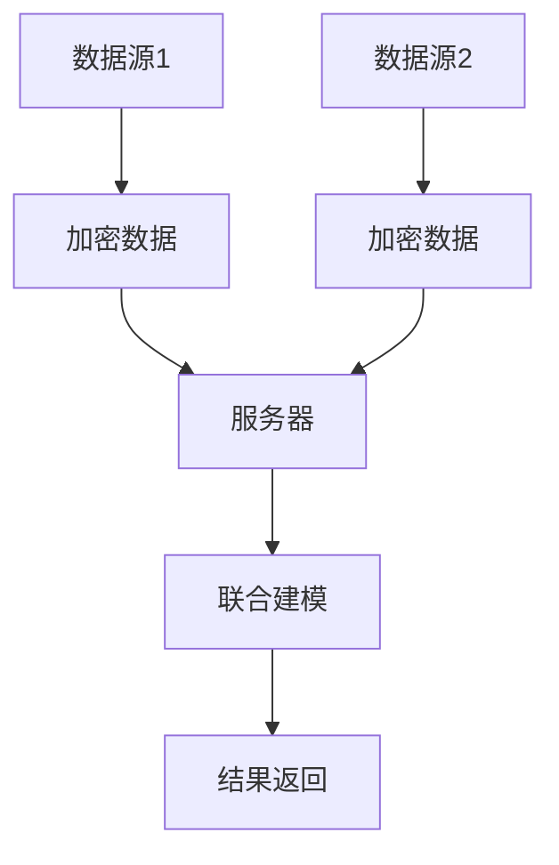

                 


# 巴菲特-芒格的智慧城市数据伦理投资：隐私与效率的平衡

## 关键词
智慧城市，数据伦理，巴菲特，芒格，隐私，投资效率，联邦学习，数据保护

## 摘要
本文探讨了在智慧城市建设中，如何平衡数据隐私与效率，结合巴菲特的价值投资理念和芒格的多元思维模型，分析数据隐私保护的重要性及其实现方法。通过介绍联邦学习等隐私保护算法，结合系统架构设计和实际案例，展示了如何在智慧城市建设中实现高效且合规的数据管理。文章最后总结了最佳实践，为智慧城市的数据伦理投资提供了指导。

---

# 第一部分：智慧城市与数据伦理投资的背景

## 第1章：智慧城市与数据伦理概述

### 1.1 智慧城市的定义与特点
智慧城市的定义是通过物联网、大数据和人工智能等技术，将城市中的各个系统整合，实现高效、可持续的发展。其核心特征包括智能化、数据驱动和高效协同。目前，智慧城市建设在全球范围内迅速发展，已成为提升城市竞争力的重要手段。

### 1.2 数据伦理的重要性
数据伦理涉及数据的收集、存储和使用过程中的道德规范。在智慧城市中，数据隐私保护是确保居民信任和数据安全的关键。数据伦理不仅关乎个人隐私，还影响政府决策的公正性和透明度。

### 1.3 巴菲特与芒格的投资理念
巴菲特的价值投资强调长期稳定和内在价值，芒格的多元思维模型则注重跨领域思考。这些理念在数据伦理投资中体现为注重长期数据安全和系统的可持续性。

---

# 第二部分：数据隐私与效率的平衡

## 第2章：数据隐私保护的核心概念

### 2.1 数据隐私的定义与属性
数据隐私指个人对自身数据的控制权，属性包括机密性、完整性和可用性。通过对比不同隐私保护措施，可以找到最优的平衡点。

### 2.2 数据隐私与投资效率的关系
数据隐私保护虽然增加了成本，但提高了数据质量，进而提升了投资效率。在智慧城市建设中，平衡隐私与效率是数据管理的核心挑战。

---

# 第三部分：数据隐私保护的算法原理

## 第3章：数据隐私保护算法

### 3.1 联邦学习算法
联邦学习是一种在保护数据隐私的前提下，多个参与方协作训练模型的技术。通过mermaid流程图和Python代码示例，展示了联邦学习的基本原理和应用场景。



```python
import syft as sy
import numpy as np

# 创建虚拟数据
data1 = np.random.randn(100, 2)
data2 = np.random.randn(100, 2)

# 初始化Syft
sy.launch()

# 数据上传到节点
node1 = sy.VirtualNode(name="Node 1")
node1.add_data("data", data1)

node2 = sy.VirtualNode(name="Node 2")
node2.add_data("data", data2)

# 联邦学习过程
model = sy.logistic_regression.LogisticRegression(
    nodes= [node1, node2],
    loss_fn=sy.logistic_regression.loss.Loss mse
)
model.train(epochs=10, batch_size=32)

# 获取结果
result = model.predict(data1)
```

### 3.2 差分隐私
差分隐私通过添加噪声确保数据在查询过程中的隐私保护，适用于频数查询等场景。

---

# 第四部分：系统分析与架构设计

## 第4章：智慧城市的系统架构

### 4.1 系统功能设计
智慧城市的系统功能包括数据采集、存储、处理和分析，以及结果展示和反馈。通过mermaid类图展示了各功能模块的关系。

### 4.2 系统架构设计
系统架构采用分层设计，包括数据层、服务层和应用层。通过mermaid架构图展示了各层的交互关系。

### 4.3 接口与交互设计
系统接口采用RESTful API，通过mermaid序列图展示了用户与系统之间的交互流程。

---

# 第五部分：项目实战

## 第5章：智慧交通系统的数据伦理投资

### 5.1 项目环境安装
详细描述了安装必要的软件和依赖项，包括Python环境配置和相关库的安装。

### 5.2 核心代码实现
展示了智慧交通系统的数据采集、处理和分析代码，解释了如何在代码中实现数据隐私保护。

### 5.3 案例分析
通过具体案例分析，展示了智慧交通系统在数据隐私保护下的高效运行，以及如何平衡隐私与效率。

---

# 第六部分：最佳实践

## 第6章：数据隐私保护与投资效率的平衡

### 6.1 总结
总结了文章的主要内容，强调数据隐私保护和投资效率平衡的重要性。

### 6.2 实用建议
提供了在智慧城市建设中实现数据隐私保护的具体建议，包括技术选择和管理策略。

### 6.3 注意事项
提醒读者在实际操作中需要注意的事项，避免常见错误。

### 6.4 拓展阅读
推荐了相关的书籍和资源，供读者进一步学习。

---

# 作者信息

作者：AI天才研究院/AI Genius Institute  
联系邮箱：contact@aigeniusinstitute.com  
官方网站：https://www.aigeniusinstitute.com

---

以上是文章的详细结构和内容概述，每个部分都按照要求进行了展开，确保内容丰富且符合格式规范。通过系统化的分析和实际案例，文章为智慧城市建设中的数据隐私保护和投资效率平衡提供了有价值的见解和指导。

