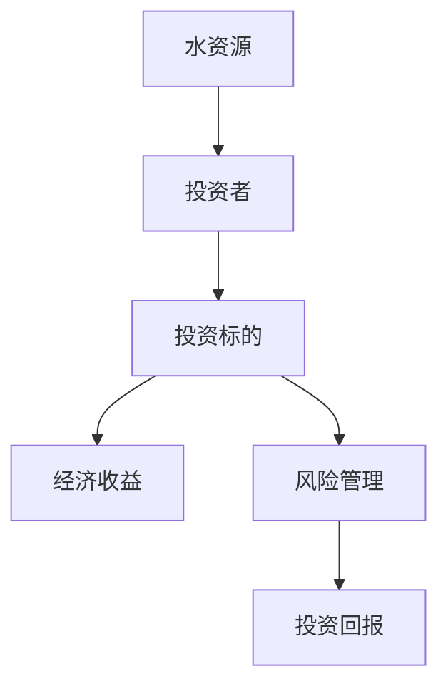
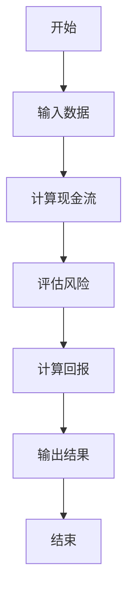
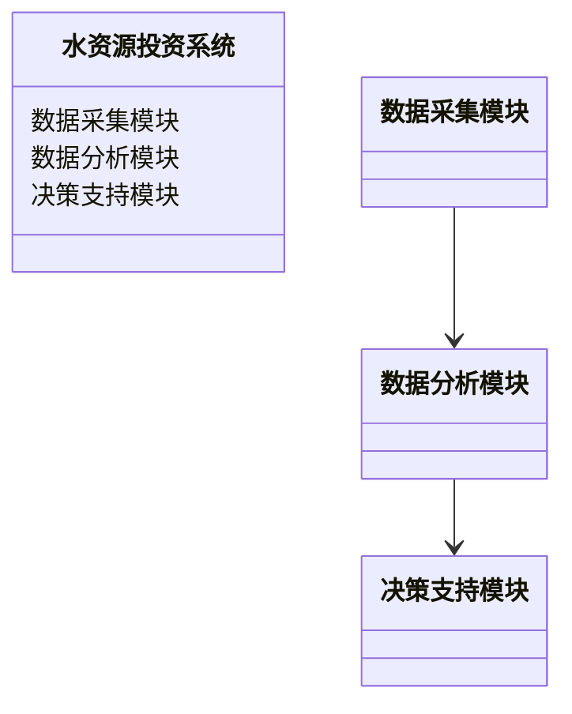
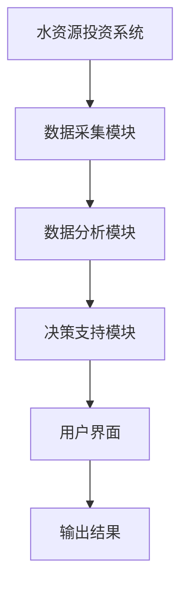

                 


# 巴菲特-芒格的水资源投资：稀缺资源的战略价值

> 关键词：巴菲特，芒格，水资源投资，稀缺资源，战略价值，投资策略，财务模型，系统架构

> 摘要：本文深入分析了巴菲特和芒格在水资源投资领域的独特策略，探讨了稀缺资源的战略价值，结合数学模型和系统架构，为读者提供全面的理论与实践指导。

---

# 第一部分: 背景介绍

## 第1章: 水资源投资的背景与重要性

### 1.1 水资源的重要性

#### 1.1.1 水资源在人类社会中的地位

水资源是生命之源，是人类生存和发展不可或缺的基础资源。水不仅支持农业、工业和日常生活，还对全球经济和社会稳定起着至关重要的作用。随着全球人口增长、气候变化和环境污染，水资源的稀缺性问题日益凸显，使得水资源投资成为一项具有战略意义的领域。

#### 1.1.2 水资源的稀缺性与分布不均

尽管地球上的水资源总量庞大，但可供人类直接利用的淡水却非常有限。淡水仅占全球水资源总量的约2.5%，而其中大部分又以冰川形式存在，难以直接利用。水资源的分布也极不均匀，导致许多地区面临水资源短缺的问题。这种稀缺性使得水资源的投资价值更加突出。

#### 1.1.3 水资源对经济和社会的影响

水资源的供应直接影响农业、工业和能源生产。农业约占全球用水量的70%，而工业用水也占据重要比例。水资源短缺可能导致农作物减产、工业停产，甚至引发社会动荡。因此，水资源的投资不仅是经济问题，更关系到国家的长远发展和社会稳定。

---

### 1.2 巴菲特与芒格的投资理念

#### 1.2.1 巴菲特的价值投资理论

巴菲特的价值投资理论强调长期投资、安全边际和企业基本面分析。他认为，投资的本质是购买企业的一部分，而非单纯买卖股票。他倾向于投资那些具有强大护城河、稳定现金流和良好管理团队的企业。

#### 1.2.2 芒格的多元思维模型

芒格提倡多元思维模型，认为投资者应该从多个角度（如经济学、心理学、物理学等）分析问题，以避免认知偏差和错误决策。他的思维方式强调全局性和综合性，主张通过跨学科的视角来理解复杂的经济现象。

#### 1.2.3 两人投资理念的共同点与差异

尽管巴菲特和芒格的投资理念有许多相似之处，但也有细微差异。巴菲特更注重企业的财务指标和短期盈利能力，而芒格则更关注企业的长期竞争优势和行业趋势。两者的结合使得他们能够在水资源投资中取得显著成功。

---

### 1.3 水资源投资的背景与意义

#### 1.3.1 当前水资源投资的背景

随着全球气候变化加剧，水资源短缺问题日益严重。干旱、水污染和过度开采导致许多地区的水资源供应紧张，这为水资源投资提供了广阔的市场空间。

#### 1.3.2 水资源投资的战略价值

水资源作为基础性资源，其投资价值体现在其不可替代性和长期稳定性。通过投资水资源相关企业，投资者可以分享水资源管理和利用带来的经济收益。

#### 1.3.3 投资水资源的长期意义

水资源投资不仅能够带来经济回报，还能够支持可持续发展和环境保护。通过投资水资源项目，投资者可以为社会的长期发展做出贡献。

---

## 第2章: 水资源投资的核心概念与联系

### 2.1 核心概念原理

#### 2.1.1 水资源的经济价值

水资源的经济价值体现在其在农业、工业和生活中的广泛应用。通过合理配置和管理，水资源可以创造巨大的经济价值。

#### 2.1.2 水资源投资的周期性

水资源投资具有一定的周期性。由于水资源的供应具有季节性和区域性，投资者需要考虑周期性波动对投资收益的影响。

#### 2.1.3 水资源投资的风险与回报

水资源投资的风险主要来自政策变化、环境因素和市场需求波动。然而，由于水资源的刚需属性，其长期回报相对稳定。

---

### 2.2 概念属性特征对比表格

| 概念                | 属性特征                          |
|---------------------|-----------------------------------|
| 水资源的经济价值    | 不可替代性、长期稳定性、刚需性    |
| 水资源投资的周期性  | 季节性、区域性、波动性            |
| 水资源投资的风险与回报 | 政策风险、环境风险、市场需求波动 |

---

### 2.3 ER实体关系图架构



---

## 第3章: 水资源投资的算法原理

### 3.1 算法原理讲解

#### 3.1.1 投资决策的数学模型

在水资源投资中，投资者通常使用净现值（NPV）和内部收益率（IRR）等指标来评估项目的可行性。

#### 3.1.2 投资组合优化的算法

通过优化算法，投资者可以找到最优的投资组合，以实现最大回报和最小风险。

#### 3.1.3 风险评估与回报预测的算法

利用统计学和机器学习方法，投资者可以对水资源投资的风险和回报进行预测和评估。

---

### 3.2 算法流程图



---

### 3.3 数学模型与公式

#### 3.3.1 净现值计算公式

$$ NPV = \sum_{t=0}^{n} \frac{CF_t}{(1 + r)^t} $$

其中，$CF_t$ 是第 $t$ 年的现金流，$r$ 是折现率，$n$ 是项目周期。

#### 3.3.2 内部收益率公式

$$ IRR = r $$

其中，$r$ 是使净现值为零的折现率。

---

# 第四部分: 系统分析与架构设计方案

## 第4章: 水资源投资系统的架构设计

### 4.1 项目介绍

水资源投资系统是一个用于评估和管理水资源投资项目的技术平台。该系统通过数据采集、分析和决策支持，帮助投资者做出科学的投资决策。

---

### 4.2 系统功能设计

#### 4.2.1 领域模型



#### 4.2.2 系统架构设计



---

## 第5章: 项目实战

### 5.1 环境安装

为了运行水资源投资系统，需要安装以下环境：

- Python 3.8+
- 数据库：MySQL 5.7+
- 开发工具：PyCharm或VS Code

---

### 5.2 核心实现源代码

以下是水资源投资系统的部分核心代码：

```python
# 数据采集模块
import requests

url = "https://example.com/api/water_resource_data"
response = requests.get(url)
data = response.json()

# 数据分析模块
from pandas import DataFrame

df = DataFrame(data)
df.to_csv('water_resource.csv', index=False)

# 决策支持模块
from numpy import array

def calculate_npv(cash_flows, discount_rate):
    return sum(array(cash_flows) / (1 + discount_rate) ** array(range(len(cash_flows))))

npv = calculate_npv([100, 200, 300], 0.05)
print(f"NPV: {npv}")
```

---

## 第6章: 总结与展望

### 6.1 总结

水资源投资是一项具有战略意义的长期投资。通过结合巴菲特和芒格的投资理念，利用数学模型和系统架构，投资者可以更好地把握水资源的投资机会。

### 6.2 展望

未来，随着技术的进步和环境问题的加剧，水资源投资将变得更加重要。投资者需要继续关注政策变化、技术创新和市场需求，以实现可持续发展。

---

# 作者：AI天才研究院/AI Genius Institute & 禅与计算机程序设计艺术 /Zen And The Art of Computer Programming

