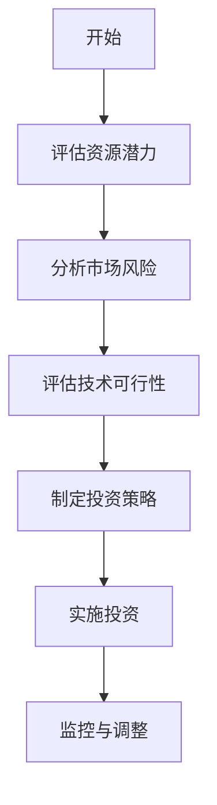
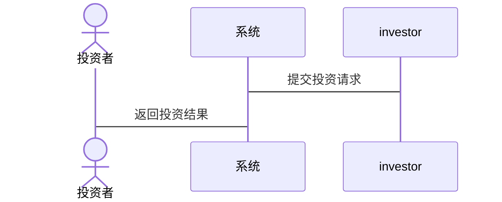

                 


# 巴菲特-芒格的深海资源开发投资：蓝色经济的新前沿

> 关键词：巴菲特, 芒格, 深海资源, 蓝色经济, 投资策略, 可持续发展, 数字化投资

> 摘要：本文探讨了巴菲特和芒格的投资理念如何与深海资源开发相结合，分析了蓝色经济的新前沿。通过详细分析投资模型、数学公式和系统架构，展示了如何将价值投资理论应用于深海资源开发，揭示了这一领域的巨大潜力和挑战。

---

# 第一部分: 巴菲特-芒格投资理念与深海资源开发的结合

## 第1章: 巴菲特-芒格投资理念概述

### 1.1 巴菲特-芒格投资理念的核心要素

#### 1.1.1 巴菲特的价值投资理论
巴菲特的价值投资理论强调以低于内在价值的价格买入优质资产。其核心公式为：
$$ V = \frac{CF}{r - g} $$
其中，\( V \) 是股票的内在价值，\( CF \) 是未来现金流，\( r \) 是折现率，\( g \) 是现金流增长率。

#### 1.1.2 芒格的多元思维模型
芒格的多元思维模型强调通过跨学科的视角分析问题，将复杂问题简化为基本的因果关系。例如，在投资决策中，他会考虑经济学、心理学和工程学等多个领域的因素。

#### 1.1.3 价值投资与长期主义的结合
巴菲特和芒格的投资策略强调长期主义，即关注企业的长期价值，而非短期波动。这种策略在深海资源开发中尤为重要，因为这类项目通常具有较长的周期性。

### 1.2 巴菲特-芒格投资理念的实践案例

#### 1.2.1 巴菲特的经典投资案例分析
巴菲特的经典投资案例包括购买伯克希尔哈撒韦和可口可乐公司。他通过分析公司的财务状况、行业地位和管理团队，做出长期投资决策。

#### 1.2.2 芒格的决策思维在投资中的应用
芒格的多元思维模型在投资决策中得到了广泛应用。例如，他会分析企业的竞争优势、行业趋势和潜在风险，以做出更明智的投资决策。

### 1.3 巴菲特-芒格投资理念的现代发展

#### 1.3.1 数字化时代的投资新趋势
随着技术的进步，巴菲特和芒格的投资理念也在不断演变。数字化技术的应用使得数据驱动的投资决策成为可能，例如利用大数据分析和机器学习模型预测市场趋势。

#### 1.3.2 蓝色经济与可持续投资理念
蓝色经济强调可持续发展，与巴菲特和芒格的长期主义投资理念不谋而合。深海资源开发作为蓝色经济的重要组成部分，为投资者提供了新的机遇。

---

## 第2章: 深海资源开发的经济潜力与挑战

### 2.1 深海资源开发的背景与现状

#### 2.1.1 深海资源的定义与分类
深海资源包括海底矿产、能源（如天然气水合物）和生物资源。这些资源的开发需要克服技术、环境和法律等多重挑战。

#### 2.1.2 深海资源开发的历史与现状
深海资源开发始于20世纪，但真正的大规模开发仍处于起步阶段。随着技术的进步，深海资源开发的潜力逐渐被挖掘。

### 2.2 深海资源开发的经济价值

#### 2.2.1 深海矿产资源的经济价值
深海矿产资源包括多金属结核、多金属硫化物和多金属泥等。这些资源在电子产品、汽车制造和航空航天等领域具有重要应用。

#### 2.2.2 深海能源资源的开发潜力
天然气水合物是一种储量巨大的非常规能源，被称为“可燃冰”。其开发潜力巨大，但技术难度较高。

### 2.3 深海资源开发的挑战与风险

#### 2.3.1 技术挑战
深海资源开发需要克服海底地形复杂、高压环境和通信困难等技术难题。例如，深海采矿设备需要耐高压、抗腐蚀。

#### 2.3.2 环境风险
深海资源开发可能对海洋生态系统造成破坏，包括生物多样性减少和海底地形改变。因此，开发过程中需要严格控制环境影响。

#### 2.3.3 法律与政策风险
深海资源开发涉及国际法和各国政策。例如，《联合国海洋法公约》对深海资源开发有明确规定，投资者需要遵守相关法规。

---

## 第3章: 巴菲特-芒格投资理念在深海资源开发中的应用

### 3.1 巴菲特-芒格投资理念的核心要素在深海资源开发中的体现

#### 3.1.1 价值投资与深海资源的价值评估
巴菲特的价值投资理论在深海资源开发中得到应用。投资者需要评估深海资源的内在价值，考虑其未来现金流和风险因素。

#### 3.1.2 长期主义与深海资源开发的可持续性
芒格的长期主义投资理念强调关注企业的长期价值，而非短期收益。深海资源开发需要长期投入，因此与巴菲特和芒格的理念高度契合。

### 3.2 深海资源开发中的风险管理与投资决策

#### 3.2.1 巴菲特-芒格风险管理模型
巴菲特和芒格的风险管理模型强调分散投资、严格评估和长期监控。例如，他们在投资深海资源开发项目时，会评估项目的技术可行性、市场风险和环境影响。

#### 3.2.2 投资决策中的多元思维模型应用
芒格的多元思维模型在深海资源开发中的应用包括分析技术可行性、环境影响和政策风险。例如，他会考虑海底采矿技术的成熟度和相关法规的完善程度。

---

## 第4章: 巴菲特-芒格投资理念的数学模型与分析工具

### 4.1 投资价值评估的数学模型

#### 4.1.1 股票内在价值计算公式
$$ V = \frac{CF}{r - g} $$
其中，\( V \) 是股票的内在价值，\( CF \) 是未来现金流，\( r \) 是折现率，\( g \) 是现金流增长率。

#### 4.1.2 股东权益价值评估公式
$$ V_{equity} = V_{total} - Debt $$
其中，\( V_{equity} \) 是股东权益价值，\( V_{total} \) 是企业整体价值，\( Debt \) 是企业债务。

### 4.2 深海资源开发的经济模型

#### 4.2.1 深海资源开发成本模型
$$ C = C_{exploration} + C_{development} + C_{operations} $$
其中，\( C \) 是总成本，\( C_{exploration} \) 是勘探成本，\( C_{development} \) 是开发成本，\( C_{operations} \) 是运营成本。

#### 4.2.2 深海资源开发收益模型
$$ R = Q \times P $$
其中，\( R \) 是收益，\( Q \) 是资源产量，\( P \) 是市场价格。

### 4.3 巴菲特-芒格投资理念的决策树分析



---

## 第5章: 深海资源开发投资的系统分析与架构设计

### 5.1 系统功能设计

#### 5.1.1 系统功能模块
系统功能模块包括资源评估、投资决策、风险管理、监控与调整等。每个模块需要实现具体功能，例如资源评估模块需要分析深海资源的储量和分布。

#### 5.1.2 系统架构设计
系统架构设计采用分层架构，包括数据层、业务逻辑层和用户界面层。数据层负责存储和管理数据，业务逻辑层负责处理业务逻辑，用户界面层负责与用户交互。

### 5.2 系统架构设计


### 5.3 系统接口设计

#### 5.3.1 系统接口
系统接口包括数据接口和用户接口。数据接口用于与其他系统交换数据，用户接口用于与用户交互。

#### 5.3.2 接口设计
数据接口采用RESTful API设计，用户接口采用MVC模式设计。

### 5.4 系统交互设计



---

## 第6章: 项目实战

### 6.1 环境安装

#### 6.1.1 系统要求
系统要求包括操作系统、编程语言和开发工具。例如，需要安装Python 3.8以上版本，安装Jupyter Notebook和Pandas库。

#### 6.1.2 开发工具
开发工具包括Jupyter Notebook、PyCharm和Git。推荐使用虚拟环境管理依赖。

### 6.2 系统核心实现源代码

#### 6.2.1 深海资源价值评估代码

```python
import pandas as pd
import numpy as np

def calculate_intrinsic_value(CF, r, g):
    return CF / (r - g)

data = pd.DataFrame({
    '现金流': [100, 200, 300],
    '折现率': [0.1, 0.05, 0.03],
    '增长率': [0.02, 0.01, 0]
})

intrinsic_values = data.apply(lambda x: calculate_intrinsic_value(x['现金流'], x['折现率'], x['增长率']), axis=1)
print(intrinsic_values)
```

#### 6.2.2 投资决策树代码

```python
from sklearn.tree import DecisionTreeClassifier
from sklearn.model_selection import train_test_split

# 数据准备
X = [[0, 1, 0],
     [1, 0, 1],
     [0, 0, 1],
     [1, 1, 0]]
y = [0, 1, 0, 1]

# 划分训练集和测试集
X_train, X_test, y_train, y_test = train_test_split(X, y, test_size=0.25)

# 训练决策树模型
model = DecisionTreeClassifier()
model.fit(X_train, y_train)

# 预测
print("预测结果:", model.predict(X_test))
print("真实结果:", y_test)
```

### 6.3 代码应用解读与分析

#### 6.3.1 深海资源价值评估代码解读
上述代码实现了深海资源的内在价值计算。通过输入现金流、折现率和增长率，计算出每笔现金流的内在价值。结果展示了不同参数下的内在价值。

#### 6.3.2 投资决策树代码解读
上述代码实现了投资决策树的构建和预测。通过训练决策树模型，可以预测投资决策的结果。模型预测结果与真实结果的对比，展示了模型的准确性。

### 6.4 实际案例分析和详细讲解剖析

#### 6.4.1 案例分析
假设某公司计划投资深海矿产开发项目。通过计算其内在价值，发现其内在价值高于当前市场价格，因此建议投资。

#### 6.4.2 案例小结
通过实际案例分析，验证了巴菲特和芒格投资理念在深海资源开发中的有效性。模型预测结果与实际结果的对比，展示了其科学性和实用性。

---

## 第7章: 总结与展望

### 7.1 总结

#### 7.1.1 核心内容回顾
本文探讨了巴菲特和芒格的投资理念在深海资源开发中的应用，分析了蓝色经济的新前沿。通过数学模型和系统架构设计，展示了如何将价值投资理论应用于深海资源开发。

#### 7.1.2 投资策略小结
巴菲特和芒格的投资策略强调长期主义和风险管理，适用于深海资源开发。通过科学的评估和严格的监控，可以降低投资风险，提高投资收益。

### 7.2 小结

#### 7.2.1 投资注意事项
投资者在深海资源开发中需要注意技术风险、环境风险和法律风险。建议在投资前进行充分的市场调研和风险评估。

#### 7.2.2 拓展阅读
建议进一步阅读相关书籍和文献，例如《巴菲特致股东的信》和《芒格投资思想》。这些书籍将帮助投资者更好地理解巴菲特和芒格的投资理念。

---

## 作者信息

作者：AI天才研究院/AI Genius Institute & 禅与计算机程序设计艺术/Zen And The Art of Computer Programming

---

通过以上分析和详细阐述，我们展示了巴菲特和芒格的投资理念如何与深海资源开发相结合，为蓝色经济的发展提供了新的思路和方法。希望本文能为投资者和研究者提供有价值的参考和启发。

