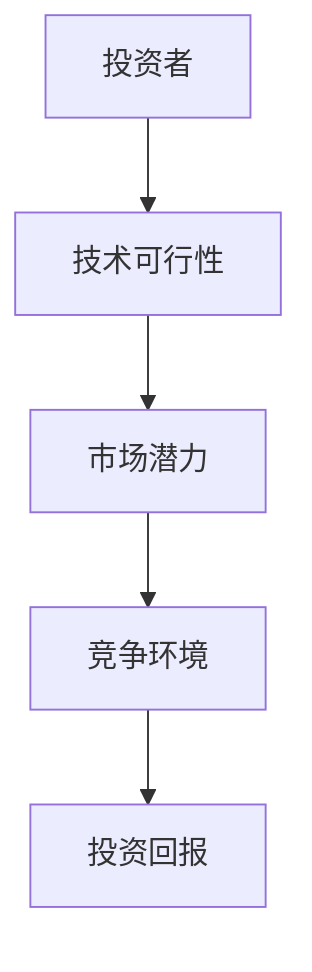
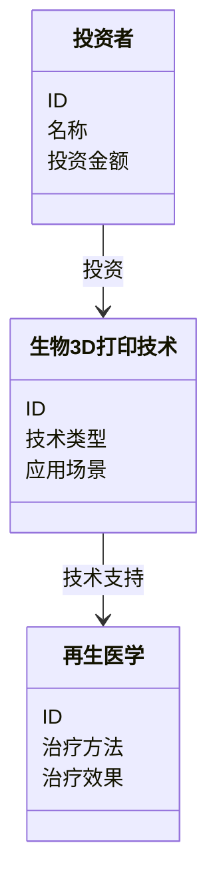
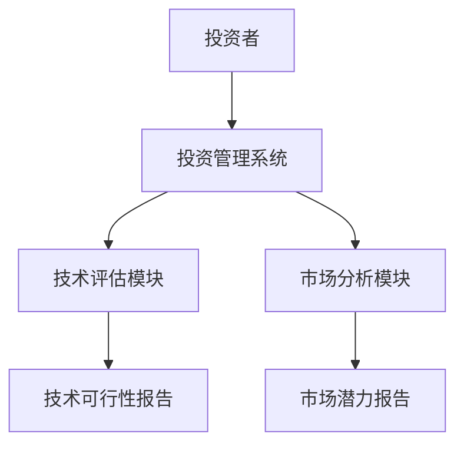

                 


# 巴菲特-芒格的生物3D打印器官投资：再生医学的新高度

---

## 关键词：
- 巴菲特
- 芒格
- 生物3D打印
- 器官再生
- 投资策略
- 再生医学

---

## 摘要：
本文探讨了巴菲特和芒格在生物3D打印器官投资领域的策略与影响，分析了再生医学的发展前景以及生物3D打印技术的核心原理。通过结合投资哲学与技术创新，文章详细阐述了这一领域的投资机会、技术挑战和未来发展方向。

---

# 第一部分：背景介绍

## 第1章：生物3D打印技术概述

### 1.1 生物3D打印的定义与原理
生物3D打印是一种利用生物材料和3D打印技术制造生物结构的方法。通过逐层沉积生物材料（如细胞、胶原蛋白或生物聚合物），构建具有复杂结构的组织或器官。

#### 核心概念与联系
生物3D打印与再生医学的结合，使其在器官修复和再生领域具有巨大潜力。以下是相关概念的对比表格和ER图：

**对比表格：**

| 概念         | 生物3D打印         | 再生医学       |
|--------------|--------------------|----------------|
| 定义         | 利用3D技术制造生物结构 | 利用生物技术修复或再生组织器官 |
| 核心技术     | 3D打印技术         | 细胞培养、组织工程 |
| 应用领域     | 器官修复、药物筛选 | 器官再生、疾病治疗 |

**ER图：**

```mermaid
erd
    entity 投资者 {
        key: ID
        name: 名称
        investment: 投资金额
    }
    entity 生物3D打印技术 {
        key: ID
        technology: 技术类型
        application: 应用场景
    }
    entity 再生医学 {
        key: ID
        treatment: 治疗方法
        outcome: 治疗效果
    }
    relation 投资者 --> 生物3D打印技术: 投资
    relation 生物3D打印技术 --> 再生医学: 技术支持
```

### 1.2 再生医学的定义与应用
再生医学通过修复或替换受损组织和器官，恢复其功能。生物3D打印技术为其提供了新的工具，能够制造复杂的组织结构。

### 1.3 生物3D打印与再生医学的结合
生物3D打印技术能够制造出具有生物活性的组织和器官，为再生医学提供了创新的解决方案。例如，打印出的人工肝脏可以在实验室中用于药物测试，或直接用于患者的器官移植。

---

## 第2章：巴菲特与芒格的投资哲学

### 2.1 巴菲特的价值投资理论
巴菲特强调长期投资和价值发现，注重企业的基本面分析。他认为，投资的核心在于找到具有持续竞争优势的企业。

#### 投资策略与生物3D打印
生物3D打印技术具有较高的市场潜力，但同时也面临技术瓶颈和市场竞争。巴菲特的投资哲学可以帮助投资者识别具有长期增长潜力的企业。

### 2.2 芒格的多元思维模型
芒格倡导通过跨学科思维来解决问题，强调对企业内外部因素的全面分析。这种思维方式非常适合评估生物3D打印技术的投资价值。

### 2.3 巴菲特与芒格的结合
两人的投资哲学互补，巴菲特注重企业价值，芒格注重多元分析，这种结合使得他们在生物技术领域的投资更加稳健和高效。

---

## 第3章：生物3D打印器官的投资分析

### 3.1 投资分析的基本框架
投资分析需要从技术、市场、竞争等多个维度进行综合评估。以下是分析框架：



### 3.2 市场分析
当前，全球生物3D打印市场增长迅速，预计到2030年市场规模将超过100亿美元。主要驱动因素包括人口老龄化、医疗需求增加以及技术进步。

### 3.3 风险分析
生物3D打印技术面临技术风险、市场风险和政策风险。投资者需要通过多元化策略来分散风险。

### 3.4 投资回报预测
基于当前市场数据和技术发展趋势，生物3D打印技术的投资回报具有较大的潜力。以下是预测模型：

```latex
$$ ROI = \frac{收益 - 成本}{成本} \times 100\% $$
```

---

## 第4章：系统架构设计

### 4.1 问题场景介绍
生物3D打印技术的投资需要一个高效的决策系统，包括数据收集、分析和预测功能。

### 4.2 功能设计
以下是系统功能的领域模型：



### 4.3 系统架构
以下是系统的架构设计：



### 4.4 接口设计
系统接口设计如下：

```mermaid
sequenceDiagram
    投资者 ->> 系统: 提交投资申请
    系统 ->>抽屉： 技术评估模块
    技术评估模块 ->>抽屉： 返回评估报告
    投资者 ->> 系统: 获取评估结果
    系统 ->抽屉： 返回结果
```

---

## 第5章：项目实战

### 5.1 环境安装
需要安装以下工具：
- Python 3.x
- Mermaid CLI
- LaTeX编辑器

### 5.2 核心实现
以下是投资分析工具的核心代码：

```python
def calculate_return(investment, return_rate):
    return investment * (1 + return_rate)

investment = 1000000  # 投资金额（美元）
return_rate = 0.3      # 年回报率
return_ = calculate_return(investment, return_rate)
print(f"投资回报为：${return_}")
```

### 5.3 实际案例分析
以糖尿病患者的胰岛素治疗为例，生物3D打印技术可以制造出胰岛细胞，从而实现精准治疗。

---

## 第6章：未来展望与建议

### 6.1 未来展望
随着技术进步和政策支持，生物3D打印技术将在再生医学领域发挥更大作用。

### 6.2 投资建议
投资者应关注具有创新技术的企业，并注重风险控制。

### 6.3 注意事项
生物3D打印技术仍处于发展阶段，投资者需谨慎评估。

---

## 作者：AI天才研究院 & 禅与计算机程序设计艺术

---

**小结**：通过分析巴菲特和芒格的投资哲学，以及生物3D打印技术的核心原理，本文揭示了再生医学领域的新投资机会。希望本文能为投资者和技术创新者提供有价值的参考。

