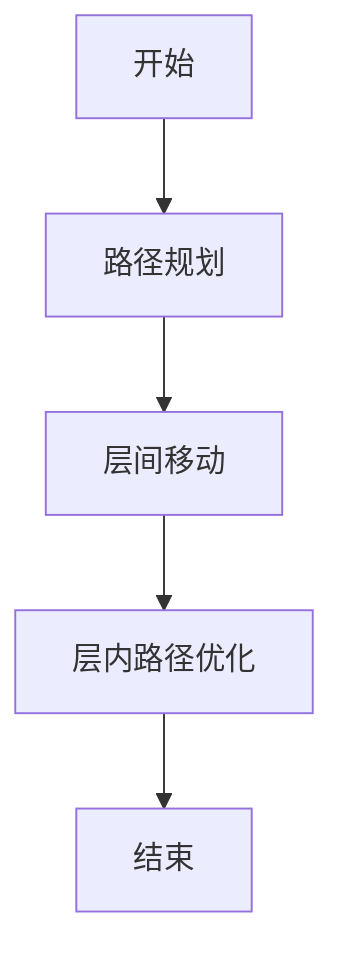
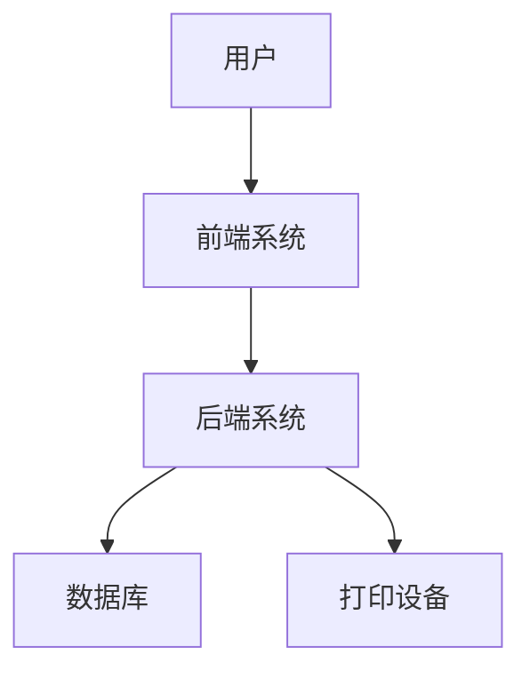

                 


# 巴菲特-芒格的生物3D打印投资：医疗和制造业的革新

**关键词**：巴菲特, 芒格, 生物3D打印, 医疗, 制造业, 投资策略

**摘要**：  
本文探讨了巴菲特和芒格的投资理念与生物3D打印技术的结合，分析了该技术在医疗和制造业中的应用潜力及其对行业格局的深远影响。通过详细的技术解析、投资分析和案例研究，本文揭示了生物3D打印的投资价值及其未来发展趋势。

---

# 第一部分：生物3D打印的背景与概述

## 第1章：生物3D打印的起源与发展

### 1.1 生物3D打印的定义与核心概念

生物3D打印是一种利用生物材料（如细胞、蛋白质、多糖等）通过3D打印技术制造出具有生物功能的结构的技术。其核心在于将生物材料逐层构建，形成复杂的三维结构，模拟天然生物组织的特性。

#### 1.1.1 生物3D打印的核心要素
- **生物材料**：包括细胞、胶原蛋白、多聚物等，用于构建组织或器官。
- **打印技术**：如FDM（熔融沉积建模）、SLA（光固化）等，用于将生物材料精确堆叠。
- **生物相容性**：打印材料需与人体组织相容，避免免疫排斥反应。

#### 1.1.2 生物3D打印与传统制造的对比

| **对比维度** | **传统制造** | **生物3D打印** |
|---------------|--------------|-----------------|
| 制造精度      | 较低         | 极高             |
| 成本          | 较高         | 可控             |
| 可定制化      | 有限         | 极高             |
| 应用领域      | 大规模生产   | 小批量、定制化   |

### 1.2 生物3D打印的现状与应用

#### 1.2.1 医疗领域的应用

- **人工器官**：如人工心脏瓣膜、肝脏模型等。
- **个性化医疗**：根据患者需求定制医疗设备或植入物。
- **药物研发**：通过打印微型组织模型用于药物测试。

#### 1.2.2 制造业中的应用

- **高端制造**：如航空航天中的复杂零件。
- **小批量生产**：适合定制化产品的需求。
- **快速原型设计**：缩短产品开发周期。

---

# 第二部分：生物3D打印的核心技术与投资机会

## 第2章：生物3D打印的技术原理与实现

### 2.1 生物3D打印的算法原理

#### 2.1.1 生物3D打印的数学模型

生物3D打印的数学模型主要基于分层制造（Layer Manufacturing）原理，通过将三维结构分解为二维层，逐层构建。其数学模型可以表示为：

$$ z = f(x, y) $$

其中，$z$ 表示高度，$f(x, y)$ 是构建的三维结构在 $(x, y)$ 处的高度函数。

#### 2.1.2 打印路径规划

路径规划是生物3D打印的关键步骤，通常采用以下算法：



### 2.2 投资机会分析

#### 2.2.1 医疗领域的投资机会

- **人工器官**：随着技术成熟，人工器官的商业化将带来巨大投资机会。
- **个性化医疗**：定制化医疗设备的需求将推动市场增长。

#### 2.2.2 制造业中的投资机会

- **高端制造**：复杂零件的打印需求将推动行业增长。
- **小批量生产**：满足定制化需求，减少库存压力。

---

# 第三部分：生物3D打印的投资分析与风险评估

## 第3章：生物3D打印的投资分析

### 3.1 投资分析方法

#### 3.1.1 企业基本面分析

- **财务状况**：关注企业的盈利能力、现金流和资产负债表。
- **管理团队**：评估管理团队的技术背景和行业经验。

#### 3.1.2 行业竞争格局

- **市场集中度**：分析行业内的主要竞争对手和市场占有率。
- **技术壁垒**：评估技术专利和技术研发能力。

### 3.2 投资风险评估

#### 3.2.1 技术风险

- **技术不确定性**：生物3D打印技术尚未完全成熟，存在失败风险。
- **研发周期长**：从实验室到商业化需要较长时间。

#### 3.2.2 市场风险

- **市场需求不足**：当前市场对生物3D打印技术的需求可能有限。
- **价格竞争**：技术成熟后可能面临价格战。

---

# 第四部分：生物3D打印的系统架构与实现

## 第4章：生物3D打印的系统设计

### 4.1 系统功能设计

#### 4.1.1 功能模块

| **模块名称** | **功能描述** |
|--------------|--------------|
| 材料供应     | 提供生物材料并确保其质量 |
| 打印设备     | 控制打印过程并确保精度 |
| 软件控制     | 生成打印路径并优化算法 |

#### 4.1.2 实体关系图

```mermaid
erDiagram
    actor 用户 {
        string 用户名
        string 密码
    }
    class 设备 {
        string 设备ID
        string 型号
    }
    class 材料 {
        string 材料ID
        string 类型
    }
    用户 --> 设备 : 操作设备
    设备 --> 材料 : 使用材料
```

### 4.2 系统架构设计

#### 4.2.1 架构图



---

# 第五部分：生物3D打印的项目实战

## 第5章：医疗领域的项目实战

### 5.1 项目背景与需求分析

- **项目背景**：开发一种人工肝脏模型用于药物测试。
- **需求分析**：高精度、低成本、可重复性。

### 5.2 系统实现

#### 5.2.1 环境配置

- **硬件**：高精度3D打印机、计算机。
- **软件**：CAD设计工具、打印控制软件。

#### 5.2.2 核心代码实现

```python
def print_layers(layers):
    for layer in layers:
        move_to_start(layer)
        deposit_material(layer)
```

### 5.3 项目总结与分析

- **成功之处**：实现了高精度人工肝脏模型。
- **存在问题**：打印时间较长，材料成本较高。

---

# 第六部分：最佳实践与未来展望

## 第6章：最佳实践与投资策略

### 6.1 投资策略

- **长期视角**：关注技术的长期发展和行业趋势。
- **分散投资**：避免过度集中在单一领域。

### 6.2 风险管理

- **技术风险**：保持对技术进展的关注，及时调整投资组合。
- **市场风险**：定期评估市场需求和竞争格局。

---

# 第七部分：总结与展望

## 第7章：总结与展望

### 7.1 本文总结

本文分析了生物3D打印技术在医疗和制造业中的应用潜力，探讨了其投资价值和风险。通过详细的技术解析和案例分析，揭示了生物3D打印对行业格局的深远影响。

### 7.2 未来展望

随着技术的不断进步和市场需求的增加，生物3D打印将在医疗和制造领域发挥更大的作用，成为未来投资的重要方向。

---

**作者**：AI天才研究院 & 禅与计算机程序设计艺术

