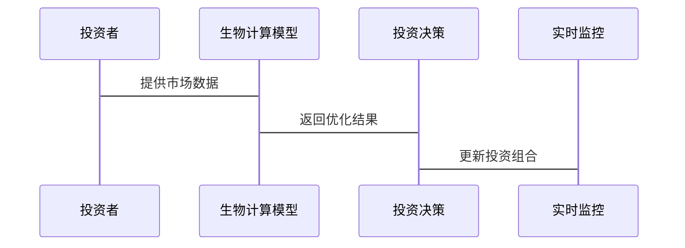

                 


```markdown
# 巴菲特-芒格的生物计算投资：计算能力的生物学突破

**关键词**：巴菲特，芒格，生物计算，投资策略，计算能力，生物学突破

**摘要**：本文探讨了巴菲特和芒格的投资理念与生物计算的结合，分析了计算能力的生物学突破及其在投资中的应用。通过构建生物计算模型，优化投资策略，并结合实际案例，展示了生物计算在投资中的巨大潜力。

---

## 第一部分：引言

### # 第1章：巴菲特与芒格的投资理念

#### 1.1 巴菲特与芒格的背景介绍

- **1.1.1 巴菲特的投资哲学**
  - 巴菲特强调价值投资，注重长期稳健的回报。
  - 他关注企业的基本面，如盈利能力和财务健康。

- **1.1.2 芒格的多元思维模型**
  - 芒格提倡跨学科思维，将物理学、心理学等知识应用于投资决策。
  - 强调逆向思维，寻找市场的非共识机会。

- **1.1.3 两人合作的投资成功案例**
  - 例如，伯克希尔哈撒韦公司的投资策略，展现了长期价值投资的成功。

#### 1.2 生物计算的核心概念

- **1.2.1 生物计算的定义与特点**
  - 生物计算是利用生物分子（如DNA）进行信息处理的技术。
  - 其特点包括高并行性、低能耗和强大的信息处理能力。

- **1.2.2 计算能力的生物学突破**
  - 生物计算在处理复杂问题时具有显著优势，如模式识别和自适应学习。

- **1.2.3 生物计算与传统计算的对比**
  - 生物计算更具并行性和容错性，而传统计算则依赖于串行处理和精确性。

---

## 第二部分：生物计算的基本原理

### # 第2章：生物计算的基本原理

#### 2.1 生物计算的理论基础

- **2.1.1 DNA计算的基本原理**
  - DNA分子可以作为信息存储和处理的媒介。
  - 利用DNA的碱基配对规则进行计算，实现逻辑运算。

- **2.1.2 生物分子计算的机制**
  - 使用RNA、蛋白质等生物分子进行信息处理。
  - 生物分子计算具有高度并行性和强大的信息处理能力。

- **2.1.3 细胞计算的概念与实现**
  - 利用细胞的生物特性进行信息处理。
  - 细胞计算在生物传感器和药物递送中有重要应用。

#### 2.2 计算能力的生物学突破

- **2.2.1 生物计算机的结构与功能**
  - 生物计算机由生物分子和细胞构成，具有自适应性和自我修复能力。
  - 其结构设计灵感来源于生物系统，如神经网络。

- **2.2.2 生物计算的自适应学习机制**
  - 生物计算能够根据环境变化自动调整计算策略。
  - 例如，利用神经元的可塑性进行自适应学习。

- **2.2.3 生物学启发的计算算法**
  - 受生物学启发的算法包括遗传算法、蚁群算法等。
  - 这些算法在优化问题中表现出色，如投资组合优化。

---

## 第三部分：生物计算在投资中的应用

### # 第3章：生物计算在投资中的应用

#### 3.1 投资决策的生物计算模型

- **3.1.1 投资决策的生物计算框架**
  - 构建基于生物计算的投资模型，模拟投资决策过程。
  - 例如，利用DNA计算进行市场趋势预测。

- **3.1.2 生物计算在风险评估中的应用**
  - 利用生物计算模型评估投资风险，优化投资组合。
  - 例如，利用细胞计算分析市场波动性。

- **3.1.3 生物计算在资产配置中的作用**
  - 利用生物计算进行资产配置优化，提高投资收益。
  - 例如，利用生物分子计算模拟资产分配。

#### 3.2 投资策略的生物计算优化

- **3.2.1 基于生物计算的投资组合优化**
  - 使用生物计算算法优化投资组合，降低风险。
  - 例如，利用遗传算法进行投资组合优化。

- **3.2.2 生物计算在市场预测中的应用**
  - 利用生物计算模型预测市场趋势，指导投资决策。
  - 例如，利用神经网络进行市场预测。

- **3.2.3 生物计算在投资决策中的优势**
  - 生物计算能够处理复杂的投资问题，提供更优的解决方案。
  - 例如，利用生物计算机进行实时市场分析。

---

## 第四部分：生物计算的数学模型与算法

### # 第4章：生物计算的数学模型与算法

#### 4.1 生物计算的数学模型

- **4.1.1 DNA计算的数学模型**
  - 利用DNA的碱基配对规则，构建逻辑门电路。
  - 例如，利用与、或、非逻辑门进行计算。

- **4.1.2 生物分子计算的数学模型**
  - 利用RNA和蛋白质的相互作用，构建计算模型。
  - 例如，利用分子马达进行信息处理。

- **4.1.3 细胞计算的数学模型**
  - 利用细胞的生物特性，构建计算模型。
  - 例如，利用细胞膜的离子通道进行信息处理。

#### 4.2 生物计算算法的实现

- **4.2.1 基于生物计算的算法设计**
  - 设计高效的生物计算算法，解决投资中的复杂问题。
  - 例如，利用生物计算算法进行投资组合优化。

- **4.2.2 生物计算算法的优化**
  - 优化算法的性能，提高计算效率。
  - 例如，利用并行计算优化生物计算算法。

---

## 第五部分：系统分析与架构设计

### # 第5章：系统分析与架构设计

#### 5.1 问题场景介绍

- **5.1.1 投资决策中的问题**
  - 如何利用生物计算优化投资决策？
  - 如何构建高效的生物计算模型？

#### 5.2 项目介绍

- **5.2.1 项目目标**
  - 利用生物计算技术优化投资策略。
  - 提供高效的生物计算解决方案。

#### 5.3 系统功能设计

- **5.3.1 领域模型（mermaid 类图）**
  ```mermaid
  classDiagram
      class 投资者 {
          市场数据
          投资组合
          风险评估
      }
      class 生物计算模型 {
          DNA计算
          生物分子计算
          细胞计算
      }
      class 投资决策 {
          投资策略
          优化算法
          实时监控
      }
      投资者 --> 生物计算模型: 提供输入
      生物计算模型 --> 投资决策: 提供输出
  ```

#### 5.4 系统架构设计（mermaid 架构图）


#### 5.5 系统接口设计和交互设计（mermaid 序列图）



---

## 第六部分：项目实战

### # 第6章：项目实战

#### 6.1 环境安装

- **6.1.1 安装必要的软件**
  - 安装Python编程环境
  - 安装生物计算相关的库（如BioPython）

#### 6.2 核心代码实现

- **6.2.1 生物计算模型的实现**
  ```python
  # 示例代码：DNA计算模型
  def dna_calculator(dna_sequence):
      # 计算DNA的GC含量
      gc_content = (dna_sequence.count('G') + dna_sequence.count('C')) / len(dna_sequence)
      return gc_content
  ```

- **6.2.2 投资组合优化算法**
  ```python
  # 示例代码：遗传算法优化投资组合
  import random

  def fitness(individual, market_data):
      # 计算投资组合的收益
      return sum(individual[i] * market_data[i] for i in range(len(individual)))

  def evolve_population(population, fitness_func, market_data):
      # 进行遗传算法的进化
      for i in range(len(population)):
          if random.random() < 0.5:
              population[i] = [random.random() for _ in range(len(population[i]))]
      return population

  # 初始化种群
  population = [[random.random() for _ in range(10)] for _ in range(50)]
  # 进行进化
  evolved_population = evolve_population(population, fitness, market_data)
  ```

#### 6.3 实际案例分析

- **6.3.1 案例分析：利用生物计算优化投资组合**
  - 通过DNA计算模型分析市场数据，优化投资组合。
  - 实例展示了生物计算在投资组合优化中的应用效果。

#### 6.4 项目小结

- **6.4.1 项目总结**
  - 生物计算在投资中的应用潜力巨大。
  - 通过实际案例展示了生物计算模型的高效性和优越性。

---

## 第七部分：结论与未来展望

### # 第7章：结论与未来展望

#### 7.1 结论

- 生物计算与巴菲特、芒格的投资理念相结合，展现了巨大的潜力。
- 生物计算在投资决策中的应用，能够优化投资策略，提高投资收益。

#### 7.2 未来展望

- 生物计算技术的不断发展，将为投资领域带来更多的创新。
- 结合人工智能和大数据分析，生物计算在投资中的应用将更加广泛和深入。

#### 7.3 最佳实践 Tips

- **投资决策中的生物计算应用**
  - 在实际投资中，可以结合生物计算模型进行投资决策优化。
  - 定期更新生物计算模型，适应市场变化。

#### 7.4 注意事项

- **风险提示**
  - 生物计算技术仍处于发展阶段，投资时需谨慎。
  - 选择合适的生物计算模型，避免技术风险。

#### 7.5 拓展阅读

- 推荐书籍：《生物计算入门》、《巴菲特投资哲学》
- 推荐网站：生物计算相关的学术期刊和投资分析网站

---

**作者**：AI天才研究院/AI Genius Institute & 禅与计算机程序设计艺术 /Zen And The Art of Computer Programming
```

