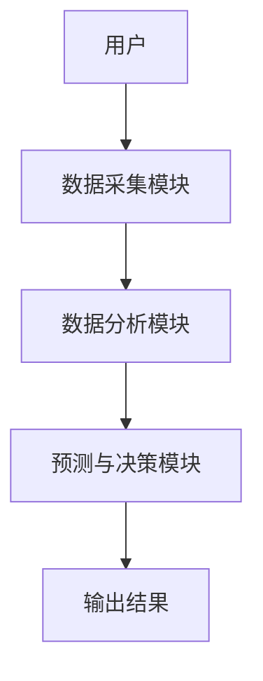

                 


# 巴菲特-芒格的生物计算机投资：下一代超级计算的基础

## 关键词：
巴菲特, 芒格, 生物计算机, 投资策略, 超级计算, 算法原理, 系统架构

## 摘要：
本文探讨了巴菲特和芒格的投资理念与生物计算机技术的结合，分析了生物计算机在投资中的应用，以及如何通过算法和系统架构构建下一代超级计算的基础。文章详细介绍了投资决策算法、数学模型、系统设计和项目实战，为读者提供了深入的技术见解和实践指导。

---

## 第一部分：背景介绍

### 第1章：巴菲特与芒格的投资哲学

#### 1.1 投资的基本原则
- **1.1.1 价值投资的核心理念**
  巴菲特和芒格的价值投资策略强调长期持有优质资产，寻找具有持续竞争优势的企业。这种投资方法注重企业的内在价值，而非市场的短期波动。
- **1.1.2 芒格的多元思维模型**
  芒格提倡通过多个学科的交叉应用来形成决策的框架，强调知识的广泛性和深度。
- **1.1.3 长期投资与复利效应**
  长期投资通过复利效应实现财富的稳步增长，而这种策略需要对市场有深刻的理解和耐心。

#### 1.2 生物计算机的背景与定义
- **1.2.1 生物计算机的定义**
  生物计算机是利用生物分子（如DNA、RNA）进行信息处理的计算机，具有高并行性和低能耗的特点。
- **1.2.2 生物计算机的发展历程**
  从分子计算的概念提出到当前的技术进展，生物计算机在材料科学和计算技术领域的应用逐渐扩大。
- **1.2.3 生物计算机与传统计算机的对比**
  生物计算机在处理复杂问题时具有传统计算机无法比拟的优势，尤其是在并行计算和信息处理效率方面。

---

## 第二部分：生物计算机与投资的结合

### 第2章：生物计算机的核心概念

#### 2.1 生物计算机在投资中的应用
- **2.1.1 生物数据的分析**
  利用生物技术数据（如基因测序数据）进行市场分析，识别潜在的投资机会。
- **2.1.2 生物传感器的应用**
  通过实时监测生物指标（如健康状况）预测市场需求变化，辅助投资决策。
- **2.1.3 生物计算在风险管理中的应用**
  利用生物计算机进行风险评估，提高投资决策的准确性。

#### 2.2 生物技术对投资的影响
- **2.2.1 生物技术在医疗领域的应用**
  创新药物研发周期的缩短和成本的降低，为投资者提供了新的机会。
- **2.2.2 生物技术在农业中的应用**
  高效作物品种的开发推动农业生产力的提升，影响农产品价格和投资策略。
- **2.2.3 生物技术对传统行业的颠覆**
  生物技术在能源、材料科学等领域的应用正在改变传统行业的格局，投资者需要及时捕捉这些变化。

---

## 第三部分：算法原理与数学模型

### 第3章：投资决策的算法原理

#### 3.1 投资决策算法概述
- **3.1.1 机器学习在投资中的应用**
  机器学习算法用于预测股票价格、识别市场趋势，帮助投资者做出更明智的决策。
- **3.1.2 常见的投资算法介绍**
  包括随机森林、支持向量机（SVM）和神经网络等算法在投资中的应用。
- **3.1.3 生物计算机算法的特点**
  生物计算机算法模拟生物过程，具有高容错性和适应性，适合处理复杂的投资问题。

#### 3.2 基于生物数据的投资算法
- **3.2.1 数据采集与处理**
  收集生物数据，如基因表达数据和蛋白质相互作用网络，进行预处理和特征提取。
- **3.2.2 算法流程图（mermaid）**
  ```mermaid
  graph TD
      A[开始] --> B[数据采集]
      B --> C[数据预处理]
      C --> D[特征提取]
      D --> E[模型训练]
      E --> F[预测与评估]
      F --> G[结束]
  ```
- **3.2.3 Python代码实现示例**
  ```python
  import pandas as pd
  from sklearn.ensemble import RandomForestClassifier
  from sklearn.metrics import accuracy_score

  # 数据加载
  data = pd.read_csv('biological_data.csv')
  X = data.drop('target', axis=1)
  y = data['target']

  # 模型训练
  model = RandomForestClassifier()
  model.fit(X, y)

  # 预测与评估
  y_pred = model.predict(X)
  print("准确率:", accuracy_score(y, y_pred))
  ```

#### 3.3 数学模型与公式
- **3.3.1 时间序列分析模型**
  使用ARIMA模型进行股票价格预测：
  $$ ARIMA(p, d, q) $$
  其中，p为自回归阶数，d为差分阶数，q为移动平均阶数。
- **3.3.2 LSTM网络的应用**
  长短期记忆网络用于处理时间序列数据，模型结构如下：
  ```mermaid
  graph TD
      Input --> LSTM_layer
      LSTM_layer --> Output
  ```

---

## 第四部分：系统分析与架构设计

### 第4章：系统架构设计

#### 4.1 问题场景介绍
- 投资者需要一个高效的投资决策支持系统，能够处理大量生物数据，提供实时市场分析和预测。

#### 4.2 系统功能设计
- **4.2.1 数据采集模块**
  从多个数据源（如生物数据库、股票市场数据）获取数据。
- **4.2.2 数据分析模块**
  利用机器学习算法对数据进行分析，生成投资建议。
- **4.2.3 预测与决策模块**
  基于分析结果，提供投资决策支持。

#### 4.3 系统架构设计（mermaid图）


---

## 第五部分：项目实战

### 第5章：项目实战

#### 5.1 项目背景
- 开发一个基于生物技术的股票筛选系统，帮助投资者识别具有潜力的企业。

#### 5.2 系统实现
- **5.2.1 环境配置**
  ```bash
  pip install numpy pandas scikit-learn
  ```
- **5.2.2 核心代码实现**
  ```python
  from sklearn.model_selection import train_test_split
  from sklearn.metrics import classification_report

  # 数据分割
  X_train, X_test, y_train, y_test = train_test_split(X, y, test_size=0.2)

  # 模型训练
  model.fit(X_train, y_train)

  # 模型评估
  print(classification_report(y_test, model.predict(X_test)))
  ```

#### 5.3 实际案例分析
- 通过具体案例展示系统如何筛选出具有增长潜力的生物技术公司，分析模型的准确性和实用性。

---

## 第六部分：最佳实践

### 第6章：最佳实践

#### 6.1 投资策略建议
- 结合生物技术和超级计算，投资者可以更精准地识别投资机会，降低风险。

#### 6.2 注意事项
- 数据质量和模型的选择直接影响投资结果，需谨慎处理。
- 定期更新模型和数据，以适应市场变化。

#### 6.3 拓展阅读
- 推荐阅读《巴菲特的雪球：投资的哲学》和《机器学习实战》等书籍，深入了解投资和算法的结合。

---

## 作者：
作者：AI天才研究院 & 禅与计算机程序设计艺术

---

本文通过详细分析巴菲特和芒格的投资理念，结合生物计算机技术，为投资者提供了构建下一代超级计算基础的策略和方法。文章内容涵盖背景介绍、算法原理、系统设计和项目实战，为读者提供了全面的技术指导和实践参考。

