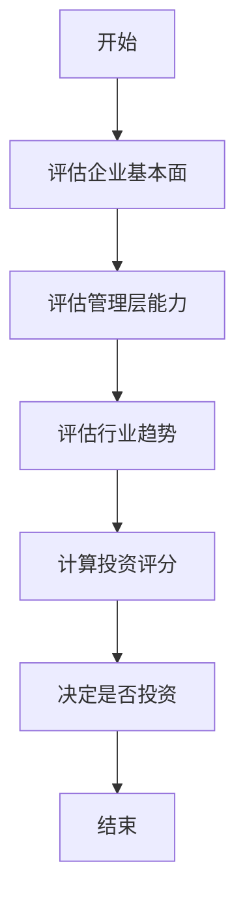
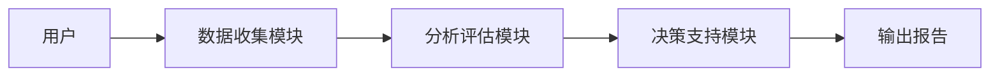

                 


# 巴菲特-芒格的生物降解材料投资：环保与创新的结合

## 关键词：巴菲特，芒格，生物降解材料，投资策略，环保创新

## 摘要：本文深入探讨了巴菲特和芒格的投资理念如何与生物降解材料的环保创新相结合，分析了他们在环保材料投资中的策略、方法和成功案例，揭示了环保投资与创新之间的内在联系。

---

# 第一部分：巴菲特与芒格的投资理念

## 第1章：巴菲特与芒格的投资哲学

### 1.1 巴菲特与芒格的简介

#### 1.1.1 巴菲特的投资理念
沃伦·巴菲特是全球最著名的价值投资者，他的投资理念强调长期价值、安全边际和企业基本面分析。他注重企业的盈利能力、财务状况和管理团队，认为投资的本质是购买企业的一部分。

#### 1.1.2 芒格的多元思维模型
查理·芒格是巴菲特的合作伙伴，他提倡多元思维模型，认为投资者需要跨学科的知识和思维方式来分析问题。芒格强调避免“认知陷阱”，并注重企业的竞争优势和长期前景。

#### 1.1.3 两人合作的投资哲学
巴菲特和芒格的合作基于对企业价值的深刻理解，他们共同强调长期投资、价值发现和风险管理。他们的投资哲学不仅关注财务指标，还关注企业的社会影响和可持续性。

### 1.2 投资与环保的结合

#### 1.2.1 环保投资的重要性
随着全球环境问题的加剧，环保投资成为社会关注的焦点。生物降解材料作为环保创新的重要领域，具有巨大的市场潜力和社会价值。

#### 1.2.2 生物降解材料的市场潜力
生物降解材料能够减少对传统塑料的依赖，降低环境污染，符合全球环保趋势。随着政策支持和技术进步，生物降解材料的市场需求持续增长。

#### 1.2.3 投资环保材料的社会责任
投资环保材料不仅是商业行为，也是履行社会责任的重要方式。巴菲特和芒格的投资哲学与环保理念的结合，体现了他们对可持续发展的重视。

---

## 第2章：生物降解材料的定义与特性

### 2.1 生物降解材料的基本概念

#### 2.1.1 材料科学基础
生物降解材料是指在自然环境中能够被微生物分解为二氧化碳和水的材料。它们通常由可再生资源制成，如淀粉、纤维素和聚乳酸（PLA）等。

#### 2.1.2 生物降解的定义与标准
生物降解是指材料在特定条件下被分解的过程。国际标准如ASTM D6400和EN 13432定义了材料降解的测试方法和评估标准。

#### 2.1.3 生物降解材料的分类
生物降解材料可以分为可堆肥材料、可生物降解材料和完全生物降解材料。每种材料的降解速率和环境影响不同，适用于不同的应用场景。

### 2.2 生物降解材料的核心属性

#### 2.2.1 生物降解材料的降解速率
材料的降解速率受环境条件、微生物种类和材料结构的影响。降解速率的快慢决定了材料的应用场景和生命周期。

#### 2.2.2 材料的力学性能
生物降解材料的强度、韧性和耐用性直接影响其应用效果。例如，聚乳酸材料在包装和纺织领域表现出良好的力学性能。

#### 2.2.3 生物降解材料的环境影响
相比传统塑料，生物降解材料能够减少温室气体排放和能源消耗，降低对环境的污染。然而，材料的生产过程和处理方式也需要考虑环保因素。

---

## 第3章：巴菲特与芒格的生物降解材料投资策略

### 3.1 投资策略的核心要素

#### 3.1.1 企业基本面分析
巴菲特和芒格注重企业的财务状况、盈利能力和发展潜力。他们分析公司的收入、利润、负债和现金流，确保投资的安全性和回报率。

#### 3.1.2 管理层能力评估
优秀的管理层是企业成功的关键。巴菲特和芒格关注管理团队的经验、决策能力和企业文化的建设，认为这些因素直接影响企业的长期发展。

#### 3.1.3 行业发展趋势
生物降解材料行业正处于快速发展阶段，政策支持和市场 demand推动了行业的增长。巴菲特和芒格关注行业的技术进步、市场需求和竞争格局。

### 3.2 投资决策的数学模型

#### 3.2.1 投资评分系统
$$ 投资评分 = 0.4 \times 企业基本面 + 0.3 \times 管理层能力 + 0.3 \times 行业趋势 $$

该模型将企业的基本面、管理层能力和行业趋势作为评估标准，权重分别为40%、30%和30%。通过量化评估，投资者可以更客观地分析投资目标。

#### 3.2.2 投资决策流程图


该流程图展示了巴菲特和芒格的投资决策过程，从企业基本面分析到行业趋势评估，最终得出投资结论。

### 3.3 投资案例分析

#### 3.3.1 案例一：某生物降解材料企业的投资决策
假设某生物降解材料企业具备良好的财务状况和优秀的管理团队，且行业发展趋势向好。根据投资评分模型，计算得出投资评分为85分，高于70分的投资阈值，因此决定投资。

#### 3.3.2 案例二：某传统塑料企业的转型投资
对于一家传统塑料企业，尽管财务状况良好，但管理层对生物降解材料的转型意愿不强，行业趋势也不乐观。投资评分为65分，低于70分，因此决定不投资。

---

## 第4章：生物降解材料的创新与应用

### 4.1 创新驱动的材料研发

#### 4.1.1 创新思路与方法
生物降解材料的研发需要结合材料科学、环境科学和工程学的知识。研究人员通过改性材料结构、优化降解条件和引入新型微生物技术，提高材料的降解效率和性能。

#### 4.1.2 材料性能优化策略
为了满足不同应用场景的需求，研究人员不断优化材料的力学性能、降解速率和成本效益。例如，通过添加纳米材料或改性剂，提高材料的强度和耐久性。

#### 4.1.3 创新案例分析
某科研团队成功研发了一种新型生物降解材料，能够在3个月内完全降解，并且具有良好的可加工性和成本优势。该材料已应用于环保包装和农业覆盖领域，取得了显著的环保效果。

### 4.2 应用领域的扩展

#### 4.2.1 环保包装材料
生物降解包装材料的应用减少了传统塑料包装对环境的污染，符合绿色包装的趋势。例如，可堆肥的生物降解包装袋在食品行业得到了广泛应用。

#### 4.2.2 生物降解塑料替代品
随着全球禁塑令的实施，生物降解塑料替代品的需求激增。企业纷纷推出生物降解吸管、餐具和购物袋，推动了市场的快速发展。

#### 4.2.3 农业与园林应用
生物降解材料在农业和园林领域的应用也非常广泛。例如，生物降解地膜能够有效减少白色污染，提高土壤质量，促进农作物的生长。

---

## 第5章：投资项目的系统分析与架构设计

### 5.1 项目背景与目标

#### 5.1.1 项目需求分析
本项目旨在通过巴菲特和芒格的投资理念，评估和选择具有潜力的生物降解材料企业，推动环保创新和可持续发展。

#### 5.1.2 项目范围界定
项目的范围包括企业基本面分析、管理层能力评估和行业趋势研究，重点关注具有技术创新和市场潜力的企业。

#### 5.1.3 项目目标设定
项目的最终目标是通过科学的投资决策，实现环保与经济的双重效益，推动生物降解材料行业的健康发展。

### 5.2 系统功能设计

#### 5.2.1 数据收集模块
数据收集模块负责收集企业的财务数据、行业信息和市场动态，为后续分析提供基础数据。

#### 5.2.2 分析评估模块
分析评估模块利用投资评分模型，对企业进行综合评估，得出投资结论。

#### 5.2.3 决策支持模块
决策支持模块提供可视化报告和投资建议，帮助投资者做出科学决策。

### 5.3 系统架构设计



该架构图展示了系统的整体流程，从数据收集到分析评估，再到决策支持，最终输出投资报告。

---

## 第6章：项目实战与案例分析

### 6.1 环保材料投资项目的实施

#### 6.1.1 环境安装
为了实施环保材料投资项目，需要安装相应的数据分析工具和投资评估系统。推荐使用Python和相关库（如Pandas和Scikit-learn）进行数据处理和分析。

#### 6.1.2 系统核心实现源代码
以下是投资评分系统的Python实现代码：

```python
import pandas as pd

def calculate_investment_score(fundamental, management, industry):
    return 0.4 * fundamental + 0.3 * management + 0.3 * industry

# 示例数据
fundamental = 80
management = 75
industry = 85

score = calculate_investment_score(fundamental, management, industry)
print(f"投资评分为：{score}")
```

#### 6.1.3 代码应用解读与分析
上述代码通过函数`calculate_investment_score`计算投资评分，权重分别为40%、30%和30%。通过输入企业的基本面、管理层能力和行业趋势数据，输出投资评分，为决策提供依据。

#### 6.1.4 实际案例分析
以某生物降解材料企业为例，假设其基本面评分为80，管理层评分为75，行业趋势评分为85，计算得出投资评分为80.5分。根据评分标准，高于70分的企业值得投资。

---

## 第7章：最佳实践 tips、小结、注意事项、拓展阅读

### 7.1 小结
巴菲特和芒格的投资理念与生物降解材料的环保创新相结合，不仅推动了环保事业的发展，也为投资者带来了可观的回报。通过科学的投资决策和技术创新，环保投资的潜力巨大。

### 7.2 注意事项
投资者在进行生物降解材料投资时，需要注意以下几点：
- 选择具有技术优势和市场潜力的企业。
- 关注政策支持和行业趋势。
- 评估企业的财务状况和管理能力。
- 长期关注投资项目的环境和社会效益。

### 7.3 拓展阅读
- 《巴菲特致股东的信》：了解巴菲特的投资哲学和管理智慧。
- 《穷查理宝典》：学习芒格的多元思维模型和投资理念。
- 《生物降解材料市场分析与展望》：深入了解生物降解材料的市场动态和技术发展。

---

## 作者：AI天才研究院/AI Genius Institute & 禅与计算机程序设计艺术 /Zen And The Art of Computer Programming

