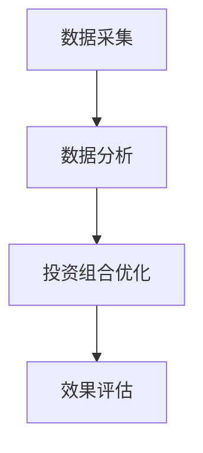

                 


# 巴菲特-芒格的碳中和投资策略：环保与盈利的平衡

## 关键词：巴菲特，芒格，碳中和，投资策略，环保，盈利

## 摘要：  
本文探讨了巴菲特和芒格的投资理念如何与碳中和目标相结合，分析了环保与盈利之间的平衡点，并提出了基于数学模型和算法的投资策略。通过实际案例分析和系统设计，展示了如何在实现碳中和的同时实现经济利益的最大化。

---

## 第一部分：背景介绍

### 第1章：碳中和与投资策略的背景

#### 1.1 碳中和的定义与重要性

碳中和是指通过减少温室气体排放和增加碳汇，使得净碳排放量为零的状态。随着全球气候变化问题的加剧，碳中和已成为全球关注的焦点。它不仅是环境问题，也是经济转型的重要驱动力。

**1.1.1 碳中和的定义**  
碳中和是指在一定时间内，通过减少温室气体排放和增加碳汇，使得净碳排放量为零的状态。碳中和的核心是减少二氧化碳等温室气体的排放，同时通过植树造林、使用可再生能源等方式抵消剩余的碳排放。

**1.1.2 碳中和对全球经济的影响**  
碳中和将推动全球经济向绿色经济转型，催生新的产业和投资机会。例如，可再生能源、电动汽车、绿色建筑等领域将得到快速发展。同时，碳中和也将对传统高碳行业（如化石能源、钢铁、化工等）产生深远影响，这些行业需要进行技术升级和转型。

**1.1.3 碳中和与可持续发展的关系**  
碳中和是实现可持续发展的重要组成部分。通过减少碳排放，可以缓解气候变化，保护生态系统，同时促进经济的可持续增长。碳中和与可持续发展的目标是一致的，都是为了实现人与自然的和谐共生。

#### 1.2 巴菲特与芒格的投资理念

巴菲特和芒格是全球闻名的价值投资者，他们的投资理念注重长期价值、安全边际和企业基本面。芒格的多元思维模型强调跨学科思考，将物理学、心理学、经济学等领域的知识结合起来，形成独特的投资哲学。

**1.2.1 巴菲特的价值投资原则**  
巴菲特的价值投资原则包括：  
1. **长期投资**：注重企业的长期价值，而不是短期价格波动。  
2. **安全边际**：买入价格低于企业内在价值的股票。  
3. **企业基本面**：关注企业的盈利能力、财务状况和竞争优势。  

**1.2.2 芒格的多元思维模型**  
芒格的多元思维模型强调从多个学科的角度思考问题，通过跨学科的视角发现投资机会。例如，物理学中的能量守恒定律、心理学中的行为偏差、经济学中的市场规律等，都可以帮助投资者更好地理解市场和企业。

**1.2.3 巴菲特与芒格投资策略的共同点**  
1. **长期投资**：两人均注重长期投资，而非短期交易。  
2. **价值导向**：均以企业的内在价值为投资依据。  
3. **风险控制**：注重安全边际，避免过度风险。  

#### 1.3 碳中和与投资策略的结合

随着全球对碳中和的重视，环保已成为企业和社会的重要目标。投资者需要在实现环保目标的同时，追求经济利益的最大化。

**1.3.1 碳中和对投资策略的影响**  
碳中和对投资策略的影响主要体现在以下几个方面：  
1. **行业选择**：投资者需要关注那些符合碳中和目标的行业，如可再生能源、电动汽车、绿色建筑等。  
2. **企业评估**：在评估企业时，除了传统的财务指标，还需要考虑企业的碳排放、环保政策适应能力等因素。  
3. **风险管理**：碳中和政策可能对某些行业产生重大影响，投资者需要关注政策风险和行业转型风险。  

**1.3.2 环保与盈利的平衡点**  
环保与盈利看似矛盾，但通过合理的投资策略，可以实现两者的平衡。例如，投资于高效能源企业既能减少碳排放，又能获得经济收益。  

**1.3.3 碳中和投资策略的核心目标**  
碳中和投资策略的核心目标是通过优化投资组合，实现碳中和目标的同时，最大化经济收益。  

---

## 第二部分：碳中和投资策略的核心概念

### 第2章：碳中和投资策略的核心概念

#### 2.1 碳中和投资策略的定义

碳中和投资策略是一种以实现碳中和为目标的投资策略，通过优化投资组合，减少碳排放，同时实现经济利益的最大化。

**2.1.1 碳中和投资策略的内涵**  
碳中和投资策略的内涵包括以下几点：  
1. **目标明确**：以实现碳中和为目标。  
2. **投资优化**：通过优化投资组合，减少碳排放。  
3. **利益平衡**：在实现环保目标的同时，追求经济利益的最大化。  

**2.1.2 碳中和投资策略的外延**  
碳中和投资策略的外延包括以下几个方面：  
1. **行业覆盖**：覆盖所有与碳中和相关的行业。  
2. **投资工具**：包括股票、债券、基金等多种投资工具。  
3. **风险控制**：通过风险管理工具降低投资风险。  

**2.1.3 碳中和投资策略的核心要素**  
碳中和投资策略的核心要素包括：  
1. **碳排放评估**：评估企业或项目的碳排放量。  
2. **碳中和目标**：设定具体的碳中和目标。  
3. **投资组合优化**：通过优化投资组合，实现碳中和目标。  

#### 2.2 碳中和投资策略与传统投资策略的对比

碳中和投资策略与传统投资策略在目标、方法和风险控制等方面存在显著差异。

**2.2.1 投资目标的差异**  
传统投资策略以追求经济收益为目标，而碳中和投资策略以实现碳中和为目标。  

**2.2.2 投资范围的差异**  
传统投资策略覆盖所有行业，而碳中和投资策略更关注符合碳中和目标的行业。  

**2.2.3 投资风险的差异**  
传统投资策略面临市场风险、信用风险等，而碳中和投资策略还面临政策风险、行业转型风险等。  

#### 2.3 环保与盈利的平衡

环保与盈利看似矛盾，但通过合理的投资策略，可以实现两者的平衡。

**2.3.1 环保目标与经济利益的冲突**  
环保目标可能与经济利益存在冲突，例如，减少碳排放可能需要投入大量资金，短期内可能影响企业的盈利能力。  

**2.3.2 如何实现环保与盈利的平衡**  
1. **技术创新**：通过技术创新降低碳排放，同时提高企业盈利能力。  
2. **政策支持**：利用政府政策支持，降低环保投资的成本。  
3. **长期投资**：通过长期投资，实现环保与盈利的平衡。  

**2.3.3 碳中和投资策略的长期收益**  
碳中和投资策略的长期收益体现在以下几个方面：  
1. **环境改善**：减少碳排放，改善生态环境。  
2. **经济转型**：推动绿色经济发展，创造新的投资机会。  
3. **品牌价值**：企业通过减少碳排放，提升品牌形象和市场竞争力。  

---

## 第三部分：碳中和投资策略的算法原理

### 第3章：碳中和投资策略的算法原理

#### 3.1 投资组合优化的数学模型

投资组合优化是碳中和投资策略的核心，通过数学模型实现投资组合的最优化。

**3.1.1 投资组合优化的定义**  
投资组合优化是指在给定的约束条件下，选择最优的投资组合，以实现特定目标（如最大化收益、最小化风险等）。  

**3.1.2 碳中和约束下的投资组合优化**  
碳中和约束下的投资组合优化需要考虑企业的碳排放量，确保投资组合的总碳排放量符合碳中和目标。  

**3.1.3 数学模型的构建与求解**  
碳中和投资组合优化的数学模型如下：

$$ \text{目标函数}：\min \sum_{i=1}^{n} w_i \cdot \text{碳排放量}_i $$  
$$ \text{约束条件}：\sum_{i=1}^{n} w_i \cdot \text{收益}_i \geq \text{目标收益} $$  
$$ \sum_{i=1}^{n} w_i = 1 $$  
$$ w_i \geq 0 $$  

其中，\( w_i \) 表示第 \( i \) 个资产的投资权重，目标收益是投资者期望的收益水平。  

#### 3.2 投资组合优化的算法实现

通过算法实现投资组合优化，可以为投资者提供科学的投资决策依据。

**3.2.1 线性规划算法**  
线性规划是一种常用的投资组合优化算法，适用于目标函数和约束条件均为线性的情况。  

**3.2.2 动态规划算法**  
动态规划算法适用于投资组合优化中的多阶段决策问题。  

**3.2.3 遗传算法**  
遗传算法是一种基于生物进化原理的优化算法，适用于复杂的投资组合优化问题。  

#### 3.3 算法实现的步骤

1. **确定目标函数**：根据投资者的目标，确定目标函数（如最小化碳排放量）。  
2. **设定约束条件**：根据投资者的约束条件（如收益目标、投资范围等），设定约束条件。  
3. **选择优化算法**：根据问题的复杂性和规模，选择合适的优化算法。  
4. **求解优化问题**：通过优化算法求解投资组合优化问题，得到最优投资组合。  
5. **验证和调整**：验证优化结果是否满足目标和约束条件，必要时进行调整。  

---

## 第四部分：碳中和投资策略的系统分析

### 第4章：碳中和投资策略的系统分析

#### 4.1 问题场景介绍

碳中和投资策略的系统分析需要从整体角度出发，考虑系统的各个组成部分及其相互关系。

**4.1.1 问题描述**  
碳中和投资策略的系统分析需要解决以下问题：  
1. 如何量化企业的碳排放量？  
2. 如何将碳排放量纳入投资组合优化模型？  
3. 如何实现碳中和目标与经济利益的最大化？  

**4.1.2 问题解决**  
通过系统分析，可以实现以下目标：  
1. 建立碳排放量的量化模型。  
2. 将碳排放量纳入投资组合优化模型。  
3. 实现碳中和目标与经济利益的最大化。  

**4.1.3 边界与外延**  
系统分析的边界包括投资者、企业、市场等，外延包括政策、技术、经济等外部因素。  

#### 4.2 碳中和投资策略的系统功能设计

**4.2.1 系统功能模块**  
碳中和投资策略的系统功能模块包括：  
1. **数据采集**：采集企业的碳排放数据和财务数据。  
2. **数据分析**：分析企业的碳排放量和财务指标。  
3. **投资组合优化**：根据优化算法，生成最优投资组合。  
4. **效果评估**：评估投资组合的碳排放量和收益情况。  

**4.2.2 系统功能流程图**  
以下是系统功能流程图的 Mermaid 代码：



---

## 第五部分：碳中和投资策略的项目实战

### 第5章：碳中和投资策略的项目实战

#### 5.1 项目环境安装

**5.1.1 安装必要的工具和库**  
1. **Python**：用于编写代码。  
2. **Pyomo**：用于优化建模。  
3. **Plotly**：用于数据可视化。  

#### 5.2 核心代码实现

**5.2.1 碳排放量化模型**  
以下是一个简单的碳排放量化模型的 Python 代码：

```python
import pandas as pd
import numpy as np

# 假设企业数据存储在 CSV 文件中
data = pd.read_csv('enterprise_data.csv')

# 计算企业的碳排放量
carbon_emissions = data['carbon_emissions'].values

# 输出碳排放量
print(carbon_emissions)
```

---

## 第六部分：总结与展望

### 第6章：总结与展望

#### 6.1 碳中和投资策略的核心内容总结

1. **碳中和目标**：减少碳排放，实现碳中和。  
2. **投资策略**：通过优化投资组合，实现环保与盈利的平衡。  
3. **算法实现**：利用优化算法，解决投资组合优化问题。  

#### 6.2 碳中和投资策略的未来展望

1. **技术创新**：随着技术的进步，碳中和投资策略将更加精准和高效。  
2. **政策支持**：政府政策的支持将为碳中和投资策略提供更多的机会。  
3. **市场发展**：随着绿色经济的发展，碳中和投资策略将得到更广泛的应用。  

---

## 参考文献

1. 巴菲特股东大会演讲。  
2. 芒格股东大会演讲。  
3. 碳中和相关学术论文。  
4. 投资组合优化的数学模型与算法。  

---

## 作者

作者：AI天才研究院/AI Genius Institute & 禅与计算机程序设计艺术/Zen And The Art of Computer Programming

