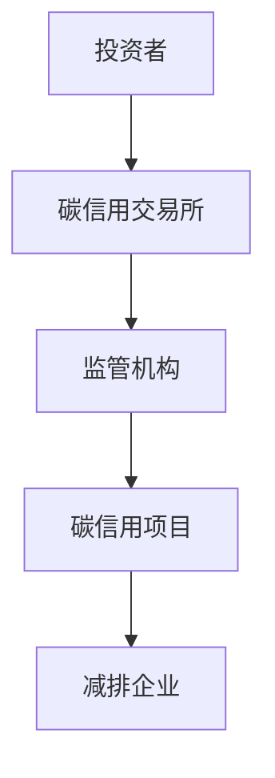
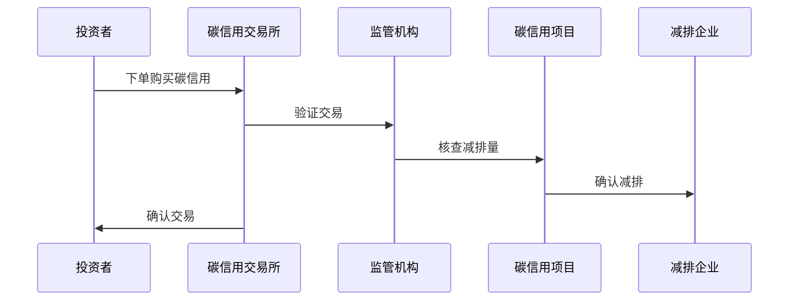

                 


# 巴菲特-芒格的碳信用投资：环保与经济效益的结合

> 关键词：巴菲特、芒格、碳信用、环保投资、经济效益

> 摘要：本文深入探讨了巴菲特和芒格在碳信用投资领域的策略与实践，分析了碳信用投资的背景、核心理论、系统架构及实际案例，结合他们的投资理念，展示了如何将环保与经济效益相结合。

---

# 第一部分: 碳信用投资的背景与概念

## 第1章: 碳信用投资的背景与概念

### 1.1 碳信用的基本概念

#### 1.1.1 碳信用的定义
碳信用是一种用于量化企业或个人减少温室气体排放的工具，通常以吨二氧化碳当量为单位。每减少一吨二氧化碳排放，即可产生一个碳信用。碳信用可以通过交易市场进行买卖，最终用于抵消高排放企业的碳排放。

#### 1.1.2 碳信用的分类与特点
碳信用主要分为两种类型：
1. **自愿碳信用**：由企业或个人自愿购买，用于抵消自身排放。
2. **合规碳信用**：由政府监管机构强制要求企业购买，以满足减排目标。

碳信用的特点包括：
- 可量化：每单位碳信用都有明确的减排量。
- 可交易：碳信用可以在市场上买卖。
- 可追踪：通过区块链等技术实现碳信用的透明追踪。

#### 1.1.3 碳信用的产生背景与意义
碳信用的产生源于全球应对气候变化的努力。通过碳信用交易，企业可以灵活地实现减排目标，同时推动环保技术的发展。

### 1.2 巴菲特与芒格的投资理念

#### 1.2.1 巴菲特的价值投资原则
巴菲特的价值投资原则强调长期持有优质资产，注重企业的基本面和内在价值。

#### 1.2.2 芒格的多元思维模型
芒格的多元思维模型强调跨学科思考，将不同领域的知识结合起来，以做出更明智的投资决策。

#### 1.2.3 巴菲特与芒格的环保理念
巴菲特和芒格都关注环保问题，认为环保不仅是社会责任，也是长期投资的重要因素。

### 1.3 碳信用投资的兴起与现状

#### 1.3.1 碳信用市场的起源与发展
碳信用市场起源于《京都议定书》的签署，随着全球气候变化问题的加剧，碳信用市场逐渐成熟。

#### 1.3.2 全球碳信用市场的现状
目前，全球碳信用市场主要由欧洲的欧盟排放交易系统（EU ETS）主导，但也存在自愿碳信用市场。

#### 1.3.3 巴菲特与芒格在碳信用领域的布局
巴菲特和芒格通过投资于可再生能源和环保技术公司，间接参与碳信用市场。

---

## 第2章: 碳信用投资的核心理论与分析

### 2.1 碳信用的经济学原理

#### 2.1.1 碳信用的市场机制
碳信用市场的供需关系决定了其价格。政府设定总量目标，企业通过购买碳信用来满足减排要求。

#### 2.1.2 碳信用的价格形成模型
碳信用价格由市场供需、减排成本和技术进步等因素决定。

#### 2.1.3 碳信用的供需关系分析
当企业减排成本低于碳信用价格时，企业会选择自行减排；反之，则选择购买碳信用。

### 2.2 碳信用与传统投资的对比

#### 2.2.1 传统投资与碳信用投资的异同
传统投资注重企业的财务表现，而碳信用投资注重企业的环保表现。

#### 2.2.2 碳信用投资的风险与收益分析
碳信用投资的风险主要来自政策变化和市场波动，而收益则来自碳信用价格上涨。

#### 2.2.3 碳信用投资的长期与短期策略
长期策略注重环保技术的发展，短期策略则关注市场波动。

### 2.3 巴菲特与芒格的碳信用投资策略

#### 2.3.1 巴菲特的长期价值投资策略
巴菲特注重长期投资，选择具有持续竞争优势的环保企业。

#### 2.3.2 芒格的多元思维模型在碳信用投资中的应用
芒格通过跨学科思考，识别出碳信用市场的潜力。

#### 2.3.3 巴菲特与芒格的碳信用投资案例分析
以巴菲特投资于可再生能源公司为例，分析其碳信用投资策略。

---

## 第3章: 碳信用投资的系统分析与架构设计

### 3.1 碳信用投资的系统构成

#### 3.1.1 碳信用市场的参与者
- **监管机构**：制定政策并监管市场。
- **减排企业**：通过减排获得碳信用。
- **投资者**：购买碳信用以实现减排目标。

#### 3.1.2 碳信用的交易流程
1. **注册**：企业注册碳信用项目。
2. **核查**：第三方机构验证减排量。
3. **发行**：监管机构发放碳信用。
4. **交易**：碳信用在市场中买卖。
5. **抵消**：企业使用碳信用抵消排放。

#### 3.1.3 碳信用的监管框架
包括政策制定、监管机构和执法机制等。

### 3.2 碳信用投资的架构设计

#### 3.2.1 碳信用投资的系统架构图（Mermaid）


#### 3.2.2 碳信用投资的系统功能模块
- **用户模块**：投资者进行交易和查询。
- **交易模块**：处理碳信用的买卖。
- **监管模块**：监督市场并验证交易。
- **数据模块**：存储和管理碳信用数据。

#### 3.2.3 碳信用投资的系统接口设计
- **API接口**：用于数据交换和交易请求。
- **用户界面**：供投资者进行操作。

#### 3.2.4 碳信用投资的系统交互流程（Mermaid）


---

## 第4章: 碳信用投资的项目实战

### 4.1 环境安装

#### 4.1.1 安装Python环境
使用Anaconda安装Python 3.8或更高版本。

#### 4.1.2 安装相关库
安装必要的库，如Pandas、NumPy、Matplotlib。

### 4.2 核心代码实现

#### 4.2.1 碳信用价格预测模型
使用线性回归模型预测碳信用价格。

```python
import pandas as pd
import numpy as np
from sklearn.linear_model import LinearRegression
from sklearn.metrics import mean_squared_error

# 加载数据
data = pd.read_csv('carbon_credit.csv')

# 特征和目标
X = data[['year', 'emissions', 'price']]
y = data['target_price']

# 训练模型
model = LinearRegression()
model.fit(X, y)

# 预测
predictions = model.predict(X)

# 评估
mse = mean_squared_error(y, predictions)
print(f'Mean Squared Error: {mse}')
```

#### 4.2.2 碳信用交易系统
实现一个简单的碳信用交易系统。

```python
class CarbonCredit:
    def __init__(self, price=0):
        self.price = price

    def buy_credit(self, amount):
        return f'购买了{amount}个碳信用，总价为{amount * self.price}'

    def sell_credit(self, amount):
        return f'出售了{amount}个碳信用，总价为{amount * self.price}'


# 示例
credit = CarbonCredit(10)
print(credit.buy_credit(5))
print(credit.sell_credit(3))
```

### 4.3 案例分析

#### 4.3.1 某公司碳信用投资案例
分析某公司如何通过购买碳信用实现减排目标。

#### 4.3.2 碳信用投资的经济效益分析
通过模型预测，分析碳信用投资的潜在收益。

### 4.4 项目总结

#### 4.4.1 项目成果
实现了碳信用价格预测和交易系统。

#### 4.4.2 经验总结
注重数据质量和模型优化，能够提高预测准确性。

---

## 第5章: 碳信用投资的最佳实践与小结

### 5.1 碳信用投资的注意事项
- **政策风险**：关注政策变化。
- **市场波动**：合理控制仓位。
- **项目选择**：选择有潜力的碳信用项目。

### 5.2 碳信用投资的未来展望
随着全球环保意识的增强，碳信用市场将更加成熟，投资机会也将增加。

### 5.3 小结
本文从背景、理论、系统设计和项目实战四个方面，全面分析了巴菲特和芒格的碳信用投资策略，展示了如何将环保与经济效益相结合。

---

## 附录

### 附录A: 碳信用相关术语表
- **碳信用**：量化减排的工具。
- **减排企业**：通过减排获得碳信用的企业。
- **投资者**：购买碳信用的个人或机构。

### 附录B: 数据来源与参考文献
- 数据来源：公开的碳信用市场数据。
- 参考文献：相关学术论文和行业报告。

### 附录C: 巴菲特与芒格的经典语录
- 巴菲特：价值投资的核心是找到具有持续竞争优势的企业。
- 芒格：多元思维模型是投资成功的基石。

---

作者：AI天才研究院/AI Genius Institute & 禅与计算机程序设计艺术 /Zen And The Art of Computer Programming

