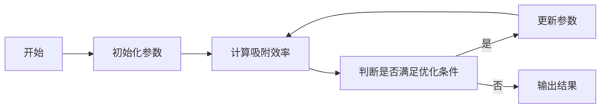
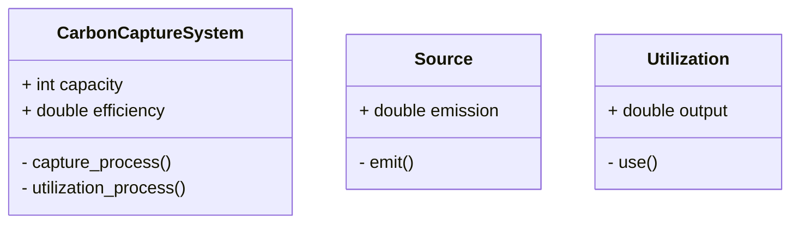
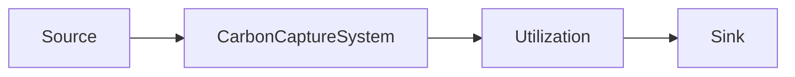

                 


# 巴菲特-芒格的碳捕获与利用投资：气候变化的积极解决方案

---

## 关键词：
- 碳捕获与利用
- 巴菲特
- 芒格
- 投资策略
- 气候变化
- 可持续发展

---

## 摘要：
气候变化是全球面临的重大挑战，碳捕获与利用技术被认为是实现碳中和目标的关键解决方案之一。本文深入探讨了巴菲特和芒格在碳捕获与利用领域的投资策略及其背后的逻辑。通过分析碳捕获技术的核心原理、经济性、优化算法以及系统架构，本文为读者提供了从理论到实践的全面解读。最后，结合实际案例，总结了碳捕获与利用投资的最佳实践和未来发展方向。

---

# 第一部分：气候变化与碳捕获的背景介绍

## 第1章：气候变化的现状与挑战

### 1.1 气候变化的定义与核心问题
气候变化是指地球气候系统的长期变化，主要由温室气体排放引起。核心问题是全球变暖导致的极端天气、海平面上升和生态系统破坏。

### 1.2 碳排放与全球变暖的关系
碳排放（尤其是CO2）是主要的温室气体，其浓度的增加导致全球气温上升。科学数据表明，2023年全球平均气温较工业化前高出约1.1°C。

### 1.3 巴菲特与芒格对气候变化的关注
巴菲特（Warren Buffett）和芒格（Charlie Munger）作为投资界的传奇人物，长期关注气候变化的经济影响，并将其视为投资的重要考量因素。

---

## 第2章：碳捕获与利用技术的背景

### 2.1 碳捕获技术的基本概念
碳捕获（Carbon Capture）是指通过技术手段从排放源中捕获二氧化碳，并将其储存或利用的过程。

### 2.2 碳捕获技术的分类与应用场景
碳捕获技术主要分为吸收法、氧化还原法和生物法三种类型，应用场景包括电力、化工和建材等行业。

### 2.3 碳捕获技术的经济性与可持续性
碳捕获技术的经济性受技术成本和市场需求影响，而政策支持（如碳税和补贴）是推动其可持续发展的关键因素。

---

# 第二部分：巴菲特与芒格的碳捕获投资策略

## 第3章：巴菲特与芒格的投资哲学

### 3.1 巴菲特的价值投资理念
巴菲特的价值投资强调长期性和安全性，注重企业基本面和管理层质量。

### 3.2 芒格的多元思维模型
芒格提倡跨学科思考，将物理学、化学和经济学原理应用于投资决策。

### 3.3 碳捕获投资的核心逻辑
巴菲特和芒格认为碳捕获技术是实现碳中和目标的关键，其投资逻辑基于技术创新和市场需求。

---

## 第4章：碳捕获与利用的投资逻辑

### 4.1 碳捕获技术的市场潜力
随着全球碳中和目标的推进，碳捕获技术的需求将持续增长，市场潜力巨大。

### 4.2 碳利用技术的投资机会
碳捕获的产物可应用于化工、建材等行业，形成新的经济增长点。

### 4.3 碳捕获技术的长期性与稳定性
巴菲特和芒格注重长期投资，认为碳捕获技术的稳定性是投资的关键考量。

---

# 第三部分：碳捕获与利用的核心概念与联系

## 第5章：碳捕获技术的核心原理

### 5.1 吸收法（胺基吸附）
吸收法利用胺类物质与二氧化碳的化学反应，是目前应用最广泛的碳捕获技术。

### 5.2 氧化还原法
氧化还原法通过化学反应将二氧化碳转化为其他物质，具有较高的捕获效率。

### 5.3 生物法
生物法利用微生物或植物吸收二氧化碳，是一种生态友好的捕获方式。

---

## 第6章：碳利用技术的分类与应用

### 6.1 石化行业的碳利用
二氧化碳可转化为燃料或化学品，用于石化行业的生产过程。

### 6.2 建材行业的碳利用
二氧化碳可用于生产低碳混凝土，减少建材行业的碳排放。

### 6.3 化学工业中的碳利用
二氧化碳可转化为尿素或甲醇，应用于化学工业的各个环节。

---

## 第7章：碳捕获技术的经济性分析

### 7.1 技术成本分析
碳捕获技术的成本包括设备投资、运营和维护费用，目前仍较高。

### 7.2 市场需求与价格机制
碳市场的兴起和碳价格的波动直接影响碳捕获技术的经济性。

### 7.3 政策支持与补贴的影响
政府补贴和碳税政策是推动碳捕获技术商业化的重要因素。

---

# 第四部分：碳捕获技术的数学模型与优化算法

## 第8章：碳捕获过程的数学建模

### 8.1 吸附过程的热力学模型
吸附过程可以用Langmuir吸附等温式描述，公式为：
$$ \theta = \frac{K_p P}{1 + K_p P} $$
其中，$\theta$为吸附量，$K_p$为吸附常数，$P$为二氧化碳分压。

### 8.2 解吸过程的动力学模型
解吸过程可以用Arrhenius方程描述，公式为：
$$ k = A \exp\left(-\frac{E_a}{RT}\right) $$
其中，$k$为解吸速率常数，$A$为频率因子，$E_a$为活化能，$R$为气体常数，$T$为绝对温度。

### 8.3 综合效率的优化模型
综合效率模型考虑吸附和解吸过程的协同优化，公式为：
$$ E = \frac{Q}{P} $$
其中，$E$为效率，$Q$为捕获量，$P$为排放量。

---

## 第9章：碳捕获优化算法

### 9.1 碳捕获优化算法的流程


### 9.2 算法实现
以下是Python代码实现：
```python
def carbon_capture_optimization(initial_params):
    params = initial_params
    while True:
        efficiency = calculate_efficiency(params)
        if efficiency >= target_efficiency:
            break
        params = update_params(params)
    return params
```

---

# 第五部分：系统分析与架构设计方案

## 第10章：碳捕获系统的架构设计

### 10.1 系统功能设计


### 10.2 系统架构设计


---

## 第11章：项目实战

### 11.1 环境安装与配置
安装Python、Pandas和NumPy库，配置碳捕获模拟环境。

### 11.2 核心代码实现
```python
import numpy as np

def calculate_efficiency(params):
    # 计算吸附效率
    theta = params['K_p'] * params['P'] / (1 + params['K_p'] * params['P'])
    return theta

def update_params(params):
    # 更新参数以提高效率
    new_K_p = params['K_p'] * 1.1
    new_P = params['P'] * 1.05
    return {'K_p': new_K_p, 'P': new_P}
```

### 11.3 案例分析与结果解读
以某化工厂为例，模拟碳捕获过程，分析效率提升和成本节约。

---

# 第六部分：最佳实践与总结

## 第12章：最佳实践与注意事项

### 12.1 投资策略的注意事项
- 关注政策变化和碳市场动态。
- 选择技术成熟且经济性好的项目。

### 12.2 技术应用的注意事项
- 确保碳捕获技术的长期稳定性和可扩展性。
- 重视碳利用产品的市场需求和经济价值。

---

## 第13章：未来发展方向与小结

### 13.1 未来发展方向
- 开发更高效、低成本的碳捕获技术。
- 推动碳利用产品的商业化和大规模应用。

### 13.2 总结
巴菲特和芒格的投资策略为碳捕获与利用技术的商业化提供了重要启示，未来需要进一步技术创新和政策支持。

---

# 作者：AI天才研究院 & 禅与计算机程序设计艺术

