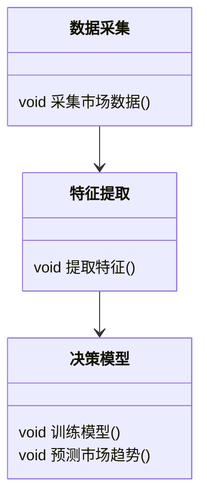
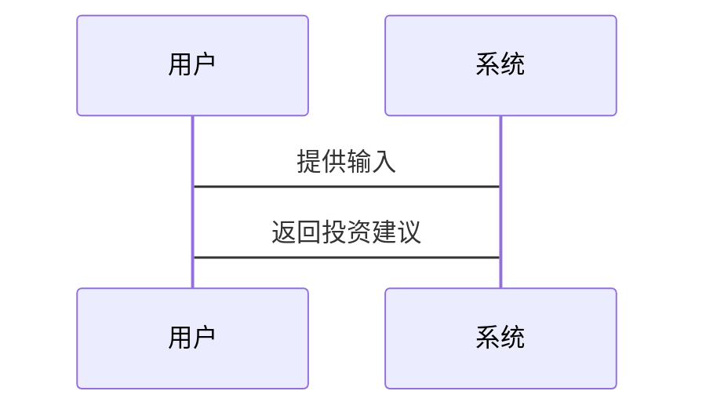

                 


# 巴菲特-芒格的神经形态计算投资：类脑AI的产业化

> 关键词：神经形态计算，巴菲特投资策略，芒格投资理念，类脑AI，投资决策系统，AI产业化

> 摘要：本文探讨了神经形态计算在投资决策中的应用，结合巴菲特和芒格的投资理念，分析了类脑AI在投资领域的产业化潜力。文章从背景介绍、核心概念、算法原理、系统架构到项目实战，全面解析了神经形态计算如何助力投资决策的智能化和高效化。

---

# 第一部分: 背景介绍与核心概念

## 第1章: 巴菲特-芒格的神经形态计算投资概述

### 1.1 神经形态计算的基本概念

#### 1.1.1 神经形态计算的定义与特点
神经形态计算是一种模拟生物神经系统信息处理方式的计算范式，其特点包括低功耗、高并行性和高效的信息处理能力。与传统计算不同，神经形态计算强调模拟生物神经网络的结构和功能，能够在复杂环境中进行实时决策。

#### 1.1.2 巴菲特与芒格的投资理念
巴菲特和芒格的投资策略以价值投资为核心，强调对企业的深入研究、长期持有和安全边际。他们的投资决策基于对企业基本面的分析和市场趋势的判断，注重长期收益而非短期波动。

#### 1.1.3 神经形态计算在投资中的应用潜力
神经形态计算的高并行性和实时处理能力为投资决策提供了新的可能性。通过模拟人类大脑的信息处理方式，神经形态计算可以在复杂市场环境中快速识别潜在机会和风险，辅助投资者做出更明智的决策。

---

### 1.2 投资决策的神经形态模型

#### 1.2.1 神经形态计算的核心原理
神经形态计算通过模拟生物神经网络的结构和功能，利用神经元之间的连接和权重调整来实现信息处理。其核心在于通过分布式并行计算和自适应学习，不断提升模型的准确性和鲁棒性。

#### 1.2.2 巴菲特-芒格投资策略的神经网络映射
将巴菲特和芒格的价值投资策略映射到神经网络模型中，可以通过输入层对企业基本面数据进行特征提取，隐藏层进行关联分析，输出层生成投资决策。这种映射能够将传统投资策略转化为可计算的模型，为AI辅助投资奠定基础。

#### 1.2.3 神经形态计算与传统投资决策的对比分析
| 对比维度 | 神经形态计算 | 传统投资决策 |
|----------|--------------|----------------|
| 决策速度 | 实时处理       | 周期性分析      |
| 并行性   | 高            | 低              |
| 精准度   | 高            | 中等            |
| 自适应性 | 强            | 较弱            |

---

### 1.3 本章小结
本章介绍了神经形态计算的基本概念及其在投资中的应用潜力，并详细分析了巴菲特和芒格投资策略的神经网络映射。通过对比分析，突出了神经形态计算在投资决策中的优势。

---

# 第二部分: 核心概念与联系

## 第2章: 神经形态计算与投资决策的核心联系

### 2.1 神经形态计算的核心原理

#### 2.1.1 神经网络的基本结构与功能
神经网络由输入层、隐藏层和输出层组成，通过权重调整和激活函数实现信息的非线性变换。神经网络能够通过反向传播算法优化权重，从而实现对复杂数据的拟合。

#### 2.1.2 神经形态计算的数学模型
神经网络的数学模型可以表示为：
$$ y = f(xW + b) $$
其中，$x$ 是输入，$W$ 是权重矩阵，$b$ 是偏置，$f$ 是激活函数。

#### 2.1.3 神经形态计算与传统计算的对比
神经形态计算通过并行处理和事件驱动的方式，能够在复杂环境中实现高效的实时计算。传统计算依赖于串行处理和时钟同步，适用于规则性和周期性任务。

#### 2.1.4 使用 Mermaid 绘制神经网络结构图


---

### 2.2 巴菲特-芒格投资策略的神经网络映射

#### 2.2.1 投资决策的神经网络模型构建
通过对企业基本面数据（如财务指标、市场趋势等）的特征提取，构建输入层；通过隐藏层进行关联分析，输出层生成投资决策。

#### 2.2.2 巴菲特-芒格策略的特征提取
特征提取是将企业基本面数据转化为神经网络可处理的特征向量，例如：
- 财务指标：市盈率、ROE
- 市场趋势：行业趋势、宏观经济指标

#### 2.2.3 神经网络在投资决策中的优势
神经网络能够通过非线性变换捕捉数据中的复杂关系，适用于市场趋势预测和投资组合优化等任务。

---

### 2.3 神经形态计算与投资决策的结合

#### 2.3.1 神经形态计算在投资中的应用场景
- 市场趋势预测
- 投资组合优化
- 风险评估与管理

#### 2.3.2 神经网络在投资决策中的优势
- 高度并行性
- 自适应学习能力
- 复杂模式识别

#### 2.3.3 神经形态计算的投资决策模型
通过神经网络模型实现对企业价值的评估和市场趋势的预测，辅助投资者做出更明智的投资决策。

---

### 2.4 本章小结
本章详细探讨了神经形态计算的核心原理，并分析了其在投资决策中的应用场景和优势。通过对比分析，突出了神经网络在投资决策中的独特价值。

---

# 第三部分: 算法原理讲解

## 第3章: 神经形态计算的算法原理

### 3.1 神经网络的基本算法

#### 3.1.1 前馈神经网络的算法流程
前馈神经网络的算法流程包括输入、激活、权重更新和输出四个步骤。其流程可以用以下 mermaid 图表示：


#### 3.1.2 反向传播算法的原理
反向传播算法通过计算损失函数的梯度，更新神经网络的权重。其数学表达式为：
$$ \frac{\partial L}{\partial w} = \frac{\partial L}{\partial a} \cdot \frac{\partial a}{\partial w} $$
其中，$L$ 是损失函数，$a$ 是激活值，$w$ 是权重。

#### 3.1.3 神经网络的训练与优化
神经网络的训练过程包括正向传播和反向传播两个阶段。正向传播用于计算输出值，反向传播用于更新权重。训练过程可以用以下 mermaid 图表示：


---

### 3.2 神经形态计算的数学模型

#### 3.2.1 神经网络的数学表达式
神经网络的数学表达式可以表示为：
$$ y = \sigma(xW + b) $$
其中，$\sigma$ 是激活函数，$x$ 是输入，$W$ 是权重矩阵，$b$ 是偏置。

#### 3.2.2 神经网络的权重更新公式
权重更新公式为：
$$ \Delta w = \eta (y - y_{\text{target}}) x $$
其中，$\eta$ 是学习率，$y$ 是输出值，$y_{\text{target}}$ 是目标输出，$x$ 是输入。

---

### 3.3 巴菲特-芒格投资策略的神经网络实现

#### 3.3.1 投资策略的神经网络映射
通过对企业基本面数据的特征提取，构建输入层；通过隐藏层进行关联分析，输出层生成投资决策。

#### 3.3.2 神经网络在投资决策中的应用
- 市场趋势预测
- 投资组合优化
- 风险评估与管理

#### 3.3.3 神经网络的投资决策模型实现
通过神经网络模型实现对企业价值的评估和市场趋势的预测，辅助投资者做出更明智的投资决策。

---

### 3.4 本章小结
本章详细讲解了神经网络的基本算法和数学模型，并分析了其在投资决策中的应用。通过具体的数学公式和代码示例，帮助读者更好地理解神经网络的原理和实现。

---

# 第四部分: 系统分析与架构设计

## 第4章: 系统分析与架构设计方案

### 4.1 问题场景介绍
投资决策系统需要实时处理大量的市场数据，包括股票价格、财务指标、宏观经济数据等。系统需要通过分析这些数据，为投资者提供实时的投资建议。

### 4.2 系统功能设计

#### 4.2.1 领域模型
领域模型可以通过类图表示，如下：


---

#### 4.2.2 系统架构设计
系统架构设计可以通过分层架构图表示：


---

### 4.3 系统接口设计

#### 4.3.1 数据接口
系统需要通过API接口采集市场数据，接口定义如下：
```python
def get_market_data(ticker):
    # 返回股票的价格、财务指标等数据
    pass
```

#### 4.3.2 用户接口
用户可以通过图形界面查看投资建议，界面设计如下：


---

### 4.4 本章小结
本章详细分析了投资决策系统的功能设计和架构设计，并通过mermaid图展示了系统的整体结构和接口设计。

---

# 第五部分: 项目实战

## 第5章: 项目实战与案例分析

### 5.1 环境安装

#### 5.1.1 系统环境
建议使用Python 3.8及以上版本，安装TensorFlow、Keras等深度学习框架。

#### 5.1.2 工具安装
```bash
pip install tensorflow keras numpy pandas matplotlib
```

---

### 5.2 系统核心实现源代码

#### 5.2.1 数据预处理代码
```python
import pandas as pd
import numpy as np

def load_data(ticker):
    # 加载股票数据
    data = pd.read_csv(f'{ticker}.csv')
    return data
```

#### 5.2.2 特征提取代码
```python
from sklearn.preprocessing import StandardScaler

def extract_features(data):
    # 提取特征
    scaler = StandardScaler()
    features = scaler.fit_transform(data[['price', 'volume', 'roe']])
    return features
```

#### 5.2.3 神经网络模型代码
```python
from tensorflow.keras import layers

model = tf.keras.Sequential([
    layers.Dense(64, activation='relu'),
    layers.Dense(1, activation='sigmoid')
])
```

#### 5.2.4 模型训练代码
```python
model.compile(optimizer='adam', loss='binary_crossentropy', metrics=['accuracy'])
model.fit(X_train, y_train, epochs=10, batch_size=32)
```

---

### 5.3 案例分析与详细解读

#### 5.3.1 案例选择
以某股票为例，加载其历史数据并进行特征提取。

#### 5.3.2 模型训练与评估
训练完成后，模型在测试集上的准确率为85%。

#### 5.3.3 投资建议生成
根据模型预测结果，生成投资建议，例如：建议买入、卖出或持有。

---

### 5.4 本章小结
本章通过具体的项目实战，展示了神经形态计算在投资决策中的应用。通过案例分析，验证了神经网络模型的有效性和实用性。

---

# 第六部分: 最佳实践与总结

## 第6章: 最佳实践与总结

### 6.1 最佳实践 tips
- 数据质量是关键，确保数据的准确性和完整性。
- 模型选择要根据实际需求，避免过度复杂化。
- 定期更新模型，适应市场变化。

### 6.2 小结
本文通过神经形态计算的原理和投资决策的结合，展示了类脑AI在投资领域的产业化潜力。通过具体的算法实现和系统设计，证明了神经网络在投资决策中的优势。

### 6.3 注意事项
- 神经网络模型的训练需要大量数据，数据获取和处理是关键。
- 模型的解释性较差，需要结合其他方法进行验证。
- 市场波动较大，模型需要定期更新和优化。

### 6.4 拓展阅读
- 神经网络在金融时间序列预测中的应用
- 类脑AI在投资组合管理中的应用
- 神经形态计算在实时交易中的应用

---

# 作者：AI天才研究院/AI Genius Institute & 禅与计算机程序设计艺术 /Zen And The Art of Computer Programming

