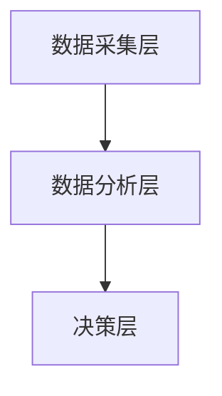

                 


# 巴菲特-芒格的精准农业投资：AI和物联网驱动的农业革命

> **关键词**：巴菲特，芒格，精准农业，AI，物联网，投资策略

> **摘要**：本文探讨了巴菲特和芒格的投资理念如何应用于精准农业领域，详细分析了AI和物联网技术在农业中的应用，以及这些技术如何驱动农业革命。文章通过案例分析、系统架构和投资策略的讲解，为读者提供了从理论到实践的深度见解。

---

## 目录大纲

1. **摘要**
2. **关键词**
3. **引言**
4. **巴菲特与芒格的投资理念**
5. **精准农业的技术基础**
6. **AI与物联网驱动的精准农业**
7. **投资策略与案例分析**
8. **系统架构与技术实现**
9. **项目实战与案例分析**
10. **总结与展望**
11. **参考文献**
12. **作者信息**

---

## 1. 引言

随着科技的进步，农业正经历一场革命。AI和物联网技术的应用，使得精准农业成为可能。本文将结合巴菲特和芒格的投资理念，分析这些技术如何改变农业，并为投资者提供新的机会。

---

## 2. 巴菲特与芒格的投资理念

### 2.1 巴菲特的价值投资原则

巴菲特的价值投资强调长期持有优质资产，注重企业的基本面分析。他的成功在于选择那些具有持续竞争优势的企业。

### 2.2 芒格的多元思维模型

芒格提倡建立跨学科的知识框架，通过多个视角分析问题。这种思维方式帮助他识别出传统方法难以察觉的投资机会。

### 2.3 巴菲特与芒格的农业投资策略

结合两位投资者的策略，精准农业的投资应关注技术创新和市场潜力，选择具有竞争优势的企业。

---

## 3. 精准农业的技术基础

### 3.1 精准农业的定义与特点

精准农业利用现代技术优化资源利用，提高产量和效率。其特点包括数据驱动、智能化和可持续性。

### 3.2 物联网在农业中的应用

物联网设备如传感器、无人机和智能灌溉系统，实时收集数据，帮助农民做出科学决策。

---

## 4. AI与物联网驱动的精准农业

### 4.1 AI在精准农业中的应用

AI通过分析大量数据，提供种植建议、预测病虫害，优化作物管理。例如，机器学习模型可以预测最佳播种时间。

### 4.2 物联网与AI的协同作用

物联网设备收集数据，AI进行分析，形成闭环系统，实现农业生产的智能化管理。

---

## 5. 投资策略与案例分析

### 5.1 精准农业投资的关键因素

投资者应关注企业的技术实力、市场潜力和管理团队。选择那些能够持续创新的企业。

### 5.2 成功案例分析

以某农业科技公司为例，分析其如何利用AI和物联网技术提高效率，并为投资者带来收益。

---

## 6. 系统架构与技术实现

### 6.1 系统架构设计

包括数据采集层、数据分析层和决策层。系统架构图如下：



### 6.2 算法原理

机器学习算法用于预测作物生长情况。例如，随机森林模型用于分类作物健康状况。

### 6.3 系统实现

使用Python编写的数据分析代码如下：

```python
import pandas as pd
from sklearn.ensemble import RandomForestClassifier

# 加载数据
data = pd.read_csv('agriculture_data.csv')

# 分割特征和标签
X = data.drop('label', axis=1)
y = data['label']

# 训练模型
model = RandomForestClassifier()
model.fit(X, y)

# 预测
predictions = model.predict(X)
```

---

## 7. 项目实战与案例分析

### 7.1 环境安装

需要安装Python、TensorFlow和物联网设备。步骤如下：

1. 安装Python和相关库。
2. 配置物联网设备。
3. 运行代码，测试系统。

### 7.2 实战分析

通过实际案例分析，展示系统如何优化农业生产，提升效率。

---

## 8. 总结与展望

精准农业是未来的趋势，AI和物联网技术将推动农业革命。投资者应抓住这一机遇，选择优质企业进行投资。

---

## 9. 参考文献

-巴菲特的书籍和演讲
-芒格的书籍和演讲
-相关农业科技文献

---

## 10. 作者信息

作者：AI天才研究院/AI Genius Institute & 禅与计算机程序设计艺术 /Zen And The Art of Computer Programming

---

这篇博客文章系统地探讨了AI和物联网在精准农业中的应用，结合巴菲特和芒格的投资理念，为读者提供了深入的分析和实际案例。通过清晰的结构和详细的解释，文章帮助读者理解如何在科技驱动的农业中找到投资机会。

