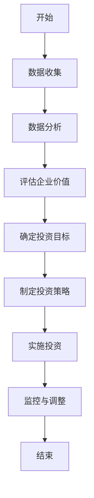
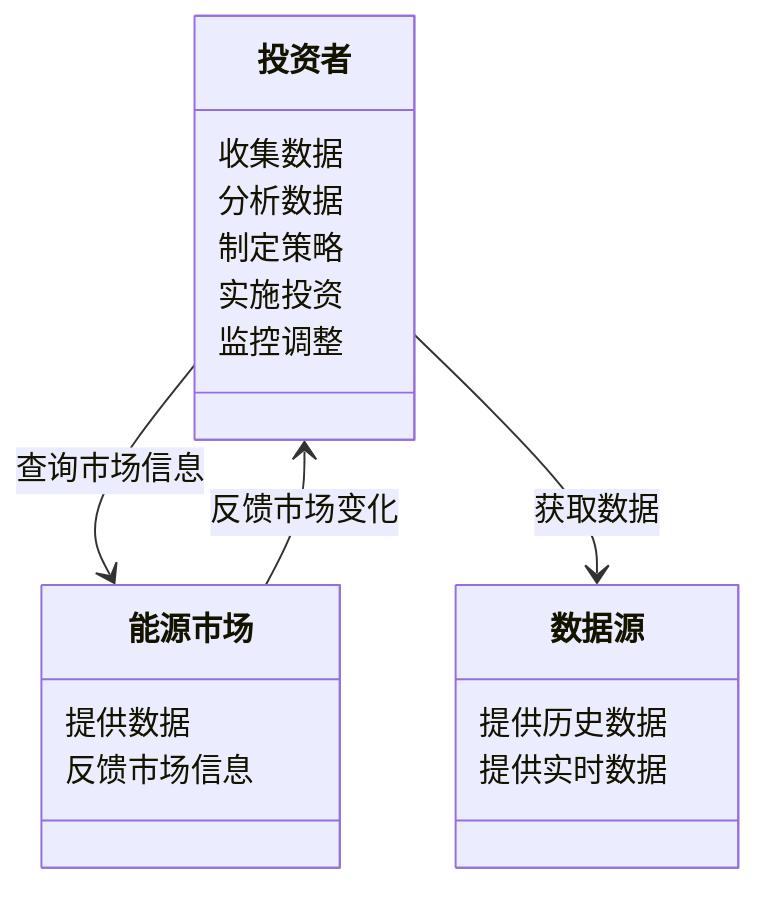
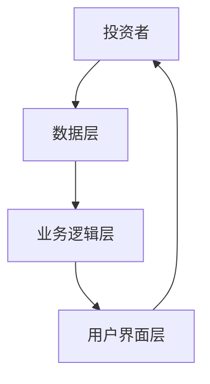

                 


# 巴菲特-芒格的能源转型投资：把握新能源革命的机遇

## 关键词：巴菲特，芒格，能源转型，新能源革命，投资策略，可再生能源

## 摘要：本文深入分析了巴菲特和芒格在能源转型投资领域的策略，探讨了新能源革命带来的投资机遇。通过详细讲解能源转型的核心概念、算法原理和系统设计，结合实际案例，展示了如何利用价值投资理念把握能源转型的投资机会。

---

## 第一部分：引言

### 第1章：能源转型投资的背景与重要性

#### 1.1 能源转型的背景与趋势

- **1.1.1 全球能源结构的变化**
  - 全球能源需求增长与结构变化
  - 石油、天然气等传统能源的局限性
  - 可再生能源的兴起与技术进步

- **1.1.2 可再生能源的发展现状与未来展望**
  - 太阳能、风能等可再生能源的现状
  - 技术进步推动成本下降
  - 全球能源结构向低碳转型

- **1.1.3 能源转型对全球经济的影响**
  - 经济增长与能源转型的关系
  - 新能源产业对就业和经济的推动
  - 全球能源政策的变化对投资的影响

#### 1.2 巴菲特与芒格的投资理念

- **1.2.1 巴菲特的价值投资策略**
  - 长期投资，注重企业内在价值
  - 寻找具有持续竞争优势的企业
  - 以合理价格买入优秀企业

- **1.2.2 芒格的多元思维模型**
  - 多学科交叉分析问题
  - 避免“心理误判”，理性决策
  - 寻找“飞人”企业，具备竞争优势和良好管理

- **1.2.3 两人合作的投资风格**
  - 长期价值投资
  - 注重风险管理
  - 通过分散投资降低风险

#### 1.3 能源转型投资的现状与挑战

- **1.3.1 当前能源转型投资的主要领域**
  - 新能源发电（太阳能、风能）
  - 智能电网与储能技术
  - 电动汽车与充电基础设施

- **1.3.2 投资者面临的挑战与风险**
  - 技术风险：技术创新不确定性
  - 政策风险：政策变化影响投资
  - 市场风险：价格波动和竞争压力

- **1.3.3 能源转型投资的未来机遇**
  - 新能源技术的商业化应用
  - 政策支持下的市场增长
  - 投资者如何抓住结构性机会

---

## 第二部分：能源转型投资的核心概念与联系

### 第2章：能源转型投资的核心概念

#### 2.1 能源市场的变化与投资机会

- **2.1.1 传统能源行业的衰退与转型**
  - 石油、煤炭等传统能源的需求变化
  - 环保政策对传统能源企业的影响
  - 企业如何转型进入新能源领域

- **2.1.2 可再生能源行业的崛起**
  - 太阳能和风能的成本下降
  - 技术进步推动行业增长
  - 新能源企业的竞争优势

- **2.1.3 能源结构变化对投资的影响**
  - 新能源企业的投资机会
  - 技术创新带来的投资机会
  - 市场需求变化带来的投资机会

#### 2.2 技术进步对能源转型的影响

- **2.2.1 新能源技术的创新与发展**
  - 太阳能电池效率提升
  - 风能技术的进步
  - 储能技术的发展

- **2.2.2 技术进步对投资决策的影响**
  - 技术进步降低投资成本
  - 技术进步提高投资收益
  - 技术进步带来的投资风险

#### 2.3 政策支持与能源转型投资

- **2.3.1 各国政府的能源政策变化**
  - 可再生能源补贴政策
  - 碳排放交易机制
  - 能源结构调整政策

- **2.3.2 政策对投资决策的影响**
  - 政策支持增加投资信心
  - 政策变化影响投资回报
  - 投资者如何应对政策变化

### 第3章：核心概念的对比分析

#### 3.1 传统能源与可再生能源的对比

| 特性                | 传统能源          | 可再生能源          |
|---------------------|-------------------|---------------------|
| 资源可用性           | 有限，需谨慎开发  | 丰富，可持续利用    |
| 环境影响             | 高，污染大         | 低，环保             |
| 成本                 | 高，尤其是化石能源| 低，随着技术进步下降|
| 可持续性             | 低，不可持续       | 高，可持续           |
| 技术成熟度           | 成熟，但面临转型   | 迅速发展，技术进步  |

#### 3.2 投资风险与回报对比

| 风险因素             | 传统能源          | 可再生能源          |
|---------------------|-------------------|---------------------|
| 市场风险             | 高                | 中                  |
| 技术风险             | 中                | 高                  |
| 政策风险             | 中                | 高                  |
| 环境风险             | 高                | 低                  |
| 投资回报             | 稳定，但增长缓慢   | 高，增长潜力大       |

---

## 第三部分：算法原理

### 第4章：能源转型投资的算法原理

#### 4.1 投资决策模型



#### 4.2 投资回报评估模型

使用CAPM模型评估投资回报：

$$ R_i = R_f + \beta_i (R_m - R_f) $$

其中：
- \( R_i \) 是资产的预期回报率
- \( R_f \) 是无风险利率
- \( \beta_i \) 是资产的贝塔系数
- \( R_m \) 是市场预期回报率
- \( R_f \) 是无风险利率

#### 4.3 投资组合优化

使用现代投资组合理论（MPT）进行投资组合优化：

$$ \text{最小化} \sigma^2 \text{，在给定的期望收益下} $$

其中：
- \( \sigma^2 \) 是投资组合的方差（风险）

---

## 第四部分：系统分析与架构设计

### 第5章：能源转型投资的系统架构

#### 5.1 系统功能设计



#### 5.2 系统架构设计



---

## 第五部分：项目实战

### 第6章：能源转型投资的项目实战

#### 6.1 案例分析：巴菲特对某可再生能源公司的投资

##### 6.1.1 环境安装

- 数据收集：市场数据、财务数据、政策数据
- 工具安装：数据分析工具（Excel、Python）、投资模型工具

##### 6.1.2 核心实现代码

```python
import pandas as pd
import numpy as np

# 数据预处理
data = pd.read_csv('energy_data.csv')
data_clean = data.dropna()

# 计算投资回报率
def calculate_return(data):
    returns = data['price'].pct_change()
    return returns.mean()

# 使用CAPM模型评估
rf = 0.05
rm = data['market_return'].mean()
beta = 1.2  # 假设的贝塔系数
expected_return = rf + beta * (rm - rf)
```

##### 6.1.3 案例分析与小结

- 投资环境分析：市场趋势、政策支持、企业竞争优势
- 投资决策过程：数据收集、分析、评估、决策
- 投资结果：收益与风险的平衡

---

## 第六部分：结论

### 第7章：能源转型投资的总结与展望

#### 7.1 全文总结

- 能源转型的重要性和投资机会
- 巴菲特和芒格的投资理念和策略
- 新能源革命对投资的影响

#### 7.2 投资策略建议

- 长期投资，注重企业内在价值
- 多元化投资，分散风险
- 关注技术创新和政策变化

#### 7.3 注意事项

- 风险管理，避免过度集中
- 保持对市场的敏感性，及时调整策略
- 理性决策，避免情绪化投资

#### 7.4 拓展阅读

- 推荐书籍：《巴菲特致股东的信》、《穷查理宝典》
- 推荐网站：能源行业报告、投资分析平台

---

## 附录

### 术语表

- CAPM：资本资产定价模型（Capital Asset Pricing Model）
- MPT：现代投资组合理论（Modern Portfolio Theory）
- 贝塔系数：衡量资产系统性风险的指标

### 参考文献

1. 巴菲特，沃伦. 《巴菲特致股东的信》
2. 芒格，查理. 《穷查理宝典》
3. 《能源转型与投资机会》
4. 《可再生能源发展报告》

---

## 作者：AI天才研究院 & 禅与计算机程序设计艺术

