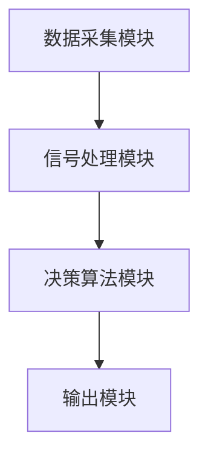

                 

# 巴菲特-芒格的脑机接口伦理投资：技术与人性的边界

> 关键词：脑机接口，投资伦理，巴菲特，芒格，人工智能，技术伦理

> 摘要：本文探讨了脑机接口技术在投资领域中的应用，结合巴菲特和芒格的投资理念，分析了技术与伦理的边界。文章从脑机接口的技术原理、数学模型、系统架构设计等方面展开，深入探讨了其在投资决策中的潜力与挑战，并提出了伦理评估与优化的策略。通过实际案例分析，总结了脑机接口技术在投资中的未来发展趋势。

---

## 第一章: 脑机接口技术与投资的结合

### 1.1 脑机接口技术的定义与原理

#### 1.1.1 脑机接口的基本概念
脑机接口（Brain-Computer Interface, BCI）是一种能够直接连接人类大脑与外部设备的接口技术，通过采集、处理和分析大脑信号，实现人与设备之间的信息交互。BCI的核心在于理解大脑的神经活动，并将其转化为可被计算机识别的信号。

#### 1.1.2 脑机接口的核心技术原理
脑机接口的工作流程主要包括信号采集、信号处理和信号输出三个阶段：
1. **信号采集**：通过 EEG（脑电图）、fMRI（功能性磁共振成像）等技术采集大脑信号。
2. **信号处理**：对采集到的信号进行预处理、特征提取和分类，提取出与投资决策相关的特征。
3. **信号输出**：将处理后的信号转化为投资决策指令，如买入或卖出股票的信号。

#### 1.1.3 脑机接口在投资领域的应用潜力
脑机接口技术可以通过捕捉投资者的情绪、注意力和决策偏好，辅助投资决策。例如，通过分析投资者的脑电波信号，可以预测市场波动、评估投资风险，并优化投资组合。

---

### 1.2 巴菲特与芒格的投资理念

#### 1.2.1 巴菲特的价值投资理论
巴菲特的价值投资理论强调长期投资、安全边际和内在价值。他主张通过分析企业的基本面，寻找具有长期竞争优势的企业进行投资。

#### 1.2.2 芒格的多元思维模型
芒格的多元思维模型强调跨学科思维，通过将不同领域的知识结合起来，形成全面的决策框架。他主张在投资决策中考虑经济、心理、社会等多个维度的因素。

#### 1.2.3 两人投资理念的现代延展
随着技术的进步，巴菲特和芒格的投资理念也需要与现代技术结合。脑机接口技术可以为他们的投资理论提供新的工具和视角，帮助投资者更科学地做出决策。

---

### 1.3 脑机接口技术与投资伦理的结合

#### 1.3.1 脑机接口在投资决策中的作用
脑机接口技术可以辅助投资者做出更理性的决策，同时也可以通过捕捉投资者的情绪波动，预测市场行为。然而，这种技术的应用也带来了伦理挑战。

#### 1.3.2 投资伦理的核心原则
投资伦理关注的是投资行为的公平性、透明性和道德性。脑机接口技术的应用必须符合这些原则，避免对市场造成不公平的影响。

#### 1.3.3 脑机接口如何影响投资伦理
脑机接口技术可能通过干预投资者的决策过程，影响市场的公平性。例如，某些投资者可能利用脑机接口技术获得不公平的优势，导致市场失衡。

---

## 第二章: 脑机接口技术的数学模型与算法

### 2.1 脑机接口的基本数学模型

#### 2.1.1 信号处理的数学基础
脑机接口的核心在于信号处理，常用的数学方法包括傅里叶变换、小波变换和主成分分析（PCA）。这些方法可以帮助提取大脑信号中的有用特征。

#### 2.1.2 神经网络模型的构建
深度学习模型（如卷积神经网络和循环神经网络）常用于脑机接口的信号分类任务。这些模型可以自动学习信号特征，并进行分类。

#### 2.1.3 模型的训练与优化
模型的训练需要大量的标注数据，通常采用交叉验证和正则化方法来优化模型性能。

---

### 2.2 投资决策的算法实现

#### 2.2.1 基于脑机接口的数据采集
通过脑机接口技术采集投资者的脑电波信号，并将其转化为投资决策的输入数据。

#### 2.2.2 数据分析与特征提取
对采集到的信号进行预处理，提取与投资决策相关的特征，如注意力水平和情绪波动。

#### 2.2.3 投资决策算法的设计与实现
设计基于特征的决策算法，如支持向量机（SVM）和随机森林（RF），并结合专家知识进行优化。

---

### 2.3 算法的伦理评估与优化

#### 2.3.1 算法的透明性与可解释性
算法的决策过程必须透明，以便投资者和监管机构能够理解其工作原理。

#### 2.3.2 算法的公平性与公正性
算法的设计必须避免对某些投资者的不公平影响，确保市场的公平性。

#### 2.3.3 算法优化中的伦理考量
在优化算法性能的同时，必须考虑其对伦理的影响，避免算法的滥用。

---

## 第三章: 脑机接口在投资中的系统架构设计

### 3.1 系统整体架构

#### 3.1.1 系统模块划分
系统主要包括数据采集模块、信号处理模块、决策算法模块和输出模块。

#### 3.1.2 系统功能设计
系统功能包括数据采集、特征提取、决策计算和结果输出。

#### 3.1.3 系统架构图

---

### 3.2 数据采集与处理

#### 3.2.1 数据采集模块设计
通过 EEG 传感器采集投资者的脑电波信号。

#### 3.2.2 数据预处理流程
对采集到的信号进行去噪、滤波和特征提取。

#### 3.2.3 数据存储与管理
将处理后的数据存储在数据库中，供后续分析使用。

---

### 3.3 投资决策与反馈系统

#### 3.3.1 决策算法实现
基于处理后的特征，运行决策算法，生成投资决策信号。

#### 3.3.2 决策结果反馈
将决策结果反馈给投资者，供其参考和调整。

#### 3.3.3 系统优化与迭代
根据实际效果，不断优化系统性能和算法参数。

---

## 第四章: 投资决策中的伦理问题分析

### 4.1 伦理问题的定义与分类

#### 4.1.1 投资决策中的主要伦理问题
包括隐私保护、公平性、透明性和责任归属等问题。

#### 4.1.2 伦理问题的分类与影响
可以将伦理问题分为技术伦理和行为伦理两大类。

---

### 4.2 脑机接口技术的伦理挑战

#### 4.2.1 技术使用的潜在风险
脑机接口技术可能被滥用，导致市场操纵或其他不正当行为。

#### 4.2.2 伦理决策的复杂性
脑机接口技术的决策过程涉及多个伦理维度，难以简单量化。

#### 4.2.3 技术对人类决策的干预
脑机接口技术可能影响投资者的自主决策能力，引发伦理争议。

---

### 4.3 伦理评估与优化策略

#### 4.3.1 伦理评估指标的设计
可以制定一套伦理评估指标，从透明性、公平性和隐私保护等多个维度进行评估。

#### 4.3.2 伦理优化的具体策略
包括技术透明化、算法可解释性和市场监督等。

#### 4.3.3 技术与伦理的平衡点
在技术应用中，需要找到技术效率与伦理约束的平衡点。

---

## 第五章: 脑机接口在投资中的实际应用案例

### 5.1 实际应用的背景介绍

#### 5.1.1 案例选择的标准
选择具有代表性的案例，重点考虑技术可行性和伦理影响。

#### 5.1.2 案例的具体情况
例如，利用脑机接口技术辅助某机构的投资决策。

#### 5.1.3 案例的实施过程
包括技术开发、数据采集、算法设计和结果分析。

---

### 5.2 技术实现与应用效果

#### 5.2.1 技术实现的细节
详细描述脑机接口技术在案例中的具体实现步骤。

#### 5.2.2 应用效果的评估
通过实验数据和市场反馈，评估技术的应用效果。

#### 5.2.3 应用中的问题与解决方案
总结应用过程中遇到的问题，并提出改进建议。

---

### 5.3 伦理评估与反思

#### 5.3.1 伦理问题的出现
在案例中发现的伦理问题，如隐私泄露和市场操纵风险。

#### 5.3.2 伦理问题的解决策略
通过技术手段和制度设计，减少伦理问题的影响。

#### 5.3.3 案例的启示与总结
总结案例的经验，为未来的技术应用提供参考。

---

## 第六章: 脑机接口技术的未来发展趋势

### 6.1 技术发展的主要方向

#### 6.1.1 神经科学的进步
神经科学的进展将为脑机接口技术提供更精确的信号处理方法。

#### 6.1.2 人工智能的融合
人工智能技术的进一步发展将推动脑机接口技术的智能化和自动化。

#### 6.1.3 技术的可扩展性
脑机接口技术的应用范围将不断扩大，涵盖更多投资领域。

---

### 6.2 投资领域的未来应用

#### 6.2.1 新的技术应用场景
脑机接口技术将应用于更多复杂的投资场景，如风险管理和社会责任投资。

#### 6.2.2 伦理问题的进一步探讨
随着技术的普及，伦理问题将更加复杂，需要社会各界共同参与解决。

#### 6.2.3 技术与伦理的协同发展
未来，技术发展与伦理规范将实现协同发展，共同推动投资领域的进步。

---

## 第七章: 总结与展望

### 7.1 全书内容的总结

#### 7.1.1 主要内容的回顾
本文从脑机接口技术的基本原理出发，结合巴菲特和芒格的投资理念，探讨了其在投资领域的应用潜力与伦理挑战。

#### 7.1.2 关键结论的提炼
脑机接口技术可以为投资决策提供新的工具，但其应用必须遵循伦理规范，避免对市场公平性造成破坏。

---

### 7.2 未来研究的方向

#### 7.2.1 技术层
进一步研究脑机接口技术的信号处理方法和算法优化。

#### 7.2.2 伦理层
加强伦理规范的制定和实施，确保技术的合理应用。

#### 7.2.3 应用层
探索脑机接口技术在更多投资场景中的应用，推动投资领域的创新。

---

作者：AI天才研究院/AI Genius Institute & 禅与计算机程序设计艺术 /Zen And The Art of Computer Programming

