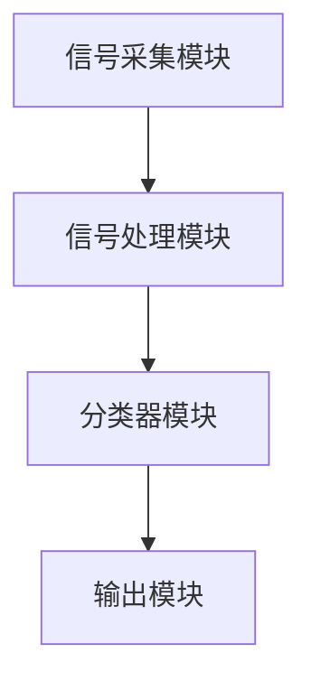

                 


# 巴菲特-芒格的脑机接口医疗应用投资：神经科技的突破

> 关键词：巴菲特，芒格，脑机接口，医疗应用，神经科技

> 摘要：本文深入探讨了巴菲特和芒格在脑机接口医疗应用领域的投资策略，分析了脑机接口技术的核心原理及其在神经康复、疾病诊断和治疗辅助等医疗领域的广泛应用。通过结合投资分析与技术实现，本文揭示了这一领域的发展潜力和投资价值，并总结了巴菲特和芒格的投资理念对医疗科技投资的启示。

---

## 第一章：引言

### 1.1 背景介绍
脑机接口（Brain-Computer Interface，BCI）是一种能够直接连接人脑与外部设备的技术，近年来在医疗领域的应用取得了显著进展。巴菲特和芒格作为投资界的传奇人物，其投资策略不仅关注企业的财务表现，更注重技术创新和市场潜力。

### 1.2 问题背景
医疗行业正经历数字化和智能化的深刻变革，脑机接口技术作为神经科技的核心，为医疗应用带来了前所未有的可能性。本文将从技术与投资两个角度，分析脑机接口医疗应用的现状与未来。

### 1.3 问题解决
通过分析巴菲特和芒格的投资逻辑，本文旨在揭示脑机接口技术在医疗领域的投资价值，并探讨其技术实现的核心原理。

### 1.4 边界与外延
本文聚焦于脑机接口技术在医疗领域的应用，重点关注神经康复、疾病诊断和治疗辅助三大领域。同时，本文还探讨了脑机接口技术与其他医疗技术的结合，如人工智能和大数据分析。

### 1.5 概念结构与核心要素
- **核心概念**：脑机接口技术、医疗应用、投资分析
- **核心要素**：神经信号采集、算法实现、医疗场景应用

---

## 第二章：脑机接口技术的核心原理

### 2.1 技术原理
脑机接口技术通过采集和处理神经信号，将其转化为可被计算机或外部设备理解的指令。其核心步骤包括信号采集、信号处理和指令生成。

### 2.2 核心算法
#### 2.2.1 神经信号处理
- **信号采集**：通过 EEG（脑电图）或 fMRI（功能性磁共振成像）采集神经信号。
- **信号处理**：使用滤波、特征提取和分类算法对信号进行处理。

#### 2.2.2 机器学习模型
- **模型构建**：基于神经信号数据，训练分类器（如支持向量机、随机森林）。
- **模型优化**：通过调整参数和特征选择，提高分类精度。

### 2.3 系统架构
#### 2.3.1 系统组成
- **信号采集模块**：负责采集神经信号。
- **信号处理模块**：对信号进行预处理和特征提取。
- **分类器模块**：将特征输入机器学习模型进行分类。
- **输出模块**：将分类结果输出为指令。

#### 2.3.2 系统流程
1. 采集神经信号。
2. 对信号进行滤波和降噪。
3. 提取特征并输入分类器。
4. 分类器输出指令。

---

## 第三章：脑机接口技术在医疗中的应用

### 3.1 神经康复
#### 3.1.1 应用场景
- 中风康复
- 脊髓损伤康复

#### 3.1.2 技术实现
- 使用 EEG 采集信号
- 通过分类器控制机器人辅助康复训练

### 3.2 疾病诊断
#### 3.2.1 应用场景
- 精神疾病诊断
- 神经退行性疾病（如阿尔茨海默病）诊断

#### 3.2.2 技术实现
- 采集患者脑电信号
- 使用机器学习模型进行疾病分类

### 3.3 治疗与康复辅助
#### 3.3.1 应用场景
- 帕金森病治疗
- 睡眠障碍治疗

#### 3.3.2 技术实现
- 实时监测神经信号
- 根据信号变化调整治疗方案

---

## 第四章：脑机接口技术的投资价值分析

### 4.1 巴菲特和芒格的投资理念
#### 4.1.1 巴菲特的价值投资
- 重视企业基本面
- 注重安全边际

#### 4.1.2 芒格的多元思维模型
- 交叉学科的思维方式
- 从多个角度分析问题

### 4.2 脑机接口技术的市场潜力
#### 4.2.1 全球医疗市场的增长
- 根据 WHO 数据，全球医疗支出预计将持续增长。

#### 4.2.2 脑机接口技术的商业化路径
- 研发周期长，但市场回报高。

### 4.3 投资策略
#### 4.3.1 选股标准
- 企业具备技术壁垒
- 市场需求明确

#### 4.3.2 风险分析
- 技术不确定性
- 市场竞争激烈

---

## 第五章：脑机接口医疗应用的技术与商业结合

### 5.1 技术实现
#### 5.1.1 系统设计
- 信号采集模块：EEG 采集头盔
- 信号处理模块：基于 Python 的特征提取算法
- 分类器模块：支持向量机模型

#### 5.1.2 系统流程
1. 采集 EEG 信号
2. 提取特征（如频域特征和时域特征）
3. 分类器进行分类
4. 输出指令

### 5.2 商业模式
#### 5.2.1 产品销售
- 销售脑机接口设备
- 提供技术支持服务

#### 5.2.2 服务模式
- 按需付费的云服务
- 数据分析服务

### 5.3 产业链分析
- 上游：芯片制造商、传感器供应商
- 中游：设备制造商、软件开发商
- 下游：医疗机构、患者

---

## 第六章：巴菲特和芒格的投资案例分析

### 6.1 巴菲特的投资案例
- **案例1**：投资某医疗设备公司
- **案例2**：投资某神经科技初创公司

### 6.2 芒格的投资案例
- **案例1**：投资某脑机接口技术公司
- **案例2**：投资某医疗数据分析公司

### 6.3 投资策略总结
- **长期视角**：关注技术创新和市场需求
- **价值发现**：寻找具备护城河的公司

---

## 第七章：脑机接口医疗应用的系统分析与架构设计

### 7.1 系统架构
#### 7.1.1 模块划分
- 信号采集模块
- 信号处理模块
- 分类器模块
- 输出模块

#### 7.1.2 模块交互
- 信号采集模块向信号处理模块传递数据
- 分类器模块根据处理后的数据输出指令

### 7.2 数据流图


### 7.3 系统接口设计
- **输入接口**：EEG 信号采集接口
- **输出接口**：指令输出接口

---

## 第八章：项目实战——脑机接口医疗应用系统实现

### 8.1 环境安装
- **软件环境**：Python 3.8+
- **硬件环境**：EEG 采集设备

### 8.2 核心代码实现
#### 8.2.1 数据采集
```python
import numpy as np

def采集_eeg信号():
    # 模拟数据采集
    return np.random.randn(1000)
```

#### 8.2.2 特征提取
```python
def 提取特征(信号):
    # 计算时域特征和频域特征
    return 特征向量
```

#### 8.2.3 分类器实现
```python
from sklearn.svm import SVC

def 训练分类器(训练数据, 标签):
    分类器 = SVC()
    分类器.fit(训练数据, 标签)
    return 分类器
```

### 8.3 系统设计
- **功能设计**：神经信号采集、特征提取、分类和输出
- **界面设计**：用户友好的操作界面

### 8.4 测试案例
- **测试1**：神经康复训练系统测试
- **测试2**：疾病诊断系统测试

---

## 第九章：总结与展望

### 9.1 总结
- 巴菲特和芒格的投资理念为脑机接口技术的投资提供了重要启示。
- 脑机接口技术在医疗领域的应用潜力巨大。

### 9.2 展望
- 技术将进一步成熟，应用场景将更加广泛。
- 投资者应关注技术创新和市场需求的结合。

---

## 作者信息

作者：AI天才研究院/AI Genius Institute & 禅与计算机程序设计艺术 /Zen And The Art of Computer Programming

---

通过以上结构，本文从技术与投资两个角度，全面分析了脑机接口医疗应用的发展现状与未来趋势，为投资者和技术创新者提供了重要的参考。

