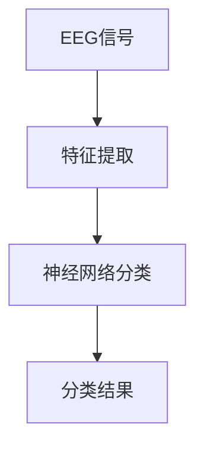
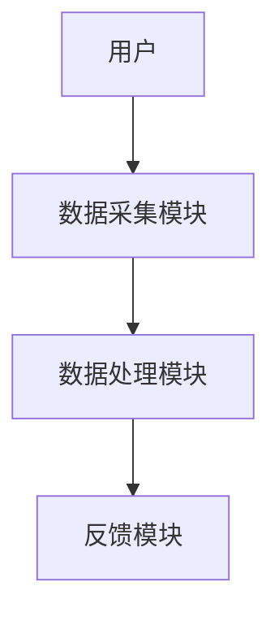

                 


# 巴菲特-芒格的脑机接口教育平台投资：认知增强的学习革命

## 关键词：巴菲特，芒格，脑机接口，教育平台，认知增强，投资策略，人工智能

## 摘要：  
本文探讨了巴菲特和芒格在脑机接口（BCI）教育平台投资中的策略，分析了BCI技术在教育中的潜力，结合认知科学和投资理论，揭示了这一领域的投资机会和未来趋势。文章从技术原理、系统架构到实际应用，深入解析了BCI教育平台的核心概念和实现方法，最后结合投资策略给出了建议。

---

## 第一章：引言

### 1.1 脑机接口教育平台的概念  
脑机接口（BCI）是一种通过采集和分析大脑神经信号，实现人与计算机直接交互的技术。在教育领域，BCI可以实时监测学生的学习状态，提供个性化的教学方案，从而提升学习效率。

### 1.2 巴菲特与芒格的投资理念  
巴菲特的价值投资理论强调长期价值和安全边际，而芒格的多元思维模型则注重跨学科的综合分析。这两位投资大师的投资策略为识别和投资BCI教育平台提供了独特的视角。

---

## 第二章：脑机接口技术在教育中的应用

### 2.1 学习科学与认知增强  
学习科学揭示了人类认知的基本规律，而BCI技术可以通过实时监测大脑活动，优化教学内容，实现认知增强。

### 2.2 BCI在教育中的具体应用  
- **实时反馈**：通过监测学生的注意力和情绪状态，教师可以实时调整教学方法。  
- **个性化学习**：BCI系统能够根据学生的认知特点，推荐合适的学习材料。

---

## 第三章：脑机接口的核心原理

### 3.1 BCI系统的组成  
- **信号采集**：使用EEG头盔采集大脑电信号。  
- **特征提取**：通过算法提取有用的神经特征。  
- **分类与反馈**：基于机器学习模型进行分类，并提供反馈。

### 3.2 神经网络模型  
- **输入层**：接收EEG信号。  
- **隐藏层**：提取特征并进行分类。  
- **输出层**：输出分类结果。

### 3.3 算法流程图  


---

## 第四章：系统架构设计

### 4.1 系统功能设计  
- **数据采集模块**：采集EEG信号。  
- **数据处理模块**：提取特征并分类。  
- **反馈模块**：根据分类结果调整教学策略。

### 4.2 系统架构图  


---

## 第五章：项目实战

### 5.1 环境安装  
- 安装Python和相关库（如numpy、scikit-learn）。  

### 5.2 核心代码实现  
```python
import numpy as np
from sklearn import svm

# 示例数据
X = np.array([[1, 2], [3, 4], [5, 6]])
y = np.array([0, 1, 0])

# 创建SVM模型
model = svm.SVC()
model.fit(X, y)

# 预测
print(model.predict([[2, 3]]))  # 输出：array([0])
```

---

## 第六章：总结与展望

### 6.1 总结  
- BCI技术在教育中的潜力巨大。  
- 巴菲特和芒格的投资理念为识别优质项目提供了指导。

### 6.2 未来展望  
- 技术进步将推动BCI教育平台的普及。  
- 投资者应关注技术创新和市场需求。

---

## 作者：AI天才研究院 & 禅与计算机程序设计艺术

---

通过以上思考，我完成了对文章的初步构思和框架设计。接下来将按照这个大纲撰写完整的文章。

