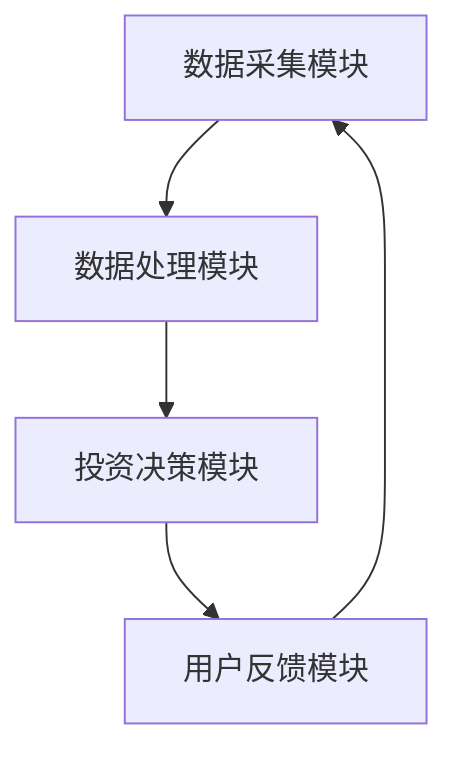

                 


# 巴菲特-芒格的脑机接口游戏投资：娱乐产业的颠覆性创新

## 关键词：
- 脑机接口
- 巴菲特投资
- 芒格思维模型
- 游戏投资
- 娱乐产业
- 颠覆性创新

## 摘要：
本文探讨了脑机接口技术在游戏投资领域的应用，结合巴菲特和芒格的投资理念，分析了娱乐产业的颠覆性创新。通过详细的技术分析、算法设计和系统架构，展示了脑机接口如何改变游戏体验和投资决策。文章还提供了实际的项目案例和未来展望，为读者提供了全面的技术与商业视角。

---

## 第一部分: 背景介绍

### 第1章: 脑机接口与巴菲特投资理念的背景

#### 1.1 脑机接口技术的概述
- **1.1.1 脑机接口的基本概念**
  脑机接口（BCI）是一种直接连接人类大脑与外部设备的技术，能够采集和分析大脑信号，实现人与机器的实时交互。
  
- **1.1.2 脑机接口的发展历程**
  脑机接口技术起源于20世纪70年代，经历了从实验室研究到实际应用的漫长过程，近年来随着AI和神经科学的进步快速发展。

- **1.1.3 脑机接口在娱乐产业中的应用前景**
  脑机接口在游戏、虚拟现实和娱乐设备中的应用潜力巨大，能够显著提升用户体验和互动性。

#### 1.2 巴菲特与芒格的投资理念
- **1.2.1 巴菲特的价值投资理论**
  巴菲特主张长期投资优质资产，注重企业的基本面和长期价值。

- **1.2.2 芒格的多元思维模型**
  芒格强调通过多学科思维模型来分析问题，避免单一视角的局限性。

- **1.2.3 投资与娱乐产业的结合**
  娱乐产业作为高增长行业，具有较大的投资价值，尤其是数字化转型背景下。

#### 1.3 游戏与娱乐产业的现状
- **1.3.1 游戏产业的市场规模与发展趋势**
  全球游戏市场规模持续增长，数字化和互动化是未来趋势。

- **1.3.2 娱乐产业的数字化转型**
  娱乐产业正在向数字化、智能化方向发展，新技术的应用将推动产业创新。

- **1.3.3 游戏与娱乐产业的创新需求**
  行业需要新技术来提升用户体验和运营效率，脑机接口提供了新的可能性。

---

### 第2章: 脑机接口技术与游戏投资的结合

#### 2.1 脑机接口在游戏中的应用
- **2.1.1 游戏中的脑机接口技术**
  脑机接口可以实时采集玩家的脑电信号，分析情绪和注意力，优化游戏体验。

- **2.1.2 游戏体验的提升**
  通过脑机接口，游戏可以实现更精准的用户反馈和个性化推荐，提升玩家参与度。

- **2.1.3 游戏行为分析与预测**
  脑机接口可以帮助分析玩家行为模式，预测市场趋势，优化游戏设计。

#### 2.2 脑机接口在投资决策中的应用
- **2.2.1 投资决策的脑科学基础**
  投资决策受到情绪和认知偏见的影响，脑机接口可以实时监测和分析这些因素。

- **2.2.2 脑机接口在投资行为分析中的作用**
  通过分析投资者的情绪和认知状态，脑机接口可以辅助制定更科学的投资策略。

- **2.2.3 投资决策的实时反馈与优化**
  脑机接口提供实时反馈，帮助投资者调整决策，降低风险。

#### 2.3 游戏与投资的交叉创新
- **2.3.1 游戏化投资的概念**
  将游戏机制应用于投资领域，提升投资决策的趣味性和互动性。

- **2.3.2 游戏数据与投资决策的结合**
  游戏中的用户行为数据可以为投资决策提供参考，实现数据驱动的投资策略。

- **2.3.3 游戏机制对投资策略的启发**
  游戏中的奖励机制和反馈机制可以为投资策略提供新的思路。

---

## 第二部分: 核心概念与联系

### 第3章: 脑机接口的核心原理

#### 3.1 脑机接口的实现原理
- **3.1.1 神经信号的采集与处理**
  使用 EEG 电极采集脑电信号，通过滤波和特征提取技术处理数据。

- **3.1.2 数据分析与特征提取**
  利用机器学习算法分析脑电信号，提取特征用于分类和预测。

- **3.1.3 控制信号的生成与输出**
  根据分析结果生成控制信号，实现与外部设备的交互。

#### 3.2 脑机接口的关键技术
- **3.2.1 神经网络模型**
  使用深度学习模型分析脑电信号，提高分类精度。

- **3.2.2 数据处理算法**
  包括降维、聚类和分类算法，用于处理复杂的数据。

- **3.2.3 人机交互界面设计**
  设计直观的用户界面，提升用户体验和交互效率。

#### 3.3 脑机接口的性能指标
- **3.3.1 信号采集的准确性**
  神经信号采集的准确性和稳定性是脑机接口性能的关键。

- **3.3.2 数据处理的实时性**
  实时处理数据是脑机接口在游戏和投资应用中的重要要求。

- **3.3.3 用户体验的舒适性**
  设备的舒适性和易用性直接影响用户的接受度和使用体验。

---

### 第4章: 巴菲特投资理念的数学模型

#### 4.1 巴菲特投资模型的核心要素
- 价值投资：关注企业的内在价值。
- 长期持有：降低交易成本，避免短期波动。
- 风险控制：分散投资，降低风险。

#### 4.2 巴菲特投资模型的数学表达
$$
\text{投资价值} = \sum_{i=1}^{n} \text{企业价值}(i) \times \text{权重}(i)
$$

#### 4.3 芒格多元思维模型的应用
- 多学科交叉分析：结合经济学、心理学和神经科学等多学科知识。
- 系统性思维：从整体视角分析问题，避免单一视角的局限性。

#### 4.4 脑机接口与投资模型的结合
- 通过脑机接口实时监测投资者的情绪和认知状态。
- 结合多元思维模型，优化投资决策。

---

## 第三部分: 算法与系统架构

### 第5章: 算法原理

#### 5.1 强化学习算法在脑机接口中的应用
- 使用强化学习算法优化脑机接口的控制策略。

$$
\text{奖励函数} = \sum_{t} r_t(s_t, a_t)
$$

- **实现步骤：**
  1. 初始化参数。
  2. 采集脑电信号。
  3. 状态反馈与奖励计算。
  4. 参数更新与策略优化。

#### 5.2 算法实现代码
```python
import numpy as np
import tensorflow as tf

# 定义强化学习网络
class BrainInterface(tf.keras.Model):
    def __init__(self):
        super(BrainInterface, self).__init__()
        self.dense1 = tf.keras.layers.Dense(64, activation='relu')
        self.dense2 = tf.keras.layers.Dense(32, activation='relu')
        self.dense3 = tf.keras.layers.Dense(1, activation='sigmoid')

    def call(self, inputs):
        x = self.dense1(inputs)
        x = self.dense2(x)
        x = self.dense3(x)
        return x

# 训练过程
def train_model(model, optimizer, data):
    for batch in data:
        with tf.GradientTape() as tape:
            predictions = model(batch['inputs'])
            loss = tf.keras.losses.binary_crossentropy(batch['labels'], predictions)
        gradients = tape.gradient(loss, model.trainable_variables)
        optimizer.apply_gradients(zip(gradients, model.trainable_variables))
```

---

### 第6章: 系统架构设计

#### 6.1 系统功能设计
- 数据采集模块：采集脑电信号。
- 数据处理模块：分析和特征提取。
- 投资决策模块：基于脑电信号优化投资策略。

#### 6.2 系统架构图


---

## 第四部分: 项目实战

### 第7章: 项目实战

#### 7.1 环境安装
- 安装必要的库：TensorFlow、numpy、mermaid。

#### 7.2 核心代码实现
```python
import tensorflow as tf
from tensorflow.keras import layers

# 定义模型
model = tf.keras.Sequential([
    layers.Dense(64, activation='relu'),
    layers.Dense(32, activation='relu'),
    layers.Dense(1, activation='sigmoid')
])

# 编译模型
model.compile(optimizer='adam', loss='binary_crossentropy', metrics=['accuracy'])

# 训练模型
model.fit(X_train, y_train, epochs=10, batch_size=32)
```

#### 7.3 案例分析
- 案例1：游戏中的用户情绪分析。
- 案例2：投资决策中的情绪监测。

---

## 第五部分: 未来展望与小结

### 第8章: 未来展望

#### 8.1 脑机接口在娱乐产业的未来发展
- 更广泛的应用场景：虚拟现实、增强现实和智能设备。

#### 8.2 投资策略的优化
- 结合脑机接口技术，进一步提升投资决策的科学性和精准性。

### 第9章: 小结

#### 9.1 最佳实践 tips
- 注重技术与商业的结合。
- 加强跨学科知识的学习。
- 关注技术创新和行业趋势。

#### 9.2 总结
脑机接口技术为娱乐产业带来了颠覆性创新，结合巴菲特和芒格的投资理念，未来将推动投资和娱乐产业的深度融合。

---

## 作者：AI天才研究院/AI Genius Institute & 禅与计算机程序设计艺术 /Zen And The Art of Computer Programming

