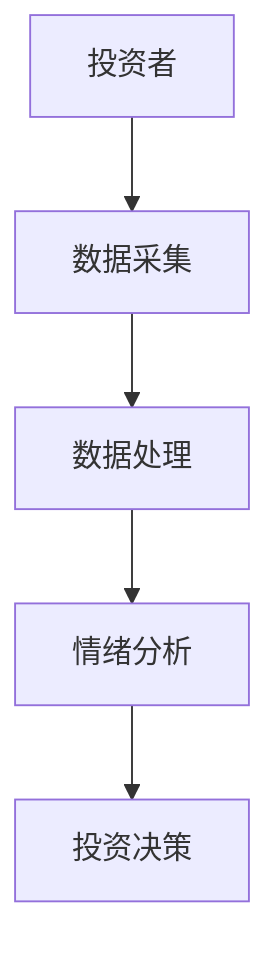

                 


# 巴菲特-芒格的脑机接口社交平台投资：思维互联的社交革命

## 关键词：巴菲特，芒格，脑机接口，社交平台，投资策略，思维互联，人工智能

## 摘要：本文探讨了巴菲特和芒格的投资理念如何与脑机接口技术相结合，推动社交平台投资的革新。通过分析投资者行为和情绪，利用脑机接口技术优化投资决策，实现社交革命。

---

## 第一部分：背景介绍与核心概念

### 1.1 问题背景与研究意义

#### 1.1.1 问题背景
- 社交平台在投资中的重要性日益增加，投资者行为受到社交网络影响。
- 技术进步推动脑机接口（BCI）技术的发展，可能改变投资决策方式。

#### 1.1.2 研究意义
- 脑机接口技术为投资者情绪分析和决策优化提供新工具。
- 结合巴菲特和芒格的投资理念，探索技术驱动的投资策略。

### 1.2 脑机接口技术的基本概念

#### 1.2.1 脑机接口的基本原理
- 脑机接口通过采集和分析脑电信号，解读用户意图。
- 应用于社交平台，实时捕捉投资者情绪。

#### 1.2.2 投资者行为分析
- 投资者情绪影响决策，情绪波动可通过脑机接口捕捉。
- 分析投资者行为模式，优化投资策略。

### 1.3 脑机接口社交平台投资的核心要素

#### 1.3.1 数据采集与处理
- 脑电信号采集：通过EEG设备获取投资者情绪数据。
- 数据预处理：去噪、特征提取，准备分析。

#### 1.3.2 情绪分类与预测
- 使用机器学习算法，如随机森林和神经网络，分析情绪数据。
- 预测投资者情绪，辅助投资决策。

#### 1.3.3 投资决策优化
- 基于情绪分析，优化投资组合。
- 结合市场趋势，提供实时投资建议。

---

## 第二部分：脑机接口技术与社交平台投资

### 2.1 投资者情绪分析

#### 2.1.1 情绪分类算法
- 使用支持向量机（SVM）进行情绪分类。
- 通过特征工程提取有效情绪特征。

#### 2.1.2 情绪预测模型
- 构建时间序列模型，如ARIMA，预测市场情绪。
- 使用LSTM进行长期记忆网络，捕捉情绪变化趋势。

### 2.2 投资决策优化

#### 2.2.1 情绪驱动的投资策略
- 基于投资者情绪变化，动态调整投资组合。
- 避免情绪化决策，提升投资回报率。

#### 2.2.2 市场趋势与情绪交互
- 分析市场趋势与投资者情绪的关系。
- 利用脑机接口技术优化投资策略。

---

## 第三部分：系统设计与实现

### 3.1 系统架构设计

#### 3.1.1 系统模块划分
- 数据采集模块：采集投资者情绪数据。
- 数据处理模块：预处理和特征提取。
- 情绪分析模块：分类和预测。
- 投资决策模块：优化投资组合。

#### 3.1.2 系统架构图


### 3.2 系统实现

#### 3.2.1 数据采集与处理
- 使用Python库进行数据采集和处理。
- 示例代码：
  ```python
  import numpy as np
  def preprocess_signals(signals):
      # 假设signals为EEG数据
      # 进行降噪处理
      filtered_signals = np.apply_along_axis(lambda x: x * np.hamming(len(x)), 1, signals)
      return filtered_signals
  ```

#### 3.2.2 情绪分类与预测
- 使用机器学习模型进行情绪分类。
- 示例代码：
  ```python
  from sklearn.svm import SVC
  model = SVC(kernel='rbf', gamma='auto')
  model.fit(X_train, y_train)
  ```

#### 3.2.3 投资决策优化
- 基于情绪分析结果，优化投资组合。
- 示例代码：
  ```python
  def optimize_portfolio(portfolio, sentiment):
      # 根据情绪调整权重
      if sentiment == 'positive':
          portfolio = portfolio * 1.1
      else:
          portfolio = portfolio * 0.9
      return portfolio
  ```

---

## 第四部分：项目实战与案例分析

### 4.1 环境安装与配置

#### 4.1.1 安装依赖
- 安装必要的Python库：
  ```bash
  pip install numpy scikit-learn matplotlib
  ```

#### 4.1.2 数据采集工具
- 使用OpenBCI或类似的脑机接口设备。

### 4.2 核心代码实现

#### 4.2.1 数据预处理
```python
import numpy as np
def preprocess_signals(signals):
    # 使用汉明窗进行降噪
    filtered = np.apply_along_axis(lambda x: x * np.hamming(len(x)), 1, signals)
    return filtered
```

#### 4.2.2 情绪分类
```python
from sklearn.svm import SVC
def train_emotion_classifier(X_train, y_train):
    model = SVC(kernel='rbf', gamma='auto')
    model.fit(X_train, y_train)
    return model
```

### 4.3 案例分析与结果解读

#### 4.3.1 案例分析
- 分析某段时间内投资者情绪变化，预测市场趋势。

#### 4.3.2 结果解读
- 情绪分析结果与实际市场数据对比，验证模型准确性。

---

## 第五部分：总结与展望

### 5.1 总结
- 脑机接口技术为社交平台投资带来新机遇。
- 巴菲特和芒格的投资理念与技术结合，优化投资决策。

### 5.2 未来展望
- 技术进步推动脑机接口在投资中的应用。
- 更多投资者情绪分析工具和决策优化模型的发展。

---

## 作者：AI天才研究院 & 禅与计算机程序设计艺术

---

通过以上结构和内容，您可以逐步展开每个部分的具体内容，撰写一篇详细的技术博客文章。

