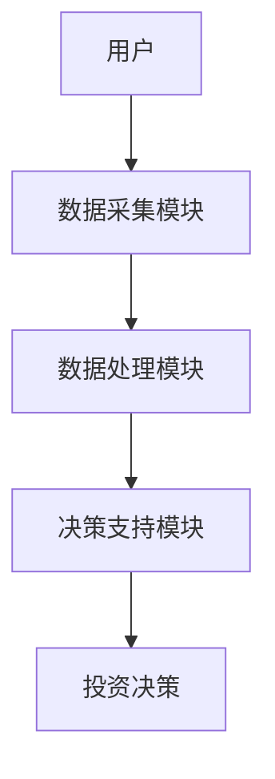

                 


# 巴菲特-芒格的脑机接口社交应用投资：思维互联的新时代

## 关键词
- 巴菲特投资理念
- 芒格思维模型
- 脑机接口技术
- 社交应用
- 投资决策优化
- 神经科学
- 技术融合

## 摘要
本文探讨了巴菲特和芒格的投资理念与脑机接口技术的结合，特别是在社交应用中的投资机会。通过分析脑机接口技术的原理、算法和系统架构，结合巴菲特和芒格的投资策略，提出了利用BCI技术优化投资决策的方法。文章还通过案例分析和实战项目，展示了如何将理论应用于实际投资中，并提供了最佳实践建议。

---

# 第一部分：巴菲特与芒格的投资理念

## 第1章：巴菲特与芒格的投资哲学

### 1.1 巴菲特的价值投资理念

#### 1.1.1 价值投资的核心思想
价值投资的核心是寻找市场低估的优质企业，长期持有，等待其内在价值的实现。巴菲特强调关注企业的基本面，如盈利能力、财务健康和行业地位。

#### 1.1.2 巴菲特的投资策略
- **长期投资**：巴菲特偏好长期持有优质资产，避免短期市场波动的干扰。
- **安全边际**：在买入股票时，确保其价格显著低于其内在价值。
- **企业质量**：选择具有持续竞争优势和良好管理的企业。

#### 1.1.3 巴菲特的长期主义
巴菲特强调长期主义，认为投资不仅是经济行为，更是对社会和企业责任的体现。

---

### 1.2 芒格的多元思维模型

#### 1.2.1 多元思维模型的定义
芒格提出多元思维模型，即通过多个学科的思维方式来分析问题，避免单一思维的局限性。

#### 1.2.2 芒格的决策框架
- **多维度分析**：从多个角度评估投资机会，包括财务、市场、技术和管理等方面。
- **避免认知偏差**：芒格强调克服心理偏差，如过度自信和从众心理。

#### 1.2.3 芒格的智慧树思维
芒格将知识体系比作一棵树，各个学科是树枝，通过交叉融合，形成完整的决策框架。

---

## 第2章：脑机接口技术的背景与应用

### 2.1 脑机接口技术的定义与原理

#### 2.1.1 脑机接口的基本概念
脑机接口（BCI）是一种连接大脑与外部设备的接口技术，通过采集和分析大脑神经信号，实现人与设备的直接交互。

#### 2.1.2 脑机接口的工作原理
- **数据采集**：通过EEG（脑电图）或fMRI（功能性磁共振成像）采集大脑神经信号。
- **信号处理**：对采集的信号进行预处理、特征提取和分类，识别特定的脑活动模式。
- **输出控制**：将处理后的信号转化为控制指令，驱动外部设备。

#### 2.1.3 脑机接口的技术分类
- **侵入式**：直接植入大脑，如深部脑刺激技术。
- **非侵入式**：通过头皮电极采集信号，如EEG技术。
- **部分侵入式**：如皮下植入电极。

---

### 2.2 脑机接口在社交应用中的潜力

#### 2.2.1 脑机接口在社交网络中的应用
- **情绪分析**：通过分析大脑活动，识别用户的情感状态，优化社交互动体验。
- **行为预测**：基于脑机接口数据，预测用户的社交行为，提升社交应用的个性化服务。

#### 2.2.2 脑机接口在用户行为分析中的作用
- **注意力监测**：识别用户在社交平台上的注意力变化，优化内容推荐算法。
- **认知负荷分析**：评估用户在使用社交应用时的认知负担，优化界面设计。

#### 2.2.3 脑机接口在社交投资中的潜在价值
- **投资决策支持**：通过分析投资者的心理状态，辅助投资决策。
- **风险预警**：识别投资者的情绪波动，提前预警潜在风险。

---

## 第3章：脑机接口技术与投资决策的结合

### 3.1 脑机接口在投资中的应用背景

#### 3.1.1 投资决策中的认知偏差
投资者常常受到认知偏差的影响，如过度自信、从众心理和确认偏见，导致决策失误。

#### 3.1.2 脑机接口在投资决策中的作用
- **实时监测**：通过脑机接口技术，实时监测投资者的心理状态，识别潜在的认知偏差。
- **情绪管理**：帮助投资者控制情绪波动，避免非理性决策。

---

### 3.2 脑机接口与巴菲特投资理念的结合

#### 3.2.1 价值投资与脑机接口的结合
- **长期视角**：脑机接口技术为长期投资者提供实时的心理监测，帮助识别潜在的风险和机会。
- **安全边际**：通过脑机接口技术，评估投资者的心理稳定性，确保安全边际的实现。

#### 3.2.2 多元思维模型的应用
- **跨学科融合**：结合神经科学、心理学和投资学，构建多元化的决策框架。
- **数据驱动决策**：利用脑机接口技术提供的实时数据，优化投资决策。

---

## 第4章：脑机接口社交应用的投资策略

### 4.1 投资决策优化的算法模型

#### 4.1.1 基于脑机接口的特征提取
- **数据采集**：通过EEG技术采集投资者在决策过程中的神经信号。
- **特征提取**：提取与投资决策相关的特征，如注意力、情绪和认知负荷。

#### 4.1.2 投资决策的分类模型
- **机器学习模型**：使用支持向量机（SVM）或随机森林（RF）对投资决策进行分类。
- **深度学习模型**：利用卷积神经网络（CNN）和循环神经网络（RNN）进行复杂的投资行为预测。

---

### 4.2 系统架构设计

#### 4.2.1 系统功能设计
- **数据采集模块**：采集投资者的脑机接口数据。
- **数据处理模块**：对数据进行预处理和特征提取。
- **决策支持模块**：基于分析结果，提供投资决策支持。

#### 4.2.2 系统架构图


---

### 4.3 项目实战

#### 4.3.1 环境安装
- **Python环境**：安装Python 3.8及以上版本。
- **相关库安装**：安装numpy、scikit-learn、pyriatel等库。

#### 4.3.2 核心代码实现
```python
import numpy as np
from sklearn.svm import SVC

# 数据采集模块
def collect_data():
    # 模拟脑机接口数据采集
    data = np.random.rand(100, 10)
    return data

# 数据处理模块
def preprocess(data):
    # 特征提取
    features = data[:, :5]
    return features

# 投资决策模块
def investment_decision(features):
    model = SVC()
    model.fit(features, [1, 0, 1, 0, 1, 0, 1, 0, 1, 0])
    return model.predict(features)

# 主函数
def main():
    data = collect_data()
    features = preprocess(data)
    decision = investment_decision(features)
    print("投资决策结果：", decision)

if __name__ == "__main__":
    main()
```

---

## 第5章：总结与展望

### 5.1 本章总结
本文探讨了巴菲特和芒格的投资理念与脑机接口技术的结合，特别是在社交应用中的投资机会。通过分析脑机接口技术的原理、算法和系统架构，结合巴菲特和芒格的投资策略，提出了利用BCI技术优化投资决策的方法。

### 5.2 未来展望
随着脑机接口技术的不断发展，其在社交应用中的潜力将更加巨大。未来的研究方向包括：
- **提升算法性能**：优化机器学习模型，提高投资决策的准确性。
- **拓展应用场景**：探索更多社交投资场景，如风险管理、资产配置和市场预测。

### 5.3 最佳实践 tips
- **数据隐私保护**：在实际应用中，需注意数据隐私和用户隐私保护。
- **技术与投资策略的结合**：投资者需结合自身的投资策略，灵活运用脑机接口技术。
- **持续学习与优化**：技术进步迅速，投资者需持续学习，优化决策模型。

---

# 作者
作者：AI天才研究院/AI Genius Institute  
合作作者：禅与计算机程序设计艺术/Zen And The Art of Computer Programming

