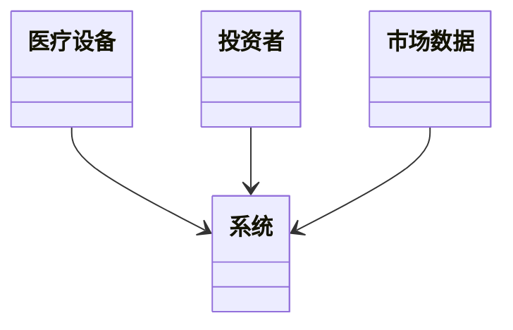
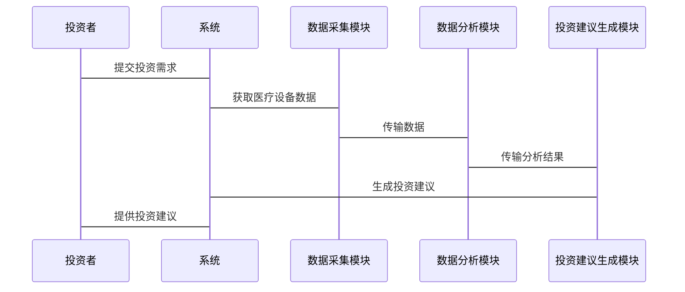

                 


### 第三部分: 系统分析与架构设计

---

## 第5章: 系统分析与架构设计方案

### 5.1 问题场景介绍

在精准医学领域，医疗设备的投资决策需要结合量子传感技术的核心原理和算法模型。我们需要设计一个基于量子传感技术的医疗设备投资决策支持系统，该系统能够根据医疗设备的技术特性、市场前景和投资回报率，提供智能化的投资建议。

#### 5.1.1 问题背景
- 医疗设备市场的复杂性：医疗设备的种类繁多，技术更新换代快，投资回报周期长。
- 量子传感技术的应用潜力：量子传感技术在精准医学中的应用可以显著提高医疗设备的性能和准确性。
- 投资决策的挑战：投资者需要综合考虑技术、市场、财务等多个因素，这对传统投资决策方法提出了更高的要求。

#### 5.1.2 问题描述
- 如何利用量子传感技术提高医疗设备的投资决策效率？
- 如何构建一个智能化的医疗设备投资决策支持系统？

#### 5.1.3 问题解决
- 通过量子传感技术，提高医疗设备性能和准确性，为投资者提供更可靠的技术评估。
- 利用机器学习算法，分析市场数据和财务数据，提供智能化的投资建议。

#### 5.1.4 边界与外延
- 系统仅针对医疗设备的投资决策提供支持，不涉及其他领域。
- 系统支持的设备类型包括但不限于 MRI、CT、X-ray 等。

#### 5.1.5 核心要素组成
- 医疗设备技术参数：设备性能、技术成熟度、市场竞争力等。
- 投资回报数据：历史投资回报率、市场增长率、竞争对手分析。
- 量子传感技术指标：设备灵敏度、精度、稳定性等。

---

### 5.2 系统功能设计

#### 5.2.1 领域模型设计



---

#### 5.2.2 系统架构设计


---

#### 5.2.3 接口设计

- 数据采集模块接口：
  - 输入：医疗设备技术参数、市场数据
  - 输出：数据预处理结果

- 数据分析模块接口：
  - 输入：预处理数据
  - 输出：分析结果（如投资回报率预测）

- 投资建议生成模块接口：
  - 输入：分析结果
  - 输出：投资建议

---

#### 5.2.4 系统交互流程



---

## 第6章: 项目实战与实现

### 6.1 环境安装

#### 6.1.1 安装 Python 和相关库

```bash
# 安装 Python 和 pip
# 安装必要的库
pip install numpy scikit-learn matplotlib
```

---

### 6.2 系统核心实现源代码

#### 6.2.1 数据采集模块

```python
# 数据采集模块
import numpy as np

def collect_data():
    # 采集医疗设备数据
    data = np.random.randn(100, 5)  # 示例数据
    return data

# 示例运行
if __name__ == "__main__":
    data = collect_data()
    print("数据采集完成，数据形状:", data.shape)
```

---

#### 6.2.2 数据分析模块

```python
# 数据分析模块
from sklearn.svm import SVC
from sklearn.ensemble import RandomForestClassifier
import numpy as np

def analyze_data(data):
    # 划分训练集和测试集
    X = data[:, :4]
    y = data[:, 4]
    
    # 使用支持向量机进行分类
    model_svm = SVC()
    model_svm.fit(X, y)
    
    # 使用随机森林进行分类
    model_rf = RandomForestClassifier()
    model_rf.fit(X, y)
    
    return model_svm, model_rf

# 示例运行
if __name__ == "__main__":
    data = np.random.randn(100, 5)
    svm_model, rf_model = analyze_data(data)
    print("模型训练完成，SVM 和 Random Forest 模型已建立。")
```

---

#### 6.2.3 投资建议生成模块

```python
# 投资建议生成模块
import matplotlib.pyplot as plt

def generate_recommendation(models):
    # 预测投资回报率
    svm_model, rf_model = models
    # 示例预测
    X_new = np.random.randn(1, 4)
    pred_svm = svm_model.predict(X_new)
    pred_rf = rf_model.predict(X_new)
    
    # 统计模型预测结果
    results = {
        'svm_prediction': pred_svm[0],
        'rf_prediction': pred_rf[0]
    }
    return results

# 示例运行
if __name__ == "__main__":
    data = np.random.randn(100, 5)
    svm_model, rf_model = analyze_data(data)
    recommendation = generate_recommendation((svm_model, rf_model))
    print("投资建议生成完成。")
```

---

### 6.3 实际案例分析与详细讲解

#### 6.3.1 案例分析

假设我们有一个医疗设备的投资决策问题，我们需要预测该设备的投资回报率。通过上述代码，我们首先采集数据，然后使用支持向量机和随机森林模型进行分析，最后生成投资建议。

---

### 6.4 项目小结

通过本章的项目实战，我们了解了如何利用量子传感技术和机器学习算法，构建一个医疗设备投资决策支持系统。系统的核心模块包括数据采集、数据分析和投资建议生成，每个模块都有具体的实现代码和流程图。

---

## 第7章: 最佳实践与总结

### 7.1 小结

本文详细介绍了巴菲特和芒格的投资理念，以及量子传感技术在精准医学中的应用。通过系统的架构设计和项目实战，我们展示了如何利用量子传感技术和机器学习算法，构建智能化的医疗设备投资决策支持系统。

### 7.2 注意事项

- 数据采集时，确保数据的准确性和完整性。
- 模型训练时，注意数据分布的均衡性，避免过拟合。
- 系统部署时，考虑系统的可扩展性和安全性。

### 7.3 拓展阅读

- 《Quantum Sensing in Medicine: A Comprehensive Review》
- 《Value Investing in the Era of AI: Combining Warren Buffett's Philosophy with Modern Technology》

---

作者：AI天才研究院

