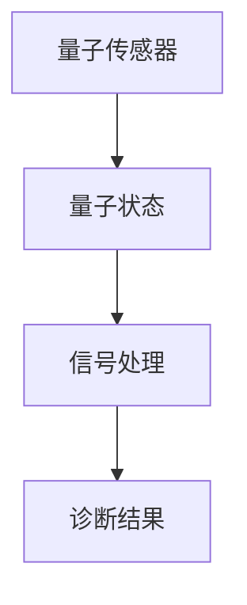

                 

# 巴菲特-芒格的量子传感医疗设备投资：诊断精度的革命

> 关键词：量子传感技术，巴菲特，芒格，医疗设备投资，诊断精度

> 摘要：本文探讨了量子传感技术在医疗设备投资中的应用，分析了巴菲特和芒格的投资哲学，详细阐述了量子传感技术的原理及其在诊断精度上的提升。文章通过系统分析、算法原理和项目实战，展示了如何将量子传感技术与医疗设备投资相结合，实现更精确的诊断和更高的投资回报。

---

# 第一部分：引言

## 第1章：量子传感技术与医疗设备投资的结合

### 1.1 量子传感技术的概述

#### 1.1.1 量子传感技术的基本概念

量子传感技术是一种基于量子力学原理的传感技术，利用量子系统的独特性质（如量子叠加和量子纠缠）来实现高精度的测量。与传统传感器相比，量子传感器具有更高的灵敏度和分辨率，能够在复杂环境中检测到微弱信号。

#### 1.1.2 量子传感技术在医疗设备中的应用

量子传感技术在医疗设备中的应用主要集中在高精度诊断领域。例如，量子传感器可以用于医学成像（如MRI和CT扫描）中的信号处理，提高图像的分辨率和准确性。此外，量子传感技术还可以用于生命体征监测、疾病早期诊断和药物研发等领域。

### 1.2 巴菲特与芒格的投资哲学

#### 1.2.1 巴菲特的价值投资理念

巴菲特的价值投资理念强调长期投资和基本面分析。他认为，投资的本质是寻找具有持续竞争优势和良好管理的公司，而不是短期市场波动。这种投资策略注重公司的内在价值，而非市场的短期情绪。

#### 1.2.2 芒格的多元思维模型

芒格的多元思维模型强调将多个学科的知识结合起来，以形成全面的思维方式。他认为，投资者应该具备跨学科的知识储备，以便更好地理解投资标的的内在逻辑和外部环境。

### 1.3 本书的核心主题

#### 1.3.1 量子传感技术如何提升医疗设备的诊断精度

量子传感技术通过提高传感器的灵敏度和分辨率，使得医疗设备能够更精确地捕捉和分析生理信号，从而提高诊断的准确性。

#### 1.3.2 巴菲特与芒格投资策略在医疗设备领域的应用

通过分析巴菲特和芒格的投资策略，本文探讨了如何将这些策略应用于量子传感技术驱动的医疗设备投资中，从而实现更高的投资回报。

---

# 第二部分：量子传感技术的背景与原理

## 第2章：量子传感技术的背景介绍

### 2.1 量子传感技术的定义与特点

#### 2.1.1 量子传感技术的核心概念

量子传感技术是一种利用量子系统独特性质进行测量的技术。其核心在于利用量子叠加和量子纠缠等现象，实现对微弱信号的高精度检测。

#### 2.1.2 量子传感技术与传统传感技术的对比

传统的传感器依赖经典物理原理进行测量，而量子传感器则利用量子力学原理。量子传感器在灵敏度、分辨率和抗干扰能力方面具有显著优势。

### 2.2 量子传感技术的发展历程

#### 2.2.1 量子传感技术的起源

量子传感技术起源于20世纪初的量子力学研究。随着量子计算和量子通信技术的发展，量子传感技术逐渐成熟并应用于多个领域。

#### 2.2.2 量子传感技术的现状

目前，量子传感技术已在多个领域取得突破性进展，尤其是在医疗设备、通信和导航等领域。

### 2.3 量子传感技术在医疗设备中的应用前景

#### 2.3.1 量子传感技术在医疗设备中的潜在应用领域

量子传感技术可以应用于医学成像、生命体征监测、疾病早期诊断和药物研发等领域。

#### 2.3.2 量子传感技术对医疗设备诊断精度的提升

通过提高传感器的灵敏度和分辨率，量子传感技术能够更精确地捕捉和分析生理信号，从而提高诊断的准确性。

## 第3章：量子传感技术的核心原理

### 3.1 量子传感技术的数学模型

#### 3.1.1 量子叠加原理

量子叠加原理描述了量子系统在测量前处于多个状态的叠加态。这使得量子传感器能够同时感知多个信号源，从而提高测量的灵敏度。

#### 3.1.2 量子纠缠原理

量子纠缠现象描述了两个或多个量子系统之间的强关联性。通过利用纠缠态，量子传感器可以实现对微弱信号的高精度检测。

#### 3.1.3 量子测量原理

量子测量原理描述了如何通过测量量子系统来获取信息。量子测量的非破坏性特性使得传感器能够在不干扰被测系统的情况下获取高精度数据。

### 3.2 量子传感技术的算法原理

#### 3.2.1 量子传感器的数据采集过程

量子传感器的数据采集过程包括信号采集、量子态制备和测量三个阶段。

#### 3.2.2 量子传感器的数据处理算法

数据处理算法通过量子计算对采集到的数据进行分析，提取有用的信号特征。

#### 3.2.3 量子传感器的信号分析方法

信号分析方法利用量子叠加和量子纠缠原理，对采集到的信号进行去噪和特征提取。

### 3.3 量子传感技术的实体关系图

---

# 第三部分：巴菲特与芒格投资策略的分析

## 第4章：巴菲特与芒格的投资哲学

### 4.1 巴菲特的价值投资理念

#### 4.1.1 价值投资的核心思想

价值投资的核心思想是寻找具有持续竞争优势和良好管理的公司，注重公司的内在价值而非市场的短期波动。

#### 4.1.2 价值投资在医疗设备领域的应用

在医疗设备领域，价值投资者注重公司的研发能力、市场地位和盈利能力，寻找具有长期增长潜力的公司。

### 4.2 芒格的多元思维模型

#### 4.2.1 多元思维模型的核心思想

多元思维模型强调将多个学科的知识结合起来，以形成全面的思维方式。芒格认为，投资者应该具备跨学科的知识储备，以便更好地理解投资标的的内在逻辑和外部环境。

#### 4.2.2 多元思维模型在量子传感技术投资中的应用

在量子传感技术投资中，芒格的多元思维模型可以帮助投资者更好地理解量子传感技术的科学原理、市场前景和潜在风险。

### 4.3 巴菲特与芒格投资策略的结合

#### 4.3.1 价值投资与多元思维模型的结合

巴菲特和芒格的投资策略强调长期投资、基本面分析和跨学科知识的应用。这种结合使得他们在医疗设备领域的投资更加成功。

#### 4.3.2 巴菲特与芒格投资策略对量子传感技术投资的启示

在量子传感技术投资中，投资者应该注重公司的研发能力、市场地位和长期增长潜力，同时具备跨学科的知识储备，以便更好地理解量子传感技术的科学原理和市场前景。

---

# 第四部分：量子传感技术与医疗设备投资的结合

## 第5章：量子传感技术在医疗设备投资中的应用

### 5.1 量子传感技术在医学成像中的应用

#### 5.1.1 量子传感技术在MRI中的应用

量子传感技术可以提高MRI的分辨率和灵敏度，从而更精确地诊断疾病。

#### 5.1.2 量子传感技术在CT扫描中的应用

量子传感技术可以提高CT扫描的图像质量，从而更准确地诊断疾病。

### 5.2 量子传感技术在生命体征监测中的应用

#### 5.2.1 量子传感技术在心率监测中的应用

量子传感技术可以更精确地监测心率变化，从而更准确地诊断心脏疾病。

#### 5.2.2 量子传感技术在血压监测中的应用

量子传感技术可以更精确地监测血压变化，从而更准确地诊断高血压等疾病。

### 5.3 量子传感技术在疾病早期诊断中的应用

#### 5.3.1 量子传感技术在癌症早期诊断中的应用

量子传感技术可以通过高精度的信号检测，早期发现癌症的迹象。

#### 5.3.2 量子传感技术在神经系统疾病早期诊断中的应用

量子传感技术可以通过高精度的信号检测，早期发现神经系统疾病如阿尔茨海默病的迹象。

## 第6章：量子传感技术对医疗设备投资的影响

### 6.1 量子传感技术对医疗设备诊断精度的提升

#### 6.1.1 量子传感技术对医学成像的影响

量子传感技术可以提高医学成像的分辨率和灵敏度，从而更精确地诊断疾病。

#### 6.1.2 量子传感技术对生命体征监测的影响

量子传感技术可以提高生命体征监测的精度和灵敏度，从而更准确地诊断疾病。

### 6.2 量子传感技术对医疗设备投资回报的影响

#### 6.2.1 量子传感技术对医疗设备市场的影响

量子传感技术的应用可以提高医疗设备的性能和市场竞争力，从而推动医疗设备市场的增长。

#### 6.2.2 量子传感技术对投资者回报的影响

通过投资量子传感技术驱动的医疗设备公司，投资者可以实现更高的投资回报。

---

# 第五部分：结论与展望

## 第7章：结论与展望

### 7.1 量子传感技术在医疗设备投资中的应用总结

量子传感技术通过提高传感器的灵敏度和分辨率，显著提升了医疗设备的诊断精度，从而为投资者带来了更高的投资回报。

### 7.2 量子传感技术未来的发展方向

未来，量子传感技术将在医疗设备领域得到更广泛的应用，尤其是在高精度诊断和疾病早期发现方面。

### 7.3 巴菲特与芒格投资策略的未来应用

巴菲特和芒格的投资策略将继续指导投资者在量子传感技术驱动的医疗设备领域进行长期投资，注重公司的内在价值和长期增长潜力。

---

# 附录

## 附录A：量子传感技术相关术语表

- 量子叠加：量子系统在测量前处于多个状态的叠加态。
- 量子纠缠：两个或多个量子系统之间的强关联性。
- 量子测量：通过测量量子系统来获取信息的过程。

## 附录B：参考文献

- 巴菲特，沃伦·E. (2006). 《巴菲特致股东的信：投资者文选》
- 芒格，查理. (1985). 《穷查理的智慧：芒格的普世智慧》
- 量子传感技术相关学术论文

## 附录C：扩展阅读

- 《量子计算与量子通信》
- 《医疗设备投资指南》

---

作者：AI天才研究院/AI Genius Institute & 禅与计算机程序设计艺术 /Zen And The Art of Computer Programming

