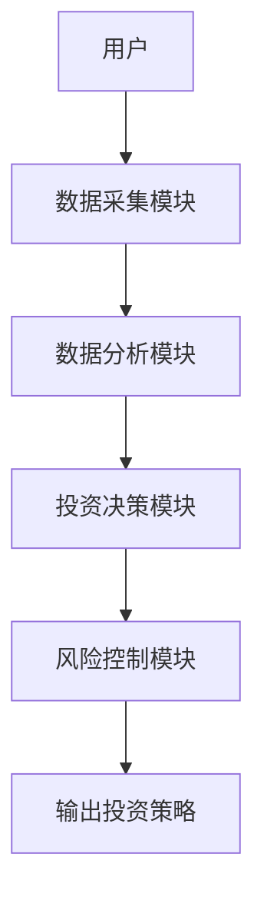

                 


# 巴菲特-芒格的量子加密货币投资：未来金融的安全基石

---

## 关键词
- 巴菲特投资理念
- 量子加密货币
- 金融安全
- 数字经济
- 量子计算

---

## 摘要
本文探讨了巴菲特和芒格的投资理念如何与量子加密货币相结合，分析了量子加密货币的技术基础、优势以及其在未来金融体系中的潜力。通过详细的技术分析和系统设计，本文揭示了量子加密货币如何成为未来金融的安全基石。

---

# 第一部分：巴菲特与芒格的投资理念

## 第1章：巴菲特与芒格的投资哲学

### 1.1 巴菲特的价值投资理念

#### 1.1.1 价值投资的定义与核心原则
价值投资是一种长期投资策略，强调以低于内在价值的价格购买优质资产。巴菲特的核心原则包括：
- **安全边际**：购买价格远低于内在价值。
- **长期视角**：关注企业的长期盈利能力。
- **优质企业**：选择具有强大竞争优势的企业。

#### 1.1.2 巴菲特的投资策略与成功案例
巴菲特的投资策略以长期持有优质股票为主，成功的案例包括可口可乐、苹果和比亚迪等。他的策略强调对企业基本面的深入分析和长期价值的判断。

#### 1.1.3 芒格的多元思维模型
芒格提倡通过多个学科的交叉视角（物理学、心理学、经济学等）来理解问题，形成多元思维模型。这种思维方式帮助投资者避免认知偏差，做出更明智的投资决策。

---

### 1.2 巴菲特与芒格投资理念的现代演变

#### 1.2.1 数字经济与金融创新的背景
随着数字经济的发展，传统金融体系面临效率和安全的双重挑战。区块链、人工智能和量子计算等技术的兴起，为金融创新提供了新的可能性。

#### 1.2.2 投资理念的数字化转型
数字技术的应用正在改变传统投资方式。投资者需要将价值投资理念与新技术相结合，以应对数字化时代的挑战。

#### 1.2.3 量子加密货币的潜在影响
量子计算的出现可能颠覆传统加密货币的安全性。如何利用量子加密技术保护投资安全，成为未来的重要课题。

---

## 第2章：量子加密货币的背景与技术基础

### 2.1 量子计算与加密技术

#### 2.1.1 量子计算的基本原理
量子计算利用量子叠加和纠缠效应进行并行计算。与经典计算机相比，量子计算机在某些特定问题上具有指数级的计算优势。

#### 2.1.2 量子加密技术的现状与挑战
传统加密算法（如RSA）在量子计算机面前脆弱，而量子加密技术（如量子密钥分发QKD）被认为是未来的安全解决方案。

#### 2.1.3 传统加密货币的安全性分析
比特币等传统加密货币基于椭圆曲线加密，但随着量子计算的发展，其安全性可能受到威胁。

---

### 2.2 量子加密货币的核心技术

#### 2.2.1 量子密钥分发（QKD）的原理
QKD通过量子通信技术实现密钥的安全分发。其核心在于利用量子态的不可克隆性确保密钥的安全性。

#### 2.2.2 量子随机数生成器在加密中的应用
量子随机数生成器基于量子物理原理生成随机数，具有不可预测性，为加密算法提供高质量的随机输入。

#### 2.2.3 量子区块链技术的实现
量子区块链结合了区块链的去中心化特性和量子加密的安全性，可能成为未来金融体系的核心技术。

---

## 第3章：量子加密货币与传统金融的对比

### 3.1 传统金融体系的缺陷

#### 3.1.1 传统加密货币的局限性
传统加密货币面临交易速度慢、能耗高、监管不完善等问题。

#### 3.1.2 传统金融体系的效率问题
传统金融体系中的跨境支付、清算等流程效率低下，且成本高昂。

#### 3.1.3 传统金融体系的安全性挑战
传统加密货币的安全性依赖于经典算法，可能在量子计算时代被破解。

---

### 3.2 量子加密货币的优势

#### 3.2.1 高安全性与抗量子攻击能力
量子加密货币通过量子加密技术，具备抗量子攻击的能力，确保了数据的安全性。

#### 3.2.2 高效性与去中心化特性
量子区块链技术结合了去中心化和高效性，可能解决传统区块链的扩展性问题。

#### 3.2.3 量子加密货币的可扩展性
量子加密技术的引入，为加密货币的大规模应用提供了技术支持。

---

## 第4章：量子加密货币的数学模型与算法原理

### 4.1 量子加密算法的数学基础

#### 4.1.1 量子叠加与纠缠的数学表示
量子叠加可以用向量空间中的向量表示，而纠缠态则通过张量积的形式描述。

#### 4.1.2 量子加密算法的数学模型
量子加密算法基于量子态的线性代数运算，通过矩阵变换实现加密和解密。

#### 4.1.3 量子加密算法的复杂度分析
量子算法的复杂度通常低于经典算法，尤其是在某些特定问题上。

---

### 4.2 量子加密算法的实现

#### 4.2.1 量子密钥分发的实现流程
1. **量子态生成**：发送方生成随机量子态。
2. **量子态传输**：通过量子通信网络传输量子态。
3. **基底协商**：双方协商测量基底。
4. **密钥提取**：根据测量结果提取密钥。

#### 4.2.2 量子随机数生成器的实现
通过量子噪声测量生成随机数，确保随机数的不可预测性。

---

## 第5章：系统架构设计

### 5.1 量子加密货币投资系统的功能设计

#### 5.1.1 系统功能模块
- 数据采集模块：收集市场数据和量子态信息。
- 数据分析模块：利用量子算法进行数据分析。
- 投资决策模块：基于分析结果生成投资策略。
- 风险控制模块：实时监控和调整投资组合。

#### 5.1.2 系统架构图


---

## 第6章：项目实战

### 6.1 量子加密货币投资系统的实现

#### 6.1.1 环境安装
- 安装量子计算开发环境（如Qiskit）。
- 配置量子通信模块。

#### 6.1.2 核心代码实现
```python
from qiskit import QuantumCircuit, execute, Aer

# 创建量子电路
qc = QuantumCircuit(2, 2)
qc.h(0)
qc.cx(0, 1)
qc.measure(0, 0)
qc.measure(1, 1)

# 执行量子计算
simulator = Aer.get_backend('qasm_simulator')
job = execute(qc, simulator)
result = job.result()
print(result.counts)
```

---

## 第7章：总结与展望

### 7.1 总结
量子加密货币结合了巴菲特和芒格的投资理念，具备传统金融体系无法比拟的优势。其安全性、高效性和可扩展性使其成为未来金融体系的核心技术。

### 7.2 未来展望
随着量子计算的成熟，量子加密货币将在金融领域发挥更大的作用。投资者需要紧跟技术发展，抓住量子加密货币带来的投资机遇。

---

## 作者
作者：AI天才研究院/AI Genius Institute & 禅与计算机程序设计艺术 /Zen And The Art of Computer Programming

