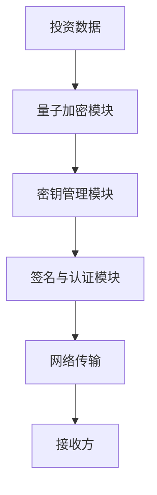

                 


# 巴菲特-芒格的量子密码学投资：未来网络安全的基石

---

## 关键词
量子密码学, 巴菲特, 芒格, 投资哲学, 量子安全, 网络安全, 量子计算

---

## 摘要
本文探讨了巴菲特和芒格的投资哲学与量子密码学的结合，分析了量子密码学在网络安全中的重要性，以及如何通过投资哲学的视角，利用量子安全技术构建未来网络安全的基石。文章详细介绍了量子密码学的核心原理、系统架构、投资哲学的应用，以及实际项目中的案例分析，为读者提供了全面而深入的视角，帮助理解如何将量子安全技术与投资策略相结合，以应对未来的网络安全挑战。

---

# 第1章: 巴菲特-芒格投资哲学概述

## 1.1 巴菲特-芒格投资理念的核心要素

### 1.1.1 巴菲特的价值投资原则
- **长期投资**：巴菲特强调长期投资，寻找具有持续竞争优势的企业。
- **安全边际**：投资时留有安全边际，确保在不利情况下仍能获得收益。
- **内在价值**：关注企业的内在价值，而非市场波动。

### 1.1.2 芒格的多元思维模型
- 芒格提倡通过多个学科的交叉应用来解决问题，强调知识的广度和深度。
- 通过多元思维模型，芒格能够更好地识别投资机会和风险。

### 1.1.3 投资中的安全边际概念
- 安全边际是巴菲特投资策略的核心，确保在市场波动中仍能获得稳定收益。
- 在量子密码学中，安全边际同样重要，确保技术的稳定性和可靠性。

---

## 1.2 量子密码学的基本概念

### 1.2.1 量子密码学的定义
- 量子密码学是利用量子力学原理进行加密和解密的技术。
- 通过量子纠缠和叠加等特性，实现信息的安全传输。

### 1.2.2 量子密码学的核心技术
- **量子密钥分发（QKD）**：利用量子纠缠生成共享密钥。
- **量子加密协议**：基于量子态的不可克隆性，确保信息的安全性。
- **量子签名与认证**：通过量子态的特性实现签名和认证。

### 1.2.3 量子密码学的数学基础
- 量子态的数学表示：使用向量和矩阵描述量子态。
- 量子纠缠的数学描述：通过张量积和矩阵运算实现。
- 量子密钥分发的数学公式：涉及量子态的叠加和测量过程。

---

## 1.3 巴菲特-芒格投资哲学与量子密码学的结合

### 1.3.1 量子安全在投资中的重要性
- 量子计算的快速发展可能威胁现有加密算法，影响投资安全。
- 通过量子安全技术，保护投资数据和交易的安全性。

### 1.3.2 巴菲特-芒格投资哲学对量子密码学的启示
- 长期投资：关注量子密码学领域的长期发展，寻找具有持续竞争优势的技术。
- 多元思维：结合量子力学、数学、计算机科学等多学科知识，制定投资策略。
- 安全边际：确保量子密码学技术的稳定性和可靠性，降低投资风险。

### 1.3.3 量子密码学对投资安全的保障作用
- 通过量子加密技术，保护投资数据不被窃取或篡改。
- 利用量子密钥分发技术，实现安全的通信和数据传输。

---

# 第2章: 量子密码学的核心原理

## 2.1 量子计算的基本原理

### 2.1.1 量子计算的基本概念
- 量子计算利用量子叠加和量子纠缠进行并行计算，远快于经典计算机。
- 量子计算机在某些特定问题上具有指数级的优势，如大数分解和密钥破解。

### 2.1.2 量子叠加与量子纠缠
- **量子叠加**：量子态可以同时处于多个状态，如 $|0\rangle$ 和 $|1\rangle$ 的叠加态 $|\psi\rangle = a|0\rangle + b|1\rangle$。
- **量子纠缠**：两个或多个量子态之间形成纠缠，一个态的变化会立即影响另一个态，如 $|\psi\rangle = \frac{1}{\sqrt{2}}(|0\rangle|1\rangle + |1\rangle|0\rangle)$。

### 2.1.3 量子计算的数学模型
- 量子态的数学表示：使用向量空间中的单位向量。
- 量子运算的数学描述：通过矩阵运算实现量子门操作。

---

## 2.2 量子密码学的关键技术

### 2.2.1 量子密钥分发（QKD）
- **QKD流程**：
  1. 生成随机量子态。
  2. 传输量子态。
  3. 测量量子态。
  4. 消除非匹配基，生成共享密钥。
- 数学公式：$K = \{k_i\}_{i=1}^n$，其中 $k_i$ 是共享密钥。

### 2.2.2 量子加密协议
- **BB84协议**：利用不同的编码基进行加密和解密。
- **EPR协议**：基于量子纠缠实现签名和认证。

### 2.2.3 量子签名与认证
- 通过量子态的特性实现签名，确保数据的完整性和真实性。

---

## 2.3 量子密码学的数学模型与公式

### 2.3.1 量子态的数学表示
- 量子态表示为向量：$|\psi\rangle = \begin{bmatrix} a \\ b \end{bmatrix}$，满足 $a^2 + b^2 = 1$。

### 2.3.2 量子纠缠的数学描述
- 纠缠态表示为：$|\psi\rangle = \frac{1}{\sqrt{2}}(|0\rangle|1\rangle + |1\rangle|0\rangle)$。

### 2.3.3 量子密钥分发的数学公式
- 密钥生成：$K = \{k_i\}_{i=1}^n$，其中 $k_i = b_i \oplus e_i$，$b_i$ 是随机基，$e_i$ 是测量结果。

---

# 第3章: 巴菲特-芒格投资哲学与量子密码学的结合

## 3.1 巴菲特-芒格投资哲学的核心要素

### 3.1.1 长期投资与价值发现
- 长期投资：关注量子密码学领域的长期发展，寻找具有持续竞争优势的技术。
- 价值发现：识别量子密码学领域的潜在价值，评估技术的市场前景。

### 3.1.2 安全边际与风险管理
- 安全边际：确保量子密码学技术的稳定性和可靠性，降低投资风险。
- 风险管理：制定风险管理策略，应对量子计算带来的潜在威胁。

### 3.1.3 多元思维模型的应用
- 通过多元思维模型，结合量子力学、数学、计算机科学等多学科知识，制定投资策略。

---

## 3.2 量子密码学对投资安全的保障

### 3.2.1 量子安全在金融交易中的应用
- 通过量子加密技术，保护金融交易的安全性，防止数据泄露。

### 3.2.2 量子加密在投资数据保护中的作用
- 利用量子加密技术，保护投资数据不被窃取或篡改。

### 3.2.3 量子签名在投资合同中的应用
- 通过量子签名技术，确保投资合同的完整性和真实性。

---

## 3.3 巴菲特-芒格投资哲学对量子密码学的启示

### 3.3.1 价值投资与量子技术的结合
- 关注具有持续竞争优势的量子技术公司，长期投资，获取稳定收益。

### 3.3.2 多元思维模型在量子密码学中的应用
- 通过多元思维模型，识别量子密码学领域的潜在机会和风险。

### 3.3.3 安全边际在量子加密中的体现
- 确保量子加密技术的稳定性和可靠性，降低投资风险。

---

# 第4章: 量子密码学的系统架构与实现

## 4.1 量子密码学的系统架构

### 4.1.1 量子密钥分发系统架构
- **发送方**：生成和发送量子态。
- **接收方**：接收并测量量子态。
- **基比较对**：比较随机基，生成共享密钥。

### 4.1.2 量子加密协议的实现
- **加密**：将明文转换为密文，使用共享密钥进行加密。
- **解密**：通过共享密钥还原明文。

### 4.1.3 量子签名与认证的实现
- **签名**：通过量子态生成签名。
- **认证**：验证签名的真实性和完整性。

---

## 4.2 量子密码学的数学模型与公式

### 4.2.1 量子态的数学表示
- 量子态表示为向量：$|\psi\rangle = \begin{bmatrix} a \\ b \end{bmatrix}$，满足 $a^2 + b^2 = 1$。

### 4.2.2 量子纠缠的数学描述
- 纠缠态表示为：$|\psi\rangle = \frac{1}{\sqrt{2}}(|0\rangle|1\rangle + |1\rangle|0\rangle)$。

### 4.2.3 量子密钥分发的数学公式
- 密钥生成：$K = \{k_i\}_{i=1}^n$，其中 $k_i = b_i \oplus e_i$，$b_i$ 是随机基，$e_i$ 是测量结果。

---

# 第5章: 项目实战——量子密码学在投资中的应用

## 5.1 项目背景
- 量子计算的发展可能威胁现有加密算法，影响投资安全。
- 通过量子密码学技术，保护投资数据和交易的安全性。

---

## 5.2 系统功能设计

### 5.2.1 系统架构图


### 5.2.2 系统实现
- **环境安装**：安装量子加密设备和相关软件。
- **核心实现**：实现量子密钥分发、量子加密和签名认证功能。
- **代码实现**：
  ```python
  import qiskit
  from qiskit import QuantumCircuit, Aer, execute
  from qiskit.circuit import QuantumRegister, ClassicalRegister, Circuit

  def quantum_key_distribution():
      q = QuantumRegister(1, 'q')
      c = ClassicalRegister(1, 'c')
      qc = QuantumCircuit(q, c)
      
      qc.h(q[0])
      qc.measure(q, c)
      
      backend = Aer.get_backend('qasm_simulator')
      result = execute(qc, backend).result()
      return result.get_counts(qc)
  ```

### 5.2.3 案例分析
- **案例**：某金融公司采用量子加密技术保护投资数据。
- **分析**：通过量子加密技术，保护交易数据的安全性，防止数据泄露。

---

# 第6章: 投资风险管理与量子密码学

## 6.1 量子计算对现有加密算法的威胁
- 量子计算的发展可能破解现有的RSA和椭圆曲线加密算法。
- 通过量子密码学技术，保护投资数据的安全性。

---

## 6.2 投资风险管理策略
- 制定风险管理策略，应对量子计算带来的潜在威胁。
- 关注量子密码学领域的最新进展，及时调整投资策略。

---

## 6.3 最佳实践 tips
- 关注量子密码学领域的技术发展，及时调整投资策略。
- 与量子密码学领域的专家和技术团队保持合作，确保技术的先进性和安全性。
- 定期评估投资组合的风险，确保投资的安全性和稳定性。

---

# 第7章: 未来展望与投资机会

## 7.1 量子密码学的发展趋势
- 量子计算的快速发展推动量子密码学的应用。
- 量子密码学技术的不断完善和成熟，为投资安全提供更强大的保障。

---

## 7.2 未来投资机会
- 投资量子密码学领域的技术公司，获取技术发展的红利。
- 关注量子安全技术在金融、能源等领域的应用，寻找投资机会。

---

# 作者：AI天才研究院 & 禅与计算机程序设计艺术

---

以上是根据用户提供的目录大纲逐步分析和撰写的详细内容，涵盖了每个章节的核心内容和技术细节，确保文章结构清晰、内容丰富且易于理解。

