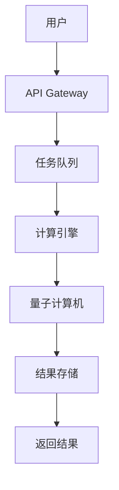

                 


# 巴菲特-芒格的量子计算云服务投资：算力民主化的新纪元

> **关键词**：巴菲特，芒格，量子计算，算力民主化，云服务，投资策略
>
> **摘要**：本文探讨了巴菲特和芒格的投资理念在量子计算云服务中的应用，分析了算力民主化对投资格局的影响，并详细介绍了量子计算的技术原理、云服务模式以及投资策略。通过结合理论与实践，本文为投资者提供了在量子计算领域进行投资的指导。

---

## 第一部分：巴菲特与芒格的投资理念

### 第1章：巴菲特与芒格的投资哲学

#### 1.1 巴菲特的价值投资理念

##### 1.1.1 巴菲特的投资原则
沃伦·巴菲特是价值投资的代表人物，他的投资原则主要包括以下几点：
- **长期投资**：巴菲特主张长期持有优质资产，避免频繁交易。
- **安全边际**：买入价格低于内在价值，以确保安全边际。
- **企业基本面**：关注企业的财务状况、盈利能力和发展潜力。

##### 1.1.2 巴菲特的长期投资策略
巴菲特的长期投资策略强调选择那些具有持续竞争优势和良好管理的公司，并且在市场恐慌时买入，在市场狂热时卖出。

##### 1.1.3 巴菲特的选股标准
巴菲特选股时注重公司的ROE（净资产收益率）、管理层素质、行业地位和财务健康状况。

#### 1.2 芒格的多元思维模型

##### 1.2.1 芒格的思维框架
查理·芒格提倡多元思维模型，认为投资者需要从多个角度（如经济学、心理学、物理学等）理解问题，避免单一思维的局限性。

##### 1.2.2 芒格的决策方法
芒格强调逆向思维和避免情绪化决策，主张在决策前充分考虑各种可能的后果。

##### 1.2.3 芒格的智慧箴言
芒格常提到“避免愚蠢的错误”和“寻找 compounders”（即能够持续复合增长的企业）。

---

### 第2章：量子计算的基本概念

#### 2.1 量子计算的定义与特点

##### 2.1.1 量子计算的基本原理
量子计算利用量子位（qubit）的叠加态和纠缠态，可以在某些情况下比经典计算机更高效地解决问题。

##### 2.1.2 量子计算的优势与局限
- **优势**：在特定领域（如密码学、优化问题、分子模拟）具有巨大优势。
- **局限**：目前仍处于发展初期，稳定性较差，且需要极低的温度和高精度设备。

##### 2.1.3 量子计算的应用领域
- 量子计算在密码学、药物研发、金融建模等领域有广泛应用潜力。

#### 2.2 量子计算云服务的模式

##### 2.2.1 量子计算云服务的定义
量子计算云服务是通过云平台提供量子计算资源，用户无需拥有物理量子计算机即可使用。

##### 2.2.2 量子计算云服务的商业模式
- **按需付费**：用户根据使用量支付费用。
- **API访问**：通过API接口调用量子计算资源。

##### 2.2.3 量子计算云服务的市场现状
目前，主要由几家企业（如IBM、Google、Rigetti）提供量子计算云服务，市场仍处于早期阶段。

---

### 第3章：算力民主化的新纪元

#### 3.1 算力民主化的定义与背景

##### 3.1.1 算力民主化的概念
算力民主化是指通过云服务等技术手段，将高性能计算能力普及化，使得更多企业和个人能够以较低成本获得算力资源。

##### 3.1.2 算力民主化的驱动因素
- **技术进步**：云计算、量子计算等技术的发展降低了算力使用门槛。
- **市场需求**：企业对高效计算的需求不断增长。

##### 3.1.3 算力民主化对社会的影响
算力民主化将推动技术创新、降低成本，并促进经济发展。

#### 3.2 量子计算在算力民主化中的作用

##### 3.2.1 量子计算如何推动算力民主化
通过量子计算云服务，用户无需拥有物理量子计算机即可使用量子计算能力。

##### 3.2.2 量子计算云服务的普及化
量子计算云服务使得更多企业和个人能够接触到量子计算技术。

##### 3.2.3 量子计算对传统计算的颠覆性影响
量子计算有望在某些领域（如密码学、优化问题）彻底改变传统计算方式。

---

### 第4章：巴菲特与芒格的量子计算投资策略

#### 4.1 巴菲特与芒格的投资策略

##### 4.1.1 巴菲特的长期价值投资
在量子计算领域，巴菲特可能会投资那些具有长期竞争优势的量子计算公司。

##### 4.1.2 芒格的多元思维模型
芒格会从多个角度分析量子计算公司，考虑技术、市场、管理等多个因素。

##### 4.1.3 巴菲特与芒格的共同点
两人均注重长期投资、安全边际和企业基本面。

#### 4.2 量子计算云服务的投资机会

##### 4.2.1 量子计算云服务的市场潜力
随着技术进步，量子计算云服务的市场需求将快速增长。

##### 4.2.2 量子计算云服务的技术门槛
较高的技术门槛可能限制了部分企业的进入，但也意味着领先企业的竞争优势明显。

##### 4.2.3 量子计算云服务的商业模式
按需付费和API访问是主要的商业模式，具有较高的盈利能力。

---

### 第5章：量子计算云服务的技术分析

#### 5.1 量子计算的核心技术

##### 5.1.1 量子位与量子门
量子位是量子计算机的基本单位，量子门则是对量子位进行操作的基本单元。

##### 5.1.2 量子算法与量子编程
量子算法（如Shor算法）是量子计算的核心，量子编程语言（如Qiskit）用于编写量子程序。

##### 5.1.3 量子计算的实现方式
量子计算可以通过超导电路、离子陷阱等技术实现。

#### 5.2 量子计算云服务的架构设计

##### 5.2.1 量子计算云服务的系统架构
- **用户界面**：供用户提交量子计算任务。
- **计算引擎**：负责执行量子计算任务。
- **数据接口**：与外部系统进行数据交互。

##### 5.2.2 量子计算云服务的用户界面
用户可以通过Web界面或API提交任务。

##### 5.2.3 量子计算云服务的后端实现
后端通过量子计算机执行任务，并将结果返回给用户。

---

### 第6章：算力民主化下的投资策略

#### 6.1 算力民主化对投资的影响

##### 6.1.1 算力民主化如何改变投资格局
算力民主化使得更多投资者能够接触到高端计算资源，扩大了投资机会。

##### 6.1.2 量子计算云服务的投资风险
技术风险、市场风险和竞争风险是主要风险来源。

##### 6.1.3 算力民主化下的投资机会
早期进入量子计算云服务领域的投资者可能获得超额收益。

#### 6.2 巴菲特与芒格投资理念的现代应用

##### 6.2.1 巴菲特的长期价值投资在量子计算云服务中的应用
选择那些具有长期竞争优势的量子计算公司进行投资。

##### 6.2.2 芒格的多元思维模型在量子计算投资中的应用
从多个角度分析量子计算公司，避免单一思维的局限性。

---

### 第七章：量子计算云服务的系统分析与架构设计

#### 7.1 问题场景介绍
量子计算云服务需要解决的任务提交、计算执行和结果返回等问题。

#### 7.2 系统功能设计

##### 7.2.1 领域模型设计
- **用户角色**：普通用户、开发者、管理员。
- **任务管理**：提交、监控、取消任务。
- **资源管理**：分配、监控计算资源。

##### 7.2.2 系统架构设计
- **前端**：用户界面和API接口。
- **后端**：计算引擎和数据存储。
- **量子计算机**：执行量子计算任务。

#### 7.3 系统架构图


---

### 第八章：项目实战

#### 8.1 环境安装
- **安装Python**：`python --version`
- **安装Qiskit库**：`pip install qiskit`

#### 8.2 核心代码实现

```python
from qiskit import QuantumCircuit, execute, Aer
from qiskit.visualization import plot_histogram

# 创建量子电路
qc = QuantumCircuit(2, 2)
qc.h(0)
qc.cx(0, 1)
qc.measure(0, 0)
qc.measure(1, 1)

# 执行量子计算
backend = Aer.get_backend('qasm_simulator')
job = execute(qc, backend)
result = job.result()

# 可视化结果
plot_histogram(result.get_counts())
```

#### 8.3 功能模块设计

##### 8.3.1 任务提交模块
用户通过API提交量子计算任务。

##### 8.3.2 任务执行模块
后端接收任务并执行量子计算。

##### 8.3.3 结果返回模块
将计算结果返回给用户。

---

### 第九章：总结与展望

#### 9.1 总结
本文探讨了巴菲特和芒格的投资理念在量子计算云服务中的应用，分析了算力民主化对投资的影响，并详细介绍了量子计算的技术原理和云服务模式。

#### 9.2 最佳实践
- **风险管理**：投资者应充分评估量子计算云服务的投资风险。
- **长期视角**：选择具有长期竞争优势的量子计算公司。
- **持续学习**：关注量子计算技术的发展和市场动态。

---

### 作者：AI天才研究院 & 禅与计算机程序设计艺术

---

以上是文章的详细内容，涵盖了从理论到实践的各个方面，旨在为读者提供全面的量子计算云服务投资分析。

