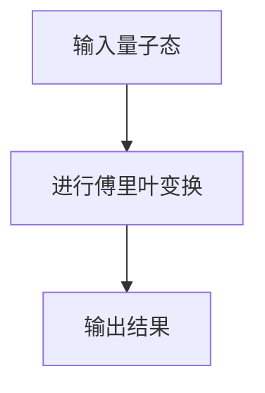
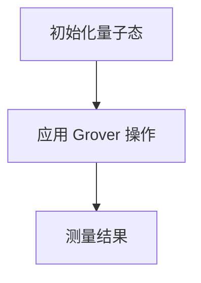
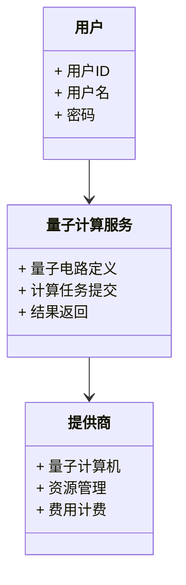
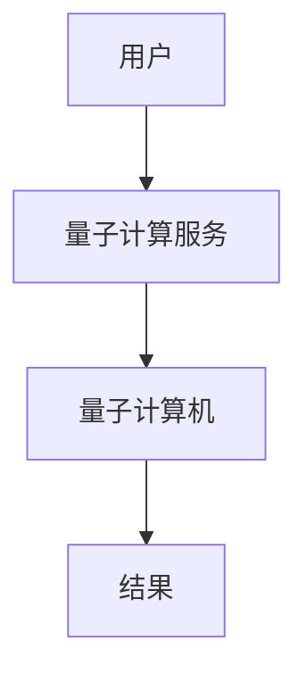
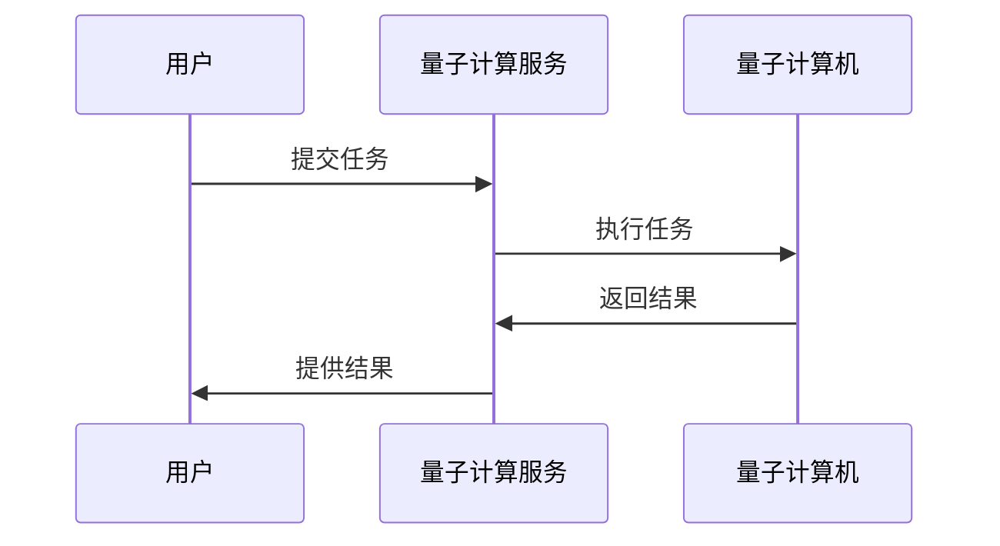

                 


# 巴菲特-芒格的量子计算云服务投资：计算能力民主化

> 关键词：巴菲特，芒格，量子计算，云服务，投资策略，计算能力民主化

> 摘要：本文深入分析了巴菲特和芒格在量子计算云服务领域的投资策略，探讨了量子计算与云计算的结合如何推动计算能力的民主化。通过详细的技术分析和投资策略的结合，本文揭示了量子计算云服务的潜力及其对社会和经济的深远影响。

---

## 第一部分: 巴菲特-芒格的量子计算云服务投资概述

### 第1章: 量子计算与云服务的结合

#### 1.1 量子计算的基本概念
##### 1.1.1 量子计算的定义
量子计算是一种基于量子力学原理的计算方式，利用量子叠加和量子纠缠的特性，能够在某些特定问题上远超经典计算机的计算能力。与经典计算机的二进制位不同，量子计算机使用量子位（qubit），可以在同一时间表示多个状态。

##### 1.1.2 量子计算的核心原理
量子计算的核心原理包括：
1. **量子叠加**：量子位可以同时处于多个状态的叠加态。
2. **量子纠缠**：多个量子位之间可以形成纠缠态，使得它们的状态紧密相关。
3. **量子测量**：测量会破坏量子态，但可以用来获取信息。

##### 1.1.3 量子计算与经典计算的区别
量子计算在处理某些特定问题（如因式分解、数据库搜索）时具有显著优势，但在通用计算任务上尚未完全超越经典计算机。

#### 1.2 云计算服务的商业模式
##### 1.2.1 云计算的基本概念
云计算是一种按需提供计算资源（如计算能力、存储、网络）的服务模式，用户只需支付使用的资源，无需自行维护基础设施。

##### 1.2.2 云计算的主要服务模式
1. **IaaS（基础设施即服务）**：提供虚拟机、存储等基础设施。
2. **PaaS（平台即服务）**：提供开发和部署平台。
3. **SaaS（软件即服务）**：提供应用程序。

##### 1.2.3 云计算的经济效益
云计算通过按需付费模式降低了企业的 IT 成本，提高了资源利用率。

#### 1.3 巴菲特-芒格投资理念的核心要素
##### 1.3.1 巴菲特的价值投资理论
巴菲特的价值投资理论强调长期投资、安全边际和公司基本面分析。

##### 1.3.2 芒格的多元思维模型
芒格的多元思维模型强调跨学科思考，将不同领域的知识结合起来，寻找投资机会。

##### 1.3.3 投资理念与量子计算的结合
巴菲特和芒格的投资理念与量子计算的结合，体现在对技术潜力和商业模式的深入分析上。

---

## 第2章: 量子计算云服务的背景与现状

### 2.1 量子计算技术的发展历程
#### 2.1.1 量子计算的历史回顾
量子计算的概念最早可以追溯到20世纪80年代，近年来随着技术进步，量子计算机的实现取得了一定进展。

#### 2.1.2 当前量子计算的技术瓶颈
目前量子计算仍面临稳定性差、纠错能力弱等问题，距离大规模应用还有一定距离。

#### 2.1.3 量子计算的未来发展趋势
随着技术进步，量子计算将在特定领域（如密码学、优化问题）发挥重要作用。

### 2.2 云计算服务的市场现状
#### 2.2.1 全球云计算市场的规模与增长
全球云计算市场持续增长，预计未来几年将保持高速发展的趋势。

#### 2.2.2 云计算服务的主要供应商
主要供应商包括亚马逊（AWS）、谷歌云、微软 Azure 等。

---

## 第3章: 量子计算云服务的核心概念与联系

### 3.1 量子计算与云计算的结合
#### 3.1.1 量子计算的基本原理
量子计算利用量子位的叠加和纠缠特性，可以在某些问题上实现指数级加速。

#### 3.1.2 云计算的商业模式
云计算通过按需提供资源，降低了量子计算的使用门槛。

#### 3.1.3 量子计算与云计算的结合
量子计算云服务将量子计算的能力通过云计算的方式提供给用户，实现了计算资源的民主化。

### 3.2 核心概念的属性对比
以下是量子计算和经典计算的对比：

| 属性         | 量子计算                | 经典计算                |
|--------------|------------------------|------------------------|
| 基础单位     | 量子位（qubit）         | 二进制位（bit）         |
| 并行能力     | 高，基于叠加态          | 低，串行处理为主        |
| 适用场景     | 因式分解、优化问题      | 通用计算任务            |

### 3.3 ER实体关系图
以下是量子计算云服务的实体关系图：

```mermaid
er
actor: 用户
service: 量子计算服务
provider: 量子计算提供商
```

---

## 第4章: 量子计算云服务的算法原理

### 4.1 量子傅里叶变换
#### 4.1.1 算法流程图


#### 4.1.2 算法实现
以下是量子傅里叶变换的Python代码示例：

```python
def quantum_fourier_transform(circuit):
    # 实现量子傅里叶变换的量子电路
    pass
```

#### 4.1.3 数学模型
量子傅里叶变换的数学模型可以表示为：

$$
F|x\rangle = \sum_{k=0}^{n-1} \omega^{k \cdot j} |k\rangle
$$

其中，$\omega$ 是单位根，$j$ 是指数。

### 4.2 Grover算法
#### 4.2.1 算法流程图


#### 4.2.2 算法实现
以下是Grover算法的Python代码示例：

```python
def grover_algorithm(circuit):
    # 实现 Grover 算法的量子电路
    pass
```

#### 4.2.3 数学模型
Grover算法的数学模型可以表示为：

$$
G|x\rangle = \sqrt{1 - \frac{M}{N}} |x\rangle + \sqrt{\frac{M}{N}} |s\rangle
$$

其中，$M$ 是目标状态的数量，$N$ 是总状态的数量，$|s\rangle$ 是所有目标状态的叠加态。

---

## 第5章: 量子计算云服务的系统分析与架构设计

### 5.1 问题场景介绍
量子计算云服务需要解决的问题包括资源分配、计算效率、用户隐私等。

### 5.2 系统功能设计
以下是量子计算云服务的系统功能设计：



### 5.3 系统架构设计
以下是量子计算云服务的系统架构设计：



### 5.4 系统接口设计
以下是系统接口设计：

1. 用户接口：提交量子计算任务。
2. 服务接口：接收任务并返回结果。
3. 计算接口：执行量子计算。

### 5.5 系统交互流程
以下是系统交互流程：



---

## 第6章: 量子计算云服务的项目实战

### 6.1 环境安装
需要安装量子计算框架，如Qiskit或Cirq。

### 6.2 核心代码实现
以下是量子计算云服务的核心代码实现：

```python
def main():
    # 初始化量子电路
    circuit = QuantumCircuit(n_qubits)
    # 应用量子算法
    apply_algorithm(circuit)
    # 返回结果
    return circuit
```

### 6.3 代码解读与分析
代码实现了量子电路的初始化、算法应用和结果返回。

### 6.4 案例分析
通过具体案例分析量子计算云服务的实际应用场景。

### 6.5 项目小结
总结项目实现的关键点和未来改进方向。

---

## 第7章: 量子计算云服务的最佳实践与小结

### 7.1 投资策略
量子计算云服务的投资策略包括关注技术发展、选择优质供应商、分散投资风险。

### 7.2 小结
量子计算云服务的潜力巨大，但需要克服技术瓶颈和商业模式的挑战。

### 7.3 注意事项
投资者需要注意技术风险、市场风险和政策风险。

### 7.4 拓展阅读
推荐阅读相关领域的书籍和论文，深入理解量子计算和云计算的结合。

---

## 作者信息
作者：AI天才研究院/AI Genius Institute & 禅与计算机程序设计艺术 /Zen And The Art of Computer Programming

