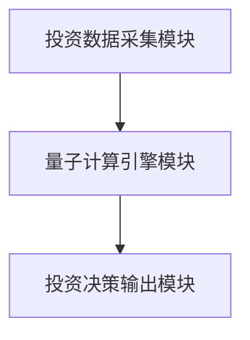

                 


# 巴菲特-芒格的量子计算投资：未来计算力的革命

**关键词**：量子计算，巴菲特，芒格，投资，量子算法，量子概率

**摘要**：  
量子计算作为一项革命性的技术，正在改变我们处理复杂问题的方式。本文探讨了如何将巴菲特和芒格的经典投资理念与量子计算相结合，利用量子计算的超强算力优化投资决策过程。文章从量子计算的基本原理、投资决策的量子模型构建、量子算法在投资中的应用，到量子计算投资系统的架构设计和实战案例，全面解析了量子计算如何赋能投资领域，为未来的投资革命提供新的视角。

---

## 第一部分：量子计算与投资的背景介绍

### 第1章：量子计算的基本概念

#### 1.1 量子计算的定义与特点
量子计算是一种基于量子力学原理的计算方式，其核心在于利用量子位（qubit）的量子叠加和量子纠缠特性，实现并行计算。与经典计算相比，量子计算在处理某些特定问题时具有指数级的计算速度优势。

#### 1.2 量子计算与经典计算的主要区别
- **量子叠加**：量子位可以同时处于多个状态的叠加态，而经典位只能是0或1。
- **量子纠缠**：两个或多个量子位之间可以形成纠缠态，使得对其中一个量子位的测量会影响另一个量子位的状态。
- **量子并行性**：利用量子叠加，量子计算机可以在一次运算中同时处理大量可能性。

#### 1.3 量子计算在投资领域的潜在应用
量子计算可以用于投资组合优化、股票价格预测、风险评估和市场趋势分析等领域。通过量子计算的强大算力，投资者可以更快地找到最优投资策略。

### 第2章：巴菲特与芒格的投资理念

#### 2.1 巴菲特的价值投资理论
巴菲特的价值投资理论强调长期持有优质资产，寻找市场中的低估股票，并坚持安全边际。量子计算可以帮助投资者更精准地识别低估股票，并优化投资组合。

#### 2.2 芒格的多元思维模型
芒格的多元思维模型强调跨学科思考，将不同领域的知识整合起来，形成对问题的全面理解。量子计算的跨学科性质与芒格的思维模型高度契合。

#### 2.3 传统投资方法的局限性
传统投资方法依赖于历史数据和统计分析，但在面对复杂市场和非线性关系时，往往显得力不从心。量子计算的出现为投资分析提供了新的工具。

---

## 第二部分：量子计算投资的核心概念与联系

### 第3章：量子计算的核心原理

#### 3.1 量子位与量子叠加
量子位（qubit）是量子计算的基本单位，它可以同时处于0和1的叠加态。这种叠加态使得量子计算机可以在一次运算中同时处理多个状态。

#### 3.2 量子纠缠与量子并行性
量子纠缠使得多个量子位之间形成关联，对其中一个量子位的测量会影响其他量子位的状态。这种特性可以用于优化投资组合的计算。

#### 3.3 量子算法的基本原理
量子算法利用量子计算机的并行性，通过特定的算法结构（如量子傅里叶变换、量子行走等）来解决特定问题。

### 第4章：投资决策的量子模型构建

#### 4.1 量子决策树的构建
量子决策树是一种基于量子计算的投资决策模型，它利用量子叠加和量子纠缠特性，构建一个可以同时考虑多种可能性的决策树。

#### 4.2 量子概率在投资中的应用
通过量子概率模型，投资者可以更精确地预测市场趋势和股票价格，从而优化投资决策。

#### 4.3 量子计算与投资风险评估
量子计算可以帮助投资者更准确地评估投资组合的风险，并找到最优的风险控制策略。

---

## 第三部分：量子计算投资的算法原理

### 第5章：量子机器学习算法

#### 5.1 量子支持向量机
量子支持向量机是一种基于量子计算的支持向量机算法，它可以用于分类问题。在投资中，它可以用于股票分类和市场趋势预测。

#### 5.2 量子聚类算法
量子聚类算法利用量子计算的并行性，快速将相似的股票或资产聚类，帮助投资者发现潜在的投资机会。

#### 5.3 量子线性回归
量子线性回归是一种基于量子计算的线性回归算法，它可以用于股票价格预测和投资组合优化。

### 第6章：量子优化算法

#### 6.1 量子退火算法
量子退火算法是一种基于量子计算的优化算法，它可以用于投资组合优化和风险控制。

#### 6.2 量子模拟退火
量子模拟退火是一种结合量子计算和模拟退火的优化算法，它可以用于解决复杂的优化问题。

#### 6.3 量子组合优化
量子组合优化是一种利用量子计算解决组合优化问题的算法，它可以用于投资组合优化和股票筛选。

---

## 第四部分：量子计算投资的数学模型与公式

### 第7章：量子概率模型

#### 7.1 量子概率的数学表达
量子概率可以通过密度矩阵或量子态向量来表示。例如，一个量子态可以表示为：
$$
|\psi\rangle = \alpha|0\rangle + \beta|1\rangle
$$
其中，$\alpha$ 和 $\beta$ 是复数，满足 $|\alpha|^2 + |\beta|^2 = 1$。

#### 7.2 量子期望值的计算
量子期望值可以通过测量算子与量子态的内积来计算。例如，期望值可以表示为：
$$
\langle A \rangle = \langle \psi | A | \psi \rangle
$$
其中，$A$ 是测量算子。

#### 7.3 量子波动性与投资决策
量子波动性可以通过量子态的相位差来表示。例如，两个量子态之间的相位差为 $\theta$，则：
$$
|\psi_1\rangle = \cos(\theta/2)|0\rangle + \sin(\theta/2)|1\rangle
$$
$$
|\psi_2\rangle = \cos(\theta/2)|1\rangle + \sin(\theta/2)|0\rangle
$$

### 第8章：量子投资组合优化

#### 8.1 量子投资组合的构建
量子投资组合可以通过量子退火算法来优化，以找到最优的投资组合。

#### 8.2 量子风险评估公式
量子风险评估公式可以通过量子概率模型来计算投资组合的风险。

#### 8.3 量子收益与风险的平衡
量子收益与风险的平衡可以通过量子优化算法来实现，以找到最优的投资策略。

---

## 第五部分：量子计算投资的系统架构设计

### 第9章：系统功能设计

#### 9.1 投资数据采集模块
投资数据采集模块负责从金融市场获取实时数据，包括股票价格、市场指数等。

#### 9.2 量子计算引擎模块
量子计算引擎模块负责将投资数据输入量子算法，进行计算和优化。

#### 9.3 投资决策输出模块
投资决策输出模块将量子计算引擎的结果输出为具体的投资策略，如买入或卖出信号。

### 第10章：系统架构图

#### 10.1 系统架构的Mermaid流程图


#### 10.2 模块之间的交互关系
模块之间的交互关系可以通过Mermaid流程图表示，展示系统整体的运行流程。

---

## 第六部分：量子计算投资的系统实现与实战案例

### 第11章：环境安装

#### 11.1 量子计算环境的安装
需要安装量子计算框架，如Qiskit、Cirq等，并配置量子模拟器或量子计算机。

#### 11.2 量子计算引擎的安装
安装量子计算引擎，如IBM Quantum Experience或 Rigetti Quantum Computing。

### 第12章：核心实现源代码

#### 12.1 量子机器学习算法的实现
量子机器学习算法的实现可以通过Qiskit框架完成，例如：
```python
from qiskit import QuantumCircuit, execute, Aer

qc = QuantumCircuit(2, 2)
qc.h(0)
qc.cx(0, 1)
qc.measure(0, 0)
qc.measure(1, 1)

simulator = Aer.get_backend('qasm_simulator')
result = execute(qc, simulator).result()
print(result.get_counts())
```

#### 12.2 量子优化算法的实现
量子优化算法的实现可以通过量子退火算法完成，例如：
```python
from qiskit import QuantumCircuit, execute, Aer

qc = QuantumCircuit(3, 3)
qc.h(0)
qc.h(1)
qc.h(2)
qc.ccx(0,1,2)
qc.measure(0,0)
qc.measure(1,1)
qc.measure(2,2)

simulator = Aer.get_backend('qasm_simulator')
result = execute(qc, simulator).result()
print(result.get_counts())
```

### 第13章：实际案例分析

#### 13.1 投资组合优化的实战案例
通过量子退火算法优化投资组合，找到最优的投资组合。

#### 13.2 股票价格预测的实战案例
通过量子机器学习算法预测股票价格，并制定投资策略。

### 第14章：项目小结

#### 14.1 最佳实践 tips
- 量子计算的投资决策需要结合市场实际情况进行调整。
- 量子计算的投资模型需要定期更新和优化。

#### 14.2 注意事项
- 量子计算的投资模型需要结合市场实际情况进行调整。
- 量子计算的投资模型需要定期更新和优化。

---

## 作者：AI天才研究院/AI Genius Institute & 禅与计算机程序设计艺术 /Zen And The Art of Computer Programming

