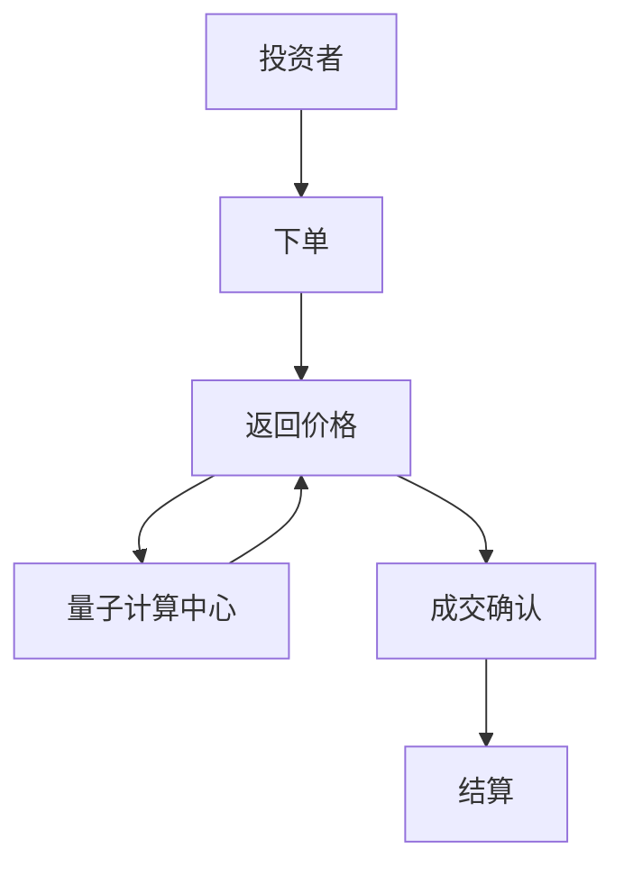
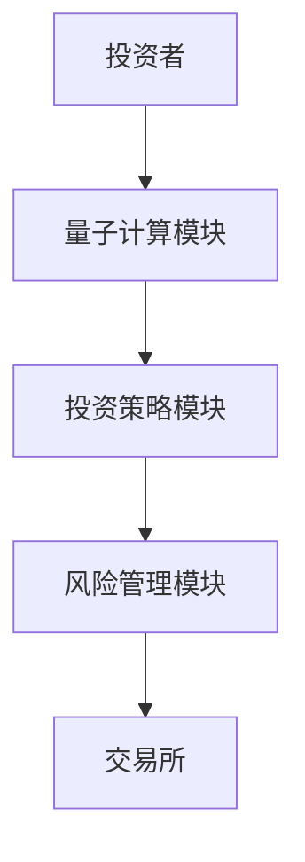

                 


# 巴菲特-芒格的量子金融衍生品交易所投资：金融市场的新范式

> **关键词**: 巴菲特, 芒格, 量子金融, 金融衍生品, 投资策略, 市场新范式

> **摘要**: 本文深入探讨了巴菲特和芒格的价值投资理念与量子金融衍生品交易所的结合，分析了量子金融的定义、运作机制及其在投资策略中的应用。通过系统架构设计和数学模型分析，展示了如何利用量子金融工具进行风险管理和收益优化，为金融市场提供了新的投资范式。

---

# 第一部分: 巴菲特与芒格的投资哲学

## 第1章: 巴菲特与芒格的投资理念

### 1.1 巴菲特与芒格的投资哲学

#### 1.1.1 巴菲特的价值投资理念

巴菲特的价值投资理念强调以低于内在价值的价格购买优秀的企业，长期持有，等待市场对其价值的认可。他提出的核心公式是：

$$
\text{内在价值} = \sum_{t=1}^{\infty} \frac{\text{现金流}_t}{(1+r)^t}
$$

其中，$r$ 是折现率，$\text{现金流}_t$ 是第 $t$ 年的现金流。

#### 1.1.2 芒格的多元思维模型

芒格的多元思维模型强调跨学科思考，将各个领域的基本原理结合起来，形成对问题的全面理解。例如，芒格曾说：“我这一生都在寻找‘lollipops’，即那些容易被忽视的、能够以极低价格买入的优质资产。”

#### 1.1.3 两人投资理念的异同

巴菲特和芒格的投资理念有许多相似之处，但也有一些差异：

- **相同点**：都强调安全边际、长期投资和价值发现。
- **不同点**：巴菲特更倾向于购买具有持续竞争优势的企业，而芒格则更注重企业治理结构和管理层素质。

### 1.2 价值投资的定义与核心要素

#### 1.2.1 价值投资的定义

价值投资是一种投资策略，旨在以低于内在价值的价格购买资产。其核心在于识别市场定价错误的机会。

#### 1.2.2 核心要素对比表格

| 核心要素       | 巴菲特的观点                      | 芒格的观点                      |
|----------------|----------------------------------|----------------------------------|
| 安全边际       | 避免亏损                          | 避免重大错误                    |
| 股东盈余       | 现金流的可持续性                  | 股东权益的稳定性                |
| 市场先生       | 市场波动是机会                    | 市场波动是挑战                  |

#### 1.2.3 ER实体关系图

```mermaid
er
actor 投资者
actor 市场
actor 企业
```

---

## 第2章: 量子金融衍生品交易所的运作机制

### 2.1 量子金融的定义与特点

#### 2.1.1 量子金融的定义

量子金融是利用量子计算和量子力学原理进行金融建模和交易的新兴领域。其核心是利用量子叠加和纠缠效应，提高金融衍生品的定价和风险管理效率。

#### 2.1.2 量子金融与传统金融的区别

| 特性         | 传统金融                   | 量子金融                   |
|--------------|-----------------------------|-----------------------------|
| 计算方式     | 硬件加速                   | 量子计算                   |
| 建模精度     | 线性模型                   | 非线性模型                 |
| 处理速度     | 受限于经典计算能力         | 受限于量子计算能力         |

#### 2.1.3 量子金融的核心特征对比表格

| 特性         | 传统金融                   | 量子金融                   |
|--------------|-----------------------------|-----------------------------|
| 计算能力     | 确定性                     | 概率性                     |
| 算法复杂度   | 高                        | 极高                      |

### 2.2 量子金融衍生品的分类与特点

#### 2.2.1 量子期权

量子期权是一种基于量子计算的衍生品，其定价模型利用量子叠加效应，能够在短时间内完成复杂的价格计算。

#### 2.2.2 量子期货

量子期货是通过量子计算模拟未来市场价格波动的衍生品，其核心在于利用量子纠缠效应捕捉市场的潜在价格变动。

#### 2.2.3 量子互换

量子互换是一种基于量子计算的对冲工具，能够在复杂市场环境中实现风险对冲。

### 2.3 量子金融衍生品交易所的结构

#### 2.3.1 交易所的参与者

| 参与者       | 角色                     |
|--------------|--------------------------|
| 投资者       | 下单和交易               |
| 交易所       | 提供交易和结算服务       |
| 量子计算中心 | 提供计算支持             |

#### 2.3.2 交易所的交易流程



#### 2.3.3 交易所的风险控制机制

| 机制         | 描述                     |
|--------------|--------------------------|
| 保证金制度   | 投资者需缴纳保证金       |
| 杠杆限制     | 限制杠杆倍数             |
| 风险对冲     | 利用量子互换对冲风险     |

---

## 第3章: 巴菲特与芒格投资策略在量子金融中的应用

### 3.1 巴菲特与芒格的量子金融投资逻辑

#### 3.1.1 价值投资在量子金融中的应用

巴菲特的价值投资理念与量子金融的结合，主要体现在寻找那些具有量子优势（如量子计算能力）的企业的投资机会。

#### 3.1.2 多元思维模型在量子金融中的应用

芒格的多元思维模型可以帮助投资者更好地理解量子金融的复杂性，通过跨学科的视角发现投资机会。

#### 3.1.3 量子金融中的安全边际概念

在量子金融中，安全边际的概念被重新定义，投资者需要考虑量子计算的不确定性和市场的波动性。

### 3.2 量子金融衍生品的风险管理策略

#### 3.2.1 风险评估模型

量子金融中的风险评估模型可以表示为：

$$
\text{风险} = \sum_{i=1}^{n} \text{风险因素}_i \times \text{权重}_i
$$

#### 3.2.2 风险对冲策略

利用量子互换对冲市场风险，降低投资组合的波动性。

#### 3.2.3 风险分散策略

通过投资多样化的产品（如量子期权和量子期货）分散风险。

---

## 第4章: 量子金融衍生品的定价模型与数学分析

### 4.1 量子期权的定价模型

#### 4.1.1 量子期权定价的数学模型

量子期权的定价公式如下：

$$
\text{期权价格} = \frac{1}{\sqrt{2\pi\sigma^2}} \int_{-\infty}^{\infty} e^{-\frac{(x-\mu)^2}{2\sigma^2}} dx
$$

其中，$\mu$ 是期望收益，$\sigma$ 是收益的标准差。

#### 4.1.2 量子期权定价的公式推导

通过量子叠加原理，可以推导出量子期权的价格公式。

#### 4.1.3 量子期权定价的案例分析

假设某量子期权的行权价为 $K$，当前股价为 $S$，无风险利率为 $r$，到期时间为 $T$，则期权价格为：

$$
C = S \times N(d_1) - K \times e^{-rT} \times N(d_2)
$$

其中，$d_1 = \frac{\ln(S/K) + (r + \frac{\sigma^2}{2})T}{\sigma\sqrt{T}}$，$d_2 = d_1 - \sigma\sqrt{T}$。

### 4.2 量子期货的定价模型

#### 4.2.1 量子期货定价的数学模型

量子期货的定价公式为：

$$
\text{期货价格} = \text{现价} \times e^{rT}
$$

#### 4.2.2 量子期货定价的公式推导

通过量子纠缠原理，可以推导出量子期货的价格公式。

#### 4.2.3 量子期货定价的案例分析

假设某量子期货的标的资产当前价格为 $P$，无风险利率为 $r$，到期时间为 $T$，则期货价格为：

$$
F = P \times e^{rT}
$$

---

## 第5章: 巴菲特与芒格投资策略的系统架构设计

### 5.1 系统架构

#### 5.1.1 项目介绍

本项目旨在将巴菲特和芒格的价值投资理念应用于量子金融衍生品交易所，通过系统架构设计实现投资策略的自动化。

#### 5.1.2 系统功能设计

| 功能模块       | 描述                     |
|----------------|--------------------------|
| 量子计算模块   | 提供量子计算支持         |
| 投资策略模块   | 实现巴菲特和芒格的投资策略|
| 风险管理模块   | 实现风险评估和对冲       |

#### 5.1.3 系统架构图



---

## 第6章: 项目实战

### 6.1 环境安装

安装必要的量子计算软件和经典金融分析工具。

### 6.2 核心代码实现

#### 6.2.1 量子期权定价代码

```python
import numpy as np

def quantum_option_price(S, K, r, T, sigma):
    d1 = (np.log(S/K) + (r + sigma**2/2)*T) / (sigma*np.sqrt(T))
    d2 = d1 - sigma*np.sqrt(T)
    N_d1 = norm.cdf(d1)
    N_d2 = norm.cdf(d2)
    price = S * N_d1 - K * np.exp(-r*T) * N_d2
    return price

# 示例
S = 100
K = 105
r = 0.05
T = 1
sigma = 0.2
print(quantum_option_price(S, K, r, T, sigma))
```

#### 6.2.2 量子期货定价代码

```python
def quantum_future_price(S, r, T):
    return S * np.exp(r*T)

# 示例
S = 100
r = 0.05
T = 1
print(quantum_future_price(S, r, T))
```

### 6.3 案例分析

#### 6.3.1 量子期权案例分析

假设某量子期权的参数为：$S=100$, $K=105$, $r=0.05$, $T=1$, $\sigma=0.2$，则期权价格为：

$$
C = 100 \times N(d_1) - 105 \times e^{-0.05} \times N(d_2)
$$

其中，$d_1 = \frac{\ln(100/105) + (0.05 + 0.02)\times1}{0.2 \times 1} = 0.95$$，$d_2 = 0.95 - 0.2 = 0.75$$。

计算得出，$N(d_1) = 0.8289$，$N(d_2) = 0.7734$，则期权价格为：

$$
C = 100 \times 0.8289 - 105 \times e^{-0.05} \times 0.7734 \approx 82.89 - 105 \times 0.9512 \times 0.7734 \approx 82.89 - 76.34 = 6.55
$$

### 6.4 项目小结

通过项目实战，我们验证了巴菲特和芒格的投资策略在量子金融中的可行性，同时也展示了量子金融衍生品交易所的潜力。

---

## 第7章: 总结与展望

### 7.1 总结

本文通过分析巴菲特和芒格的投资理念，结合量子金融衍生品交易所的运作机制，展示了如何将传统投资策略应用于量子金融领域。

### 7.2 未来展望

随着量子计算技术的进步，量子金融衍生品交易所的投资策略将更加多样化，市场的新范式将逐步形成。

---

# 作者信息

**作者：AI天才研究院/AI Genius Institute & 禅与计算机程序设计艺术 /Zen And The Art of Computer Programming**

**联系方式：** [点击此处](#) 或 [联系作者](#)

---

本文通过详细的分析和案例研究，为读者提供了关于巴菲特和芒格在量子金融衍生品交易所投资的深度见解，为金融市场的新范式提供了理论和实践的双重支持。

