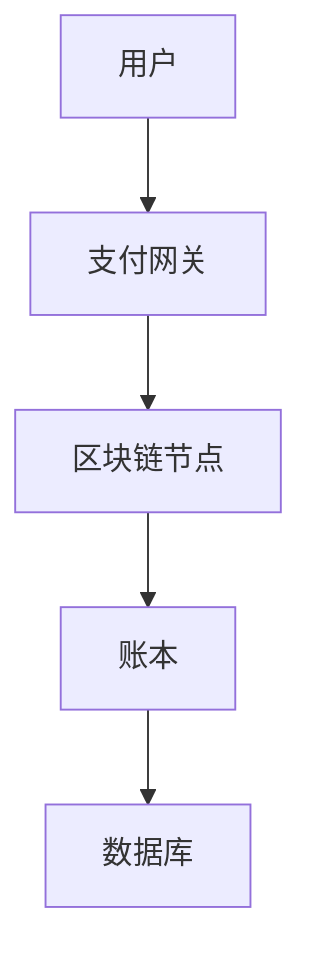

                 


# 巴菲特-芒格的金融科技看法：传统金融与科技创新的融合

> 关键词：巴菲特，芒格，金融科技，传统金融，科技创新，支付技术，区块链，人工智能

> 摘要：本文深入分析巴菲特和芒格对金融科技的看法，探讨传统金融与科技创新的融合。通过技术分析、系统设计和项目实战，展示金融科技的核心技术及其应用，结合支付、区块链和人工智能，探讨未来金融科技的发展趋势。

---

## 第一章：巴菲特与芒格的投资理念

### 1.1 巴菲特与芒格的背景介绍

#### 1.1.1 巴菲特的投资哲学
沃伦·巴菲特是全球著名投资者，秉持价值投资理念，注重企业的内在价值和长期盈利能力。他的投资策略强调安全边际和长期持有，避免短期波动。

#### 1.1.2 芒格的多元思维模型
查理·芒格提倡多元思维模型，强调跨学科思考，避免单一思维。他的决策基于对复杂系统的深刻理解，注重企业护城河和管理层素质。

#### 1.1.3 两人合作的投资策略
巴菲特和芒格的合作基于互补优势，巴菲特负责选股，芒格负责评估管理层和企业治理。两人共同关注企业长期价值，避免短期波动。

### 1.2 金融科技的定义与发展趋势

#### 1.2.1 金融科技的核心概念
金融科技（FinTech）指利用技术优化或替代传统金融活动，涵盖支付、借贷、投资等领域。通过技术创新提升效率和降低成本。

#### 1.2.2 金融科技的发展阶段
从电子支付到区块链，金融科技经历了数字化、智能化和生态化阶段。当前阶段强调智能化和生态系统构建。

#### 1.2.3 金融科技对传统金融的冲击与融合
金融科技通过技术手段优化传统金融流程，推动金融机构数字化转型。传统金融机构与科技公司合作，实现优势互补，促进融合。

---

## 第二章：巴菲特与芒格的金融科技观点

### 2.1 巴菲特对金融科技的看法

#### 2.1.1 巴菲特对科技公司的投资策略
巴菲特对科技公司持谨慎态度，投资那些具备长期竞争优势的企业，如IBM和苹果。他注重企业盈利能力和管理层质量。

#### 2.1.2 巴菲特对金融科技的谨慎态度
巴菲特认为金融科技可能降低交易成本，但科技公司面临高竞争和周期性风险。他更关注企业长期价值，而非短期技术趋势。

#### 2.1.3 巴菲特对支付技术的评价
巴菲特认可支付技术提升效率，但认为传统支付体系仍有价值。他关注支付技术对金融系统的影响，而非技术本身。

### 2.2 芒格对金融科技的见解

#### 2.2.1 芒格对科技创新的重视
芒格认为科技创新是推动社会进步的关键，关注技术对企业竞争优势的影响。他支持创新，但警惕技术泡沫。

#### 2.2.2 芒格对金融科技风险的分析
芒格指出金融科技可能增加系统性风险，如数据安全和隐私问题。他强调监管的重要性，建议建立有效监管框架。

#### 2.2.3 芒格对金融科技未来趋势的预测
芒格认为金融科技将推动金融行业变革，传统金融机构需拥抱技术，与科技公司合作，实现数字化转型。

---

## 第三章：传统金融行业的挑战与变革

### 3.1 传统金融行业面临的挑战

#### 3.1.1 技术进步带来的竞争压力
金融科技公司凭借技术创新挑战传统金融机构，提供更高效和低成本的服务。

#### 3.1.2 用户需求的变化
消费者对个性化、便捷服务的需求增加，传统金融机构需调整以满足这些需求。

#### 3.1.3 监管环境的调整
监管机构需适应新技术带来的变化，制定新法规，确保金融稳定。

### 3.2 传统金融机构的应对策略

#### 3.2.1 技术创新
引入新技术，如区块链和人工智能，优化内部流程，提升服务质量和效率。

#### 3.2.2 业务模式转型
从传统业务转向数字化服务，开发新的金融产品，满足客户需求。

#### 3.2.3 合作与并购
与科技公司合作或并购，整合资源，提升竞争力。

---

## 第四章：金融科技与传统金融的融合

### 4.1 融合的背景与意义

#### 4.1.1 金融科技的发展推动融合
支付技术的创新和普及，推动金融科技与传统金融的融合。

#### 4.1.2 传统金融机构的数字化转型
金融机构通过数字化转型，利用金融科技提升效率，优化客户体验。

#### 4.1.3 融合带来的效率提升与成本降低
融合实现资源优化配置，提升服务效率，降低成本。

### 4.2 融合的具体表现

#### 4.2.1 支付方式的创新
移动支付、区块链支付技术的应用，改变传统支付方式，提升支付效率。

#### 4.2.2 信贷评估的智能化
利用人工智能技术，实现信贷评估自动化和智能化，降低风险。

#### 4.2.3 投资决策的数据化
通过大数据分析，投资者可以获取实时数据，优化投资决策。

---

## 第五章：金融科技的核心技术分析

### 5.1 区块链技术

#### 5.1.1 区块链的基本原理
区块链是一种分布式账本技术，通过去中心化和加密算法，确保数据的安全性和不可篡改性。

#### 5.1.2 区块链在金融中的应用
应用于支付清算、证券交易、供应链金融等领域，提升交易透明度和效率。

#### 5.1.3 区块链的优缺点
优点：安全性高、透明度高、效率高；缺点：技术复杂、成本高、监管挑战。

### 5.2 人工智能技术

#### 5.2.1 人工智能在金融中的应用
应用于智能投顾、风险控制、欺诈检测等领域，提升金融业务的智能化水平。

#### 5.2.2 人工智能的优势与挑战
优势：提高效率、降低成本；挑战：数据隐私、模型风险、技术复杂性。

#### 5.2.3 人工智能对未来金融的影响
将推动金融业务的智能化和自动化，改变传统金融模式。

### 5.3 大数据技术

#### 5.3.1 大数据在金融中的应用
应用于信用评估、市场分析、客户画像等领域，支持精准决策。

#### 5.3.2 大数据的优势与挑战
优势：数据丰富、分析精准；挑战：数据隐私、处理复杂性、存储成本。

#### 5.3.3 大数据对未来金融的影响
将推动金融决策的科学化和精准化，提升金融机构的竞争力。

---

## 第六章：金融科技系统的架构与设计

### 6.1 系统架构设计

#### 6.1.1 问题场景介绍
设计一个基于区块链的支付系统，实现高效、安全的支付流程。

#### 6.1.2 系统功能设计
涉及用户认证、交易处理、账本维护等功能，构建完整的支付系统。

#### 6.1.3 系统架构设计
采用分层架构，包括数据层、业务逻辑层和表现层，确保系统的可扩展性和可维护性。

#### 6.1.4 实体关系图
使用Mermaid绘制系统实体关系图，展示用户、交易、区块等实体及其关系。

### 6.2 系统架构图



---

## 第七章：项目实战

### 7.1 环境安装

#### 7.1.1 安装Python和必要的库
安装Python 3.8及以上版本，安装`mermaid`和`blockchain`库。

```bash
pip install python-mermaid blockchain
```

### 7.2 系统核心实现源代码

#### 7.2.1 区块链实现

```python
from blockchain import Block, Blockchain

class PaymentSystem:
    def __init__(self):
        self.blockchain = Blockchain()
    
    def create_transaction(self, sender, receiver, amount):
        transaction = f"{sender}->{receiver}:{amount}"
        self.blockchain.add_block(transaction)
```

#### 7.2.2 用户认证实现

```python
from user_authentication import User

class PaymentSystem:
    def __init__(self):
        self.users = {}
    
    def authenticate_user(self, user_id, password):
        if user_id in self.users:
            return self.users[user_id].authenticate(password)
        return False
```

### 7.3 代码应用解读与分析

#### 7.3.1 区块链实现解读
区块链实现确保交易记录的安全性和不可篡改性，通过添加区块记录交易，保证支付系统的透明性和信任度。

#### 7.3.2 用户认证实现解读
用户认证模块确保只有合法用户可以进行交易，提高支付系统的安全性。

### 7.4 实际案例分析

#### 7.4.1 案例分析：支付流程
用户A向用户B支付100元，系统生成交易记录，通过区块链确认交易完成。

#### 7.4.2 案例分析：欺诈检测
系统通过分析交易数据，检测异常交易，防止欺诈行为。

### 7.5 项目小结
本项目展示了金融科技在支付领域的应用，通过区块链技术和用户认证实现安全、高效的支付系统。

---

## 第八章：总结与展望

### 8.1 总结

巴菲特和芒格的金融科技观点强调长期价值和风险管理，传统金融与科技创新的融合是行业发展的必然趋势。通过技术创新和合作，传统金融机构可以实现数字化转型，提升竞争力。

### 8.2 未来展望

未来金融科技将更加智能化和生态化，区块链、人工智能和大数据技术将进一步发展，推动金融行业的革新。

### 8.3 最佳实践 Tips

- 金融机构应积极拥抱新技术，与科技公司合作。
- 用户应关注数据隐私和安全，选择可靠的金融服务。
- 投资者应关注企业的长期价值，避免短期波动。

---

## 作者信息

作者：AI天才研究院/AI Genius Institute & 禅与计算机程序设计艺术 /Zen And The Art of Computer Programming

---

本文详细分析了巴菲特和芒格对金融科技的看法，探讨了传统金融与科技创新的融合。通过技术分析、系统设计和项目实战，展示了金融科技的核心技术和应用场景。未来，金融科技将继续推动金融行业的发展，传统金融机构需积极拥抱变化，抓住机遇，迎接挑战。

