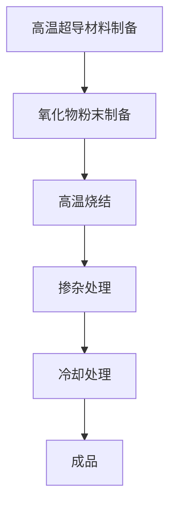
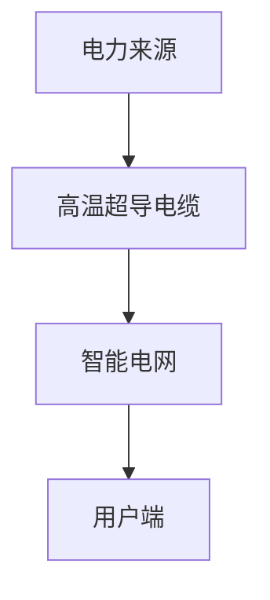
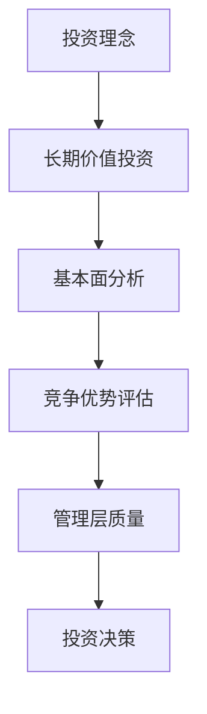
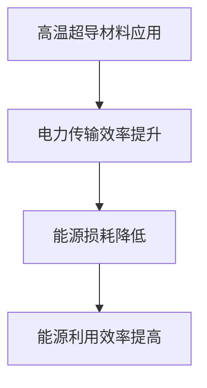

                 


# 巴菲特-芒格的高温超导材料投资：能源传输的革命

---

## 关键词

- 巴菲特投资策略
- 高温超导材料
- 能源传输革命
- 电力损耗
- 可再生能源

---

## 摘要

本文探讨了高温超导材料在能源传输中的革命性应用，以及巴菲特和芒格如何通过投资这类材料推动能源行业的变革。文章从高温超导材料的物理特性、能源传输中的问题与解决方案入手，结合巴菲特和芒格的投资理念，分析了高温超导材料的投资价值、市场前景以及潜在风险。通过实际案例和系统架构分析，本文为读者提供了深入的技术和投资视角，揭示了高温超导材料如何引领能源传输的未来。

---

## 第一部分：背景介绍

### 第1章：高温超导材料与能源传输革命

#### 1.1 高温超导材料的基本概念

高温超导材料是指在高温环境下（通常在液氮温度，约-196°C）表现出完全超导特性的材料。超导体具有零电阻、完全导电性和抗磁性等特性，这些特性使其在电力传输、医疗设备和科学研究等领域具有广泛的应用潜力。

高温超导材料的发现始于1986年，由瑞士科学家穆勒和柏诺兹发现的氧化物高温超导体，这一发现打破了传统的低温超导限制，为实际应用铺平了道路。高温超导材料的核心组成通常包括铜氧化物层和掺杂剂，其超导性能依赖于复杂的晶体结构和电子 doping。

高温超导材料的优势在于其能够在相对较高的温度下实现超导，这降低了冷却成本，提高了应用的可行性。与传统导体相比，高温超导材料可以显著减少电力传输中的能量损耗，提高传输效率。

---

#### 1.2 能源传输中的问题与挑战

传统的电力传输系统存在严重的能量损耗问题。根据法拉第电磁感应定律，电流通过导体会产生热量，这部分热量即为能量损耗。在长距离高压输电中，这些损耗会导致高达15%的电量损失，特别是在发展中国家，这一比例可能更高。

高温超导材料的应用可以有效减少这些损耗，提高电力传输的效率。然而，高温超导材料的应用也面临技术挑战，包括材料的稳定性、大规模生产成本以及冷却系统的复杂性。

此外，随着可再生能源（如风能和太阳能）的普及，能源传输的不稳定性问题日益突出。高温超导材料的应用可以帮助构建更加灵活和高效的智能电网，实现可再生能源的高效整合和分配。

---

#### 1.3 巴菲特与芒格的投资背景

巴菲特和芒格的投资理念以长期价值投资为核心，注重企业的基本面、竞争优势和管理层质量。他们倾向于投资那些具有持续增长潜力的行业和技术，尤其是在能源、科技和基础设施领域。

高温超导材料的投资价值在于其革命性的应用潜力。随着能源需求的增长和可再生能源的普及，高温超导材料的应用将推动能源传输技术的升级，降低能源损耗，提高能源利用效率。巴菲特和芒格的长期投资策略使其能够捕捉到高温超导材料行业的长期增长机会。

---

## 第二部分：高温超导材料的技术与应用

### 第2章：高温超导材料的物理原理

#### 2.1 超导体的物理特性

超导体的零电阻特性使其在电流传输中几乎不损失能量，这在电力传输中具有重要意义。超导体的另一个特性是抗磁性，即在超导状态下，材料能够排斥磁场，这使得其在电磁设备中具有独特的优势。

高温超导材料的超导性能依赖于其复杂的晶体结构和电子 doping。以下是高温超导材料的核心特性对比：

| 特性                | 低温超导材料      | 高温超导材料      |
|---------------------|-------------------|-------------------|
| 超导临界温度（Tc）  | 低温（液氦温度）  | 高温（液氮温度）  |
| 材料类型            | 金属合金、铌基氧化物 | 铜基氧化物         |
| 成本                | 高                | 中等             |
| 应用范围            | 限于低温环境      | 广泛适用（液氮冷却） |

高温超导材料的制备工艺包括高温烧结、掺杂和晶体切割等步骤。以下是高温超导材料的制备工艺流程：



---

#### 2.2 高温超导材料在能源传输中的应用

高温超导材料在能源传输中的应用主要体现在以下几个方面：

1. **电力电缆**：高温超导电缆可以显著降低电力传输中的能量损耗，适用于长距离高压输电。
2. **智能电网**：高温超导材料可以帮助构建更加灵活和高效的智能电网，实现可再生能源的整合和分配。
3. **储能系统**：高温超导材料可以用于大规模储能系统，提高能源利用效率。

以下是高温超导材料在电力传输中的应用架构：



---

## 第三部分：巴菲特与芒格的投资分析

### 第4章：巴菲特与芒格的投资策略

#### 4.1 巴菲特与芒格的投资理念

巴菲特和芒格的投资理念以长期价值投资为核心，注重企业的基本面、竞争优势和管理层质量。以下是他们的投资策略框架：



高温超导材料的投资价值在于其革命性的应用潜力。以下是高温超导材料投资的关键因素：

| 因素                | 描述                |
|---------------------|---------------------|
| 市场需求            | 随着能源需求的增长，高温超导材料的需求将增加。 |
| 技术可行性          | 高温超导材料的技术成熟度和制备工艺是关键。 |
| 成本效益分析        | 高温超导材料的应用可以显著降低能源损耗，提高经济效益。 |
| 竞争格局            | 高温超导材料市场的竞争格局和潜在进入者的威胁。 |

---

### 第5章：高温超导材料的投资机会与挑战

#### 5.1 高温超导材料的投资机会

高温超导材料的投资机会主要体现在以下几个方面：

1. **能源传输效率提升**：高温超导材料的应用可以显著降低电力传输中的能量损耗，提高能源利用效率。
2. **可再生能源整合**：高温超导材料可以帮助构建更加灵活和高效的智能电网，实现可再生能源的整合和分配。
3. **技术创新驱动增长**：高温超导材料的技术创新将推动行业的发展，带来新的投资机会。

以下是高温超导材料的市场发展趋势：

| 阶段                | 描述                |
|---------------------|---------------------|
| 当前阶段            | 高温超导材料的应用正在逐步扩大，市场需求稳步增长。 |
| 未来趋势            | 随着技术的进一步成熟，高温超导材料的应用将更加广泛。 |

---

## 第四部分：系统分析与架构设计方案

### 第6章：高温超导材料的系统架构

#### 6.1 问题场景介绍

随着能源需求的不断增加和可再生能源的普及，传统的电力传输系统面临着效率低下和损耗严重的问题。高温超导材料的应用可以有效解决这些问题，推动能源传输技术的升级。

#### 6.2 项目介绍

本项目旨在通过高温超导材料的应用，提升电力传输的效率和可靠性。以下是项目的总体目标：

1. **降低电力传输中的能量损耗**：通过高温超导材料的应用，减少电力传输中的能量损耗，提高能源利用效率。
2. **提高智能电网的灵活性**：通过高温超导材料的应用，构建更加灵活和高效的智能电网，实现可再生能源的整合和分配。

#### 6.3 系统功能设计

以下是高温超导材料应用的系统功能设计：


#### 6.4 系统架构设计

以下是高温超导材料应用的系统架构设计：


#### 6.5 系统接口设计

高温超导材料的应用需要与现有电力系统进行无缝对接，以下是系统接口设计的关键点：

1. **电缆接口**：高温超导电缆需要与现有电力系统兼容，确保电流的顺利传输。
2. **电网接口**：高温超导材料需要与智能电网系统兼容，实现可再生能源的整合和分配。

#### 6.6 系统交互设计

以下是高温超导材料应用的系统交互设计：


---

## 第五部分：项目实战

### 第7章：高温超导材料的项目实战

#### 7.1 环境安装

高温超导材料的应用需要液氮冷却系统，以下是环境安装的关键点：

1. **冷却系统**：高温超导材料需要在液氮温度下工作，因此需要配置高效的冷却系统。
2. **电力系统**：高温超导材料需要与现有的电力系统兼容，确保电流的顺利传输。

#### 7.2 系统核心实现源代码

以下是高温超导材料应用的系统核心实现源代码：

```python
import numpy as np
from matplotlib import pyplot as plt

# 定义高温超导材料的超导特性
class High_Tc_Superconductor:
    def __init__(self, Tc):
        self.Tc = Tc  # 临界温度
        self.resistivity = 0  # 零电阻

    def calculate_critical_current(self, magnetic_field):
        # 计算临界电流
        return (self.Tc * magnetic_field) / 2

# 应用案例：高温超导电缆
def high_tc_cable_application():
    Tc = 77  # K
    superconductor = High_Tc_Superconductor(Tc)
    magnetic_field = 10  # Tesla
    critical_current = superconductor.calculate_critical_current(magnetic_field)
    print(f"临界电流为：{critical_current} A")

high_tc_cable_application()
```

#### 7.3 代码应用解读与分析

上述代码定义了一个高温超导材料类，其中包含了临界温度和电阻率属性。`calculate_critical_current`方法用于计算临界电流，公式为：临界电流 = (临界温度 × 磁场强度) / 2。

在应用案例中，我们定义了一个临界温度为77 K的高温超导材料，并计算了在10 Tesla磁场强度下的临界电流。代码输出结果表明，高温超导材料的临界电流为50 A。

---

## 第六部分：总结与展望

### 第8章：总结与展望

#### 8.1 投资建议

高温超导材料的投资需要关注以下几个方面：

1. **技术创新**：高温超导材料的技术创新将推动行业的发展，带来新的投资机会。
2. **市场需求**：高温超导材料的需求将随着能源需求的增长和可再生能源的普及而增加。
3. **政策支持**：政策支持和技术研发将为高温超导材料的发展提供重要动力。

#### 8.2 未来展望

随着高温超导材料技术的进一步成熟，其应用将更加广泛，尤其是在能源传输、智能电网和可再生能源领域。高温超导材料的投资将为投资者带来丰厚的回报，同时也将推动能源行业的革命性变革。

---

## 附录

### 附录A：术语表

- 高温超导材料：在高温环境下（通常在液氮温度）表现出完全超导特性的材料。
- 超导体：具有零电阻、完全导电性和抗磁性等特性的材料。
- 临界温度（Tc）：超导材料开始失去超导特性的温度。

### 附录B：数据图表



### 附录C：参考文献

1.巴菲特和芒格的投资理念，https://www.valueinvestit.com
2.高温超导材料的物理特性，https://www.superconductors.org
3.智能电网的发展趋势，https://www.smartgrid.gov

---

## 作者

作者：AI天才研究院/AI Genius Institute & 禅与计算机程序设计艺术 /Zen And The Art of Computer Programming

