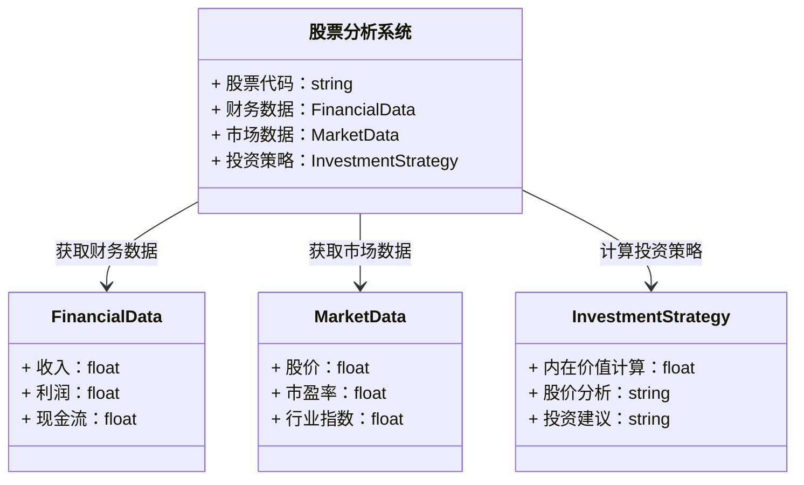

                 

<think>
好的，我需要根据用户的要求，撰写一篇关于“巴菲特-芒格看人口老龄化：投资机遇与挑战”的技术博客文章。文章需要符合以下要求：

1. **标题**：《巴菲特-芒格看人口老龄化：投资机遇与挑战》
2. **关键词**：巴菲特, 芒格, 人口老龄化, 投资机会, 资本市场, 股票分析
3. **摘要**：本文从巴菲特和芒格的投资视角，分析人口老龄化对经济和社会的影响，探讨其中的投资机会和挑战，结合具体案例和数学模型，提供深入的分析和见解。
4. **目录大纲**：如上所述，分为六大部分，每部分有详细的章节和小节。

接下来，我将逐步展开思考，确保每个部分都符合用户的要求，并且内容详实、结构清晰。

---

### 第一部分：人口老龄化背景与巴菲特-芒格投资视角

#### 第1章：人口老龄化问题背景

##### 1.1 人口老龄化的基本概念

- **1.1.1 人口老龄化定义与特征**
  - 定义：人口老龄化是指65岁及以上人口占总人口比例不断上升的趋势。
  - 特征：老龄化速度快、老年人口比例高、劳动年龄人口减少。

- **1.1.2 人口老龄化对社会的深远影响**
  - 社会影响：社会保障压力加大、劳动力市场萎缩、家庭结构变化。
  - 经济影响：消费结构变化、企业用工成本上升、技术创新动力减弱。

- **1.1.3 全球人口老龄化趋势分析**
  - 发达国家老龄化严重，发展中国家逐步跟进。
  - 中国老龄化速度最快，印度等新兴市场国家也在加速。

##### 1.2 巴菲特与芒格的投资视角

- **1.2.1 巴菲特的价值投资理念**
  - 贵公司：具备持续盈利能力、强大的竞争优势和护城河。
  - 长期投资：关注企业的内在价值，而非短期股价波动。

- **1.2.2 芒格的多元思维模型**
  - 跨学科思维：将心理学、经济学、社会学等知识结合起来。
  - 逆向思维：从反方向思考问题，找到别人忽略的机会。
  - 人类心理与行为：理解市场参与者的心理，避免情绪化决策。

- **1.2.3 人口老龄化与投资机会的结合**
  - 老龄化带来的医疗、健康、养老服务需求增加，相关行业投资潜力大。
  - 保险、金融科技在老龄化社会中的重要性上升。

---

#### 第2章：人口老龄化对经济与社会的影响

##### 2.1 经济层面的影响

- **2.1.1 人口老龄化对劳动力市场的冲击**
  - 劳动力供给减少，企业用工成本上升。
  - 劳动力结构变化，企业需要更多灵活性和自动化解决方案。

- **2.1.2 养老金体系的压力与改革**
  - 养老金支出增加，财政压力加大。
  - 推动养老金融创新，如第三支柱个人养老金发展。

- **2.1.3 消费结构的变化与投资机会**
  - 医疗健康、养老服务、智能设备等领域需求增加。
  - 企业需要调整产品策略，满足老龄化需求。

##### 2.2 社会层面的影响

- **2.2.1 家庭结构的变化**
  - 核心家庭化，家庭成员减少，养老压力分散。
  - 家庭结构变化影响消费习惯和投资行为。

- **2.2.2 医疗需求的增长**
  - 高龄人群医疗需求增加，医疗资源分配需优化。
  - 医疗科技发展，如远程医疗、智能设备的应用。

- **2.2.3 社会治理的挑战**
  - 社会福利制度调整，社会治理模式创新。
  - 社会组织在老龄化中的作用增强。

---

#### 第3章：巴菲特-芒格视角下的投资策略

##### 3.1 巴菲特的长期投资理念

- **3.1.1 贵公司与护城河**
  - 贵公司：具备持续竞争优势的企业，如可口可乐、苹果。
  - 护城河：品牌、技术、市场占有率等，确保企业长期盈利能力。

- **3.1.2 股价与内在价值的关系**
  - 股价波动短期不可预测，但长期回归内在价值。
  - 投资者应关注企业的内在价值，而非短期股价波动。

- **3.1.3 避免短期波动的干扰**
  - 长期投资，避免频繁交易。
  - 通过持有优质股票，分享企业的长期增长。

##### 3.2 芒格的多元思维模型

- **3.2.1 跨学科思维的重要性**
  - 结合心理学、经济学、社会学等多学科知识，全面分析问题。
  - 通过多角度思考，发现潜在投资机会。

- **3.2.2 逆向思维的应用**
  - 从反方向思考问题，找到别人忽略的机会。
  - 例如，老龄化社会中，医疗健康需求增加，相关企业投资潜力大。

- **3.2.3 人类心理与行为的洞察**
  - 理解市场参与者的心理，避免情绪化决策。
  - 例如，避免在市场恐慌时卖出优质股票。

---

#### 第4章：人口老龄化下的投资机会分析

##### 4.1 医疗健康行业

- **4.1.1 老龄医疗需求的增长**
  - 高龄人群医疗需求增加，医疗资源需求上升。
  - 医疗服务、药品研发等领域投资机会。

- **4.1.2 医疗科技的发展与投资机会**
  - 远程医疗、智能设备、基因技术等领域发展迅速。
  - 投资医疗科技企业，分享技术进步的红利。

- **4.1.3 养老服务市场的潜力**
  - 养老服务需求增加，企业可以提供多元化服务。
  - 投资养老服务企业，分享市场增长的收益。

##### 4.2 金融科技与保险行业

- **4.2.1 保险行业的转型与创新**
  - 保险产品创新，如长期护理保险、健康保险。
  - 利用金融科技提升保险服务效率。

- **4.2.2 金融科技在养老金管理中的应用**
  - 第三支柱个人养老金发展，金融科技在养老金管理中的作用。
  - 利用大数据、人工智能技术优化养老金投资。

- **4.2.3 数字化养老服务的未来发展**
  - 数字化养老服务需求增加，企业可以提供智能化养老服务。
  - 投资数字化养老服务企业，分享技术进步的红利。

---

#### 第5章：巴菲特-芒格投资策略的数学模型与分析

##### 5.1 巴菲特投资模型的构建

- **5.1.1 贵公司筛选标准**
  - 内在价值计算：企业未来现金流的现值。
  - 股价与内在价值的关系：股价围绕内在价值波动。

- **5.1.2 股价与内在价值的数学关系**
  - 内在价值公式：$$ V = \sum_{t=1}^{\infty} \frac{CF_t}{(1+r)^t} $$
  - 股价与内在价值的关系：$$ P = \alpha \times V $$，其中$$ \alpha $$为折现率。

- **5.1.3 长期投资回报的计算公式**
  - 投资回报公式：$$ R = \frac{P_{final} - P_{initial}}{P_{initial}} \times 100\% $$
  - 长期投资回报与企业内在价值增长相关。

##### 5.2 芒格多元思维模型的系统架构

- **5.2.1 多学科交叉分析框架**
  - 结合心理学、经济学、社会学等学科，构建综合分析框架。
  - 例如，分析老龄化对消费行为的影响，结合心理学和社会学知识。

- **5.2.2 逆向思维的应用场景**
  - 从反方向思考问题，例如，分析老龄化社会中医疗需求增加，寻找相关投资机会。

- **5.2.3 心理学与行为经济学的结合**
  - 理解市场参与者的心理，避免情绪化决策。
  - 例如，避免在市场恐慌时卖出优质股票。

---

#### 第6章：系统架构与投资策略实现

##### 6.1 投资策略的系统功能设计

- **6.1.1 系统功能模块划分**
  - 数据采集：收集企业财务数据、市场数据。
  - 模型计算：计算企业内在价值、评估投资机会。
  - 投资决策：根据模型结果，制定投资策略。

- **6.1.2 领域模型的Mermaid类图**



##### 6.2 系统架构设计

- **6.2.1 系统架构设计mermaid架构图**


---

### 第七章：项目实战

#### 第7章：基于巴菲特-芒格策略的养老健康产业投资分析

##### 7.1 项目背景与目标

- **项目背景**：老龄化社会中，医疗健康需求增加，养老健康产业投资潜力大。
- **项目目标**：基于巴菲特和芒格的投资策略，分析养老健康产业的投资机会。

##### 7.2 环境安装与数据准备

- **环境安装**：
  - 安装Python 3.x
  - 安装相关库：pandas、numpy、scipy
- **数据准备**：
  - 获取相关企业的财务数据、市场数据。
  - 收集老龄化相关统计数据。

##### 7.3 核心代码实现

- **内在价值计算**：

```python
import numpy as np
import pandas as pd

def calculate_intrinsic_value(revenue, profit, growth_rate, discount_rate):
    # 内在价值计算公式
    # V = revenue * (profit_margin) / discount_rate
    # 假设净利润率为net_margin
    net_margin = profit / revenue
    return revenue * net_margin / (discount_rate - growth_rate)
```

- **股价与内在价值对比**：

```python
def compare_price_to_value(stock_price, intrinsic_value):
    return stock_price / intrinsic_value
```

##### 7.4 案例分析与结果解读

- **案例分析**：以某养老服务企业为例，计算其内在价值和股价对比。
  - 假设企业收入为10亿元，净利润为2亿元，增长率5%，折现率10%。
  - 内在价值：V = (10 * 0.2) / 0.1 = 20亿元。
  - 股价：假设股价为15元，股价低于内在价值，具有投资价值。

##### 7.5 小结与展望

- **小结**：通过数学模型和系统架构设计，可以有效识别老龄化社会中的投资机会。
- **展望**：随着老龄化加剧，医疗健康、养老服务等领域将继续增长，投资者应关注这些领域的优质企业。

---

### 第八章：最佳实践与注意事项

#### 8.1 最佳实践 tips

- **长期视角**：关注企业的长期增长潜力，避免短期波动干扰。
- **多元思维**：结合多学科知识，全面分析问题。
- **风险管理**：合理分散投资，降低风险。

#### 8.2 小结

- 本文从巴菲特和芒格的投资视角，分析了人口老龄化带来的投资机会和挑战。
- 通过数学模型和系统架构设计，提供了具体的投资策略和方法。

#### 8.3 注意事项

- **数据准确性**：确保数据来源可靠，避免错误分析。
- **模型适用性**：根据实际情况调整模型参数，避免生搬硬套。
- **市场变化**：密切关注市场变化，及时调整投资策略。

#### 8.4 拓展阅读

- 巴菲特的《投资的艺术》
- 芒格的《穷查理宝典》
- 其他相关书籍和研究报告。

---

### 作者信息

作者：AI天才研究院/AI Genius Institute & 禅与计算机程序设计艺术 /Zen And The Art of Computer Programming

---

通过以上思考，我逐步构建了文章的结构和内容，确保每个部分都符合用户的要求，并且逻辑清晰、内容详实。接下来，我将按照上述思考过程撰写完整的文章。

