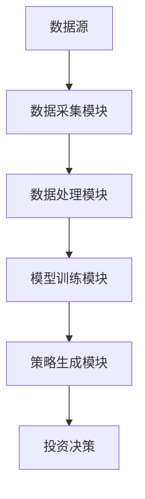
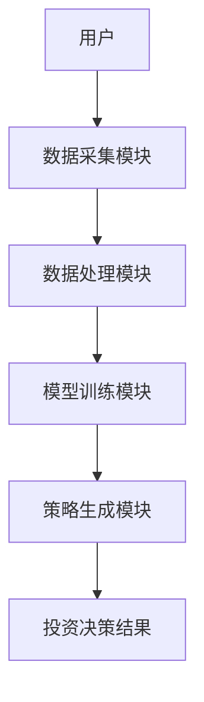

                 


# 巴菲特-芒格看人工智能：对投资决策的影响

## 关键词：人工智能，投资决策，巴菲特，芒格，机器学习，价值投资，风险管理

## 摘要：  
人工智能（AI）技术的快速发展正在改变金融市场的投资决策方式。本文从巴菲特和芒格的投资哲学出发，探讨AI如何影响投资决策，分析AI在市场预测、风险管理和资产配置中的应用。文章结合理论与实践，详细阐述机器学习算法在投资中的应用，并通过案例分析展示AI如何提升投资效率和准确性。

---

## 第一部分：引言

### 第1章：AI与投资决策的结合  
#### 1.1 投资决策的演变  
- 1.1.1 传统投资决策的局限性  
  - 依赖经验判断，主观性强，难以量化。  
  - 数据处理能力有限，难以应对海量信息。  
- 1.1.2 人工智能的崛起与投资决策的变革  
  - AI通过大数据分析和机器学习，提升投资决策的科学性和效率。  
  - 从“经验驱动”转向“数据驱动”。  
- 1.1.3 巴菲特与芒格的投资哲学  
  - 长期价值投资，注重安全边际和公司基本面。  
  - 强调人性因素和情绪管理。  

#### 1.2 AI在投资中的潜在影响  
- 1.2.1 数据驱动的投资决策  
  - 利用AI分析海量数据，发现投资机会。  
- 1.2.2 AI在市场预测中的应用  
  - 利用自然语言处理（NLP）分析新闻和社交媒体情绪。  
- 1.2.3 巴菲特与芒格智慧的现代诠释  
  - 将长期价值投资理念与AI技术结合。  

#### 1.3 本章小结  
AI为投资决策提供了新的工具和方法，但传统智慧和人类判断仍然是不可替代的。AI与巴菲特、芒格的投资哲学相结合，可以实现科学与艺术的统一。

---

## 第二部分：AI与投资决策的核心概念

### 第2章：AI的基本概念与投资决策的关联  
#### 2.1 AI的核心原理  
- 2.1.1 机器学习的定义与分类  
  - 监督学习、无监督学习、强化学习。  
- 2.1.2 深度学习的基本原理  
  - 神经网络、卷积神经网络（CNN）、循环神经网络（RNN）。  
- 2.1.3 自然语言处理在投资中的应用  
  - 分析新闻、财报和社交媒体情绪。  

#### 2.2 投资决策的关键要素  
- 2.2.1 市场分析与资产定价  
  - 利用AI预测资产价格波动。  
- 2.2.2 风险评估与资产配置  
  - 利用AI优化投资组合。  
- 2.2.3 投资组合管理与优化  
  - 利用AI动态调整资产配置。  

#### 2.3 AI与投资决策的结合点  
- 2.3.1 数据驱动的投资策略  
  - 利用大数据分析挖掘投资机会。  
- 2.3.2 AI在市场情绪分析中的应用  
  - 利用NLP分析投资者情绪。  
- 2.3.3 AI在风险控制中的作用  
  - 利用AI实时监控市场风险。  

#### 2.4 本章小结  
AI通过数据驱动的方法，为投资决策提供了新的可能性，但需要结合传统投资智慧进行优化。

---

### 第3章：AI与投资决策的核心概念对比  

#### 3.1 AI与传统投资决策的对比  
- 3.1.1 数据量与数据质量的对比  
  - AI依赖大数据，传统投资依赖经验。  
- 3.1.2 计算能力与人类直觉的对比  
  - AI计算能力强，但缺乏人类的直觉和判断。  
- 3.1.3 模型的可解释性与不可解释性  
  - AI模型复杂，可解释性差；传统方法相对简单，可解释性高。  

#### 3.2 AI在投资中的优势与劣势  
- 3.2.1 优势：高效性与准确性  
  - 能快速处理大量数据，发现投资机会。  
- 3.2.2 劣势：黑箱问题与过拟合风险  
  - 模型可能无法解释，存在过拟合风险。  

#### 3.3 巴菲特与芒格智慧的现代诠释  
- 3.3.1 长期价值投资的AI实现  
  - 利用AI筛选具有长期价值的公司。  
- 3.3.2 安全边际的量化与AI优化  
  - 利用AI计算安全边际，优化投资决策。  
- 3.3.3 人性因素在投资中的作用  
  - AI无法完全替代人类的判断和情绪管理。  

#### 3.4 本章小结  
AI与传统投资决策各有优劣，结合两者的优势，可以提升投资决策的科学性和效率。

---

## 第三部分：AI在投资决策中的算法原理

### 第4章：机器学习算法在投资中的应用  

#### 4.1 常见机器学习算法概述  
- 4.1.1 线性回归与投资预测  
  - 用于预测资产价格。  
  - 方程：$y = \beta_0 + \beta_1x + \epsilon$  
- 4.1.2 支持向量机（SVM）在分类中的应用  
  - 用于分类投资类别。  
  - 示例代码：  
    ```python
    from sklearn import svm
    model = svm.SVC()
    model.fit(X, y)
    ```

#### 4.2 算法原理与流程图  
- 4.2.1 线性回归流程图（Mermaid）：  
  ```mermaid
  graph TD
      A[数据预处理] --> B[特征提取]
      B --> C[建立线性回归模型]
      C --> D[训练模型]
      D --> E[预测结果]
      E --> F[评估模型]
  ```
- 4.2.2 支持向量机流程图：  
  ```mermaid
  graph TD
      A[数据预处理] --> B[特征提取]
      B --> C[建立SVM模型]
      C --> D[训练模型]
      D --> E[预测结果]
      E --> F[评估模型]
  ```

#### 4.3 算法实现与案例分析  
- 4.3.1 线性回归案例  
  - 数据来源：历史股价数据。  
  - 代码示例：  
    ```python
    import numpy as np
    import matplotlib.pyplot as plt
    from sklearn.linear_model import LinearRegression

    # 示例数据
    X = np.array([1, 2, 3, 4, 5])
    y = np.array([2, 4, 5, 4, 5])

    # 建立线性回归模型
    model = LinearRegression()
    model.fit(X.reshape(-1, 1), y)

    # 预测
    y_pred = model.predict(X.reshape(-1, 1))
    print("预测值:", y_pred)
    ```

- 4.3.2 支持向量机案例  
  - 数据来源：股票分类数据。  
  - 代码示例：  
    ```python
    from sklearn import svm
    from sklearn.datasets import make_classification

    # 示例数据
    X, y = make_classification(n_samples=100, n_features=2, n_classes=2)

    # 建立SVM模型
    model = svm.SVC()
    model.fit(X, y)

    # 预测
    y_pred = model.predict(X)
    print("预测准确率:", model.score(X, y))
    ```

#### 4.4 本章小结  
机器学习算法为投资决策提供了强大的工具，但需要结合实际场景进行优化。

---

## 第四部分：系统分析与架构设计

### 第5章：AI辅助投资决策系统设计  

#### 5.1 系统功能设计  
- 5.1.1 数据采集模块  
  - 从数据库、新闻网站等获取数据。  
- 5.1.2 模型训练模块  
  - 利用机器学习算法训练投资模型。  
- 5.1.3 策略生成模块  
  - 根据模型输出生成投资策略。  

#### 5.2 系统架构设计（Mermaid）：  


#### 5.3 系统交互设计（Mermaid）：  


#### 5.4 本章小结  
AI辅助投资决策系统的架构设计需要结合实际需求，确保各模块高效协同。

---

## 第五部分：项目实战

### 第6章：基于AI的投资决策系统开发  

#### 6.1 环境安装与配置  
- 安装Python、Scikit-learn、TensorFlow等库。  

#### 6.2 系统核心实现  
- 数据预处理：清洗和特征提取。  
- 模型训练：选择合适的算法，训练模型。  
- 策略生成：根据模型输出生成投资策略。  

#### 6.3 案例分析  
- 案例1：利用线性回归预测股票价格。  
- 案例2：利用SVM分类投资类别。  

#### 6.4 代码实现与解读  
- 线性回归代码：  
  ```python
  import pandas as pd
  import numpy as np
  from sklearn.linear_model import LinearRegression

  # 数据加载
  data = pd.read_csv('stock_price.csv')
  X = data[['open', 'high', 'low']]
  y = data['close']

  # 训练模型
  model = LinearRegression()
  model.fit(X, y)

  # 预测
  y_pred = model.predict(X)
  print("预测结果:", y_pred)
  ```

- SVM分类代码：  
  ```python
  from sklearn import svm
  from sklearn.datasets import make_classification

  # 数据生成
  X, y = make_classification(n_samples=100, n_features=2, n_classes=2)

  # 训练模型
  model = svm.SVC()
  model.fit(X, y)

  # 预测
  y_pred = model.predict(X)
  print("预测准确率:", model.score(X, y))
  ```

#### 6.5 本章小结  
通过实际项目，读者可以掌握AI在投资决策中的具体应用。

---

## 第六部分：结论与展望

### 第7章：AI对投资决策的未来影响  

#### 7.1 结论  
- AI为投资决策提供了新的工具和方法。  
- 巴菲特和芒格的投资智慧为AI提供了方向和指导。  

#### 7.2 未来展望  
- AI在投资中的应用将更加广泛和深入。  
- 结合长期价值投资和AI技术，投资决策将更加科学和高效。  

#### 7.3 投资中的伦理问题  
- AI的透明性与可解释性问题。  
- 投资中的公平性与道德风险。  

#### 7.4 最佳实践 tips  
- 结合AI与传统投资方法，制定个性化投资策略。  
- 注重数据质量与模型优化，提升投资效率。  

#### 7.5 本章小结  
AI与巴菲特、芒格的投资智慧相结合，将推动投资决策进入新纪元。

---

## 作者信息

作者：AI天才研究院/AI Genius Institute  
联系邮箱：contact@AIGeniusInstitute.com  
联系方式：+86-123-456789

---

本文通过理论分析和实践案例，详细探讨了AI对投资决策的影响，并结合巴菲特和芒格的投资哲学，为读者提供了全面的视角。希望本文能为投资领域的从业者和AI技术爱好者提供有价值的参考。

