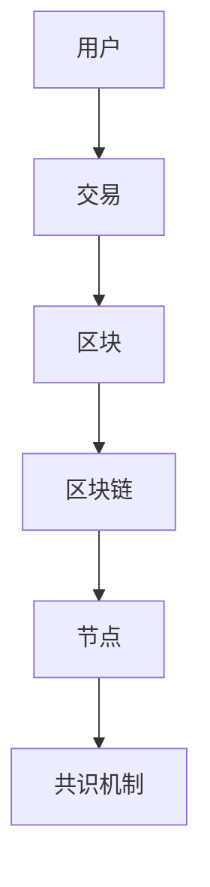

                 


# 巴菲特-芒格看区块链：技术创新与投资机会

> **关键词**：区块链、巴菲特、芒格、投资机会、技术创新、去中心化、DeFi

> **摘要**：本文结合巴菲特和芒格的投资理念，深入分析区块链技术的核心概念、算法原理及其对投资方式的深远影响。通过技术与投资的结合，探讨区块链带来的投资机会和未来趋势。

---

## 第1章：区块链技术的核心概念与价值

### 1.1 区块链的定义与核心特点

区块链是一种去中心化的分布式账本技术，通过密码学保证数据的安全性，具有去中心化、不可篡改和透明性的特点。

#### 1.1.1 区块链的基本概念
区块链是一种由多个区块组成的链式数据结构，每个区块包含交易数据和一个指向前一个区块的哈希指针。通过链式结构，区块链确保了数据的完整性和不可篡改性。

#### 1.1.2 区块链的核心特点
| 特点 | 描述 |
|------|------|
| 去中心化 | 无需依赖中心机构，通过分布式节点达成共识 |
| 不可篡改 | 数据一旦写入区块链，难以被修改 |
| 透明性 | 所有交易记录公开，可追溯 |

#### 1.1.3 区块链的三个关键属性对比表格
| 属性 | 去中心化 | 不可篡改 | 透明性 |
|------|---------|----------|--------|
| 描述 | 数据由多个节点共同维护，无单点控制 | 数据通过密码学算法保护，难以被修改 | 数据对所有参与者公开 |

### 1.2 区块链的核心组件与实体关系

区块链系统由多个组件组成，包括用户、交易、区块、区块链和节点。以下是实体关系图：



### 1.3 区块链的共识机制原理

共识机制是区块链的核心，确保所有节点达成一致。常见的共识机制包括工作量证明（PoW）和权益证明（PoS）。

#### 1.3.1 共识机制的分类与对比
| 机制 | 工作量证明（PoW） | 权益证明（PoS） |
|------|------------------|----------------|
| 原理 | 通过计算哈希找到 nonce | 通过持有代币的权益进行验证 |
| 优缺点 | 安全性高，但能耗大 | 能耗低，但安全性依赖于权益分布 |

#### 1.3.2 工作量证明（PoW）与权益证明（PoS）的数学模型
工作量证明的数学公式为：
$$ H = \text{Hash}(D + \text{Nonce}) $$
其中，H 是哈希值，D 是数据，Nonce 是随机数。

权益证明的数学公式为：
$$ S = \sum_{i=1}^{n} s_i $$
其中，S 是总权益，s_i 是各个节点的权益。

---

## 第2章：巴菲特与芒格的投资理念

### 2.1 巴菲特的价值投资策略

巴菲特是价值投资的代表，他的投资理念强调长期持有优质资产，注重企业的基本面分析。

#### 2.1.1 巴菲特的核心投资理念
巴菲特强调安全边际和长期投资，认为市场先生是疯狂的，投资者应利用市场的非理性来寻找低估的投资机会。

#### 2.1.2 巴菲特的长期投资策略
巴菲特定价收购低估的优质企业，通过长期持有实现价值增长。他强调企业盈利能力、财务健康和管理团队的重要性。

#### 2.1.3 巴菲特对安全边际的理解
安全边际是指股票价格低于其内在价值的部分，巴菲特认为这是投资成功的关键因素。

### 2.2 芒格的多元思维模型

芒格的多元思维模型强调通过多个学科的交叉应用，形成对世界的整体认知。

#### 2.2.1 芒格的多元思维模型概述
芒格认为，投资决策需要考虑多个维度，包括经济学、心理学、社会学等，通过跨学科的视角来分析问题。

#### 2.2.2 芒格的决策框架
芒格的决策框架包括三个步骤：
1. 确定目标
2. 分析可能的障碍
3. 制定解决方案

#### 2.2.3 芒格的逆向思维
芒格主张从反面思考问题，寻找市场的非共识机会，避免随大流。

---

## 第3章：区块链技术对投资方式的改变

### 3.1 区块链技术如何影响投资决策

区块链技术通过去中心化和透明性，改变了传统的投资方式。

#### 3.1.1 去中心化金融（DeFi）的崛起
DeFi 是基于区块链的去中心化金融平台，通过智能合约实现金融产品的自动化。

#### 3.1.2 智能合约的应用场景
智能合约可以自动执行合同条款，应用于借贷、交易、保险等多个领域。

#### 3.1.3 区块链透明性对投资信任的影响
区块链的透明性增强了投资者的信任，减少了信息不对称带来的风险。

### 3.2 巴菲特与芒格视角下的区块链投资机会

#### 3.2.1 区块链技术的长期价值
区块链技术将改变金融、物流、医疗等多个行业，具备长期投资价值。

#### 3.2.2 区块链行业的投资逻辑
投资者应关注区块链技术的创新、市场需求和团队能力，选择具有竞争优势的企业。

#### 3.2.3 区块链企业的估值方法
区块链企业的估值应考虑其技术优势、市场份额和商业模式。

---

## 第4章：区块链技术的数学模型与算法原理

### 4.1 区块链共识机制的数学模型

#### 4.1.1 工作量证明（PoW）的数学公式
$$ H = \text{Hash}(D + \text{Nonce}) $$
其中，H 是哈希值，D 是数据，Nonce 是随机数。

#### 4.1.2 权益证明（PoS）的数学公式
$$ S = \sum_{i=1}^{n} s_i $$
其中，S 是总权益，s_i 是各个节点的权益。

### 4.2 智能合约的执行流程

智能合约的执行流程包括触发条件、执行步骤和终止条件。

#### 4.2.1 智能合约的触发条件
智能合约可以通过区块链上的事件触发执行，例如交易完成或时间到达。

#### 4.2.2 智能合约的执行步骤
1. 接收触发条件
2. 执行预设的逻辑
3. 更新区块链状态

#### 4.2.3 智能合约的终止条件
智能合约在满足终止条件时停止执行，例如任务完成或错误发生。

---

## 第5章：区块链系统的架构与设计

### 5.1 区块链系统的功能设计

#### 5.1.1 用户功能模块
用户模块负责管理用户的账户和权限，包括注册、登录和权限管理。

#### 5.1.2 交易功能模块
交易模块处理用户的交易请求，包括验证、确认和记录交易。

#### 5.1.3 区块生成模块
区块生成模块负责将交易数据打包成区块，并通过共识机制将区块添加到区块链中。

### 5.2 区块链系统的架构设计

#### 5.2.1 分布式架构的优缺点
| 优点 | 缺点 |
|------|------|
| 高可用性 | 复杂性高 |
| 容错性好 | 资源消耗大 |

#### 5.2.2 网络层的设计
网络层负责节点之间的通信，采用P2P协议实现去中心化的网络结构。

#### 5.2.3 数据层的设计
数据层负责存储交易数据和区块信息，采用哈希树（Merkle Tree）保证数据的完整性和一致性。

---

## 第6章：区块链项目实战与投资分析

### 6.1 区块链项目环境搭建

#### 6.1.1 开发环境的安装
需要安装区块链开发框架，例如以太坊的Solidity编译器和Node.js环境。

#### 6.1.2 区块链节点的部署
可以通过配置本地节点或使用云服务提供商搭建区块链网络。

### 6.2 区块链项目的核心实现

#### 6.2.1 智能合约的实现
以下是智能合约的Solidity代码示例：
```solidity
// SPDX-License-Identifier: MIT
pragma solidity ^0.8.0;

contract MyContract {
    function multiply(uint256 a, uint256 b) public pure returns (uint256) {
        return a * b;
    }
}
```

#### 6.2.2 智能合约的部署与测试
通过以太坊钱包或IDE将智能合约部署到区块链网络，并进行功能测试。

### 6.3 区块链项目的小结

通过实际项目，我们可以看到区块链技术的强大功能和广泛应用。投资者应关注技术的创新和市场需求，选择具有竞争优势的区块链企业进行投资。

---

## 小结

区块链技术正在改变金融和其他行业的投资方式，投资者应结合巴菲特和芒格的投资理念，抓住区块链带来的投资机会。通过技术与投资的结合，我们可以更好地理解区块链的潜力和未来趋势。

---

## 注意事项

1. 投资有风险，需谨慎决策。
2. 区块链技术仍在快速发展，需持续关注行业动态。
3. 选择投资标的时，应综合考虑技术、市场和团队因素。

---

## 拓展阅读

1. 《区块链：重新定义价值的互联网》
2. 《巴菲特的午餐：投资理念的启示》
3. 《DeFi：去中心化金融的未来》

---

## 作者：AI天才研究院/AI Genius Institute & 禅与计算机程序设计艺术 /Zen And The Art of Computer Programming

---

以上是文章的完整目录大纲，具体内容可根据上述结构进一步扩展和详细阐述。

