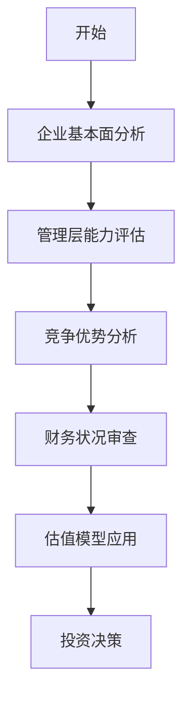

                 

# 巴菲特-芒格看待科技创新：机遇与风险的平衡

## 关键词：巴菲特，芒格，科技创新，投资，风险管理

## 摘要：本文从巴菲特和芒格的投资哲学出发，分析他们对科技创新的机遇与风险的看法。通过详细阐述价值投资原则、安全边际概念、科技企业评估方法，结合实际案例和系统架构设计，探讨如何在科技创新中实现机遇与风险的平衡。

---

## # 第一部分：巴菲特与芒格的投资哲学

### ## 第1章：巴菲特与芒格的投资理念

#### ### 1.1 巴菲特与芒格的背景介绍

- **巴菲特的投资哲学**  
  巴菲特是价值投资的代表人物，强调以合理价格买入优秀企业，长期持有。他提出的“安全边际”概念，即买入价格低于内在价值，是价值投资的核心。

- **芒格的多元思维模型**  
  芒格强调跨学科思维，认为投资决策需要考虑物理学、心理学、经济学等多个领域的知识。他提出的“格栅思维”帮助投资者避免认知偏差。

- **两人合作的投资理念**  
  巴菲特和芒格的合作基于对价值投资的共同信仰，芒格的多元思维模型为巴菲特的投资决策提供了理论支持。

#### ### 1.2 价值投资的核心原则

- **价值投资的定义与特点**  
  价值投资是寻找市场定价低于内在价值的企业进行投资。其特点包括长期持有、注重基本面分析、强调安全边际。

- **质价理论与市场先生**  
  巴菲特将市场波动比作“市场先生”，强调投资者应避免被短期市场波动干扰，专注于企业的内在价值。

- **安全边际的概念与应用**  
  安全边际是指买入价格与内在价值的差距，用于降低投资风险。在科技投资中，安全边际尤为重要，因为科技企业的估值往往波动较大。

#### ### 1.3 科技创新与价值投资的结合

- **科技创新对价值投资的影响**  
  科技创新改变了企业的商业模式和竞争优势，但也带来了新的投资机会。例如，互联网和人工智能技术的革新为企业创造了新的增长点。

- **芒格对科技企业的看法**  
  芒格认为科技企业的投资需要谨慎，因为技术变革可能导致企业迅速过时。他强调管理层能力和商业模式的重要性。

- **巴菲特对科技创新的态度**  
  巴菲特对科技创新持开放态度，但更倾向于投资那些具有强大护城河和稳定现金流的企业。

---

## # 第二部分：科技创新的机遇与挑战

### ## 第2章：科技创新的背景与趋势

#### ### 2.1 科技革命的历史演变

- **工业革命到信息革命**  
  从机械化生产到数字化转型，科技革命推动了社会的进步和经济的发展。

- **数字化与智能化的浪潮**  
  当前，人工智能、大数据、区块链等技术正在改变传统行业，创造新的商业模式。

- **当前科技发展的主要方向**  
  包括人工智能、量子计算、生物技术等领域，这些技术将对未来社会产生深远影响。

#### ### 2.2 科技创新对企业的影响

- **企业竞争优势的变化**  
  科技创新改变了企业的竞争优势，数据和技术成为核心资产。

- **商业模式的创新**  
  科技创新推动了订阅制、共享经济等新型商业模式的出现。

- **科技企业的估值挑战**  
  科技企业的估值需要考虑未来现金流和技术创新的可持续性，这增加了投资的复杂性。

---

## # 第三部分：科技创新中的风险管理

### ## 第3章：科技创新的风险分析

#### ### 3.1 科技创新的风险类型

- **技术风险**  
  技术创新可能失败，导致企业损失。例如，某科技公司研发投入巨大但未能成功商业化。

- **市场风险**  
  市场需求不足或竞争加剧可能导致科技企业盈利能力下降。

- **政策风险**  
  政府政策的变化可能对科技行业产生重大影响，例如数据隐私法规的收紧。

#### ### 3.2 投资决策框架

- **投资决策框架的概念**  
  通过系统化的分析框架，投资者可以更清晰地评估科技企业的投资价值。

- **基于芒格的决策树**  
  使用mermaid绘制决策树，展示从企业基本面分析到投资决策的逻辑。

#### ### 3.3 风险管理策略

- **分散投资**  
  将资金分配到不同科技领域，降低单一技术失败的风险。

- **长期视角**  
  科技创新需要时间验证，投资者应保持耐心，避免短期波动干扰。

- **动态调整**  
  定期评估投资组合，根据市场变化和企业表现进行调整。

---

## # 第四部分：实际案例分析

### ## 第4章：巴菲特与芒格的投资案例

#### ### 4.1 成功案例：苹果公司

- **苹果的投资历程**  
  巴菲特通过芒格推荐投资苹果，看重其强大的品牌和技术优势。

- **投资回报分析**  
  苹果的股价长期上涨，为投资者带来丰厚回报。

#### ### 4.2 失败案例：IBM的投资教训

- **IBM的投资决策**  
  巴菲特曾投资IBM，但未能准确预判其在云计算领域的竞争劣势。

- **教训总结**  
  技术变革对企业的影响复杂，投资者需更谨慎评估。

#### ### 4.3 中概科技股的投资启示

- **中概科技股的现状**  
  包括阿里巴巴、腾讯等企业的投资机会与风险。

- **投资策略调整**  
  加强对管理层能力和企业护城河的分析，降低政策风险。

---

## # 第五部分：系统化的投资策略

### ## 第5章：投资策略与风险管理

#### ### 5.1 长期投资的重要性

- **长期投资的优势**  
  避免短期波动干扰，享受企业成长的复利效应。

#### ### 5.2 投资组合的构建

- **资产配置建议**  
  将资金分配到科技、消费、金融等多个领域，分散风险。

#### ### 5.3 价值投资在科技领域的应用

- **寻找低估的科技企业**  
  通过估值模型和财务分析，识别具有成长潜力的科技企业。

---

## # 结论

巴菲特和芒格的投资哲学为科技创新投资提供了宝贵的启示。通过价值投资原则和风险管理策略，投资者可以在科技浪潮中把握机遇，规避风险。未来的科技创新将带来更多挑战，但也将创造更多投资机会。投资者需要保持谨慎，结合长期视角和多元化策略，实现投资目标。

---

## 作者：AI天才研究院 & 禅与计算机程序设计艺术

--- 

希望这篇文章能够帮助您理解巴菲特和芒格看待科技创新的视角，以及如何在机遇与风险之间找到平衡。

