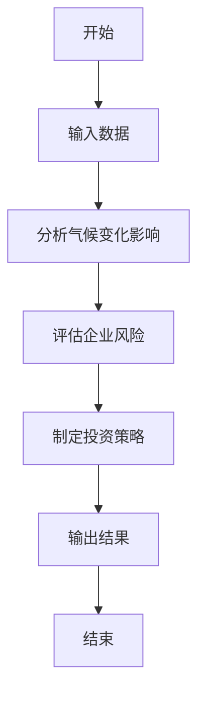

                 


# 巴菲特-芒格看气候变化：对投资决策的影响

## 关键词：巴菲特，芒格，气候变化，投资决策，风险管理，可持续发展

## 摘要： 
本文探讨了气候变化对投资决策的影响，分析了巴菲特和芒格的投资理念，以及他们如何在气候变化的背景下调整投资策略。文章从背景介绍、核心概念、算法原理、系统分析、项目实战等多个方面展开，结合实际案例和数据分析，为投资者提供了在气候变化背景下进行投资决策的深度分析和实用建议。

---

# 第一部分：引言

## 1.1 气候变化与投资决策的关联性

### 1.1.1 气候变化的定义与科学基础
气候变化是指地球气候系统的长期变化，主要由人类活动导致的温室气体排放引起。科学上，气候变化会导致极端天气事件增加、海平面上升和生态系统破坏。这些变化对经济、社会和企业运营产生了深远影响。

### 1.1.2 气候变化对全球经济的影响
气候变化不仅影响环境，还会对全球经济产生重大影响。例如，极端天气可能导致农作物减产、基础设施损坏，进而影响企业的盈利能力。此外，气候变化还可能导致政策变化，例如碳税的实施，进一步影响企业的成本结构。

### 1.1.3 投资决策中的长期风险与机会
投资者需要关注气候变化带来的长期风险和机会。例如，传统能源行业可能面临转型压力，而绿色能源行业则可能迎来快速发展。投资者需要评估企业在应对气候变化方面的准备情况，以识别投资风险和机会。

## 1.2 巴菲特与芒格的投资理念

### 1.2.1 巴菲特的价值投资原则
巴菲特的价值投资理念强调长期投资、安全边际和公司基本面分析。他认为，投资的核心是找到那些具有持续竞争优势、良好管理和强大财务状况的企业。

### 1.2.2 芒格的多元思维模型
芒格的多元思维模型强调从多个学科的角度分析问题，注重长期趋势和潜在风险。他认为，投资者需要具备跨学科的知识，以便更好地理解复杂的投资环境。

### 1.2.3 两人投资决策的共同点与差异
尽管巴菲特和芒格的投资理念有相似之处，但也有差异。巴菲特更注重企业的财务指标和短期盈利能力，而芒格则更关注长期趋势和企业的社会影响。两人在风险管理方面都非常重视，但芒格更倾向于从多个角度分析风险。

## 1.3 本书的目的与结构
### 1.3.1 本书的核心问题
本书旨在探讨气候变化对投资决策的影响，并分析巴菲特和芒格的投资理念如何在气候变化背景下发生变化。

### 1.3.2 本书的章节安排
本书将从背景介绍、核心概念、投资策略、系统分析和项目实战等方面展开，帮助读者全面理解气候变化对投资的影响。

### 1.3.3 如何阅读本书
读者可以通过本书了解气候变化的经济影响、巴菲特和芒格的投资策略、风险管理方法以及实际案例分析，从而掌握在气候变化背景下进行投资决策的技巧。

---

# 第二部分：气候变化对投资的影响

## 2.1 气候变化的经济影响分析

### 2.1.1 气候变化对能源行业的冲击
气候变化可能导致能源行业的转型。例如，传统化石能源企业可能面临需求下降，而绿色能源企业可能迎来发展机遇。投资者需要评估企业在绿色能源转型中的准备情况。

### 2.1.2 气候变化对农业的影响
气候变化可能导致农作物减产，进而影响农业企业的盈利能力。投资者需要关注企业在应对气候变化方面的技术储备和市场策略。

### 2.1.3 气候变化对保险业的挑战
气候变化可能导致极端天气事件增加，从而增加保险公司的赔付风险。投资者需要评估保险公司在应对气候变化方面的风险管理能力。

## 2.2 巴菲特与芒格视角下的投资策略

### 2.2.1 长期投资视角下的气候变化风险
巴菲特和芒格都认为，气候变化是一个长期趋势，投资者需要关注企业在长期气候变化背景下的竞争力。他们倾向于投资那些能够适应气候变化并从中获益的企业。

### 2.2.2 股东权益与公司治理中的气候因素
巴菲特和芒格强调股东权益的重要性，认为企业应该注重股东利益。在气候变化背景下，他们关注企业的治理结构是否能够有效应对气候变化带来的风险。

### 2.2.3 绿色投资与可持续发展的机会
巴菲特和芒格认为，绿色投资是一个重要的机会。他们倾向于投资那些在绿色技术、可持续发展方面有优势的企业。例如，巴菲特曾投资特斯拉，认为其在电动汽车领域的领先地位将受益于绿色投资趋势。

## 2.3 气候变化对传统行业的影响

### 2.3.1 石油与天然气行业的转型
气候变化可能导致石油和天然气行业的转型。传统能源企业需要转型为绿色能源企业，投资者需要评估企业的转型能力和市场需求。

### 2.3.2 汽车行业的电动化趋势
气候变化推动了汽车行业的电动化趋势。电动汽车企业如特斯拉可能成为投资者的首选。投资者需要关注企业的技术优势和市场前景。

### 2.3.3 建筑行业的绿色化发展
气候变化推动了建筑行业的绿色化发展。绿色建筑企业可能面临更多的市场需求，投资者需要关注企业在绿色建筑技术方面的创新能力。

---

# 第三部分：投资策略与风险管理

## 3.1 巴菲特与芒格的投资策略

### 3.1.1 股票选择的标准
巴菲特和芒格在股票选择上注重企业的基本面、管理层素质和财务状况。在气候变化背景下，他们倾向于选择那些具有绿色技术优势和长期竞争力的企业。

### 3.1.2 风险管理的技巧
巴菲特和芒格强调风险管理的重要性。他们倾向于分散投资、设定止损点，并关注企业的风险暴露情况。在气候变化背景下，他们关注企业的碳排放风险和政策风险。

### 3.1.3 长期投资的耐心与纪律
巴菲特和芒格认为，长期投资需要耐心和纪律。在气候变化背景下，他们倾向于长期持有优质股票，避免短期波动的影响。

## 3.2 气候变化下的投资组合优化

### 3.2.1 绿色能源的投资机会
绿色能源行业如太阳能、风能等可能成为投资的重点。投资者需要关注企业的技术优势、市场前景和政策支持。

### 3.2.2 可再生能源的技术进步
可再生能源技术的进步将推动行业的发展。投资者需要关注企业的技术创新能力和市场竞争力。

### 3.2.3 碳中和目标下的投资策略
碳中和目标为绿色投资提供了新的机会。投资者需要关注那些在碳中和目标下具有优势的企业，例如电动汽车、绿色建筑等领域。

## 3.3 风险管理与资产配置

### 3.3.1 气候风险的量化与评估
投资者需要量化气候变化带来的风险，例如通过碳足迹分析和情景分析。这有助于投资者评估企业的风险暴露情况。

### 3.3.2 资产配置的动态调整
投资者需要根据气候变化的趋势动态调整资产配置。例如，在气候变化风险较高的行业减少投资，增加对绿色能源企业的投资。

### 3.3.3 投资组合的分散化策略
通过分散化投资，投资者可以降低气候变化带来的风险。例如，投资于不同行业的企业，以分散气候变化的影响。

---

# 第四部分：系统分析与架构设计

## 4.1 气候变化对经济系统的系统性影响

### 4.1.1 经济系统的复杂性
经济系统是一个复杂的系统，涉及多个行业和领域。气候变化可能导致经济系统的连锁反应，例如供应链中断和市场需求变化。

### 4.1.2 气候变化的连锁反应
气候变化可能导致极端天气事件增加，进而影响企业的生产和供应链。投资者需要关注企业在供应链管理中的应对能力。

### 4.1.3 系统性风险的评估框架
系统性风险是指气候变化可能导致的广泛经济影响。投资者需要建立系统性风险评估框架，以识别和应对潜在风险。

## 4.2 投资决策的系统性分析

### 4.2.1 问题场景介绍
投资者需要分析气候变化对企业的影响，包括企业的财务状况、市场前景和政策风险。

### 4.2.2 项目介绍
以投资特斯拉为例，分析企业在电动汽车领域的竞争优势和市场前景。

### 4.2.3 系统功能设计
使用领域模型Mermaid类图，展示企业在气候变化背景下的核心功能和竞争优势。

### 4.2.4 系统架构设计
使用Mermaid架构图，展示系统的整体架构，包括前端、后端和数据存储部分。

### 4.2.5 系统接口设计
描述系统与其他系统的接口，例如数据接口和用户接口。

### 4.2.6 系统交互序列图
使用Mermaid序列图，展示系统在气候变化背景下的交互流程。

## 4.3 算法原理讲解

### 4.3.1 使用Mermaid画出算法流程图


### 4.3.2 使用Python代码实现
```python
def climate_investment_analysis(data):
    # 分析气候变化对企业的影响
    risk = data['风险评估']
    opportunity = data['机会分析']
    if risk < 0.5 and opportunity > 0.7:
        return "投资建议：买入"
    elif risk > 0.8:
        return "投资建议：卖出"
    else:
        return "投资建议：观望"

# 示例数据
data = {
    '风险评估': 0.6,
    '机会分析': 0.8
}

result = climate_investment_analysis(data)
print(result)
```

### 4.3.3 数学模型和公式
$$
\text{投资决策} = \begin{cases}
\text{买入} & \text{如果风险 < 0.5 且机会 > 0.7} \\
\text{卖出} & \text{如果风险 > 0.8} \\
\text{观望} & \text{其他情况}
\end{cases}
$$

---

# 第五部分：项目实战

## 5.1 环境安装

### 5.1.1 安装Python和必要的库
```bash
pip install numpy pandas matplotlib
```

## 5.2 核心实现源代码

### 5.2.1 数据分析
```python
import pandas as pd

data = pd.read_csv('climate_investment.csv')
print(data.head())
```

### 5.2.2 可视化分析
```python
import matplotlib.pyplot as plt

plt.plot(data['年份'], data['投资回报率'])
plt.xlabel('年份')
plt.ylabel('投资回报率')
plt.title('气候变化对投资回报率的影响')
plt.show()
```

## 5.3 应用解读与分析

### 5.3.1 投资回报率分析
从图中可以看出，气候变化对投资回报率的影响在不同年份有所不同。在某些年份，气候变化可能导致投资回报率下降，而在其他年份，可能带来投资机会。

### 5.3.2 投资策略调整
根据数据分析结果，投资者可以调整投资策略。例如，在气候变化风险较高的年份，减少对传统能源行业的投资，增加对绿色能源企业的投资。

## 5.4 实际案例分析

### 5.4.1 投资特斯拉的案例
特斯拉是电动汽车领域的领导者，受益于绿色投资趋势。投资者可以分析特斯拉的财务数据、技术优势和市场前景，评估其投资价值。

### 5.4.2 投资绿色能源公司的案例
选择一家绿色能源公司，分析其财务状况、技术优势和市场前景，评估其投资价值。

## 5.5 项目小结

### 5.5.1 项目总结
通过实际案例分析，投资者可以更好地理解气候变化对投资决策的影响。绿色能源行业可能成为未来的投资热点，投资者需要关注企业的技术优势和市场前景。

### 5.5.2 经验与教训
在实际投资中，投资者需要结合多种因素进行综合分析，包括企业的财务状况、技术优势、市场前景和政策环境等。同时，投资者需要关注企业的长期发展潜力，避免短期波动的影响。

---

# 第六部分：总结与展望

## 6.1 总结

### 6.1.1 本文的核心观点
气候变化对投资决策的影响不容忽视。投资者需要关注企业在气候变化背景下的风险和机会，选择具有长期竞争力的企业进行投资。

### 6.1.2 本文的主要结论
巴菲特和芒格的投资理念在气候变化背景下仍然适用。他们倾向于长期投资、注重企业基本面和风险管理。投资者需要关注绿色能源行业，选择具有技术优势和市场前景的企业。

## 6.2 未来展望

### 6.2.1 气候变化与投资的未来趋势
随着全球气候变化的加剧，绿色投资将成为未来的趋势。投资者需要关注绿色技术、可持续发展和碳中和目标，选择具有长期竞争优势的企业。

### 6.2.2 巴菲特与芒格投资理念的演变
巴菲特和芒格的投资理念可能会随着气候变化的趋势而演变。他们可能会更加关注绿色能源行业，选择那些在可持续发展方面具有优势的企业。

---

# 附录

## 附录A：数据来源与工具介绍

### 附录A.1 数据来源
数据来源包括公开的财务数据、行业报告和学术研究。投资者可以参考这些数据进行投资分析。

### 附录A.2 工具介绍
常用的工具包括Python、Pandas、Matplotlib和Scikit-learn等。这些工具可以帮助投资者进行数据分析、可视化和建模。

## 附录B：进一步阅读

### 附录B.1 推荐书籍
- 《The Intelligent Investor》 by Benjamin Graham
- 《Poor Charlie's Almanack》 by Charlie Munger

### 附录B.2 推荐博客和网站
-巴菲特的官方网站：https://www.sagacity.com/
-芒格的官方网站：https://www.scripophilist.com/

---

# 作者

作者：AI天才研究院/AI Genius Institute & 禅与计算机程序设计艺术 /Zen And The Art of Computer Programming

---

**感谢您的耐心阅读！希望本文能为您提供有价值的投资决策参考。**

