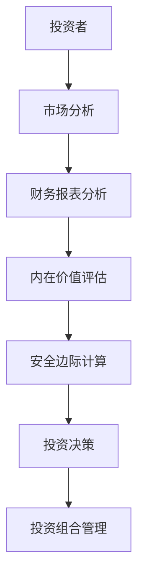

                 


# 巴菲特-芒格策略在不同市场环境下的表现

---

## 关键词：
巴菲特，芒格，价值投资，市场环境，投资策略

---

## 摘要：
本文深入分析了巴菲特和芒格的投资策略在不同市场环境下的表现，探讨了其在牛市、熊市、经济衰退和新兴市场中的具体应用。通过结合实际案例、数学模型和系统架构，本文揭示了巴菲特-芒格策略的核心要素及其在复杂市场环境中的适应性，为投资者提供了实用的指导和启示。

---

# 第一部分: 巴菲特-芒格策略概述

## 第1章: 巴菲特与芒格的投资理念

### 1.1 巴菲特与芒格的生平简介

#### 1.1.1 巴菲特的生平与投资历程

沃伦·巴菲特（Warren Buffett）是世界著名的投资者和慈善家，被誉为“股神”。他于1934年出生在美国奥马哈市，早年通过投资股票积累了第一桶金。巴菲特的投资理念以价值投资为核心，强调长期持有和安全边际。他创立的伯克希尔·哈撒韦公司（Berkshire Hathaway）成为全球最具影响力的投资公司之一。

#### 1.1.2 芒格的生平与投资哲学

查理·芒格（Charlie Munger）是巴菲特的长期合作伙伴，也是伯克希尔·哈撒韦公司的副主席。芒格以其独特的投资哲学和思维模式闻名，强调逆向思维和多元思维模型。他的投资理念注重对企业内在价值的深入分析和风险控制，与巴菲特形成了互补。

#### 1.1.3 两人合作的里程碑事件

巴菲特和芒格的合作始于20世纪50年代，两人共同创立了伯克希尔·哈撒韦公司，并在投资领域取得了巨大成功。他们的合作以价值投资为核心，通过长期持有优质股票，取得了超越市场的收益，成为投资界的经典案例。

---

### 1.2 价值投资的核心理念

#### 1.2.1 价值投资的定义与内涵

价值投资是一种以企业内在价值为核心的投资策略。巴菲特和芒格认为，股票的价值取决于企业的基本面，包括财务状况、盈利能力、行业地位等因素。投资者应以低于企业内在价值的价格买入股票，并长期持有，等待价值实现。

#### 1.2.2 巴菲特-芒格策略的核心要素

1. **内在价值评估**：通过财务报表分析，评估企业的实际价值。
2. **安全边际**：以低于内在价值的价格买入股票，以规避市场波动风险。
3. **长期持有**：避免短期市场波动，专注于企业的长期价值增长。

#### 1.2.3 价值投资与长期主义的结合

巴菲特和芒格强调长期投资，认为市场短期波动无法预测，但优质企业的长期价值是可确定的。他们通过长期持有优质股票，实现财富的稳定增长。

---

## 第2章: 巴菲特-芒格策略的关键原则

### 2.1 财务报表分析与企业评估

#### 2.1.1 财务报表分析的基本方法

巴菲特和芒格非常重视企业的财务报表分析，尤其是盈利能力、财务状况和成长能力。他们通过分析收入、利润、负债等指标，评估企业的财务健康状况。

#### 2.1.2 企业内在价值的评估模型

内在价值 = (净利润 × (P/E 市盈率)) / 市场利率

其中，P/E 市盈率反映了市场对企业的估值，市场利率则影响企业的融资成本。巴菲特和芒格通过比较企业的内在价值与市场价值，确定投资机会。

#### 2.1.3 账面价值与市场价值的对比

账面价值是企业财务报表上的净值，而市场价值是股票的市场价格。巴菲特和芒格强调以低于账面价值的价格买入股票，确保安全边际。

---

### 2.2 安全边际与风险控制

#### 2.2.1 安全边际的定义与作用

安全边际是巴菲特和芒格策略的核心要素之一。它是指股票的市场价格低于其内在价值的部分，用于规避市场波动带来的风险。

#### 2.2.2 风险控制的策略与方法

1. **分散投资**：通过投资不同行业和地区的股票，降低风险。
2. **长期持有**：避免短期波动，降低交易成本。
3. **安全边际**：以低于内在价值的价格买入股票。

#### 2.2.3 安全边际在投资决策中的应用

通过计算股票的内在价值和市场价格，确定安全边际。如果市场价格低于内在价值，则存在投资机会。

---

### 2.3 股票与市场的长期视角

#### 2.3.1 股票投资的长期视角

巴菲特和芒格认为，股票市场的长期趋势是由优质企业的长期价值驱动的。他们强调长期持有优质股票，避免短期波动。

#### 2.3.2 市场波动与投资机会

市场波动为投资者提供了以低价买入优质股票的机会。巴菲特和芒格通过逆向思维，在市场恐慌时寻找投资机会。

#### 2.3.3 长期持有与价值实现

长期持有优质股票，能够分享企业的长期成长，实现财富的稳定增长。

---

# 第二部分: 不同市场环境下的策略表现

## 第3章: 牛市环境下的巴菲特-芒格策略

### 3.1 牛市环境的特点与挑战

#### 3.1.1 牛市的定义与特征

牛市是指股票市场整体上涨，投资者信心高涨的市场环境。牛市中，股票价格通常高于其内在价值，市场情绪乐观。

#### 3.1.2 牛市对企业价值的影响

牛市中，企业的市场价值可能高于其内在价值，导致泡沫。巴菲特和芒格提醒投资者要警惕市场泡沫，避免过度投资。

#### 3.1.3 牛市中的投资机会与风险

牛市中，优质股票的价格可能被高估，投资机会减少。同时，市场波动较大，风险增加。

---

### 3.2 巴菲特-芒格策略在牛市中的应用

#### 3.2.1 高质量企业的筛选标准

巴菲特和芒格在牛市中依然坚持选择高质量企业，注重企业的基本面和长期盈利能力。

#### 3.2.2 安全边际的调整与优化

在牛市中，股票价格可能高于内在价值，安全边际减少。巴菲特和芒格会调整投资组合，降低风险。

#### 3.2.3 长期持有与价值增长的平衡

在牛市中，巴菲特和芒格依然坚持长期持有优质股票，避免短期交易，分享企业的长期成长。

---

## 第4章: 熊市环境下的巴菲特-芒格策略

### 4.1 熊市环境的特点与挑战

#### 4.1.1 熊市的定义与特征

熊市是指股票市场整体下跌，投资者信心低迷的市场环境。熊市中，股票价格通常低于其内在价值，市场情绪悲观。

#### 4.1.2 熊市对企业价值的影响

熊市中，企业的市场价值可能低于其内在价值，为投资者提供了以低价买入优质股票的机会。

#### 4.1.3 熊市中的投资机会与风险

熊市中，优质股票的价格可能被低估，投资机会增加。同时，市场波动较大，风险增加。

---

### 4.2 巴菲特-芒格策略在熊市中的应用

#### 4.2.1 企业内在价值的重新评估

在熊市中，巴菲特和芒格会重新评估企业的内在价值，寻找被市场低估的优质股票。

#### 4.2.2 安全边际的扩大与风险控制

在熊市中，股票价格可能低于内在价值，安全边际增加。巴菲特和芒格会扩大安全边际，降低投资风险。

#### 4.2.3 熊市中的逆向投资策略

巴菲特和芒格在熊市中采取逆向投资策略，买入被市场抛弃的优质股票，分享其未来的成长。

---

## 第5章: 经济衰退环境下的巴菲特-芒格策略

### 5.1 经济衰退环境的特点与挑战

#### 5.1.1 经济衰退的定义与特征

经济衰退是指经济活动显著下降，通常伴随着高失业率、低经济增长和市场信心不足。经济衰退对企业盈利能力和股票市场产生重大影响。

#### 5.1.2 经济衰退对企业价值的影响

经济衰退中，企业的盈利能力可能下降，市场价值可能低于内在价值。巴菲特和芒格提醒投资者要关注企业的财务健康状况。

#### 5.1.3 经济衰退中的投资机会与风险

经济衰退中，优质股票的价格可能被低估，投资机会增加。同时，经济衰退可能导致企业倒闭，增加投资风险。

---

### 5.2 巴菲特-芒格策略在经济衰退中的应用

#### 5.2.1 高质量企业的筛选标准

在经济衰退中，巴菲特和芒格依然注重选择高质量企业，尤其是那些具有强大财务状况和长期盈利能力的企业。

#### 5.2.2 安全边际的调整与优化

在经济衰退中，股票价格可能低于内在价值，安全边际增加。巴菲特和芒格会调整投资组合，降低风险。

#### 5.2.3 长期持有与价值增长的平衡

在经济衰退中，巴菲特和芒格依然坚持长期持有优质股票，分享企业的长期成长。

---

## 第6章: 新兴市场环境下的巴菲特-芒格策略

### 6.1 新兴市场环境的特点与挑战

#### 6.1.1 新兴市场的定义与特征

新兴市场是指经济发展迅速、市场潜力大的国家或地区，如中国、印度等。新兴市场通常具有高增长潜力，但也伴随着高风险。

#### 6.1.2 新兴市场对企业价值的影响

新兴市场中，企业的增长潜力较大，但市场波动也较大。巴菲特和芒格提醒投资者要关注企业的基本面和长期盈利能力。

#### 6.1.3 新兴市场中的投资机会与风险

新兴市场中，优质股票的价格可能被低估，投资机会增加。同时，新兴市场的不确定性和高波动性增加了投资风险。

---

### 6.2 巴菲特-芒格策略在新兴市场中的应用

#### 6.2.1 高质量企业的筛选标准

在新兴市场中，巴菲特和芒格依然注重选择具有强大财务状况和长期盈利能力的企业。

#### 6.2.2 安全边际的调整与优化

在新兴市场中，股票价格可能波动较大，安全边际需要动态调整。巴菲特和芒格会根据市场环境和企业基本面，调整投资组合。

#### 6.2.3 长期持有与价值增长的平衡

在新兴市场中，巴菲特和芒格依然坚持长期持有优质股票，分享企业的长期成长。

---

## 附录

### 附录A: 巴菲特-芒格策略的数学模型

$$ \text{内在价值} = \frac{\text{净利润} \times (P/E \text{ 市盈率})}{\text{市场利率}} $$

### 附录B: 巴菲特-芒格策略的系统架构图



### 附录C: 巴菲特-芒格策略的Python实现示例

```python
def calculate_intrinsic_value(net_profit, pe_ratio, market_rate):
    return (net_profit * pe_ratio) / market_rate

# 示例数据
net_profit = 100  # 净利润（百万美元）
pe_ratio = 15     # 市盈率
market_rate = 5    # 市场利率（%）

intrinsic_value = calculate_intrinsic_value(net_profit, pe_ratio, market_rate)
print(f"内在价值为: {intrinsic_value}百万美元")
```

---

## 结语

巴菲特和芒格的投资策略在不同市场环境下表现出色，其核心理念是长期持有优质股票，注重安全边际和内在价值评估。无论市场环境如何变化，巴菲特和芒格始终坚持价值投资，为投资者提供了宝贵的经验和启示。

作者：AI天才研究院 & 禅与计算机程序设计艺术

