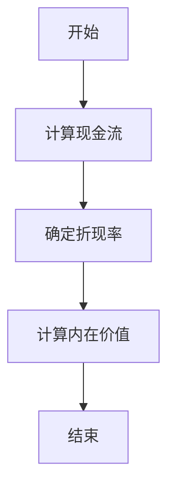
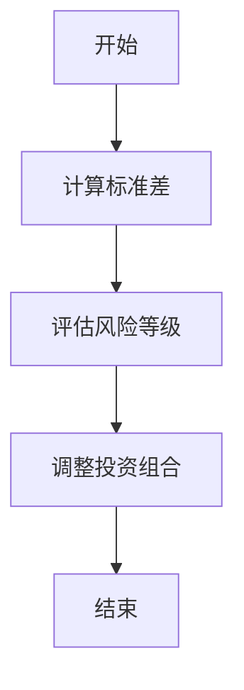
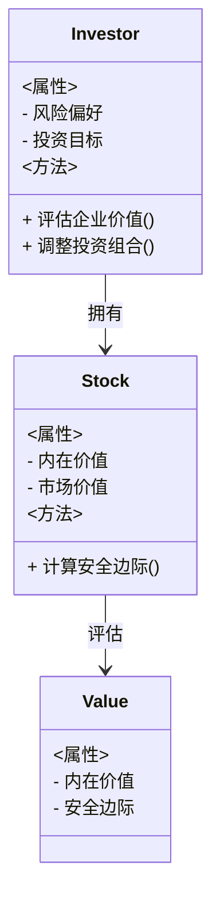

                 


# 巴菲特-芒格策略在个人投资中的应用

> **关键词**：巴菲特，芒格，价值投资，风险管理，长期思维，投资策略，个人投资  
> **摘要**：本文深入探讨了巴菲特和芒格的投资策略，分析了其核心概念、数学模型、算法原理以及系统架构。通过实际案例和工具的应用，指导读者如何将这些策略应用于个人投资中，以实现长期稳定的收益。

---

## 第一部分: 巴菲特-芒格策略的背景与核心概念

### 第1章: 巴菲特-芒格策略概述

#### 1.1 巴菲特-芒格策略的背景介绍
##### 1.1.1 投资领域的核心问题与挑战
投资领域充满了不确定性，投资者需要在有限的信息和资源下做出决策。巴菲特和芒格的策略强调长期价值，而非短期波动，这在传统投资方法中是一个创新。

##### 1.1.2 巴菲特-芒格策略的提出与核心思想
巴菲特和芒格的核心思想是寻找具有持续竞争优势的企业，进行长期投资。他们强调安全边际和内在价值，避免短期市场波动的影响。

##### 1.1.3 策略的边界与外延
巴菲特-芒格策略适用于长期价值投资，但并不适用于所有市场环境。在极端市场波动或企业基本面变化时，需要调整策略。

#### 1.2 巴菲特-芒格策略的核心概念与联系
##### 1.2.1 核心概念原理
- **内在价值**：企业未来现金流的现值。
- **安全边际**：购买价格低于内在价值，以降低风险。

##### 1.2.2 核心概念属性特征对比表格
| 属性 | 内在价值 | 安全边际 |
|------|----------|----------|
| 定义 | 未来现金流的现值 | 购买价格低于内在价值 |
| 目的 | 确定企业价值 | 降低投资风险 |
| 计算 | 肖恩公式：$IV = \sum_{t=1}^{n} \frac{CF_t}{(1+r)^t}$ | $Price < IV$ |

##### 1.2.3 实体关系图（ER图）架构
```mermaid
erDiagram
    investor <--- owns : "拥有" --> stock
    stock <.. evaluated : "评估" ..> value
    value <--> risk
```

---

### 第2章: 巴菲特-芒格策略的数学模型与算法原理

#### 2.1 巴菲特-芒格策略的数学模型
##### 2.1.1 价值评估模型
使用肖恩公式计算内在价值：
$$IV = \sum_{t=1}^{n} \frac{CF_t}{(1+r)^t}$$
其中，$CF_t$为第$t$年的现金流，$r$为折现率。

##### 2.1.2 风险评估模型
通过标准差衡量资产风险：
$$\sigma = \sqrt{\frac{1}{N-1}\sum_{i=1}^{N}(x_i - \bar{x})^2}$$
其中，$\bar{x}$为平均值，$N$为数据点数。

##### 2.1.3 长期收益预测模型
$$R = \sum_{t=1}^{T} \frac{CF_t}{(1+r)^t}$$
其中，$T$为投资期限。

#### 2.2 算法原理讲解
##### 2.2.1 价值评估算法


##### 2.2.2 风险控制算法


---

### 第3章: 巴菲特-芒格策略的系统分析与架构设计

#### 3.1 问题场景介绍
##### 3.1.1 投资者面临的典型问题
- 短期波动干扰投资决策
- 风险评估不准确

##### 3.1.2 巴菲特-芒格策略的应用场景
- 长期价值投资
- 风险管理

#### 3.2 系统功能设计
##### 3.2.1 领域模型设计（Mermaid类图）


##### 3.2.2 系统架构设计（Mermaid架构图）
```mermaid
client --> server: 发送投资数据
server --> database: 查询历史数据
database --> server: 返回数据
server --> client: 返回评估结果
```

---

## 第二部分: 巴菲特-芒格策略的实战应用

### 第4章: 巴菲特-芒格策略的项目实战

#### 4.1 环境安装与配置
##### 4.1.1 投资分析工具安装
- 使用Excel或Python进行数据分析

##### 4.1.2 数据源获取与配置
- 从Yahoo Finance获取股票数据

#### 4.2 系统核心实现
##### 4.2.1 价值评估模块实现
```python
def calculate_intrinsic_value(cash_flows, discount_rate):
    return sum(cf / (1 + discount_rate)**t for t, cf in enumerate(cash_flows))
```

##### 4.2.2 风险控制模块实现
```python
def calculate_volatility(returns):
    return np.std(returns)
```

##### 4.2.3 投资组合优化模块实现
```python
def optimize_portfolio(assets, returns):
    # 使用均值-方差优化
    pass
```

#### 4.3 代码应用解读与分析
##### 4.3.1 价值评估代码解读
- 使用现金流和折现率计算内在价值

##### 4.3.2 风险控制代码解读
- 通过标准差衡量资产风险

##### 4.3.3 投资组合优化代码解读
- 使用均值-方差模型优化投资组合

---

### 第5章: 实际案例分析与详细讲解

#### 5.1 典型案例分析
##### 5.1.1 巴菲特的经典投资案例
- 投资可口可乐，长期持有

##### 5.1.2 芒格的典型投资案例
- 投资富国银行，注重安全边际

##### 5.1.3 组合投资案例分析
- 组合投资分散风险，提高收益稳定性

#### 5.2 案例详细讲解
##### 5.2.1 投资决策过程分析
- 确定企业内在价值，评估安全边际

##### 5.2.2 风险管理策略实施
- 定期评估投资组合风险，调整持仓

##### 5.2.3 长期收益评估
- 通过历史数据验证策略的有效性

---

### 第6章: 巴菲特-芒格策略的最佳实践与小结

#### 6.1 最佳实践Tips
##### 6.1.1 投资心态管理
- 长期思维，避免短期波动干扰

##### 6.1.2 风险控制技巧
- 设置止损，分散投资

##### 6.1.3 长期投资策略
- 定期审视投资组合，调整持仓

#### 6.2 小结与展望
##### 6.2.1 本书内容回顾
- 巴菲特-芒格策略的核心思想和实现方法

##### 6.2.2 未来投资策略的发展方向
- 结合人工智能技术，优化投资决策

---

## 第三部分: 巴菲特-芒格策略的拓展与深入

### 第7章: 巴菲特-芒格策略的数学模型与公式

#### 7.1 价值评估模型
##### 7.1.1 市盈率模型
- $$P/E = \frac{P}{E}$$

##### 7.1.2 市净率模型
- $$P/B = \frac{P}{B}$$

##### 7.1.3 内在价值公式
- $$IV = \sum_{t=1}^{n} \frac{CF_t}{(1+r)^t}$$

---

## 结论

巴菲特-芒格策略通过价值投资和风险管理，帮助投资者实现长期稳定的收益。通过本文的详细讲解，读者可以系统地理解和应用这些策略，优化个人投资决策。

---

**作者：AI天才研究院/AI Genius Institute & 禅与计算机程序设计艺术 /Zen And The Art of Computer Programming**

