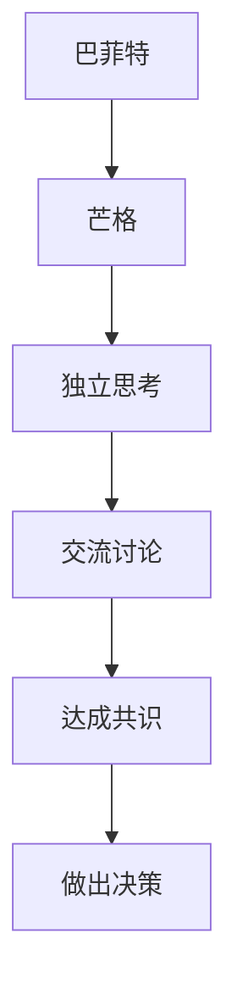

                 

# 巴菲特与芒格：'二营长'的价值投资搭档之道

> 关键词：巴菲特，芒格，价值投资，投资搭档，投资哲学，决策框架

> 摘要：本文深入探讨了巴菲特和芒格这对价值投资领域的传奇搭档的成功之道。通过分析他们的个人背景、投资哲学、决策框架和合作模式，揭示了他们如何通过互补和共识实现长期投资成功。文章从技术角度解析了他们的投资策略，并提供了实战案例和最佳实践。

---

# 第一部分: 巴菲特与芒格的个人背景与投资哲学

## 第1章: 巴菲特的生平与投资理念

### 1.1 巴菲特的早年经历

沃伦·巴菲特（Warren Buffett）于1934年8月31日出生于美国内布拉斯州的奥马哈市。他的父亲 Howard Buffett 是一名律师和政治家，母亲 Freda Buffett 则是一位家庭主妇。巴菲特从小就展现出了对数字和金融的天赋，他在高中时期就通过投资小企业积累了人生第一桶金。

巴菲特的早期投资理念深受 Benjamin Graham 的影响，后者是价值投资的鼻祖，强调安全边际和内在价值的计算。巴菲特在哥伦比亚大学师从格雷厄姆，学习了基本面分析和安全边际的概念，这些理念成为他一生投资的核心思想。

### 1.2 巴菲特的投资哲学

巴菲特的价值投资哲学可以用以下几个关键词来概括：**安全边际**、**内在价值**、**长期持有**、**集中投资**。

- **安全边际**：巴菲特强调以低于内在价值的价格买入股票，以降低投资风险。他将安全边际视为投资成功的关键因素。
- **内在价值**：内在价值是企业未来现金流的现值，巴菲特通过分析企业的财务状况、竞争优势和管理层质量来估算内在价值。
- **长期持有**：巴菲特认为市场短期波动难以预测，但长期趋势可以通过对企业基本面的分析来把握。他倾向于长期持有优质股票。
- **集中投资**：巴菲特认为分散投资是“对无知的保护”，而集中投资优质企业可以最大化收益。

### 1.3 巴菲特的选股标准

巴菲特选股的标准可以用“三好学生”来概括：

1. **好行业**：选择具有强大护城河的行业，如消费、金融、能源等。
2. **好公司**：公司具有强大的竞争优势，管理层优秀，财务健康。
3. **好价格**：买入价格低于内在价值，确保安全边际。

---

## 第2章: 芒格的生平与思维方式

### 2.1 芒格的早年经历

查理·芒格（Charlie Munger）于1924年1月17日出生于加拿大温莎市。他在美国长大，父亲是律师，母亲是教师。芒格在加州大学伯克利分校获得法律学位，并在法律和商业领域积累了丰富的经验。

芒格的职业生涯中，他曾经是巴菲特的导师，两人在投资理念上有着深厚的契合点。芒格的思维方式深受心理学、经济学和哲学的影响，他强调多元思维模型的应用，认为投资是跨学科的综合艺术。

### 2.2 芒格的多元思维模型

芒格的多元思维模型是一个复杂的认知框架，涵盖了多个学科的核心思想，包括：

1. **心理学**：理解人类行为和认知偏差。
2. **经济学**：理解市场机制和价值规律。
3. **物理学**：理解能量守恒和杠杆原理。
4. **数学**：理解概率和统计。
5. **历史学**：理解历史规律和周期性。

芒格认为，投资不仅仅是对企业的分析，更是对人性的洞察。他强调避免心理偏差，保持理性决策。

### 2.3 芒格的决策框架

芒格的决策框架可以分为以下几个步骤：

1. **识别问题**：明确投资目标和潜在风险。
2. **分析问题**：运用多元思维模型进行跨学科分析。
3. **制定方案**：结合逻辑推理和经验判断。
4. **验证方案**：通过历史数据和实际案例验证方案的可行性。
5. **做出决策**：基于分析结果做出最终决策。

---

## 第3章: 巴菲特与芒格的合作模式

### 3.1 二营长的搭档关系

“二营长”是巴菲特和芒格之间的非正式称谓，源于巴菲特对芒格的调侃：“你就像二营长的参谋，我随时可以叫你来帮忙。” 这种轻松的互动背后，是两人深厚的信任和默契。

### 3.2 巴菲特与芒格的互补性

- **巴菲特**：擅长企业基本面分析，注重安全边际和内在价值。
- **芒格**：擅长宏观思维和跨学科分析，注重风险管理和决策框架。

两人在投资决策中相互补充，巴菲特负责具体的选股和估值，芒格负责宏观判断和风险控制。

### 3.3 他们的决策共识机制

巴菲特和芒格的决策共识机制可以总结为以下几个步骤：

1. **独立思考**：两人分别从不同的角度分析投资标的。
2. **交流讨论**：通过讨论消除分歧，达成共识。
3. **最终决策**：基于共识做出投资决策。

---

## 第4章: 巴菲特与芒格的价值投资框架

### 4.1 巴菲特的价值投资框架

巴菲特的价值投资框架可以用以下公式表示：

$$
\text{内在价值} = \sum_{t=1}^{\infty} \frac{\text{未来现金流}}{(1 + r)^t}
$$

其中，\( r \) 是折现率，通常基于企业的风险水平和市场利率。

### 4.2 芒格的多元思维模型

芒格的多元思维模型可以用以下步骤进行分析：

1. **明确问题**：识别投资目标和潜在风险。
2. **跨学科分析**：运用心理学、经济学、物理学等学科的原理进行分析。
3. **制定方案**：结合分析结果制定投资策略。
4. **验证方案**：通过历史数据和实际案例验证方案的可行性。

### 4.3 巴菲特与芒格的合作模式

巴菲特和芒格的合作模式可以用以下流程图表示：

---

## 第5章: 巴菲特与芒格的投资策略

### 5.1 巴菲特的投资策略

巴菲特的投资策略可以用以下步骤进行分析：

1. **识别投资机会**：通过基本面分析筛选优质企业。
2. **评估企业价值**：计算内在价值，确保安全边际。
3. **投资决策**：集中投资优质企业，长期持有。

### 5.2 芒格的投资策略

芒格的投资策略可以用以下步骤进行分析：

1. **明确投资目标**：识别潜在投资机会。
2. **跨学科分析**：运用多元思维模型进行分析。
3. **制定投资策略**：结合分析结果制定投资计划。
4. **验证策略**：通过历史数据和实际案例验证策略的可行性。

---

## 第6章: 巴菲特与芒格的决策框架

### 6.1 巴菲特的决策框架

巴菲特的决策框架可以用以下步骤进行分析：

1. **识别投资机会**：通过基本面分析筛选优质企业。
2. **评估企业价值**：计算内在价值，确保安全边际。
3. **投资决策**：集中投资优质企业，长期持有。

### 6.2 芒格的决策框架

芒格的决策框架可以用以下步骤进行分析：

1. **明确问题**：识别投资目标和潜在风险。
2. **跨学科分析**：运用心理学、经济学、物理学等学科的原理进行分析。
3. **制定方案**：结合分析结果制定投资策略。
4. **验证方案**：通过历史数据和实际案例验证方案的可行性。

---

## 第7章: 巴菲特与芒格的成功经验总结

### 7.1 成功经验总结

1. **长期持有优质企业**：巴菲特和芒格的成功离不开他们对优质企业的长期持有。
2. **安全边际**：巴菲特强调以低于内在价值的价格买入股票，确保投资的安全性。
3. **多元思维模型**：芒格的多元思维模型帮助他们避免了认知偏差，提高了决策的准确性。
4. **信任与合作**：巴菲特和芒格之间的信任与合作是他们成功的关键因素。

### 7.2 对投资者的启示

1. **长期投资**：投资者应该摒弃短期交易的诱惑，专注于长期投资。
2. **安全边际**：在投资中，安全边际是确保投资成功的基石。
3. **多元思维**：投资者需要具备跨学科的思维方式，才能做出更明智的决策。
4. **信任与合作**：投资者应该与值得信赖的合作伙伴共同投资，分享经验和资源。

---

## 第8章: 巴菲特与芒格的价值投资实战案例

### 8.1 投资案例分析

以可口可乐公司为例，巴菲特和芒格是如何进行投资的：

1. **识别投资机会**：可口可乐公司具有强大的品牌优势和全球市场。
2. **评估企业价值**：通过基本面分析，计算可口可乐公司的内在价值。
3. **投资决策**：以低于内在价值的价格买入股票，长期持有。

### 8.2 投资实战总结

1. **案例分析**：通过具体案例分析，投资者可以更好地理解巴菲特和芒格的投资策略。
2. **实战经验**：投资者需要具备基本面分析能力和风险控制能力，才能在实际投资中取得成功。

---

## 第9章: 巴菲特与芒格的价值投资最佳实践

### 9.1 投资理念

1. **长期持有**：投资者应该专注于长期投资，避免短期波动的干扰。
2. **安全边际**：在投资中，安全边际是确保投资成功的基石。
3. **多元思维**：投资者需要具备跨学科的思维方式，才能做出更明智的决策。

### 9.2 投资策略

1. **集中投资**：投资者应该集中投资优质企业，避免分散投资带来的风险。
2. **长期持有**：投资者应该长期持有优质企业，避免频繁交易带来的成本。

### 9.3 风险管理

1. **风险控制**：投资者需要具备风险控制能力，避免投资失败。
2. **心理管理**：投资者需要具备心理管理能力，避免认知偏差的影响。

---

## 第10章: 巴菲特与芒格的价值投资未来展望

### 10.1 价值投资的未来

1. **技术进步**：随着技术的进步，价值投资的分析工具和方法将更加智能化。
2. **全球化**：随着全球化的深入，价值投资的范围和领域将更加广阔。

### 10.2 对投资者的建议

1. **持续学习**：投资者需要持续学习，不断提升自己的投资能力。
2. **保持耐心**：投资者需要保持耐心，专注于长期投资，避免短期波动的干扰。

---

## 作者：AI天才研究院/AI Genius Institute & 禅与计算机程序设计艺术 /Zen And The Art of Computer Programming

---

### 小结：

本文从巴菲特和芒格的个人背景、投资哲学、决策框架和合作模式出发，深入分析了他们成功的投资策略和实战经验。通过本文的学习，投资者可以更好地理解价值投资的核心理念，并将其应用到实际投资中，实现长期的财富增长。

