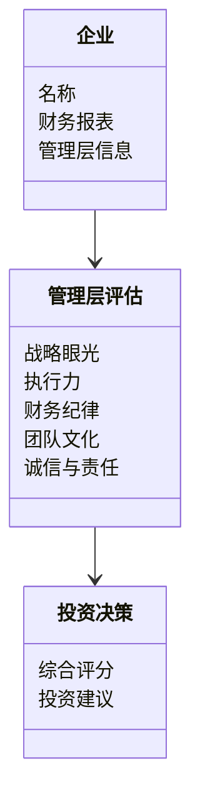
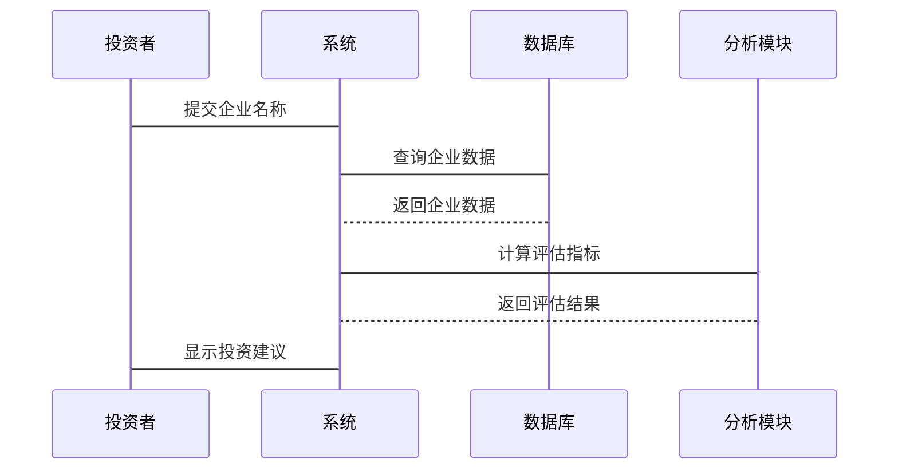

                 


# 巴菲特如何看待公司管理层

## 关键词：巴菲特，公司管理层，投资理念，战略思维，财务纪律，企业治理

## 摘要：  
本文将探讨巴菲特如何分析和评估公司管理层。通过分析巴菲特的投资哲学、选股标准以及他对管理层的评价标准，本文将揭示管理层在企业价值中的关键作用，并提供实用的评估方法。

---

# 第一部分：背景介绍

## 第1章：巴菲特投资理念概述

### 1.1 巴菲特的生平与投资哲学

#### 1.1.1 巴菲特的早期经历
沃伦·巴菲特（Warren Buffett）出生于1930年，是一位传奇投资者。他从少年时期开始接触投资，通过阅读和实践积累了丰富的投资经验。巴菲特的投资哲学强调长期价值投资，而非短期投机。

#### 1.1.2 巴菲特的投资理念核心
巴菲特的核心理念是寻找那些具有持续竞争优势、财务健康且管理层优秀的公司进行投资。他认为，市场波动是短期的，而企业内在价值的增长才是长期的。

#### 1.1.3 巴菲特的长期投资策略
巴菲特强调长期持有优质股票，避免频繁交易。他认为，优秀的管理层能够为公司创造持续价值，而短期波动不应影响长期投资决策。

### 1.2 巴菲特的选股标准

#### 1.2.1 高质量企业的定义
巴菲特寻找那些在行业内具有竞争优势、财务稳健且管理层诚信的企业。他认为，这些企业能够为股东创造长期价值。

#### 1.2.2 持续竞争优势的来源
竞争优势可以是成本优势、品牌影响力、技术壁垒或独特的商业模式。巴菲特认为，这些因素能够使企业在长期竞争中占据优势。

#### 1.2.3 企业的财务健康状况
巴菲特关注企业的财务健康状况，包括低债务、高利润率和稳定的现金流。他倾向于投资那些能够持续盈利并回报股东的企业。

### 1.3 管理层在企业中的作用

#### 1.3.1 管理层对企业发展的影响
管理层的决策直接影响企业的战略方向、运营效率和资本分配。巴菲特认为，优秀的管理层能够带领企业克服困难，抓住机遇。

#### 1.3.2 管理层决策对企业价值的影响
管理层的决策直接影响企业的价值。例如，合理的资本分配和高效的运营管理能够提升企业的盈利能力，从而提升股价。

#### 1.3.3 管理层的道德与企业长期发展
巴菲特非常重视管理层的诚信和道德。他相信，诚信的管理层更有可能为股东创造长期价值。

### 1.4 巴菲特对管理层的评价标准

#### 1.4.1 管理层的诚信与责任感
巴菲特认为，管理层应具备高度的责任感和诚信。他倾向于投资那些管理层能够与股东利益保持一致的企业。

#### 1.4.2 管理层的战略眼光与执行力
管理层应具备清晰的战略眼光，并能够有效执行战略。巴菲特认为，这能够确保企业在竞争中保持优势。

#### 1.4.3 管理层的资本分配能力
巴菲特关注管理层如何分配资本。他认为，优秀的管理层能够合理分配资本，以实现最大化的股东价值。

### 1.5 本章小结
本章介绍了巴菲特的投资哲学、选股标准以及他对管理层的评价标准。巴菲特认为，优秀的管理层是企业成功的关键，而他选择投资那些具有持续竞争优势、财务健康且管理层诚信的企业。

---

## 第2章：管理层分析的核心要素

### 2.1 管理层的治理结构

#### 2.1.1 公司治理的基本原则
公司治理是管理层与股东之间的一种契约关系。有效的治理结构能够确保管理层的决策符合股东的利益。

#### 2.1.2 股东与管理层的关系
股东是企业的所有者，管理层是企业的经营者。管理层应代表股东的利益，确保企业能够为股东创造价值。

#### 2.1.3 管理层的权力与责任
管理层拥有决策权和执行权，同时承担确保企业稳健发展的责任。有效的治理结构能够平衡管理层的权力，避免滥用。

### 2.2 管理层的战略思维

#### 2.2.1 战略规划的重要性
战略规划是企业发展的蓝图。优秀的管理层能够制定清晰的战略，并指导企业实现目标。

#### 2.2.2 竞争分析与市场定位
管理层需要分析竞争对手，明确企业的市场定位。这能够帮助企业制定有效的竞争策略。

#### 2.2.3 长期目标与短期绩效的平衡
管理层需要在追求短期绩效的同时，关注企业的长期发展。平衡这两者是制定战略的重要原则。

### 2.3 管理层的财务纪律

#### 2.3.1 财务健康的核心指标
财务健康的核心指标包括利润率、资产负债率和现金流等。这些指标能够反映企业的财务状况。

#### 2.3.2 资本分配的决策原则
资本分配是管理层的重要决策。合理的资本分配能够提升企业的价值，而错误的分配可能导致资源浪费。

#### 2.3.3 管理层对财务风险的控制
管理层需要识别和控制财务风险，确保企业的财务稳健。这包括合理管理债务和优化资本结构。

### 2.4 管理层的团队文化

#### 2.4.1 企业文化对员工的影响
企业文化是企业的灵魂。优秀的管理层能够塑造积极向上的企业文化，激发员工的潜力。

#### 2.4.2 团队协作的重要性
团队协作是企业成功的关键。管理层需要促进团队协作，确保各部门之间的有效配合。

#### 2.4.3 管理层如何塑造企业文化
管理层通过制定企业价值观、规范和激励机制来塑造企业文化。这能够增强员工的归属感和责任感。

### 2.5 本章小结
本章分析了管理层的治理结构、战略思维、财务纪律和团队文化。这些因素共同构成了一个全面的管理层评估框架。优秀的企业管理层需要具备全面的能力，能够在各个领域做出正确的决策。

---

## 第3章：巴菲特的管理层评估模型

### 3.1 模型的核心框架

#### 3.1.1 企业质量评估的维度
企业质量评估的维度包括财务状况、市场地位、竞争优势和管理层能力。这些因素共同决定了企业的价值。

#### 3.1.2 管理层能力的评估指标
管理层能力的评估指标包括战略眼光、执行力、财务纪律和团队文化。这些指标能够全面反映管理层的能力。

#### 3.1.3 模型的适用范围与限制
该模型适用于评估上市公司管理层的能力。其限制在于，模型依赖于公开数据，无法评估非上市公司的管理层。

### 3.2 模型的数学表达

#### 3.2.1 企业质量的量化公式
企业质量的量化公式如下：

$$
\text{企业质量} = \frac{\text{净利润} \times \text{ROE}}{\text{行业平均净利润}}
$$

其中，ROE表示净资产收益率，净利润表示企业的盈利能力。

#### 3.2.2 管理层能力的评分系统
管理层能力的评分系统分为五个维度，每个维度满分为20分。总分为100分。

| 维度          | 分数 |
|---------------|------|
| 战略眼光      | 20   |
| 执行力        | 20   |
| 财务纪律      | 20   |
| 团队文化      | 20   |
| 诚信与责任    | 20   |

#### 3.2.3 综合评估的加权方法
综合评估的加权方法如下：

$$
\text{综合评分} = \sum (\text{维度权重} \times \text{维度评分})
$$

其中，权重根据维度的重要性确定。例如，战略眼光和财务纪律的权重较高。

### 3.3 模型的实现步骤

#### 3.3.1 数据收集与处理
数据收集与处理包括获取企业的财务报表、管理层 biography 和行业数据。数据来源包括公司公告、财务报表和行业报告。

#### 3.3.2 指标计算与分析
指标计算与分析包括计算ROE、净利润率和资产负债率等。这些指标能够反映企业的财务状况和管理层能力。

#### 3.3.3 结果解读与应用
结果解读与应用包括将综合评分与行业平均水平进行对比，找出具备优秀管理层的公司进行投资。

### 3.4 本章小结
本章介绍了巴菲特的管理层评估模型，包括模型的核心框架、数学表达和实现步骤。通过该模型，投资者可以系统地评估管理层的能力，从而做出明智的投资决策。

---

## 第4章：系统分析与架构设计

### 4.1 问题场景介绍
在实际投资过程中，投资者需要系统地分析管理层的能力。为了提高效率，可以构建一个基于巴菲特评估模型的系统。

### 4.2 系统功能设计

#### 4.2.1 领域模型
以下是领域模型的mermaid类图：



#### 4.2.2 系统架构设计
以下是系统架构设计的mermaid架构图：


### 4.3 系统接口设计
系统接口设计包括数据输入接口、分析模块接口和输出接口。数据输入接口接收企业的财务数据和管理层信息；分析模块接口处理数据并生成评估结果；输出接口将结果呈现给投资者。

### 4.4 系统交互设计

#### 4.4.1 用例分析
以下是系统交互的mermaid序列图：



### 4.5 本章小结
本章通过系统分析与架构设计，构建了一个基于巴菲特评估模型的系统。该系统能够帮助投资者系统地分析管理层的能力，从而做出明智的投资决策。

---

## 第5章：项目实战

### 5.1 环境安装

#### 5.1.1 安装Python
安装Python 3.8及以上版本。

#### 5.1.2 安装必要的库
安装pandas、numpy和matplotlib等库。

#### 5.1.3 安装Jupyter Notebook
安装Jupyter Notebook用于数据分析和可视化。

### 5.2 系统核心实现源代码

#### 5.2.1 数据获取
使用pandas库从数据库中获取企业数据。

#### 5.2.2 数据分析
计算ROE、净利润率等指标。

#### 5.2.3 模型实现
实现管理层评估模型，计算综合评分。

### 5.3 代码实现

#### 5.3.1 数据获取代码
```python
import pandas as pd

# 从数据库中获取企业数据
data = pd.read_sql("SELECT * FROM 企业数据", connection)
```

#### 5.3.2 数据分析代码
```python
# 计算ROE
data['ROE'] = data['净利润'] / data['净资产']
```

#### 5.3.3 模型实现代码
```python
# 计算综合评分
def compute_score(roe, net_profit_margin, debt_ratio):
    score = 0
    score += min(roe * 10, 20)
    score += min(net_profit_margin * 5, 10)
    score += min((1 - debt_ratio) * 10, 20)
    return score

data['综合评分'] = data.apply(lambda x: compute_score(x['ROE'], x['净利润率'], x['资产负债率']), axis=1)
```

### 5.4 案例分析
以苹果公司为例，分析其管理层的能力。

### 5.5 本章小结
本章通过项目实战，展示了如何使用巴菲特的评估模型进行实际投资分析。通过代码实现，读者可以掌握如何将理论应用于实践。

---

## 第6章：最佳实践与注意事项

### 6.1 最佳实践

#### 6.1.1 巴菲特的方法论
巴菲特的方法论包括长期投资、价值投资和管理层评估。这些方法能够帮助投资者识别优质的公司。

#### 6.1.2 投资建议
投资者应关注企业的财务状况、市场地位和管理层能力。同时，应避免短期交易，注重长期投资。

#### 6.1.3 注意事项
投资者应结合市场环境和经济周期，灵活调整投资策略。同时，应保持对市场的敏感性，及时捕捉投资机会。

### 6.2 小结
本章总结了巴菲特的管理层评估方法，并提出了实际投资中的注意事项。通过这些最佳实践，投资者可以提高投资成功的概率。

---

## 结语

巴菲特如何看待公司管理层，这个问题涉及到投资哲学、管理层评估和系统设计等多个方面。通过本文的分析，读者可以全面理解巴菲特的管理层评估方法，并将其应用于实际投资中。

作者：AI天才研究院/AI Genius Institute & 禅与计算机程序设计艺术 /Zen And The Art of Computer Programming
```

