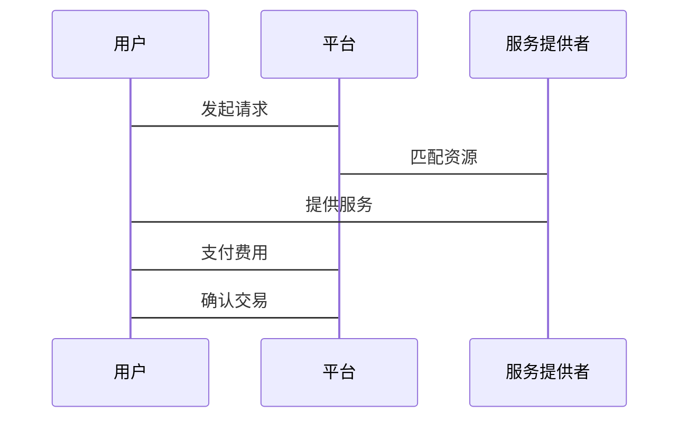

                 


# 巴菲特如何看待共享经济模式的投资

## 关键词：巴菲特，共享经济，投资分析，价值投资，滴滴出行，Airbnb

## 摘要：本文从巴菲特的投资理念出发，分析他对共享经济模式的看法，探讨共享经济的典型企业案例，以及如何从价值投资的角度评估这些企业的投资价值。

---

## 第一部分: 巴菲特与共享经济模式的背景与概述

### 第1章: 巴菲特投资理念与共享经济概述

#### 1.1 巴菲特投资理念的核心思想

##### 1.1.1 价值投资的定义与原则

价值投资是一种以基本面分析为基础的投资策略，核心在于寻找市场低估的优质企业进行长期投资。巴菲特是价值投资的代表人物，他强调关注企业的内在价值，而不是市场的短期波动。

**公式：**
$$\text{内在价值} = \sum_{t=1}^{\infty} \frac{\text{现金流}_t}{(1 + r)^t}$$

其中，$r$ 是折现率，$\text{现金流}_t$ 是第 $t$ 年的现金流。

##### 1.1.2 巴菲特的投资策略与成功案例

巴菲特的成功在于他长期持有优质企业，并在市场恐慌时买入低估资产。例如，他投资的可口可乐和苹果公司，都是具有强大竞争优势的企业。

##### 1.1.3 巴菲特对经济周期的判断与应对

巴菲特强调在经济衰退时寻找优质企业，避免恐慌性抛售。他认为，市场的短期波动为长期投资者提供了买入机会。

#### 1.2 共享经济的定义与特点

##### 1.2.1 共享经济的定义与核心要素

共享经济是一种通过数字平台将闲置资源进行共享的经济模式。其核心要素包括闲置资源、数字平台、供需匹配和信任机制。

##### 1.2.2 共享经济的模式与应用场景

共享经济的典型模式包括共享出行（如滴滴）、共享住宿（如Airbnb）、共享办公空间（如WeWork）等。这些模式通过平台将资源供需双方连接起来，提高资源利用率。

##### 1.2.3 共享经济的优缺点与挑战

优点：提高资源利用率，降低交易成本，创造就业机会。缺点：可能存在监管问题、隐私问题和劳动权益问题。

#### 1.3 巴菲特与共享经济的关联性

##### 1.3.1 巴菲特对新兴经济模式的关注

巴菲特对新兴技术持开放态度，但更关注企业的商业模式和财务健康状况。

##### 1.3.2 共享经济对传统商业模式的冲击

共享经济通过数字化平台颠覆了传统行业，如出租车行业和酒店业。

##### 1.3.3 巴菲特对共享经济未来发展的看法

巴菲特认为，共享经济的未来取决于企业的盈利能力、竞争优势和管理能力。

---

### 第2章: 共享经济模式的典型企业分析

#### 2.1 共享经济的代表性企业

##### 2.1.1 滴滴出行的商业模式与市场表现

滴滴出行通过移动应用平台，连接司机和乘客，提供便捷的出行服务。其商业模式包括抽成佣金和广告收入。

##### 2.1.2 Airbnb的共享住宿模式与扩张策略

Airbnb通过平台提供闲置房源，满足用户的住宿需求。其扩张策略包括市场推广和产品创新。

##### 2.1.3 其他共享经济领域的典型企业

例如，共享办公空间企业WeWork，其商业模式依赖于高出租率和增值服务。

#### 2.2 典型企业的财务分析

##### 2.2.1 财务报表分析与投资价值评估

分析企业的收入来源、成本结构和盈利能力。例如，滴滴出行的高收入依赖于用户数量和平台佣金。

##### 2.2.2 市盈率与市净率的计算与对比

市盈率（P/E）=股价/每股收益；市净率（P/B）=股价/每股净资产。通过比较市盈率和市净率，评估企业的估值水平。

##### 2.2.3 企业盈利能力与成长性的评估

关注企业的净利润率、毛利率和收入增长率。例如，Airbnb的高收入增长率反映了市场需求的强劲增长。

#### 2.3 巴菲特视角下的企业竞争优势

##### 2.3.1 企业的竞争优势

滴滴出行的竞争优势在于其庞大的用户基础和高效的技术平台。Airbnb则通过全球化的网络覆盖和多样化的产品线获得竞争优势。

##### 2.3.2 企业的市场地位

滴滴出行在中国市场占据主导地位，而Airbnb在住宿领域具有全球影响力。

##### 2.3.3 企业的财务健康状况

关注企业的现金流、负债水平和盈利能力。例如，滴滴出行的高负债可能影响其财务健康状况。

---

### 第3章: 巴菲特视角下的共享经济投资分析

#### 3.1 巴菲特对共享经济企业的核心关注点

##### 3.1.1 企业的竞争优势与市场地位

巴菲特关注企业的竞争优势，如滴滴的用户粘性和Airbnb的网络效应。

##### 3.1.2 企业的财务健康状况与盈利能力

关注企业的盈利能力和现金流状况，例如滴滴出行的高收入和高成本结构。

##### 3.1.3 企业的管理团队与治理结构

巴菲特强调管理团队的重要性，认为优秀的管理团队能够带领企业持续增长。

#### 3.2 共享经济模式的长期投资价值

##### 3.2.1 共享经济的市场规模与增长潜力

共享经济的市场规模正在快速增长，特别是在出行和住宿领域。

##### 3.2.2 共享经济对企业与社会的影响

通过提高资源利用率，共享经济有助于减少浪费，促进可持续发展。

##### 3.2.3 共享经济模式的可持续性与风险

共享经济面临政策监管、市场竞争和技术变革等风险，但其长期前景看好。

#### 3.3 巴菲特对共享经济企业的投资建议

##### 3.3.1 长期投资 vs 短期交易

巴菲特倡导长期投资，关注企业的基本面。

##### 3.3.2 价值投资 vs 技术分析

巴菲特认为价值投资更可靠，而技术分析缺乏长期稳定性。

##### 3.3.3 投资组合的分散与风险控制

通过分散投资降低风险，同时关注企业的长期增长潜力。

---

## 第四部分: 共享经济模式的数学模型与投资决策

### 第4章: 共享经济模式的数学模型与投资决策

#### 4.1 共享经济企业的估值模型

##### 4.1.1 市盈率模型的公式与应用

$$\text{市盈率} = \frac{\text{股价}}{\text{每股收益}}$$

##### 4.1.2 市净率模型的公式与应用

$$\text{市净率} = \frac{\text{股价}}{\text{每股净资产}}$$

##### 4.1.3 自由现金流模型的公式与应用

$$\text{企业价值} = \sum_{t=1}^{\infty} \frac{\text{自由现金流}_t}{(1 + r)^t}$$

#### 4.2 投资决策的数学分析

##### 4.2.1 投资回报率的计算公式

$$\text{投资回报率} = \frac{\text{净利润}}{\text{初始投资}}$$

##### 4.2.2 风险评估的数学模型

使用蒙特卡罗模拟评估投资的不确定性。

##### 4.2.3 投资组合优化的数学方法

使用马科维茨的均值-方差优化模型。

---

## 第五部分: 共享经济模式的系统分析与架构设计

### 第5章: 共享经济模式的系统分析与架构设计

#### 5.1 共享经济系统的功能需求

##### 5.1.1 用户需求分析

用户需要便捷的资源查找和预订功能。

##### 5.1.2 企业需求分析

企业需要高效的订单管理和服务提供功能。

##### 5.1.3 市场监管需求分析

监管机构需要确保平台的公平性和安全性。

#### 5.2 共享经济系统的架构设计

##### 5.2.1 系统功能模块划分

- 用户模块：注册、登录、订单管理。
- 资源模块：资源发布、资源匹配。
- 支付模块：订单支付、费用结算。

##### 5.2.2 系统数据流设计

用户发起请求，系统进行匹配和支付，完成交易。

##### 5.2.3 系统交互的mermaid序列图



#### 5.3 共享经济系统的架构图

```mermaid
classDiagram
    class 用户 {
        - 用户ID
        - 用户名
        - 密码
    }
    class 资源 {
        - 资源ID
        - 资源类型
        - 资源状态
    }
    class 平台 {
        - 平台ID
        - 平台名称
        - 管理功能
    }
    用户 --> 平台: 注册/登录
    用户 --> 平台: 提交请求
    平台 --> 资源: 匹配资源
    用户 <---> 资源: 交易
```

---

## 作者：AI天才研究院 & 禅与计算机程序设计艺术

---

通过以上内容，文章详细分析了巴菲特对共享经济模式的看法，结合典型企业的案例，从财务分析、投资策略和系统设计等多个角度进行了深入探讨，帮助读者全面理解共享经济的投资价值和挑战。

