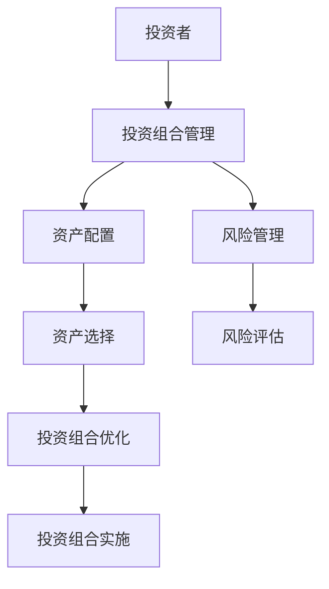

                 


# 巴菲特如何看待分散投资

> **关键词**：巴菲特，分散投资，投资哲学，风险管理，数学模型

> **摘要**：本文将详细探讨巴菲特的分散投资理念，从其投资哲学到具体的操作策略，结合数学模型和系统架构设计，分析分散投资的核心概念和实际应用。通过实际案例和系统设计，帮助读者全面理解分散投资的理论和实践。

---

## 第1章: 巴菲特投资哲学与分散投资基础

### 1.1 巴菲特的投资哲学

#### 1.1.1 巴菲特的生平与投资理念
沃伦·巴菲特（Warren Buffett）是世界上最著名的投资者之一，他的投资哲学以价值投资为核心，强调长期投资、分散投资和风险管理。巴菲特出生于1934年，早年通过阅读投资经典著作自学投资，并在1957年建立了自己的投资合伙公司，从此开始了他的投资生涯。

巴菲特的投资理念可以总结为以下几点：
1. **价值投资**：寻找具有长期竞争优势的企业，以合理的价格买入并长期持有。
2. **分散投资**：通过投资多个行业和企业来降低风险，避免过度集中在单一资产。
3. **风险管理**：通过分散投资和严格的投资标准来控制风险，确保资本的安全。

#### 1.1.2 巴菲特对分散投资的重视
巴菲特认为，分散投资是保护投资者免受市场波动影响的重要手段。他强调，即使是最好的投资者，也无法准确预测市场的短期走势，因此分散投资可以有效降低非系统性风险。

分散投资的核心思想在于通过投资多个不同的资产或行业，将风险分散到多个标的上，从而降低整体投资组合的波动性。巴菲特的分散投资策略不仅仅是数量上的分散，更注重行业和资产类别的多样化。

#### 1.1.3 巴菲特投资哲学的核心思想
巴菲特的投资哲学的核心是“长期持有优质资产”。他认为，投资的目的是通过持有优质企业的一部分股权，分享企业的长期增长。分散投资则是为了降低风险，避免因某一资产的波动而导致整体投资组合的重大损失。

---

### 1.2 分散投资的基本概念

#### 1.2.1 什么是分散投资
分散投资是指将资金分配到不同的资产、行业或地区，以降低投资组合的整体风险。分散投资的核心思想是“不要把所有鸡蛋放在一个篮子里”，通过多样化来降低特定资产或市场的波动对整体投资组合的影响。

#### 1.2.2 分散投资的原理与优势
分散投资的原理是基于概率和统计学。通过投资多个相关性较低的资产，可以降低投资组合的整体波动性。分散投资的优势包括：
1. **降低风险**：通过多样化，减少单一资产波动对整体投资组合的影响。
2. **平滑收益**：分散投资可以在不同资产之间平衡收益，避免因某一资产表现不佳而导致整体收益下降。
3. **适应不同市场环境**：分散投资可以帮助投资者在不同的市场环境下获得稳定的收益。

#### 1.2.3 分散投资与集中投资的对比
集中投资和分散投资的主要区别在于风险和收益的平衡。集中投资可能带来更高的收益，但同时也伴随着更高的风险；分散投资则更注重风险控制，追求稳定的收益。

---

### 1.3 巴菲特分散投资的核心思想

#### 1.3.1 巴菲特分散投资的定义
巴菲特的分散投资是指通过投资多个不同行业和地区的优质企业，构建一个多样化的投资组合，以降低非系统性风险。他强调，分散投资不仅仅是数量上的分散，更注重资产的质量和长期增长潜力。

#### 1.3.2 巴菲特分散投资的策略
巴菲特的分散投资策略主要包括以下几点：
1. **投资优质企业**：选择具有长期竞争优势的企业，如可口可乐、苹果等。
2. **行业多样化**：分散投资到不同行业，避免过度集中在某一行业。
3. **地域分散**：投资全球不同地区的资产，降低区域风险。

#### 1.3.3 巴菲特分散投资的边界与外延
分散投资的边界在于投资标的的相关性和风险控制。巴菲特强调，分散投资并不是无限的，而是要在相关性较低的资产之间进行合理分配。外延则是通过分散投资，构建一个既能抵御市场波动，又能获得长期稳定收益的投资组合。

---

## 第2章: 巴菲特分散投资的核心概念与联系

### 2.1 分散投资的核心概念

#### 2.1.1 分散投资的核心要素
分散投资的核心要素包括：
1. **资产配置**：确定投资组合中不同资产的权重。
2. **相关性**：投资标的之间的相关性影响分散投资的效果。
3. **风险与收益**：分散投资旨在在风险可控的前提下追求收益最大化。

#### 2.1.2 分散投资的数学模型
分散投资的数学模型可以通过现代投资组合理论（MPT）来描述。MPT的核心是通过优化资产配置，使投资组合的风险最小化，同时实现收益最大化。

#### 2.1.3 分散投资的ER实体关系图
以下是分散投资的ER实体关系图：

```mermaid
erd
    左侧: 投资者
    中间: 投资组合
    右侧: 资产
    左侧 --> 中间: 持有
    中间 --> 右侧: 包含
```

---

### 2.2 分散投资的核心概念原理

#### 2.2.1 分散投资的原理
分散投资的原理基于概率和统计学，通过投资多个相关性较低的资产，降低投资组合的整体波动性。

#### 2.2.2 分散投资的数学公式
分散投资的数学公式可以通过方差来衡量投资组合的风险。投资组合的方差可以表示为：

$$
\sigma_p^2 = \sum_{i=1}^{n} w_i^2 \sigma_i^2 + \sum_{i=1}^{n} \sum_{j \neq i} w_i w_j \sigma_{i,j}
$$

其中，$w_i$ 是资产 $i$ 的权重，$\sigma_i^2$ 是资产 $i$ 的方差，$\sigma_{i,j}$ 是资产 $i$ 和资产 $j$ 的协方差。

---

### 2.3 分散投资的系统架构图

#### 2.3.1 分散投资的系统架构图
以下是分散投资的系统架构图：



---

通过以上章节，我们详细探讨了巴菲特的分散投资理念，从其投资哲学到具体的操作策略，结合数学模型和系统架构设计，分析了分散投资的核心概念和实际应用。接下来的章节将深入探讨分散投资的数学模型与公式，系统分析与架构设计方案，以及项目实战。

--- 

**作者：AI天才研究院/AI Genius Institute & 禅与计算机程序设计艺术 /Zen And The Art of Computer Programming**

