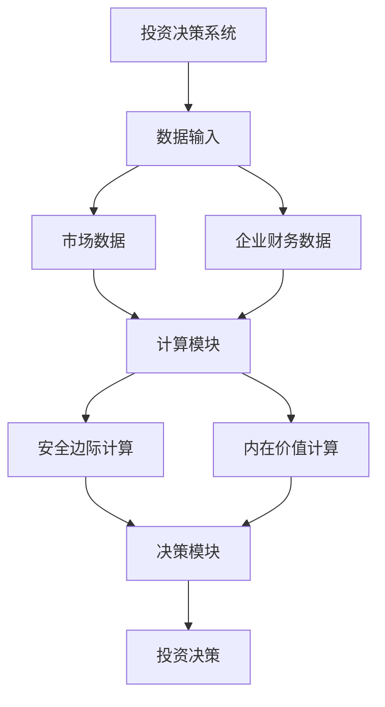
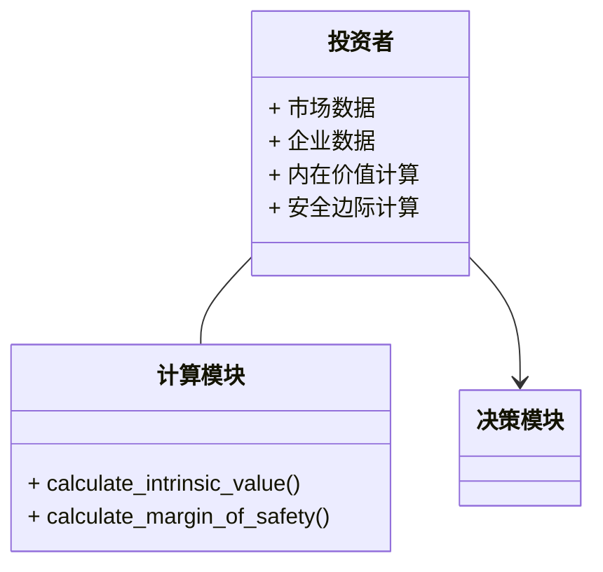
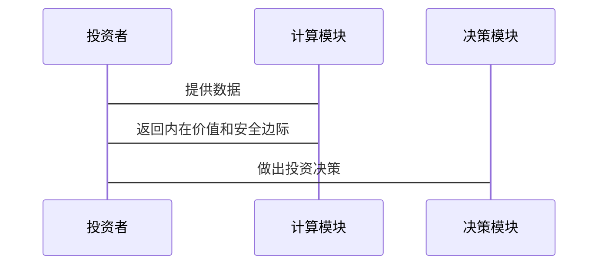

                 


# 巴菲特如何看待市场波动和长期投资

## 关键词：巴菲特，市场波动，长期投资，价值投资，安全边际，复利效应

## 摘要：
本文深入探讨巴菲特对市场波动和长期投资的独特见解。通过分析他的价值投资策略、安全边际概念、市场波动的周期性及心理因素，结合实际案例，揭示巴菲特如何在市场波动中保持稳定并实现长期收益。文章结构清晰，内容详实，适合投资者和对投资理念感兴趣的技术人士阅读。

---

# 第1章: 投资的基本概念与市场波动

## 1.1 投资的基本概念

### 1.1.1 什么是投资
投资是将资金投入到资产中，以期获得未来收益的行为。资产包括股票、债券、房地产等，投资的本质是通过价值增值实现财富增长。

### 1.1.2 投资的类型与特点
- **股票投资**：购买公司股份，分享企业成长收益。
- **债券投资**：购买债务工具，定期获得利息收入。
- **房地产投资**：购买不动产，通过租金和升值获利。
- **特点**：风险与收益并存，长期性与波动性共存。

### 1.1.3 投资的目标与意义
目标：实现财富增值，分散风险，保障资金安全。意义：投资是个人和企业实现财富增长的重要手段，也是资源配置的重要方式。

## 1.2 市场波动的定义与影响

### 1.2.1 市场波动的定义
市场波动是指资产价格在短时间内频繁变化的现象，通常由市场参与者的买卖行为、信息变化和情绪波动引起。

### 1.2.2 市场波动的来源
- **经济因素**：经济数据、政策变化、国际贸易等。
- **心理因素**：投资者情绪波动、市场预期变化。
- **技术因素**：市场参与者的技术分析和交易策略。

### 1.2.3 市场波动对投资者的影响
- **短期影响**：价格波动可能导致短期收益或损失。
- **长期影响**：波动是市场的一部分，长期投资者应关注企业价值而非短期波动。

## 1.3 长期投资的意义

### 1.3.1 长期投资的定义
长期投资是指投资者持有资产超过一年，关注企业的长期价值而非短期价格波动。

### 1.3.2 长期投资的优势
- **复利效应**：长期持有可以最大化复利效应，实现财富指数增长。
- **分散风险**：长期投资平滑短期波动带来的风险，降低市场周期性影响。

### 1.3.3 长期投资与短期投资的对比
- **短期投资**：关注价格波动，风险较高，收益不稳定。
- **长期投资**：关注企业价值，风险较低，收益稳定。

---

# 第2章: 巴菲特的投资理念

## 2.1 巴菲特的投资哲学

### 2.1.1 价值投资的定义
价值投资是一种投资策略，强调以低于内在价值的价格买入优质资产，长期持有以实现收益。

### 2.1.2 巴菲特的价值投资原则
- **购买优秀企业**：投资具有持续竞争优势的企业。
- **关注内在价值**：分析企业的财务状况，评估其真实价值。
- **长期持有**：避免频繁交易，保持投资稳定性。

### 2.1.3 巴菲特的投资策略
- **集中投资**：将资金集中在少数优质资产上，提高收益。
- **逆市投资**：在市场恐慌时买入，市场狂热时卖出。

## 2.2 安全边际的概念

### 2.2.1 安全边际的定义
安全边际是指买入价格低于内在价值的差额，确保投资的安全性和收益性。

### 2.2.2 安全边际的重要性
- **保护本金**：通过安全边际降低本金损失风险。
- **提升收益**：确保在市场波动中获得超额收益。

### 2.2.3 如何计算安全边际
安全边际 = 内在价值 - 市场价格

$$
\text{安全边际} = \text{内在价值} - \text{市场价格}
$$

---

# 第3章: 市场波动的分析方法

## 3.1 市场波动的周期性

### 3.1.1 市场波动的周期性规律
市场波动通常呈现周期性，包括上涨、下跌、震荡等阶段。投资者需识别周期，制定相应策略。

### 3.1.2 如何识别市场波动的周期
- **技术分析**：通过K线图、均线等工具识别周期。
- **市场情绪指标**：利用投资者情绪指数判断市场周期。

### 3.1.3 周期性对投资决策的影响
- **上涨周期**：积极投资，抓住增值机会。
- **下跌周期**：谨慎投资，控制风险。

## 3.2 市场波动的心理因素

### 3.2.1 投资者心理与市场波动的关系
- **贪婪与恐惧**：投资者情绪波动影响市场价格。
- **从众心理**：投资者跟随市场趋势，可能导致过度交易。

### 3.2.2 情绪化决策的负面影响
- **过度交易**：频繁交易增加成本，降低收益。
- **错失机会**：情绪化决策可能导致错失长期投资机会。

### 3.2.3 如何克服情绪化决策
- **制定计划**：设定投资目标和策略，避免情绪干扰。
- **持续学习**：提升投资知识，增强理性决策能力。

## 3.3 市场波动的技术分析

### 3.3.1 技术分析的定义与原理
技术分析通过分析历史价格和成交量，预测未来价格走势。

### 3.3.2 常用的技术分析指标
- **移动平均线（MA）**：显示价格趋势，帮助判断买卖时机。
- **相对强弱指数（RSI）**：衡量价格超买或超卖状态。

### 3.3.3 技术分析在巴菲特投资中的应用
虽然巴菲特不依赖技术分析，但其对市场波动的理解仍可结合技术分析工具。

---

# 第4章: 巴菲特对市场波动的应对策略

## 4.1 长期投资的稳定性

### 4.1.1 长期投资如何应对市场波动
- **分散投资**：通过多元化降低风险。
- **长期持有**：忽略短期波动，关注长期价值。

### 4.1.2 长期投资的风险管理
- **资产配置**：合理分配资金，降低波动影响。
- **定期调整**：根据市场变化，优化投资组合。

### 4.1.3 长期投资的收益与风险平衡
长期投资通过复利效应实现收益，同时降低短期波动带来的风险。

## 4.2 安全边际的动态调整

### 4.2.1 如何动态调整安全边际
- **市场变化**：根据市场波动调整买入价格。
- **企业价值变化**：评估企业内在价值，及时调整投资决策。

### 4.2.2 安全边际与市场波动的关系
安全边际为投资者提供缓冲区，使投资在波动中保持安全。

---

# 第5章: 巴菲特投资策略的数学模型与算法实现

## 5.1 投资决策的数学模型

### 5.1.1 复利效应的数学模型
复利公式：
$$
A = P \times (1 + r)^t
$$
其中，\( A \) 是最终金额，\( P \) 是本金，\( r \) 是年收益率，\( t \) 是时间。

### 5.1.2 内在价值计算
巴菲特使用格雷厄姆的内在价值公式：
$$
\text{内在价值} = \sum_{t=1}^{\infty} \frac{\text{现金流}}{(1 + r)^t}
$$

### 5.1.3 安全边际计算
$$
\text{安全边际} = \text{内在价值} - \text{市场价格}
$$

## 5.2 投资决策系统的算法实现

### 5.2.1 系统架构设计
- **数据输入**：市场数据、企业财务数据。
- **计算模块**：计算内在价值、安全边际。
- **决策模块**：根据安全边际和市场波动做出投资决策。

### 5.2.2 系统实现代码
```python
def calculate_intrinsic_value(cash_flows, discount_rate):
    iv = 0
    for t, cf in enumerate(cash_flows):
        iv += cf / (1 + discount_rate) ** t
    return iv

def calculate_margin_of_safety(iv, market_price):
    return iv - market_price

# 示例：计算可口可乐的内在价值和安全边际
cash_flows = [100, 110, 120, 130]  # 每年的现金流
discount_rate = 0.10  # 折现率
iv = calculate_intrinsic_value(cash_flows, discount_rate)
market_price = 40  # 市场价格
mos = calculate_margin_of_safety(iv, market_price)
print(f"内在价值: {iv}, 安全边际: {mos}")
```

## 5.3 投资决策系统的系统架构图


---

# 第6章: 项目实战——巴菲特风格投资系统

## 6.1 项目介绍

### 6.1.1 系统功能需求
- **数据采集**：收集市场数据和企业财务数据。
- **价值评估**：计算内在价值和安全边际。
- **投资决策**：根据安全边际和市场波动做出投资建议。

### 6.1.2 系统架构设计


### 6.1.3 系统交互流程


## 6.2 环境安装与系统实现

### 6.2.1 环境安装
- **Python**：安装Python 3.x
- **Pandas**：用于数据处理
- **Matplotlib**：用于数据可视化

### 6.2.2 核心实现代码
```python
import pandas as pd
import matplotlib.pyplot as plt

def calculate_intrinsic_value(cash_flows, discount_rate):
    iv = 0
    for t, cf in enumerate(cash_flows):
        iv += cf / (1 + discount_rate) ** t
    return iv

def calculate_margin_of_safety(iv, market_price):
    return iv - market_price

# 示例数据
data = {
    '公司': ['可口可乐', '苹果', '谷歌'],
    '现金流': [[100, 110, 120], [150, 160, 170], [200, 210, 220]],
    '折现率': [0.10, 0.10, 0.10],
    '市场价格': [40, 100, 150]
}

df = pd.DataFrame(data)

# 计算内在价值和安全边际
for index, row in df.iterrows():
    iv = calculate_intrinsic_value(row['现金流'], row['折现率'])
    mos = calculate_margin_of_safety(iv, row['市场价格'])
    print(f"{row['公司']}的内在价值为：{iv}，安全边际为：{mos}")

# 可视化
plt.bar(df['公司'], df['市场价格'])
plt.title('市场价格')
plt.show()
```

---

# 第7章: 最佳实践与投资建议

## 7.1 投资策略总结

### 7.1.1 巴菲特的成功经验
- **长期投资**：坚持价值投资，长期持有优质资产。
- **安全边际**：确保买入价格低于内在价值。
- **复利效应**：通过长期投资实现财富指数增长。

## 7.2 投资建议

### 7.2.1 初学者建议
- **学习基础知识**：掌握价值投资的基本概念。
- **选择优质企业**：投资具有持续竞争优势的企业。
- **避免情绪化决策**：保持理性，避免盲目跟风。

### 7.2.2 资产配置建议
- **分散投资**：通过多元化降低风险。
- **定期调整**：根据市场变化优化投资组合。

## 7.3 投资注意事项

### 7.3.1 风险提示
- **市场波动风险**：短期波动可能影响投资收益。
- **企业风险**：企业基本面变化可能影响内在价值。

### 7.3.2 税务规划
- **合理避税**：利用税收优惠政策降低投资成本。

---

# 第8章: 结论与展望

## 8.1 结论

### 8.1.1 巴菲特投资理念的总结
巴菲特的成功在于长期投资、价值投资和安全边际的结合。通过坚持这些原则，投资者可以在市场波动中保持稳定，实现长期收益。

### 8.1.2 对投资者的启示
- **长期思维**：关注企业的长期价值，而非短期价格波动。
- **理性决策**：避免情绪化投资，制定科学的投资策略。

## 8.2 展望

### 8.2.1 投资理念的发展
随着市场变化，投资理念也在不断进化。未来，投资者需要结合新技术和新方法，进一步优化投资策略。

### 8.2.2 对技术人士的建议
- **技术分析**：利用大数据和人工智能优化投资决策。
- **创新思维**：探索新的投资工具和方法，提升投资效率。

---

# 作者：AI天才研究院/AI Genius Institute & 禅与计算机程序设计艺术 /Zen And The Art of Computer Programming

---

以上是完整的文章大纲，按照每个部分逐步展开，确保内容丰富、逻辑清晰，并结合实际案例和数学模型进行详细讲解。

